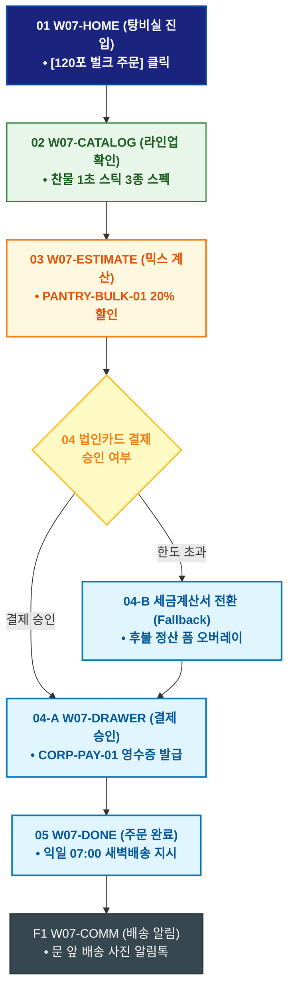

# 🔄 WICKETA 박지후 서비스 흐름도 [스타트업 탕비실 120포 대용량 벌크 믹스 세트 법인 구매]

> **프로젝트명**: WICKETA 오피스 탕비실 웰니스 & 퀵커머스 (Office Wellness)  
> **분석 대상 클라이언트**: [`[가상클라이언트_07] 박지후_스타트업피플팀_오피스탕비실.txt`](file:///C:/Users/user/Desktop/이지희%20에이전트/설계%20마저%20해오기/자동화/03_클라이언트/01_가상_클라이언트/[가상클라이언트_07] 박지후_스타트업피플팀_오피스탕비실.txt)  
> **기준 사이트맵 문서**: [`C:\Users\SBS\Desktop\0819 이지희\한명씩 화면 설계도 진행\자동화\04_설계_및_스토리보드\03_사이트맵\07_박지후\사이트맵_목적1_탕비실벌크.md`](file:///C:/Users/SBS/Desktop/0819%20%EC%9D%B4%EC%A7%80%ED%9D%AC/%ED%95%9C%EB%AA%85%EC%94%A9%20%ED%99%94%EB%A9%B4%20%EC%84%A4%EA%B3%84%EB%8F%84%20%EC%A7%84%ED%96%89/%EC%9E%90%EB%8F%99%ED%99%94/04_%EC%84%A4%EA%B3%84_%EB%B0%8F_%EC%8A%A4%ED%86%A0%EB%A6%AC%EB%B3%B4%EB%93%9C/03_%EC%82%AC%EC%9D%B4%ED%8A%B8%EB%A7%B5/07_박지후/사이트맵_목적1_탕비실벌크.md)  
> **접속 목적**: 탕비실 찬물 1초 스틱 120포 대용량 3종 믹스 세트 법인카드 1초 결제  
> **목적별 고유 킬러 기능**: **탕비실 120포 대용량 계산기 (`PANTRY-BULK-01`) & 법인카드 1초 간편결제 (`CORP-PAY-01`)**  
> **작성일자**: 2026년 8월 19일  
> **작성자**: Antigravity UI/UX 설계팀  
> **문서 인코딩**: UTF-8 (유니코드)  

---

## 1. 목적별 핵심 서비스 흐름 개요

스타터 피플팀이 직원 선호도 3종 믹스 120포 대용량 벌크를 자동 계산하고, 법인카드로 1초 만에 결제하여 익일 오전 07:00 탕비실 문 앞 새벽배송을 받는 프로세스

---

## 2. 목적 맞춤형 가변 여정 스테이지 (Dynamic Journey Stages)

### 🏢 Stage 1: 탕비실 벌크 포털 진입
- **01 피플팀 포털 진입 (`W07-HOME`)**: [탕비실 120포 대용량 벌크] 퀵독 클릭 ➔ 탕비실 대시보드 로딩
- **02 찬물 1초 스틱 라인업 확인 (`W07-CATALOG`)**: 퀵 브루 스틱(SEC-09), 보태니컬 에이드(SEC-04), 루이보스(SEC-07) 120포 벌크 확인

### 🧮 Stage 2: 직원 선호도 3종 믹스 자동 계산
- **03 대용량 번들 계산기 조작 (`W07-ESTIMATE`)**: PANTRY-BULK-01 직원 수(30명) 입력 ➔ 120포 3종 황금비율 및 20% 법인 할인 산출
- **04 법인 결제 검증 (`W07-DRAWER`)**:
  - `{법인카드 승인 여부?}`
  - `[결제 승인]` ➔ CORP-PAY-01 법인 영수증 자동 생성
  - `[한도 초과(Fallback)]` ➔ 세금계산서 후불 정산 모달 전환

### 🚚 Stage 3: 주문 완료 & 익일 07:00 새벽배송
- **05 주문 승인 확인 (`W07-DONE`)**: 익일 오전 07:00 탕비실 문 앞 도착 특급 배송 지시
- **F1 배송 완료 알림 루프 (`W07-COMM`)**: 탕비실 배송 사진 카카오톡 수신 & 입고 확인

---

## 3. 단계별 명세표 (Flow Matrix Table)

| 단계 ID | 단계 명칭 | 사용자 행동 | 화면 접점 | 서비스/시스템 반응 | 매핑 요구사항 | 다음 진입 조건 |
| :---: | :--- | :--- | :--- | :--- | :--- | :--- |
| **01** | 탕비실 진입 | [120포 벌크 주문] 클릭 | `W07-HOME` | 탕비실 대시보드 로딩 | `REQ-01 탕비실 기획` | 02 라인업 확인 |
| **02** | 라인업 확인 | 찬물 1초 스틱 3종 확인 | `W07-CATALOG` | 120포 벌크 스펙 렌더링 | `REQ-04 1초 스틱` | 03 믹스 계산 |
| **03** | 믹스 계산 | 직원 수(30명) 입력 | `W07-ESTIMATE` | PANTRY-BULK-01 20% 법인 할인 산출 | `REQ-02 대용량 계산기` | 04 법인 결제 |
| **04-A** | [성공] 결제 승인 | 법인카드 1-Click 승인 | `W07-DRAWER` | CORP-PAY-01 결제 승인 및 영수증 발급 | `REQ-06 법인 결제` | 05 주문 완료 |
| **04-B** | [예외] 한도 초과 | 세금계산서 전환 (Fallback)| `W07-DRAWER` | 후불 정산 신청 폼 노출 | `예외 복구` | 05 주문 완료 |
| **05** | 주문 완료 | 배송 스케줄 확인 | `W07-DONE` | 익일 07:00 새벽배송 지시 | `REQ-06 새벽배송` | F1 배송 알림 |
| **F1** | 배송 알림 | 배송 완료 사진 확인 | `W07-COMM` | 탕비실 입고 확인 알림톡 발송 | `사후 관리` | 여정 완료 |

---

## 4. 목적별 서비스 흐름도 다이어그램 (Mermaid)

---

## 5. 최종 품질 검토 및 연계 설계 문서

- [x] **고정 템플릿 탈피**: 목적별 특성에 맞춘 독자적 가변 스테이지 및 분기 조건 반영
- [x] **예외 상황(Fallback) 및 루프 완비**: 재고 부족, 결제 실패, 글자수 오류, 연속 출석 등의 분기/복구 파이프라인 수록
- [x] **연계 사이트맵**: [`사이트맵_목적1_탕비실벌크.md`](file:///C:/Users/SBS/Desktop/0819%20%EC%9D%B4%EC%A7%80%ED%9D%AC/%ED%95%9C%EB%AA%85%EC%94%A9%20%ED%99%94%EB%A9%B4%20%EC%84%A4%EA%B3%84%EB%8F%84%20%EC%A7%84%ED%96%89/%EC%9E%90%EB%8F%99%ED%99%94/04_%EC%84%A4%EA%B3%84_%EB%B0%8F_%EC%8A%A4%ED%86%A0%EB%A6%AC%EB%B3%B4%EB%93%9C/03_%EC%82%AC%EC%9D%B4%ED%8A%B8%EB%A7%B5/07_박지후/사이트맵_목적1_탕비실벌크.md)
