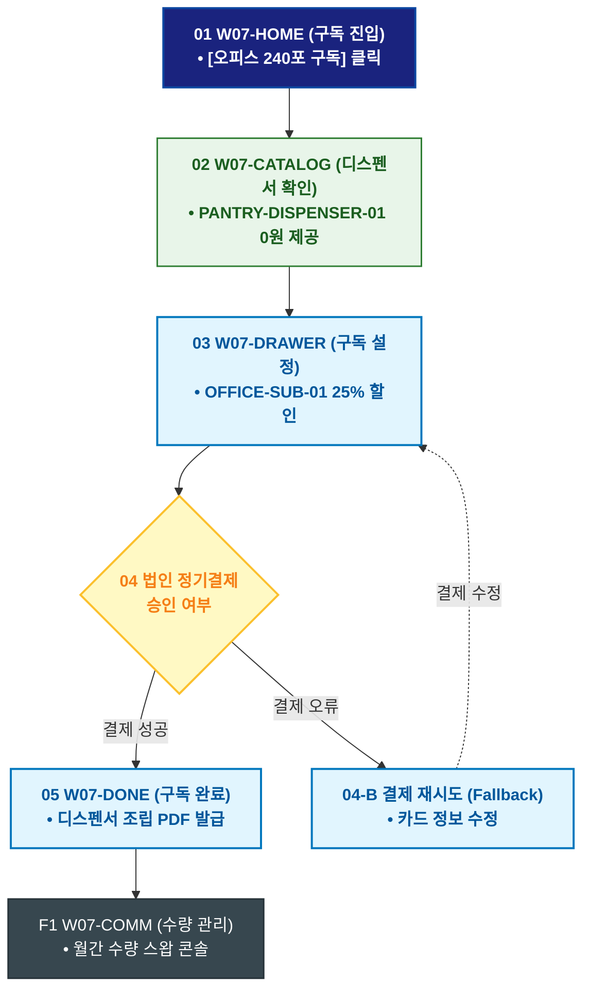

# 🔄 WICKETA 박지후 서비스 흐름도 [오피스 240포 정기구독 & 아크릴 디스펜서 무료 렌탈]

> **프로젝트명**: WICKETA 오피스 탕비실 웰니스 & 퀵커머스 (Office Wellness)  
> **분석 대상 클라이언트**: [`[가상클라이언트_07] 박지후_스타트업피플팀_오피스탕비실.txt`](file:///C:/Users/user/Desktop/이지희%20에이전트/설계%20마저%20해오기/자동화/03_클라이언트/01_가상_클라이언트/[가상클라이언트_07] 박지후_스타트업피플팀_오피스탕비실.txt)  
> **기준 사이트맵 문서**: [`C:\Users\SBS\Desktop\0819 이지희\한명씩 화면 설계도 진행\자동화\04_설계_및_스토리보드\03_사이트맵\07_박지후\사이트맵_목적2_오피스구독.md`](file:///C:/Users/SBS/Desktop/0819%20%EC%9D%B4%EC%A7%80%ED%9D%AC/%ED%95%9C%EB%AA%85%EC%94%A9%20%ED%99%94%EB%A9%B4%20%EC%84%A4%EA%B3%84%EB%8F%84%20%EC%A7%84%ED%96%89/%EC%9E%90%EB%8F%99%ED%99%94/04_%EC%84%A4%EA%B3%84_%EB%B0%8F_%EC%8A%A4%ED%86%A0%EB%A6%AC%EB%B3%B4%EB%93%9C/03_%EC%82%AC%EC%9D%B4%ED%8A%B8%EB%A7%B5/07_박지후/사이트맵_목적2_오피스구독.md)  
> **접속 목적**: 매월 240포 정기배송 및 전용 파티션 디스펜서 0원 렌탈 계약  
> **목적별 고유 킬러 기능**: **아크릴 파티션 디스펜서 (`PANTRY-DISPENSER-01`) & 오피스 정기구독 (`OFFICE-SUB-01`)**  
> **작성일자**: 2026년 8월 19일  
> **작성자**: Antigravity UI/UX 설계팀  
> **문서 인코딩**: UTF-8 (유니코드)  

---

## 1. 목적별 핵심 서비스 흐름 개요

오피스 임직원을 위해 매월 240포 스틱을 정기구독하고, 깔끔한 탕비실 정리를 위한 전용 4단 아크릴 디스펜서를 무료 렌탈받는 오피스 복지 구독 여정

---

## 2. 목적 맞춤형 가변 여정 스테이지 (Dynamic Journey Stages)

### 🏢 Stage 1: 오피스 복지 구독 탐색
- **01 구독 포털 진입 (`W07-HOME`)**: [오피스 240포 정기구독] 배너 클릭 ➔ 오피스 구독 혜택 확인
- **02 디스펜서 무료 렌탈 혜택 확인 (`W07-CATALOG`)**: PANTRY-DISPENSER-01 아크릴 4단 수납함 0원 제공 스펙 검토

### 🛒 Stage 2: 30일 배송 플랜 & 법인 정기결제
- **03 오피스 구독 드로어 호출 (`W07-DRAWER`)**: OFFICE-SUB-01 25% 법인 할인 + 매월 1일 정기배송 설정
- **04 법인 정기결제 승인 (`W07-DRAWER`)**:
  - `[조건: 결제 승인]` ➔ 웰니스 오피스 멤버십 발급 ➔ 1회차 및 디스펜서 즉시 출고
  - `[조건: 결제 실패(Fallback)]` ➔ 법인 결제 정보 재확인 안내

### 📦 Stage 3: 구독 승인 & 탕비실 셋업 가이드
- **05 구독 완료 확인 (`W07-DONE`)**: 디스펜서 조립 가이드 PDF 및 정기배송 관리 코드 발급
- **F1 월간 수량 변경 콘솔 (`W07-COMM`)**: 직원 수 증감에 따른 월간 수량 스왑 루프

---

## 3. 단계별 명세표 (Flow Matrix Table)

| 단계 ID | 단계 명칭 | 사용자 행동 | 화면 접점 | 서비스/시스템 반응 | 매핑 요구사항 | 다음 진입 조건 |
| :---: | :--- | :--- | :--- | :--- | :--- | :--- |
| **01** | 구독 진입 | [오피스 구독] 클릭 | `W07-HOME` | 오피스 구독 혜택 노출 | `REQ-01 오피스 구독` | 02 디스펜서 확인 |
| **02** | 디스펜서 확인 | 아크릴 디스펜서 0원 확인 | `W07-CATALOG` | PANTRY-DISPENSER-01 3D 뷰 렌더링 | `REQ-05 디스펜서` | 03 구독 설정 |
| **03** | 구독 설정 | 240포 플랜 선택 | `W07-DRAWER` | OFFICE-SUB-01 25% 법인 할인 적용 | `REQ-06 정기구독` | 04 법인 결제 |
| **04-A** | [성공] 결제 승인 | 법인 정기결제 1-Click 승인 | `W07-DRAWER` | 매월 1일 자동 출고 큐 등록 | `REQ-06 결제 승인` | 05 구독 완료 |
| **04-B** | [예외] 결제 실패 | 결제 정보 수정 (Fallback) | `W07-DRAWER` | 카드 정보 재입력 오버레이 | `결제 복구` | 결제 재시도 |
| **05** | 구독 완료 | 셋업 매뉴얼 다운로드 | `W07-DONE` | 디스펜서 조립 가이드 PDF 발급 | `REQ-06 가이드 발급` | F1 수량 관리 |
| **F1** | 수량 관리 | 월간 수량 변경 콘솔 확인 | `W07-COMM` | 직원 수 증감 수량 스왑 연동 | `구독 지속성` | 순환 루프 |

---

## 4. 목적별 서비스 흐름도 다이어그램 (Mermaid)

---

## 5. 최종 품질 검토 및 연계 설계 문서

- [x] **고정 템플릿 탈피**: 목적별 특성에 맞춘 독자적 가변 스테이지 및 분기 조건 반영
- [x] **예외 상황(Fallback) 및 루프 완비**: 재고 부족, 결제 실패, 글자수 오류, 연속 출석 등의 분기/복구 파이프라인 수록
- [x] **연계 사이트맵**: [`사이트맵_목적2_오피스구독.md`](file:///C:/Users/SBS/Desktop/0819%20%EC%9D%B4%EC%A7%80%ED%9D%AC/%ED%95%9C%EB%AA%85%EC%94%A9%20%ED%99%94%EB%A9%B4%20%EC%84%A4%EA%B3%84%EB%8F%84%20%EC%A7%84%ED%96%89/%EC%9E%90%EB%8F%99%ED%99%94/04_%EC%84%A4%EA%B3%84_%EB%B0%8F_%EC%8A%A4%ED%86%A0%EB%A6%AC%EB%B3%B4%EB%93%9C/03_%EC%82%AC%EC%9D%B4%ED%8A%B8%EB%A7%B5/07_박지후/사이트맵_목적2_오피스구독.md)
