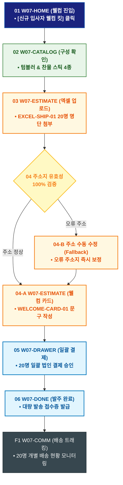

# 🔄 WICKETA 박지후 서비스 흐름도 [신규 입사자 웰컴 온보딩 텀블러 & 티 키트 대량 발송]

> **프로젝트명**: WICKETA 오피스 탕비실 웰니스 & 퀵커머스 (Office Wellness)  
> **분석 대상 클라이언트**: [`[가상클라이언트_07] 박지후_스타트업피플팀_오피스탕비실.txt`](file:///C:/Users/user/Desktop/이지희%20에이전트/설계%20마저%20해오기/자동화/03_클라이언트/01_가상_클라이언트/[가상클라이언트_07] 박지후_스타트업피플팀_오피스탕비실.txt)  
> **기준 사이트맵 문서**: [`C:\Users\SBS\Desktop\0819 이지희\한명씩 화면 설계도 진행\자동화\04_설계_및_스토리보드\03_사이트맵\07_박지후\사이트맵_목적3_웰컴키트.md`](file:///C:/Users/SBS/Desktop/0819%20%EC%9D%B4%EC%A7%80%ED%9D%AC/%ED%95%9C%EB%AA%85%EC%94%A9%20%ED%99%94%EB%A9%B4%20%EC%84%A4%EA%B3%84%EB%8F%84%20%EC%A7%84%ED%96%89/%EC%9E%90%EB%8F%99%ED%99%94/04_%EC%84%A4%EA%B3%84_%EB%B0%8F_%EC%8A%A4%ED%86%A0%EB%A6%AC%EB%B3%B4%EB%93%9C/03_%EC%82%AC%EC%9D%B4%ED%8A%B8%EB%A7%B5/07_박지후/사이트맵_목적3_웰컴키트.md)  
> **접속 목적**: 신규 입사자 개별 자택으로 웰컴 텀블러 & 4종 샘플 킷 대량 발송  
> **목적별 고유 킬러 기능**: **엑셀 대량 주소지 업로더 (`EXCEL-SHIP-01`) & 웰컴 메시지 커스텀 (`WELCOME-CARD-01`)**  
> **작성일자**: 2026년 8월 19일  
> **작성자**: Antigravity UI/UX 설계팀  
> **문서 인코딩**: UTF-8 (유니코드)  

---

## 1. 목적별 핵심 서비스 흐름 개요

신규 입사자 웰컴 키트 발송을 위해 엑셀 명단을 업로드하여 20명의 입사자 자택으로 개별 웰컴 카드와 함께 익일 발송하는 온보딩 복지 여정

---

## 2. 목적 맞춤형 가변 여정 스테이지 (Dynamic Journey Stages)

### 🎁 Stage 1: 신규 입사자 웰컴 킷 큐레이션
- **01 웰컴 킷 진입 (`W07-HOME`)**: [신규 입사자 웰컴 킷 제작] 클릭 ➔ 온보딩 쇼케이스 로딩
- **02 텀블러 & 4종 샘플 구성 확인 (`W07-CATALOG`)**: 보온 텀블러 + 찬물 스틱 4종 웰컴 패키지 선택

### 📑 Stage 2: 엑셀 주소지 업로드 & 웰컴 메시지 작성
- **03 엑셀 명단 일괄 업로드 (`W07-ESTIMATE`)**:
  - EXCEL-SHIP-01 입사자 20명 명단 엑셀 드래그 업로드 ➔ `{주소지 유효성 100% 검증}`
- **04 CEO 웰컴 메시지 카드 작성 (`W07-ESTIMATE`)**: WELCOME-CARD-01 입사 축하 문구 입력

### 🛒 Stage 3: B2B 일괄 간편결제
- **05 대량 발송 드로어 호출 (`W07-DRAWER`)**: 20명 일괄 견적 확인 ➔ 법인 결제 승인
- **06 개별 운송장 자동 발급 (`W07-DRAWER`)**: 20개 개별 택배 출고 큐 등록

### 🚚 Stage 4: 발주 완료 & 입사자 수령 대시보드
- **07 발주 승인 확인 (`W07-DONE`)**: 대량 발송 접수증 발급
- **F1 개별 배송 트래킹 (`W07-COMM`)**: 20명 입사자 자택 배송 현황 실시간 모니터링

---

## 3. 단계별 명세표 (Flow Matrix Table)

| 단계 ID | 단계 명칭 | 사용자 행동 | 화면 접점 | 서비스/시스템 반응 | 매핑 요구사항 | 다음 진입 조건 |
| :---: | :--- | :--- | :--- | :--- | :--- | :--- |
| **01** | 웰컴 진입 | [웰컴 킷 제작] 클릭 | `W07-HOME` | 온보딩 큐레이션 노출 | `REQ-05 웰컴 기획` | 02 구성 확인 |
| **02** | 구성 확인 | 텀블러 & 티 세트 선택 | `W07-CATALOG` | 웰컴 패키지 스펙 렌더링 | `REQ-05 상품 선택` | 03 엑셀 업로드 |
| **03** | 엑셀 업로드 | 20명 주소지 엑셀 첨부 | `W07-ESTIMATE` | EXCEL-SHIP-01 주소지 자동 파싱 | `REQ-06 대량 배송` | 04 주소 검증 |
| **04-A** | [성공] 주소 정상 | 유효 주소 20건 확인 | `W07-ESTIMATE` | WELCOME-CARD-01 카드 생성 | `REQ-05 웰컴 카드` | 05 일괄 결제 |
| **04-B** | [예외] 오류 주소 | 주소 수동 수정 (Fallback) | `W07-ESTIMATE` | 오류 주소지 하이라이트 노출 | `예외 복구` | 05 일괄 결제 |
| **05** | 일괄 결제 | 법인카드 일괄 승인 | `W07-DRAWER` | 20건 개별 송장 자동 생성 | `REQ-06 B2B 결제` | 06 발주 완료 |
| **06** | 발주 완료 | 대량 발송 접수증 확인 | `W07-DONE` | 접수증 PDF 다운로드 | `REQ-06 접수증 발급` | F1 배송 트래킹 |
| **F1** | 배송 트래킹 | 20명 배송 상태 확인 | `W07-COMM` | 실시간 배송 트래킹 대시보드 | `사후 관리` | 여정 완료 |

---

## 4. 목적별 서비스 흐름도 다이어그램 (Mermaid)

---

## 5. 최종 품질 검토 및 연계 설계 문서

- [x] **고정 템플릿 탈피**: 목적별 특성에 맞춘 독자적 가변 스테이지 및 분기 조건 반영
- [x] **예외 상황(Fallback) 및 루프 완비**: 재고 부족, 결제 실패, 글자수 오류, 연속 출석 등의 분기/복구 파이프라인 수록
- [x] **연계 사이트맵**: [`사이트맵_목적3_웰컴키트.md`](file:///C:/Users/SBS/Desktop/0819%20%EC%9D%B4%EC%A7%80%ED%9D%AC/%ED%95%9C%EB%AA%85%EC%94%A9%20%ED%99%94%EB%A9%B4%20%EC%84%A4%EA%B3%84%EB%8F%84%20%EC%A7%84%ED%96%89/%EC%9E%90%EB%8F%99%ED%99%94/04_%EC%84%A4%EA%B3%84_%EB%B0%8F_%EC%8A%A4%ED%86%A0%EB%A6%AC%EB%B3%B4%EB%93%9C/03_%EC%82%AC%EC%9D%B4%ED%8A%B8%EB%A7%B5/07_박지후/사이트맵_목적3_웰컴키트.md)
