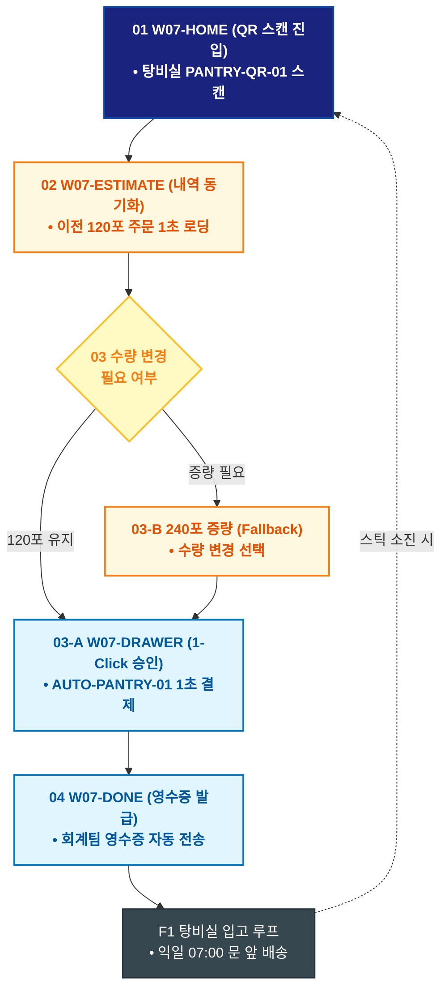

# 🔄 WICKETA 박지후 서비스 흐름도 [탕비실 디스펜서 QR 스캔 1초 법인 재발주 루프]

> **프로젝트명**: WICKETA 오피스 탕비실 웰니스 & 퀵커머스 (Office Wellness)  
> **분석 대상 클라이언트**: [`[가상클라이언트_07] 박지후_스타트업피플팀_오피스탕비실.txt`](file:///C:/Users/user/Desktop/이지희%20에이전트/설계%20마저%20해오기/자동화/03_클라이언트/01_가상_클라이언트/[가상클라이언트_07] 박지후_스타트업피플팀_오피스탕비실.txt)  
> **기준 사이트맵 문서**: [`C:\Users\SBS\Desktop\0819 이지희\한명씩 화면 설계도 진행\자동화\04_설계_및_스토리보드\03_사이트맵\07_박지후\사이트맵_목적4_재발주루프.md`](file:///C:/Users/SBS/Desktop/0819%20%EC%9D%B4%EC%A7%80%ED%9D%AC/%ED%95%9C%EB%AA%85%EC%94%A9%20%ED%99%94%EB%A9%B4%20%EC%84%A4%EA%B3%84%EB%8F%84%20%EC%A7%84%ED%96%89/%EC%9E%90%EB%8F%99%ED%99%94/04_%EC%84%A4%EA%B3%84_%EB%B0%8F_%EC%8A%A4%ED%86%A0%EB%A6%AC%EB%B3%B4%EB%93%9C/03_%EC%82%AC%EC%9D%B4%ED%8A%B8%EB%A7%B5/07_박지후/사이트맵_목적4_재발주루프.md)  
> **접속 목적**: 탕비실 스틱 소진 시 디스펜서 QR 스캔을 통한 모바일 1초 즉시 재발주  
> **목적별 고유 킬러 기능**: **탕비실 QR 모바일 즉시 발주기 (`PANTRY-QR-01`) & 1-Click 재발주 (`AUTO-PANTRY-01`)**  
> **작성일자**: 2026년 8월 19일  
> **작성자**: Antigravity UI/UX 설계팀  
> **문서 인코딩**: UTF-8 (유니코드)  

---

## 1. 목적별 핵심 서비스 흐름 개요

피플팀 매니저가 탕비실 디스펜서의 QR 코드를 스마트폰으로 스캔하여, 이전 주문 조건 그대로 1초 만에 법인 재발주를 완료하는 초고속 오피스 보충 루프

---

## 2. 목적 맞춤형 가변 여정 스테이지 (Dynamic Journey Stages)

### 📱 Stage 1: 탕비실 디스펜서 QR 스캔 진입
- **01 모바일 QR 스캔 유입 (`W07-HOME`)**: 탕비실 디스펜서 부착 QR 스캔 ➔ 모바일 퀵 주문 화면 즉시 렌더링
- **02 이전 주문 내역 1초 동기화 (`W07-ESTIMATE`)**: 지난 120포 3종 믹스 구성 및 법인 결제 정보 1초 로딩

### 🛒 Stage 2: 1-Click 법인 재발주 승인
- **03 수량 및 옵션 검증 (`W07-DRAWER`)**:
  - `{수량 유지 여부?}`
  - `[동일 조건 120포]` ➔ AUTO-PANTRY-01 1-Click 승인
  - `[수량 증량(Fallback)]` ➔ 성수기 240포 증량 선택
- **04 법인 결제 즉시 완료 (`W07-DRAWER`)**: 지문/FaceID 인증으로 1초 결제 완료

### 🚚 Stage 3: 주문 완료 & 익일 새벽 입고 루프
- **05 재발주 영수증 확인 (`W07-DONE`)**: 모바일 법인 영수증 생성 ➔ 회계팀 자동 전송
- **F1 탕비실 입고 루프 (`W07-COMM`)**: 익일 오전 07:00 탕비실 배송 완료 알림톡 수신

---

## 3. 단계별 명세표 (Flow Matrix Table)

| 단계 ID | 단계 명칭 | 사용자 행동 | 화면 접점 | 서비스/시스템 반응 | 매핑 요구사항 | 다음 진입 조건 |
| :---: | :--- | :--- | :--- | :--- | :--- | :--- |
| **01** | QR 진입 | 디스펜서 QR 스캔 | `W07-HOME` | PANTRY-QR-01 모바일 퀵 콘솔 로딩 | `REQ-01 QR 스캔` | 02 내역 동기화 |
| **02** | 내역 동기화 | 이전 120포 주문 확인 | `W07-ESTIMATE` | 이전 결제 조건 1초 동기화 | `REQ-06 1초 재발주` | 03 수량 검증 |
| **03-A** | [성공] 1-Click 승인 | [1초 재발주하기] 탭 | `W07-DRAWER` | AUTO-PANTRY-01 즉시 승인 | `REQ-06 간편 승인` | 04 영수증 발급 |
| **03-B** | [증량] 수량 변경 | 240포 증량 선택 (Fallback)| `W07-DRAWER` | 단가 자동 재계산 | `예외 복구` | 04 영수증 발급 |
| **04** | 영수증 발급 | 모바일 영수증 확인 | `W07-DONE` | 법인 회계 시스템 자동 전송 | `REQ-06 영수증 연동` | F1 입고 루프 |
| **F1** | 탕비실 입고 루프| 배송 완료 알림 확인 | `W07-COMM` | 익일 07:00 도착 알림톡 발송 | `공급 지속성` | 다음 QR 재발주 |

---

## 4. 목적별 서비스 흐름도 다이어그램 (Mermaid)

---

## 5. 최종 품질 검토 및 연계 설계 문서

- [x] **고정 템플릿 탈피**: 목적별 특성에 맞춘 독자적 가변 스테이지 및 분기 조건 반영
- [x] **예외 상황(Fallback) 및 루프 완비**: 재고 부족, 결제 실패, 글자수 오류, 연속 출석 등의 분기/복구 파이프라인 수록
- [x] **연계 사이트맵**: [`사이트맵_목적4_재발주루프.md`](file:///C:/Users/SBS/Desktop/0819%20%EC%9D%B4%EC%A7%80%ED%9D%AC/%ED%95%9C%EB%AA%85%EC%94%A9%20%ED%99%94%EB%A9%B4%20%EC%84%A4%EA%B3%84%EB%8F%84%20%EC%A7%84%ED%96%89/%EC%9E%90%EB%8F%99%ED%99%94/04_%EC%84%A4%EA%B3%84_%EB%B0%8F_%EC%8A%A4%ED%86%A0%EB%A6%AC%EB%B3%B4%EB%93%9C/03_%EC%82%AC%EC%9D%B4%ED%8A%B8%EB%A7%B5/07_박지후/사이트맵_목적4_재발주루프.md)
