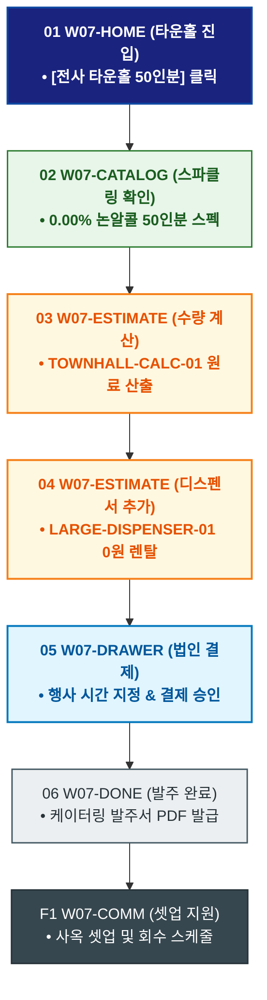

# 🔄 WICKETA 박지후 서비스 흐름도 [전사 타운홀 미팅 50인분 스파클링 에이드 케이터링 패키지 발주]

> **프로젝트명**: WICKETA 오피스 탕비실 웰니스 & 퀵커머스 (Office Wellness)  
> **분석 대상 클라이언트**: [`[가상클라이언트_07] 박지후_스타트업피플팀_오피스탕비실.txt`](file:///C:/Users/user/Desktop/이지희%20에이전트/설계%20마저%20해오기/자동화/03_클라이언트/01_가상_클라이언트/[가상클라이언트_07] 박지후_스타트업피플팀_오피스탕비실.txt)  
> **기준 사이트맵 문서**: [`C:\Users\SBS\Desktop\0819 이지희\한명씩 화면 설계도 진행\자동화\04_설계_및_스토리보드\03_사이트맵\07_박지후\사이트맵_목적5_타운홀패키지.md`](file:///C:/Users/SBS/Desktop/0819%20%EC%9D%B4%EC%A7%80%ED%9D%AC/%ED%95%9C%EB%AA%85%EC%94%A9%20%ED%99%94%EB%A9%B4%20%EC%84%A4%EA%B3%84%EB%8F%84%20%EC%A7%84%ED%96%89/%EC%9E%90%EB%8F%99%ED%99%94/04_%EC%84%A4%EA%B3%84_%EB%B0%8F_%EC%8A%A4%ED%86%A0%EB%A6%AC%EB%B3%B4%EB%93%9C/03_%EC%82%AC%EC%9D%B4%ED%8A%B8%EB%A7%B5/07_박지후/사이트맵_목적5_타운홀패키지.md)  
> **접속 목적**: 분기 전사 타운홀 미팅을 위한 50인분 0.00% 논알콜 에이드 & 디스펜서 주문  
> **목적별 고유 킬러 기능**: **타운홀 케이터링 계산기 (`TOWNHALL-CALC-01`) & 대형 디스펜서 렌탈 (`LARGE-DISPENSER-01`)**  
> **작성일자**: 2026년 8월 19일  
> **작성자**: Antigravity UI/UX 설계팀  
> **문서 인코딩**: UTF-8 (유니코드)  

---

## 1. 목적별 핵심 서비스 흐름 개요

분기 전사 타운홀 미팅 행사를 위해 50인분의 0.00% 스파클링 에이드 팩과 대형 파티 디스펜서를 당일 오전 지정 시간까지 납품받는 케이터링 발주 프로세스

---

## 2. 목적 맞춤형 가변 여정 스테이지 (Dynamic Journey Stages)

### 🍹 Stage 1: 타운홀 F&B 케이터링 탐색
- **01 타운홀 포털 진입 (`W07-HOME`)**: [전사 타운홀 50인분 패키지] 클릭 ➔ 케이터링 콘솔 로딩
- **02 0.00% 스파클링 라인업 검토 (`W07-CATALOG`)**: 로즈 쿼츠 탄산(SEC-04) & 에메랄드 라임(SEC-06) 50인분 구성 확인

### 🧮 Stage 2: 50인분 수량 산출 & 대형 디스펜서 렌탈
- **03 케이터링 계산기 조작 (`W07-ESTIMATE`)**: TOWNHALL-CALC-01 인원수(50인) 입력 ➔ 탄산 믹서 소요량 산출
- **04 대형 글래스 디스펜서 렌탈 (`W07-ESTIMATE`)**: LARGE-DISPENSER-01 파티용 대형 디스펜서 2구 0원 대여 추가

### 🛒 Stage 3: 법인 결제 및 행사 시간 지정
- **05 행사 일정 지정 및 결제 (`W07-DRAWER`)**: 타운홀 당일 오전 10:00 사옥 셋업 배송 지정 ➔ 법인 결제
- **06 결제 승인 (`W07-DRAWER`)**: 케이터링 전담팀 배정

### 🚚 Stage 4: 발주 완료 & 행사 셋업 지원
- **07 발주 승인증 확인 (`W07-DONE`)**: 타운홀 케이터링 발주서 PDF 발급
- **F1 셋업 지원 연동 (`W07-COMM`)**: 행사 당일 오전 전담 셋업 및 용기 회수 서비스 지원

---

## 3. 단계별 명세표 (Flow Matrix Table)

| 단계 ID | 단계 명칭 | 사용자 행동 | 화면 접점 | 서비스/시스템 반응 | 매핑 요구사항 | 다음 진입 조건 |
| :---: | :--- | :--- | :--- | :--- | :--- | :--- |
| **01** | 타운홀 진입 | [타운홀 패키지] 클릭 | `W07-HOME` | 케이터링 콘솔 로딩 | `REQ-01 타운홀 기획` | 02 라인업 검토 |
| **02** | 라인업 검토 | 0.00% 스파클링 스펙 확인 | `W07-CATALOG` | 50인분 패키지 스펙 렌더링 | `REQ-04 스파클링 에이드`| 03 수량 산출 |
| **03** | 수량 산출 | 50인 인원수 입력 | `W07-ESTIMATE` | TOWNHALL-CALC-01 원료 수량 계산 | `REQ-02 케이터링 계산` | 04 디스펜서 추가 |
| **04** | 디스펜서 추가 | 대형 디스펜서 2구 추가 | `W07-ESTIMATE` | LARGE-DISPENSER-01 0원 렌탈 적용 | `REQ-05 대형 기기` | 05 법인 결제 |
| **05** | 법인 결제 | 행사 시간 지정 및 결제 | `W07-DRAWER` | 케이터링 전담팀 배정 및 결제 승인 | `REQ-06 시간 지정 배송` | 06 발주 완료 |
| **06** | 발주 완료 | 케이터링 발주서 확인 | `W07-DONE` | 타운홀 발주서 PDF 발급 | `REQ-06 발주서 발급` | F1 셋업 지원 |
| **F1** | 셋업 지원 | 당일 셋업 일정 확인 | `W07-COMM` | 사옥 셋업 및 회수 스케줄 연동 | `파트너십 지속` | 여정 완료 |

---

## 4. 목적별 서비스 흐름도 다이어그램 (Mermaid)

---

## 5. 최종 품질 검토 및 연계 설계 문서

- [x] **고정 템플릿 탈피**: 목적별 특성에 맞춘 독자적 가변 스테이지 및 분기 조건 반영
- [x] **예외 상황(Fallback) 및 루프 완비**: 재고 부족, 결제 실패, 글자수 오류, 연속 출석 등의 분기/복구 파이프라인 수록
- [x] **연계 사이트맵**: [`사이트맵_목적5_타운홀패키지.md`](file:///C:/Users/SBS/Desktop/0819%20%EC%9D%B4%EC%A7%80%ED%9D%AC/%ED%95%9C%EB%AA%85%EC%94%A9%20%ED%99%94%EB%A9%B4%20%EC%84%A4%EA%B3%84%EB%8F%84%20%EC%A7%84%ED%96%89/%EC%9E%90%EB%8F%99%ED%99%94/04_%EC%84%A4%EA%B3%84_%EB%B0%8F_%EC%8A%A4%ED%86%A0%EB%A6%AC%EB%B3%B4%EB%93%9C/03_%EC%82%AC%EC%9D%B4%ED%8A%B8%EB%A7%B5/07_박지후/사이트맵_목적5_타운홀패키지.md)
