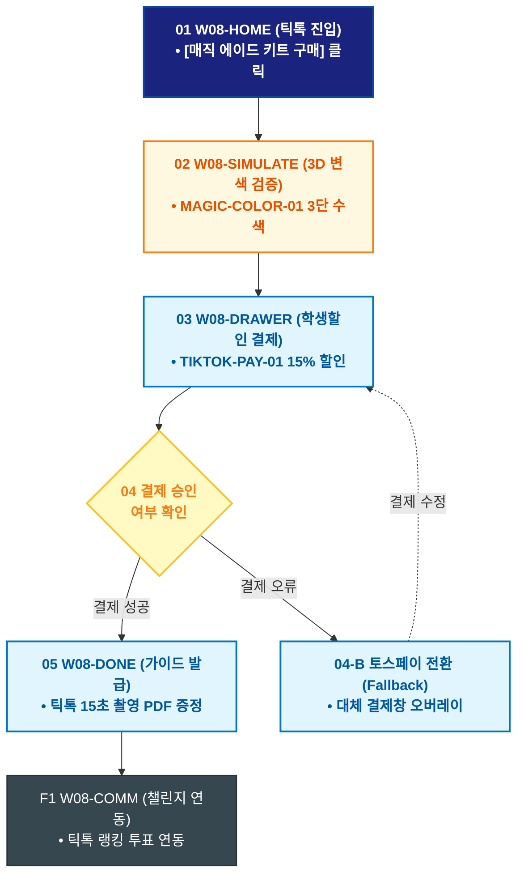

# 🔄 WICKETA 이지민 서비스 흐름도 [틱톡 레몬즙 3단 수색 변환 매직 에이드 키트 3초 간편결제]

> **프로젝트명**: WICKETA Z세대 틱톡 믹솔로지 & 숏폼 챌린지 (TikTok Mixology)  
> **분석 대상 클라이언트**: [`[가상클라이언트_08] 이지민_대학생틱톡커_Z세대믹솔로지.txt`](file:///C:/Users/user/Desktop/이지희%20에이전트/설계%20마저%20해오기/자동화/03_클라이언트/01_가상_클라이언트/[가상클라이언트_08] 이지민_대학생틱톡커_Z세대믹솔로지.txt)  
> **기준 사이트맵 문서**: [`C:\Users\SBS\Desktop\0819 이지희\한명씩 화면 설계도 진행\자동화\04_설계_및_스토리보드\03_사이트맵\08_이지민\사이트맵_목적1_수색변환에이드.md`](file:///C:/Users/SBS/Desktop/0819%20%EC%9D%B4%EC%A7%80%ED%9D%AC/%ED%95%9C%EB%AA%85%EC%94%A9%20%ED%99%94%EB%A9%B4%20%EC%84%A4%EA%B3%84%EB%8F%84%20%EC%A7%84%ED%96%89/%EC%9E%90%EB%8F%99%ED%99%94/04_%EC%84%A4%EA%B3%84_%EB%B0%8F_%EC%8A%A4%ED%86%A0%EB%A6%AC%EB%B3%B4%EB%93%9C/03_%EC%82%AC%EC%9D%B4%ED%8A%B8%EB%A7%B5/08_이지민/사이트맵_목적1_수색변환에이드.md)  
> **접속 목적**: 틱톡 화제의 변색 에이드 3D 시뮬레이션 및 학생할인 1초 결제  
> **목적별 고유 킬러 기능**: **3D 매직 변색 에이드 뷰어 (`MAGIC-COLOR-01`) & Z세대 카카오페이 1초 결제 (`TIKTOK-PAY-01`)**  
> **작성일자**: 2026년 8월 19일  
> **작성자**: Antigravity UI/UX 설계팀  
> **문서 인코딩**: UTF-8 (유니코드)  

---

## 1. 목적별 핵심 서비스 흐름 개요

틱톡 챌린지 영상에서 유입되어 레몬즙 투입 시 3단으로 변하는 수색 모션을 3D로 검증하고 대학생 15% 할인을 적용받아 3초 만에 결제하는 Z세대 여정

---

## 2. 목적 맞춤형 가변 여정 스테이지 (Dynamic Journey Stages)

### 📱 Stage 1: 틱톡 숏폼 영상 유입
- **01 틱톡 전용 홈 진입 (`W08-HOME`)**: 틱톡 태그 유입 ➔ [레몬즙 매직 에이드 키트 사기] 클릭
- **02 3단 변색 수색 3D 검증 (`W08-SIMULATE`)**: MAGIC-COLOR-01 오로라 블루(SEC-01) + 레몬즙 3단계 변색 시뮬레이션

### 🛒 Stage 2: 학생할인 검증 & 1초 결제
- **03 학생할인 드로어 호출 (`W08-DRAWER`)**: TIKTOK-PAY-01 대학생 인증(15% 추가할인) ➔ 카카오페이 1-Click 결제
- **04 결제 승인 (`W08-DRAWER`)**:
  - `[조건: 결제 승인]` ➔ 당일 특급 출고 큐 등록 ➔ 틱톡 챌린지 음원 링크 발급
  - `[조건: 잔액 부족(Fallback)]` ➔ 토스페이 1초 전환

### 🎥 Stage 3: 주문 완료 & 틱톡 촬영 가이드
- **05 주문 완료 확인 (`W08-DONE`)**: 틱톡 15초 촬영 꿀팁 PDF 발급
- **F1 틱톡 챌린지 연동 (`W08-COMM`)**: 틱톡 영상 업로드 & 실시간 투표 랭킹 참여

---

## 3. 단계별 명세표 (Flow Matrix Table)

| 단계 ID | 단계 명칭 | 사용자 행동 | 화면 접점 | 서비스/시스템 반응 | 매핑 요구사항 | 다음 진입 조건 |
| :---: | :--- | :--- | :--- | :--- | :--- | :--- |
| **01** | 틱톡 진입 | [매직 에이드 키트] 클릭 | `W08-HOME` | 틱톡 숏폼 캔버스 로딩 | `REQ-01 틱톡 유입` | 02 변색 검증 |
| **02** | 변색 검증 | 3D 레몬즙 투입 탭 | `W08-SIMULATE` | MAGIC-COLOR-01 실시간 3단 변색 렌더링 | `REQ-04 수색 변환` | 03 학생할인 결제 |
| **03** | 학생할인 결제 | 카카오페이 1-Click 승인 | `W08-DRAWER` | TIKTOK-PAY-01 15% 학생할인 적용 | `REQ-06 1초 결제` | 04 결제 승인 |
| **04-A** | [성공] 결제 완료 | 결제 완료 확인 | `W08-DRAWER` | 당일 특급 배송 지시 | `REQ-06 출고 지시` | 05 가이드 발급 |
| **04-B** | [예외] 결제 오류 | 토스페이 전환 (Fallback) | `W08-DRAWER` | 대체 결제창 노출 | `결제 복구` | 결제 재시도 |
| **05** | 가이드 발급 | 틱톡 촬영 꿀팁 확인 | `W08-DONE` | 15초 촬영 PDF & BGM 다운로드 | `REQ-05 크리에이터 툴` | F1 챌린지 연동 |
| **F1** | 챌린지 연동 | 틱톡 챌린지 피드 확인 | `W08-COMM` | 실시간 틱톡커 랭킹 투표 참여 | `순환 루프` | 여정 완료 |

---

## 4. 목적별 서비스 흐름도 다이어그램 (Mermaid)

---

## 5. 최종 품질 검토 및 연계 설계 문서

- [x] **고정 템플릿 탈피**: 목적별 특성에 맞춘 독자적 가변 스테이지 및 분기 조건 반영
- [x] **예외 상황(Fallback) 및 루프 완비**: 재고 부족, 결제 실패, 글자수 오류, 연속 출석 등의 분기/복구 파이프라인 수록
- [x] **연계 사이트맵**: [`사이트맵_목적1_수색변환에이드.md`](file:///C:/Users/SBS/Desktop/0819%20%EC%9D%B4%EC%A7%80%ED%9D%AC/%ED%95%9C%EB%AA%85%EC%94%A9%20%ED%99%94%EB%A9%B4%20%EC%84%A4%EA%B3%84%EB%8F%84%20%EC%A7%84%ED%96%89/%EC%9E%90%EB%8F%99%ED%99%94/04_%EC%84%A4%EA%B3%84_%EB%B0%8F_%EC%8A%A4%ED%86%A0%EB%A6%AC%EB%B3%B4%EB%93%9C/03_%EC%82%AC%EC%9D%B4%ED%8A%B8%EB%A7%B5/08_이지민/사이트맵_목적1_수색변환에이드.md)
