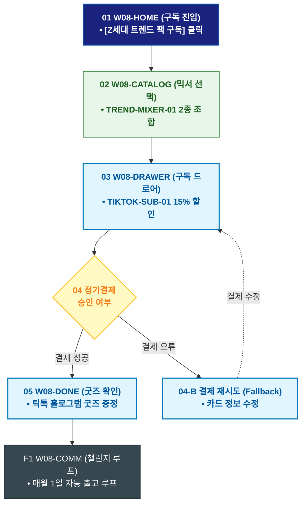

# 🔄 WICKETA 이지민 서비스 흐름도 [Z세대 홈카페 트렌디 믹서 2종 30일 정기구독]

> **프로젝트명**: WICKETA Z세대 틱톡 믹솔로지 & 숏폼 챌린지 (TikTok Mixology)  
> **분석 대상 클라이언트**: [`[가상클라이언트_08] 이지민_대학생틱톡커_Z세대믹솔로지.txt`](file:///C:/Users/user/Desktop/이지희%20에이전트/설계%20마저%20해오기/자동화/03_클라이언트/01_가상_클라이언트/[가상클라이언트_08] 이지민_대학생틱톡커_Z세대믹솔로지.txt)  
> **기준 사이트맵 문서**: [`C:\Users\SBS\Desktop\0819 이지희\한명씩 화면 설계도 진행\자동화\04_설계_및_스토리보드\03_사이트맵\08_이지민\사이트맵_목적2_홈카페구독.md`](file:///C:/Users/SBS/Desktop/0819%20%EC%9D%B4%EC%A7%80%ED%9D%AC/%ED%95%9C%EB%AA%85%EC%94%A9%20%ED%99%94%EB%A9%B4%20%EC%84%A4%EA%B3%84%EB%8F%84%20%EC%A7%84%ED%96%89/%EC%9E%90%EB%8F%99%ED%99%94/04_%EC%84%A4%EA%B3%84_%EB%B0%8F_%EC%8A%A4%ED%86%A0%EB%A6%AC%EB%B3%B4%EB%93%9C/03_%EC%82%AC%EC%9D%B4%ED%8A%B8%EB%A7%B5/08_이지민/사이트맵_목적2_홈카페구독.md)  
> **접속 목적**: 매월 신규 트렌디 믹서 2종과 틱톡 챌린지 굿즈를 받는 정기구독  
> **목적별 고유 킬러 기능**: **Z세대 맞춤 구독 드로어 (`TIKTOK-SUB-01`) & 트렌드 믹서 셀렉터 (`TREND-MIXER-01`)**  
> **작성일자**: 2026년 8월 19일  
> **작성자**: Antigravity UI/UX 설계팀  
> **문서 인코딩**: UTF-8 (유니코드)  

---

## 1. 목적별 핵심 서비스 흐름 개요

매월 SNS 인기 믹서 2종을 골라 담고 틱톡커 한정판 스티커 팩과 함께 정기배송 받는 Z세대 웰니스 구독 여정

---

## 2. 목적 맞춤형 가변 여정 스테이지 (Dynamic Journey Stages)

### 🍹 Stage 1: 이달의 트렌디 믹서 탐색
- **01 구독 홈 진입 (`W08-HOME`)**: [Z세대 트렌드 팩 구독] 클릭 ➔ 믹서 셀렉터 로딩
- **02 믹서 2종 커스텀 조합 (`W08-CATALOG`)**: TREND-MIXER-01 로즈 쿼츠 + 블루 캐모마일 선택

### 🛒 Stage 2: Slide-out 15% 정기결제
- **03 구독 드로어 오픈 (`W08-DRAWER`)**: TIKTOK-SUB-01 30일 배송 플랜 & 15% 할인 적용
- **04 간편결제 승인 (`W08-DRAWER`)**:
  - `[조건: 결제 승인]` ➔ 틱톡 멤버십 발급 ➔ 굿즈 팩 동봉 출고
  - `[조건: 결제 실패(Fallback)]` ➔ 간편 카드 재등록 안내

### 🎁 Stage 3: 구독 완료 & 챌린지 굿즈 발급
- **05 구독 승인 확인 (`W08-DONE`)**: 한정판 틱톡 홀로그램 스티커 증정 확인
- **F1 월간 틱톡커 챌린지 루프 (`W08-COMM`)**: 매월 1일 신규 팩 수령 ➔ 챌린지 순환 루프

---

## 3. 단계별 명세표 (Flow Matrix Table)

| 단계 ID | 단계 명칭 | 사용자 행동 | 화면 접점 | 서비스/시스템 반응 | 매핑 요구사항 | 다음 진입 조건 |
| :---: | :--- | :--- | :--- | :--- | :--- | :--- |
| **01** | 구독 진입 | [트렌드 팩 구독] 클릭 | `W08-HOME` | Z세대 큐레이션 노출 | `REQ-01 구독 기획` | 02 믹서 선택 |
| **02** | 믹서 선택 | 트렌디 믹서 2종 조합 | `W08-CATALOG` | TREND-MIXER-01 조합 렌더링 | `REQ-05 믹서 조합` | 03 구독 설정 |
| **03** | 구독 설정 | 30일 플랜 선택 | `W08-DRAWER` | TIKTOK-SUB-01 15% 할인 적용 | `REQ-06 정기구독` | 04 결제 승인 |
| **04-A** | [성공] 결제 승인 | 1-Click 간편결제 승인 | `W08-DRAWER` | 매월 정기 출고 지시 완료 | `REQ-06 결제 승인` | 05 굿즈 확인 |
| **04-B** | [예외] 결제 오류 | 결제 수단 재선택 (Fallback)| `W08-DRAWER` | 카드 변경 창 노출 | `결제 복구` | 결제 재시도 |
| **05** | 굿즈 확인 | 틱톡 홀로그램 굿즈 확인 | `W08-DONE` | 한정판 스티커 팩 증정 등록 | `REQ-06 굿즈 증정` | F1 챌린지 루프 |
| **F1** | 챌린지 루프 | 월간 챌린지 알림 확인 | `W08-COMM` | 매월 1일 자동 출고 루프 | `고객 락인` | 순환 루프 |

---

## 4. 목적별 서비스 흐름도 다이어그램 (Mermaid)

---

## 5. 최종 품질 검토 및 연계 설계 문서

- [x] **고정 템플릿 탈피**: 목적별 특성에 맞춘 독자적 가변 스테이지 및 분기 조건 반영
- [x] **예외 상황(Fallback) 및 루프 완비**: 재고 부족, 결제 실패, 글자수 오류, 연속 출석 등의 분기/복구 파이프라인 수록
- [x] **연계 사이트맵**: [`사이트맵_목적2_홈카페구독.md`](file:///C:/Users/SBS/Desktop/0819%20%EC%9D%B4%EC%A7%80%ED%9D%AC/%ED%95%9C%EB%AA%85%EC%94%A9%20%ED%99%94%EB%A9%B4%20%EC%84%A4%EA%B3%84%EB%8F%84%20%EC%A7%84%ED%96%89/%EC%9E%90%EB%8F%99%ED%99%94/04_%EC%84%A4%EA%B3%84_%EB%B0%8F_%EC%8A%A4%ED%86%A0%EB%A6%AC%EB%B3%B4%EB%93%9C/03_%EC%82%AC%EC%9D%B4%ED%8A%B8%EB%A7%B5/08_이지민/사이트맵_목적2_홈카페구독.md)
