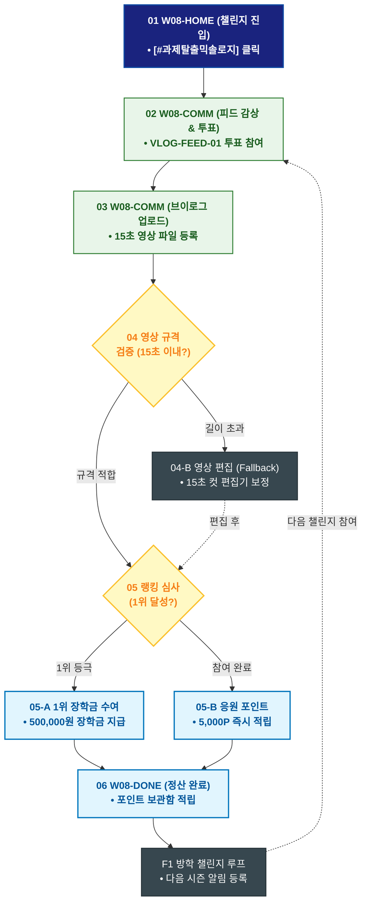

# 🔄 WICKETA 이지민 서비스 흐름도 [대학생 일상 브이로그 믹솔로지 챌린지 영상 응모 & 투표]

> **프로젝트명**: WICKETA Z세대 틱톡 믹솔로지 & 숏폼 챌린지 (TikTok Mixology)  
> **분석 대상 클라이언트**: [`[가상클라이언트_08] 이지민_대학생틱톡커_Z세대믹솔로지.txt`](file:///C:/Users/user/Desktop/이지희%20에이전트/설계%20마저%20해오기/자동화/03_클라이언트/01_가상_클라이언트/[가상클라이언트_08] 이지민_대학생틱톡커_Z세대믹솔로지.txt)  
> **기준 사이트맵 문서**: [`C:\Users\SBS\Desktop\0819 이지희\한명씩 화면 설계도 진행\자동화\04_설계_및_스토리보드\03_사이트맵\08_이지민\사이트맵_목적4_브이로그챌린지.md`](file:///C:/Users/SBS/Desktop/0819%20%EC%9D%B4%EC%A7%80%ED%9D%AC/%ED%95%9C%EB%AA%85%EC%94%A9%20%ED%99%94%EB%A9%B4%20%EC%84%A4%EA%B3%84%EB%8F%84%20%EC%A7%84%ED%96%89/%EC%9E%90%EB%8F%99%ED%99%94/04_%EC%84%A4%EA%B3%84_%EB%B0%8F_%EC%8A%A4%ED%86%A0%EB%A6%AC%EB%B3%B4%EB%93%9C/03_%EC%82%AC%EC%9D%B4%ED%8A%B8%EB%A7%B5/08_이지민/사이트맵_목적4_브이로그챌린지.md)  
> **접속 목적**: 시험기간/과제 힐링 15초 홈카페 브이로그 업로드 및 투표 참여  
> **목적별 고유 킬러 기능**: **Z세대 브이로그 피드 (`VLOG-FEED-01`) & 틱톡커 랭킹 보드 (`TIKTOK-RANK-01`)**  
> **작성일자**: 2026년 8월 19일  
> **작성자**: Antigravity UI/UX 설계팀  
> **문서 인코딩**: UTF-8 (유니코드)  

---

## 1. 목적별 핵심 서비스 흐름 개요

대학생 시험기간 힐링 홈카페 15초 숏폼 브이로그를 업로드하고 실시간 투표를 통해 틱톡커 굿즈 팩과 장학금 리워드를 획득하는 소셜 루프

---

## 2. 목적 맞춤형 가변 여정 스테이지 (Dynamic Journey Stages)

### 📹 Stage 1: 브이로그 챌린지 피드 탐색
- **01 챌린지 홈 진입 (`W08-HOME`)**: [#과제탈출믹솔로지] 탭 클릭 ➔ VLOG-FEED-01 피드 감상
- **02 타 학생 브이로그 투표 (`W08-COMM`)**: TIKTOK-RANK-01 투표 참여

### 🎬 Stage 2: 내 브이로그 영상 등록 & 검수
- **03 15초 영상 업로드 (`W08-COMM`)**: 일상 홈카페 영상 등록 ➔ 레시피 태깅
- **04 영상 검수 (`W08-COMM`)**:
  - `{15초 규격 검증}` (통과 시 피드 즉시 게시)

### 🏆 Stage 3: 실시간 랭킹 산출 & 장학금 획득
- **05 랭킹 검증 분기 (`W08-COMM`)**:
  - `{월간 1위 달성?}`
  - `[1위 등극]` ➔ 위케타 대학생 장학금 500,000원 수여
  - `[참여 완료(Fallback)]` ➔ 시험기간 응원 5,000P 즉시 적립

### 🔄 Stage 4: 리워드 수령 & 다음 챌린지 순환
- **06 리워드 정산 (`W08-DONE`)**: 장학금 및 포인트 수령 완료
- **F1 방학 챌린지 알림 루프 (`W08-COMM`)**: 다음 시즌 챌린지 알림 등록

---

## 3. 단계별 명세표 (Flow Matrix Table)

| 단계 ID | 단계 명칭 | 사용자 행동 | 화면 접점 | 서비스/시스템 반응 | 매핑 요구사항 | 다음 진입 조건 |
| :---: | :--- | :--- | :--- | :--- | :--- | :--- |
| **01** | 챌린지 진입 | [과제탈출 챌린지] 클릭 | `W08-HOME` | 브이로그 챌린지 피드 로딩 | `REQ-03 챌린지 기획` | 02 피드 투표 |
| **02** | 피드 투표 | 타 학생 영상 투표 | `W08-COMM` | TIKTOK-RANK-01 실시간 집계 | `REQ-03 실시간 투표` | 03 영상 업로드 |
| **03** | 영상 업로드 | 15초 브이로그 등록 | `W08-COMM` | VLOG-FEED-01 비디오 인코딩 | `REQ-03 영상 업로드` | 04 검수 분기 |
| **04-A** | [성공] 피드 게시 | 검수 통과 확인 | `W08-COMM` | 챌린지 피드 즉시 노출 | `REQ-03 피드 게시` | 05 랭킹 판정 |
| **04-B** | [예외] 길이 초과 | 영상 트리밍 (Fallback) | `W08-COMM` | 15초 편집 툴 노출 | `예외 복구` | 04 피드 게시 |
| **05-A** | [성공] 1위 등극 | 1위 랭크 확인 | `W08-COMM` | 대학생 장학금 500,000원 수여 | `리워드 지급` | 06 장학금 수령 |
| **05-B** | [참여] 응원 포인트 | 참여 완료 확인 | `W08-COMM` | 응원 5,000P 즉시 적립 | `참여 보상` | 06 장학금 수령 |
| **06** | 장학금 수령 | 리워드 보관함 확인 | `W08-DONE` | 장학금/포인트 정산 완료 | `REQ-06 리워드 정산` | F1 방학 챌린지 |
| **F1** | 방학 챌린지 | 다음 챌린지 알림 확인 | `W08-COMM` | 다음 시즌 카카오 푸시 예약 | `순환 루프` | 다음 챌린지 |

---

## 4. 목적별 서비스 흐름도 다이어그램 (Mermaid)

---

## 5. 최종 품질 검토 및 연계 설계 문서

- [x] **고정 템플릿 탈피**: 목적별 특성에 맞춘 독자적 가변 스테이지 및 분기 조건 반영
- [x] **예외 상황(Fallback) 및 루프 완비**: 재고 부족, 결제 실패, 글자수 오류, 연속 출석 등의 분기/복구 파이프라인 수록
- [x] **연계 사이트맵**: [`사이트맵_목적4_브이로그챌린지.md`](file:///C:/Users/SBS/Desktop/0819%20%EC%9D%B4%EC%A7%80%ED%9D%AC/%ED%95%9C%EB%AA%85%EC%94%A9%20%ED%99%94%EB%A9%B4%20%EC%84%A4%EA%B3%84%EB%8F%84%20%EC%A7%84%ED%96%89/%EC%9E%90%EB%8F%99%ED%99%94/04_%EC%84%A4%EA%B3%84_%EB%B0%8F_%EC%8A%A4%ED%86%A0%EB%A6%AC%EB%B3%B4%EB%93%9C/03_%EC%82%AC%EC%9D%B4%ED%8A%B8%EB%A7%B5/08_이지민/사이트맵_목적4_브이로그챌린지.md)
