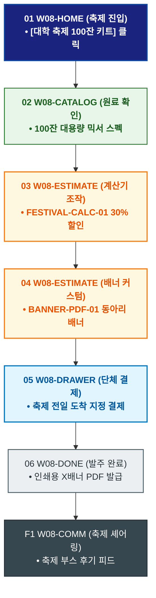

# 🔄 WICKETA 이지민 서비스 흐름도 [대학교 축제 동아리 믹솔로지 부스 100잔 대용량 키트 발주]

> **프로젝트명**: WICKETA Z세대 틱톡 믹솔로지 & 숏폼 챌린지 (TikTok Mixology)  
> **분석 대상 클라이언트**: [`[가상클라이언트_08] 이지민_대학생틱톡커_Z세대믹솔로지.txt`](file:///C:/Users/user/Desktop/이지희%20에이전트/설계%20마저%20해오기/자동화/03_클라이언트/01_가상_클라이언트/[가상클라이언트_08] 이지민_대학생틱톡커_Z세대믹솔로지.txt)  
> **기준 사이트맵 문서**: [`C:\Users\SBS\Desktop\0819 이지희\한명씩 화면 설계도 진행\자동화\04_설계_및_스토리보드\03_사이트맵\08_이지민\사이트맵_목적5_동아리축제키트.md`](file:///C:/Users/SBS/Desktop/0819%20%EC%9D%B4%EC%A7%80%ED%9D%AC/%ED%95%9C%EB%AA%85%EC%94%A9%20%ED%99%94%EB%A9%B4%20%EC%84%A4%EA%B3%84%EB%8F%84%20%EC%A7%84%ED%96%89/%EC%9E%90%EB%8F%99%ED%99%94/04_%EC%84%A4%EA%B3%84_%EB%B0%8F_%EC%8A%A4%ED%86%A0%EB%A6%AC%EB%B3%B4%EB%93%9C/03_%EC%82%AC%EC%9D%B4%ED%8A%B8%EB%A7%B5/08_이지민/사이트맵_목적5_동아리축제키트.md)  
> **접속 목적**: 대학 축제 믹솔로지 주점/부스를 위한 100잔분 대용량 팩 및 레시피 배너 주문  
> **목적별 고유 킬러 기능**: **축제 부스 대용량 계산기 (`FESTIVAL-CALC-01`) & 레시피 X배너 PDF (`BANNER-PDF-01`)**  
> **작성일자**: 2026년 8월 19일  
> **작성자**: Antigravity UI/UX 설계팀  
> **문서 인코딩**: UTF-8 (유니코드)  

---

## 1. 목적별 핵심 서비스 흐름 개요

대학 축제 동아리 부스 운영을 위해 100잔분의 0.00% 무알콜 믹솔로지 원료 팩과 축제 홍보용 레시피 X배너 디자인 PDF를 원클릭 발주하는 단체 주문 여정

---

## 2. 목적 맞춤형 가변 여정 스테이지 (Dynamic Journey Stages)

### 🎪 Stage 1: 대학교 축제 부스 포털 진입
- **01 축제 포털 진입 (`W08-HOME`)**: [대학 축제 부스 100잔 키트] 클릭 ➔ 축제 콘솔 로딩
- **02 대용량 0.00% 믹서 확인 (`W08-CATALOG`)**: 100잔분 오로라/루비 대용량 베이스 스틱 스펙 검토

### 🧮 Stage 2: 축제 인원수 계산 & X배너 커스텀
- **03 축제 계산기 조작 (`W08-ESTIMATE`)**: FESTIVAL-CALC-01 예상 잔수(100잔) 입력 ➔ 30% 학생 단체 할인 산출
- **04 동아리 이름 배너 커스텀 (`W08-ESTIMATE`)**: BANNER-PDF-01 동아리명 입력 ➔ 축제 홍보 배너 3D 프리뷰

### 🛒 Stage 3: 학생회/동아리 단체 간편결제
- **05 주문 드로어 호출 (`W08-DRAWER`)**: 30% 학생 단체 할인 확인 ➔ 카카오페이/토스 결제
- **06 결제 승인 (`W08-DRAWER`)**: 축제 D-Day 전일 특급 배송 지정

### 📦 Stage 4: 주문 완료 & 배너 디자인 PDF 발급
- **07 발주 승인 및 배너 다운로드 (`W08-DONE`)**: 축제 레시피 X배너 인쇄용 고해상도 PDF 발급
- **F1 축제 성공 후기 셰어링 (`W08-COMM`)**: 축제 부스 운영 사진 공유 피드 연동

---

## 3. 단계별 명세표 (Flow Matrix Table)

| 단계 ID | 단계 명칭 | 사용자 행동 | 화면 접점 | 서비스/시스템 반응 | 매핑 요구사항 | 다음 진입 조건 |
| :---: | :--- | :--- | :--- | :--- | :--- | :--- |
| **01** | 축제 진입 | [축제 100잔 키트] 클릭 | `W08-HOME` | 축제 부스 포털 로딩 | `REQ-01 축제 기획` | 02 라인업 확인 |
| **02** | 라인업 확인 | 100잔분 대용량 스펙 확인 | `W08-CATALOG` | 100잔 믹서 패키지 렌더링 | `REQ-05 대용량 상품` | 03 계산기 조작 |
| **03** | 계산기 조작 | 100잔 수량 입력 | `W08-ESTIMATE` | FESTIVAL-CALC-01 30% 학생할인 산출 | `REQ-02 축제 계산기` | 04 배너 커스텀 |
| **04** | 배너 커스텀 | 동아리 이름 입력 | `W08-ESTIMATE` | BANNER-PDF-01 X배너 3D 프리뷰 | `REQ-05 홍보 배너` | 05 단체 결제 |
| **05** | 단체 결제 | 카카오페이 단체 결제 승인 | `W08-DRAWER` | 축제 전일 배송 지정 및 승인 완료 | `REQ-06 단체 결제` | 06 발주 완료 |
| **06** | 발주 완료 | 배너 인쇄용 PDF 확인 | `W08-DONE` | 고해상도 X배너 인쇄 PDF 발급 | `REQ-06 배너 PDF` | F1 축제 셰어링 |
| **F1** | 축제 셰어링 | 축제 부스 사진 등록 | `W08-COMM` | 축제 성공 후기 피드 연동 | `고객 락인` | 여정 완료 |

---

## 4. 목적별 서비스 흐름도 다이어그램 (Mermaid)

---

## 5. 최종 품질 검토 및 연계 설계 문서

- [x] **고정 템플릿 탈피**: 목적별 특성에 맞춘 독자적 가변 스테이지 및 분기 조건 반영
- [x] **예외 상황(Fallback) 및 루프 완비**: 재고 부족, 결제 실패, 글자수 오류, 연속 출석 등의 분기/복구 파이프라인 수록
- [x] **연계 사이트맵**: [`사이트맵_목적5_동아리축제키트.md`](file:///C:/Users/SBS/Desktop/0819%20%EC%9D%B4%EC%A7%80%ED%9D%AC/%ED%95%9C%EB%AA%85%EC%94%A9%20%ED%99%94%EB%A9%B4%20%EC%84%A4%EA%B3%84%EB%8F%84%20%EC%A7%84%ED%96%89/%EC%9E%90%EB%8F%99%ED%99%94/04_%EC%84%A4%EA%B3%84_%EB%B0%8F_%EC%8A%A4%ED%86%A0%EB%A6%AC%EB%B3%B4%EB%93%9C/03_%EC%82%AC%EC%9D%B4%ED%8A%B8%EB%A7%B5/08_이지민/사이트맵_목적5_동아리축제키트.md)
