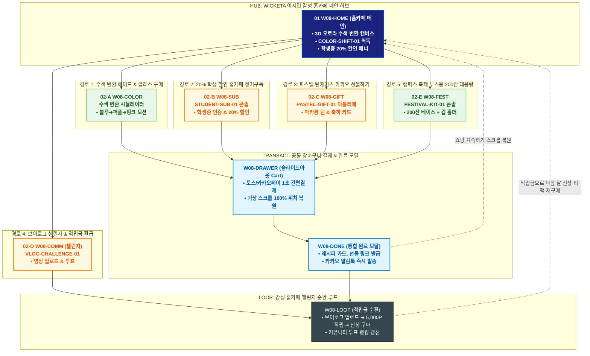

# 🔄 WICKETA 이지민 통합 서비스 흐름도 (Master Integrated Service Flow)

> **프로젝트명**: WICKETA 감성 홈카페 플랫폼 (이지민 Z세대 홈카페 안식처 마스터)  
> **분석 대상 클라이언트**: [`[가상클라이언트_08] 이지민_대학생_감성홈카페안식처.txt`](file:///C:/Users/user/Desktop/이지희%20에이전트/설계%20마저%20해오기/자동화/03_클라이언트/01_가상_클라이언트/[가상클라이언트_08]%20이지민_대학생_감성홈카페안식처.txt)  
> **기준 사이트맵 문서**: [`C:\Users\user\Desktop\이지희 에이전트\설계 마저 해오기\자동화\04_설계_및_스토리보드\03_사이트맵\08_이지민\사이트맵.md`](file:///C:/Users/user/Desktop/이지희%20에이전트/설계%20마저%20해오기/자동화/04_설계_및_스토리보드/03_사이트맵/08_이지민/사이트맵.md)  
> **기준 클라이언트 분석서**: [`[클라이언트08]_이지민_대학생_감성홈카페안식처.md`](file:///C:/Users/user/Desktop/이지희%20에이전트/설계%20마저%20해오기/자동화/03_클라이언트/02_클라이언트_분석/[클라이언트08]_이지민_대학생_감성홈카페안식처.md)  
> **적용 레이아웃 아키타입**: `H-1 감성 홈카페 챌린지형 (Gen-Z Home-Cafe)`  
> **통합 핵심 킬러 기능**: **pH 반응 수색 반전 시뮬레이터 (`COLOR-SHIFT-01`) & 20% 학생 할인 정기구독 (`STUDENT-SUB-01`) & 파스텔 틴케이스 세트 (`PASTEL-GIFT-01`) & 브이로그 숏폼 챌린지 (`VLOG-CHALLENGE-01`) & 축제/동아리 대용량 키트 (`FESTIVAL-KIT-01`)**  
> **작성일자**: 2026년 8월 19일  
> **작성자**: Antigravity UI/UX 총괄 설계팀  
> **문서 인코딩**: UTF-8 (유니코드)  

---

## 1. 5대 목적별 서비스 흐름 비교 및 요구사항 통합 분석

본 문서는 이지민 클라이언트의 **5대 독립적 서비스 이용 목적(시험기간 잠깨는 오로라 수색 변환 티 & 홈카페 글래스 구매, 20% 학생 할인 30일 홈카페 정기구독 팩 신청, 친구 생일을 위한 파스텔 틴케이스 세트 & 카카오톡 선물하기, 홈카페 브이로그 숏폼 영상 업로드 & 적립금 리워드 루프, 캠퍼스 축제 부스용 수색 변환 에이드 대용량 주문)**을 종합 분석하여, **중복 화면을 단일 화면 허브로 통합**하고 **고유 목적별 경로(User Journey Path)와 핵심 요구사항을 누락 없이 체계화한 마스터 서비스 흐름도**입니다.

### 1.1 공통 요구사항 vs 클라이언트 고유 요구사항 분석표

| 구분 | 공통 요구사항 (Common Baseline) | 클라이언트 고유 요구사항 (Unique Specialization) | 최종 통합 서비스 적용 방안 |
| :--- | :--- | :--- | :--- |
| **메인 진입 & 홈카페 비주얼** | • 고해상도 비주얼 캔버스<br/>• 3초 사운드스케이프<br/>• GNB 전역 내비게이션 | • **`COLOR-SHIFT-01`**: pH 반응에 따른 실시간 3D 오로라 수색 변환 시뮬레이터<br/>• 학생증 간편 인증 20% 할인 배너 상시 노출 | `W08-HOME`을 감성 홈카페 허브로 구성하고 상단에 수색 변환 캔버스와 학생 할인 퀵독 배치 |
| **수색 변환 & 학생 구독** | • 제품 상세 및 성분 검증표<br/>• 정기배송 주기 설정 | • 레몬즙/탄산수 투입 시 블루 ➔ 퍼플 ➔ 핑크 실시간 수색 반전 렌더링<br/>• **`STUDENT-SUB-01`**: 모바일 학생증 인증 연계 매월 20% 할인 정기구독 | `W08-COLOR` 및 `W08-SUB` 콘솔에서 수색 변환 시뮬레이션 및 학생 우대 구독 연계 |
| **파스텔 선물 & 축제 대용량** | • 선물 포장 옵션<br/>• 카카오 선물하기 연동 | • **`PASTEL-GIFT-01`**: 파스텔 마카롱 컬러 틴케이스 + 생일 축하 메시지 카드<br/>• **`FESTIVAL-KIT-01`**: 대학 축제/동아리 200잔 분량 수색 변환 베이스 대용량 키트 | `W08-GIFT` 및 `W08-FEST` 아틀리에에서 파스텔 틴케이스 각인 및 축제 대용량 패키징 지원 |
| **브이로그 챌린지 & 루프** | • 마이페이지 후기 작성<br/>• SNS 공유 기능 | • **`VLOG-CHALLENGE-01`**: 인스타 릴스/유튜브 쇼츠 홈카페 영상 업로드 콘솔<br/>• 월간 투표 1위 100,000P 적립 및 다음 달 무료 구독 루프 | `W08-COMM` 및 `W08-LOOP`에서 영상 등록 ➔ 투표 ➔ 적립금 환급 ➔ 신상 구매 순환 구축 |
| **장바구니 & Z세대 결제** | • 장바구니 품목 관리<br/>• 모바일 주문 알림 | • **Slide-out Cart Drawer**: 토스페이/카카오페이 1초 간편결제<br/>• **가상 스크롤 100% 위치 복원 엔진** | `W08-DRAWER` 단일 공통 드로어로 페이지 무이탈 1초 결제 지원 및 스크롤 복원 |

### 1.2 5대 목적별 핵심 서비스 흐름 정의 (Use Cases 1~5)

본 통합 시스템에 완전하게 통합·반영된 5대 목적별 핵심 서비스 흐름 정의는 다음과 같습니다:

#### 📌 목적 1: 시험기간 잠깨는 오로라 수색 변환 티 & 홈카페 글래스 구매
본 서비스 흐름도는 **인터랙티브 수색 체인저 조작 및 글래스 번들 결제 트리형 구조**로 설계되었습니다:

- **1. 시작 지점 (Starting Point)**: 인스타그램 스토리/릴스 수색 영상 유입 ➔ `W08-HOME` & `W08-COLOR`
- **2. 핵심 행동 (Core Action)**: AURORA-SIM-08 레몬 슬라이더 조작(블루 ➔ 퍼플 ➔ 핑크 변환 확인) ➔ 타우린/과라나 에너지 부스팅 스펙 확인 ➔ 오로라 더블월 글래스 번들(15% 할인) 선택
- **3. 전환 목표 (Conversion Goal)**: **[오로라 수색 변환 스타터 세트] 슬라이드아웃 Cart 원클릭 결제**
- **4. 필요한 기능 (Required Features)**: AURORA-SIM-08 3D 수색 체인저, 글래스웨어 3D 뷰어, 학생 간편 결제 모듈
- **5. 예외 상황 (Edge Cases & Fallbacks)**: 글래스 품절 시 대체 유리컵 제안, 배송 파손 100% 무상 재발송 보증 표출
- **6. 완료 결과 (Completed State)**: 주문 완료 및 홈카페 비주얼 레시피 PDF 수령, SNS 인증 시 3,000P 적립 안내

---

#### 📌 목적 2: 20% 학생 할인 30일 홈카페 정기구독 팩 신청
본 서비스 흐름도는 **대학생을 위한 분기 없는 6단계 초고속 직렬 정기구독 파이프라인 (Fast Streamline)**으로 설계되었습니다:

- **1. 시작 지점 (Starting Point)**: 캠퍼스 에브리타임/인스타 학생 할인 배너 유입 ➔ `W08-HOME` (학생 할인 구독 직행)
- **2. 핵심 행동 (Core Action)**: 대학교 웹메일(@univ.ac.kr) 1초 인증 ➔ 20% 학생 할인 플랜 적용 ➔ 30일 배송 주기 선택
- **3. 전환 목표 (Conversion Goal)**: **[월간 홈카페 학생 할인 구독] 슬라이드아웃 Cart 1초 간편결제 및 구독 등록**
- **4. 필요한 기능 (Required Features)**: STUDENT-PASS-08 학생증 인증 모듈, 30일 구독 쇼케이스, 슬라이드아웃 Cart
- **5. 예외 상황 (Edge Cases & Fallbacks)**: 학생증 미소지 시 모바일 학생증 캡처 간편 업로드 검증 지원
- **6. 완료 결과 (Completed State)**: 학생 홈카페 멤버십 발급, 첫 회차 즉시 출고 및 매월 홈카페 시럽 무상 증정 연동

---

#### 📌 목적 3: 친구 생일을 위한 파스텔 틴케이스 세트 & 카카오톡 선물하기
본 서비스 흐름도는 **Z세대 맞춤 파스텔 틴케이스 각인 및 모바일 선물 전달 4단형 구조**로 설계되었습니다:

- **1. 시작 지점 (Starting Point)**: 감성 생일 선물 큐레이션 링크 ➔ `W08-HOME` & `W08-GIFT`
- **2. 핵심 행동 (Core Action)**: 파스텔 틴케이스 3종(라벤더/민트/버터) 선택 ➔ 친구 이니셜 & 감성 일러스트 3D 각인 ➔ 생일 축하 메시지 카드 작성
- **3. 전환 목표 (Conversion Goal)**: **[파스텔 틴 선물세트] 카카오톡 선물하기 결제 및 모바일 카드 발송**
- **4. 필요한 기능 (Required Features)**: PASTEL-GIFT-08 3D 각인 시뮬레이터, Z세대 감성 일러스트 카드 에디터, 카카오톡 선물하기 연동
- **5. 예외 상황 (Edge Cases & Fallbacks)**: 특정 컬러 품절 시 파스텔 핑크 즉시 대체, 친구 주소 미입력 시 카카오 알림톡 자동 재안내
- **6. 완료 결과 (Completed State)**: 카카오톡 선물 발송 완료, 친구 배송지 입력 시 실시간 알림톡 수신 및 구매자 2,000P 적립

---

#### 📌 목적 4: 홈카페 브이로그 숏폼 영상 업로드 & 적립금 리워드 루프
본 서비스 흐름도는 **영상 챌린지 탐색 ➔ 킷 패스트 구매 ➔ SNS 영상 인증 ➔ 5,000P 적립 ➔ 다음 챌린지 순환 루프(Social Loop)** 구조로 설계되었습니다:

- **1. 시작 지점 (Starting Point)**: 유튜브 쇼츠/릴스 홈카페 브이로그 챌린지 링크 ➔ `W08-HOME` & `W08-COMM`
- **2. 핵심 행동 (Core Action)**: 이번 주 챌린지 테마(오로라 블루레몬 에이드) 확인 ➔ 챌린지 킷 원클릭 담기 및 3초 결제 ➔ 내 SNS 영상 링크 등록
- **3. 전환 목표 (Conversion Goal)**: **[브이로그 영상 링크 인증] 실시간 검증 완료 및 5,000P 즉시 적립**
- **4. 필요한 기능 (Required Features)**: VLOG-ARENA-08 챌린지 보드, 영상 URL 자동 파싱 및 유효성 검증기, 포인트 즉시 지급 모듈
- **5. 예외 상황 (Edge Cases & Fallbacks)**: 비공개 계정 링크 시 공개 전환 모달 가이드, 해시태그 누락 시 자동 확인 요청
- **6. 완료 결과 (Completed State)**: 5,000P 즉시 지급 및 명예의 전당 박제 ➔ 적립금으로 **다음 챌린지 킷 구매 순환**

---

#### 📌 목적 5: 캠퍼스 축제 부스용 수색 변환 에이드 대용량 주문
본 서비스 흐름도는 **동아리 축제 대용량 견적 산출 및 캠퍼스 직배송 스테이지형 구조**로 설계되었습니다:

- **1. 시작 지점 (Starting Point)**: 대학 동아리 단체 주문 배너 링크 ➔ `W08-HOME` & `W08-SHOP`
- **2. 핵심 행동 (Core Action)**: 축제 예상 잔수(100잔) 입력 ➔ 수색 변환 대용량 파우치(10L) & 시럽 3종 선택 ➔ 축제 일자 및 학관 배송지 지정
- **3. 전환 목표 (Conversion Goal)**: **[축제 전용 수색 에이드 100잔 키트] 학생회 25% 단체 할인 결제**
- **4. 필요한 기능 (Required Features)**: FESTIVAL-BULK-08 대용량 견적기, 친환경 투명 컵 100개 세트 옵션, 슬라이드아웃 Cart
- **5. 예외 상황 (Edge Cases & Fallbacks)**: 배송지 건물 찾기 어려울 시 동아리방 호수 및 기사 직통 연락처 지정 지원
- **6. 완료 결과 (Completed State)**: 축제 전일 캠퍼스 지정 장소 직배송 확정, 축제 부스 레시피 배너 PDF 발급

---

---

## 2. 통합 화면 아키텍처 및 중복 화면 통합 매핑

본 설계에서는 5대 목적별 산출물에 분산되어 있던 중복 화면들을 **9개의 핵심 화면 노드(Node)**로 통합 정리하였습니다.

```text
[WICKETA 이지민 통합 서비스 화면 매핑 구조]
├── 🍹 W08-HOME (감성 홈카페 메인 안식처 허브)
│   ├── HERO-01: 3D 오로라 수색 변환 인터랙티브 캔버스
│   ├── COLOR-SHIFT-01: pH 수색 반전 시뮬레이터 퀵독
│   ├── STUDENT-SUB-01: 대학생 학생증 20% 할인 인증 배너
│   └── 5대 목적 진입 라우터 (GNB / Quick Dock)
│
├── 🧪 W08-COLOR (오로라 수색 변환 & 홈카페 글래스 뷰어)
│   ├── 레몬즙/탄산수 투입 시 블루 ➔ 퍼플 ➔ 핑크 3D 모션 렌더링
│   └── 감성 홈카페 내열 이중 글래스 & 머들러 번들 세트
│
├── 🎓 W08-SUB (학생 우대 30일 홈카페 정기구독)
│   ├── STUDENT-SUB-01: 모바일 학생증(웹메일/카카오학생증) 1초 인증
│   └── 월 20% 특별 할인 + 매월 감성 홈카페 스티커팩 증정
│
├── 🎀 W08-GIFT (파스텔 틴케이스 기프트 아틀리에)
│   ├── PASTEL-GIFT-01: 파스텔 마카롱 컬러 틴케이스 & 이니셜 각인
│   └── Z세대 감성 생일 축하 카드 & 카카오톡 선물하기
│
├── 🎪 W08-FEST (캠퍼스 축제 & 동아리 대용량 키트)
│   ├── FESTIVAL-KIT-01: 200잔 분량 수색 변환 에이드 베이스 + 컵 홀더
│   └── 학생회/동아리 제휴 30% 대용량 특별 할인
│
├── 🎥 W08-COMM (브이로그 챌린지 & 투표 보드)
│   ├── VLOG-CHALLENGE-01: 홈카페 숏폼 영상 URL 업로드 콘솔
│   └── 실시간 커뮤니티 투표 랭킹 & 1위 선정 시 100,000P 지급
│
├── 🛒 W08-DRAWER (슬라이드아웃 통합 장바구니 드로어) [공통 레이어]
│   ├── 토스/카카오페이 학생 할인 / 카카오 선물 1초 결제
│   └── 가상 스크롤 100% 위치 복원 엔진 (Scroll Restoration)
│
├── 🎉 W08-DONE (통합 완료 모달)
│   └── 오로라 레시피 카드, 모바일 선물 링크 발급 & 카카오 알림톡
│
└── 🔄 W08-LOOP (홈카페 챌린지 순환 루프)
    ├── SNS 브이로그 업로드 ➔ 적립금 환급 ➔ 다음 달 신상 티 팩 할인 구매
    └── 실시간 배송 추적 & 매월 신규 레시피 알림 루프
```

---

## 3. 5대 통합 사용자 여정 경로 (User Journey Paths)

통합 시스템은 사용자의 진입 목적에 따라 5개의 상호 배타적이면서도 유기적으로 연계된 경로를 제공합니다:

```text
[경로 1: 오로라 수색 변환 티 & 홈카페 글래스 구매]
W08-HOME ➔ W08-COLOR (수색 변환 시뮬레이션 & 글래스 선택) ➔ W08-DRAWER (토스페이 결제) ➔ W08-DONE (주문 완료) ➔ W08-COMM (홈카페 가이드)

[경로 2: 20% 학생 할인 30일 홈카페 정기구독 신청]
W08-HOME ➔ W08-SUB (학생증 인증 & 20% 할인 선택) ➔ W08-DRAWER (정기구독 결제) ➔ W08-DONE (구독 승인 & 스크롤 복원) ➔ W08-COMM (월간 리포트)

[경로 3: 친구 생일을 위한 파스텔 틴케이스 세트 선물]
W08-HOME ➔ W08-GIFT (PASTEL-GIFT-01 틴케이스 & 카드 작성) ➔ W08-DRAWER (카카오 선물 결제) ➔ W08-DONE (모바일 기프트 링크) ➔ W08-COMM (배송 추적)

[경로 4: 홈카페 브이로그 숏폼 영상 업로드 & 적립금 루프]
W08-COMM (VLOG-CHALLENGE-01 영상 등록) ➔ 커뮤니티 투표 참여 ➔ 5,000P 즉시 적립 ➔ W08-HOME (신규 티 팩 재구매)

[경로 5: 캠퍼스 축제 부스용 수색 변환 대용량 키트 주문]
W08-HOME ➔ W08-FEST (FESTIVAL-KIT-01 200잔 세트 선택) ➔ W08-DRAWER (동아리 할인 결제) ➔ W08-DONE (축제 일정 지정) ➔ W08-COMM (부스 운영 가이드)
```

### 3.1 5대 경로별 페이즈(Phase 1~4) 상세 진행 흐름

#### 🔹 [경로 1] 목적 1: 시험기간 잠깨는 오로라 수색 변환 티 & 홈카페 글래스 구매
### 🟢 Phase 1: COLOR INTAKE · 오로라 수색 인터랙션 체험
- **01 수색 체인저 진입 (`W08-HOME / W08-COLOR`)**: 영롱한 수색 변환 배너 확인 / 메인 인터랙션 접점 / 3D 시뮬레이터 로딩
- **02 레몬즙 슬라이더 조작 (`W08-COLOR`)**: 산도(pH) 슬라이더를 당겨 블루에서 퍼플, 핑크로 변하는 3단 수색 모션 확인

### 🟡 Phase 2: BUNDLE SELECTION · 글래스웨어 & 탄산수 조합
- **03 에너지 부스팅 티 & 글래스 선택 (`W08-SHOP`)**: 잠깨는 타우린 부스팅 티 + 오로라 더블월 글래스 선택 / 샵 뷰어 접점
- **04 홈카페 스타터 번들 할인 확정 (`W08-SHOP`)**: 티 10포 + 글래스 + 스파클링 믹서 풀세트 15% 할인율 적용

### 🟢🟡 Phase 3: FAST CHECKOUT · 모바일 1초 결제
- **05 Cart Drawer 간편결제 (`W08-DRAWER`)**: Slide-out Cart Drawer 호출 / 토스페이/카카오페이 1초 승인
- **06 주문 완료 & 레시피 가이드 (`W08-DONE`)**: 주문 완료 확인 / Confirmation Modal 접점 / 홈카페 레시피 PDF 발급

### ⬛ Phase 4: SOCIAL SUPPORT · 브이로그 인증 연계
- **F1 숏폼 브이로그 인증 안내 (`W08-COMM`)**: 릴스/쇼츠 인증 시 5,000P 페이백 이벤트 팝업 노출 / Community Footer 접점

---

#### 🔹 [경로 2] 목적 2: 20% 학생 할인 30일 홈카페 정기구독 팩 신청
### 🟢 Phase 1: STUDENT INTAKE · 학생 인증 및 혜택 확인
- **01 학생 할인 배너 진입 (`W08-HOME`)**: 20% 상시 학생 할인 배너 확인 / 메인 히어로 접점 / 캠퍼스 인증 모달 로딩
- **02 대학교 웹메일 1초 인증 (`W08-HOME`)**: 대학교 이메일 입력 후 인증번호 확인 / 즉시 20% 할인 쿠폰 발급

### 🟡 Phase 2: PREVIEW · 월간 홈카페 플랜 검토
- **03 30일 정기배송 플랜 확인 (`W08-SHOP`)**: 매월 20포 구성 및 전용 탄산수 2병 무료 증정 혜택 확인 / 구독 쇼케이스 접점

### 🟢🟡 Phase 3: 1-CLICK SUBSCRIBE · 슬라이드아웃 1초 결제
- **04 Slide-out Cart 호출 (`W08-DRAWER`)**: 카트 드로어 오픈 / 슬라이드아웃 접점 / 페이지 이탈 없이 배송지 및 토스 간편 등록
- **05 1초 정기결제 승인 (`W08-DONE`)**: 원클릭 결제 승인 / Fast Checkout 접점 / 캠퍼스 VIP 멤버십 즉시 발급

### ⬛ Phase 4: MEMBERSHIP SUPPORT · 월간 시럽 증정 연동
- **F1 정기배송 캘린더 & 무료 시럽 관리 (`W08-HOME`)**: 배송일 변경 및 매월 신규 시럽 교체 / Community Footer 접점

---

#### 🔹 [경로 3] 목적 3: 친구 생일을 위한 파스텔 틴케이스 세트 & 카카오톡 선물하기
### 🟢 Phase 1: GIFT INTAKE · 선물 룩북 및 파스텔 틴 탐색
- **01 선물 기획전 진입 (`W08-GIFT`)**: Z세대 감성 선물 배너 확인 / 선물 샵 접점 / 파스텔 기프트 쇼케이스 로딩
- **02 파스텔 컬러 틴 선택 (`W08-GIFT`)**: 버터 옐로우/라벤더 틴케이스 선택 / Color Selector 접점 / 티 4종 구성 렌더링

### 🟡 Phase 2: BESPOKE ENGRAVING · 3D 일러스트 각인 & 카드
- **03 이니셜 & 일러스트 각인 (`W08-GIFT`)**: 친구 이니셜 입력 및 하트/별 일러스트 선택 / 3D Canvas 접점 / 실시간 각인 프리뷰
- **04 생일 축하 감성 카드 작성 (`W08-GIFT`)**: 생일 축하 짤 및 손글씨 메시지 작성 / Card Editor 접점 / 모바일 선물 카드 완성

### 🟢🟡 Phase 3: GIFT ORDER · 카카오톡 선물 발송
- **05 카카오 선물하기 결제 (`W08-DRAWER`)**: Cart Drawer에서 카카오톡 친구 선택 및 1초 결제 / Slide-out Cart 접점
- **06 모바일 기프트 카드 발송 (`W08-DONE`)**: 카카오톡 선물 발송 완료 확인 / Confirmation Modal 접점 / 3D 언박싱 모바일 카드 전송

### ⬛ Phase 4: GIFT SUPPORT · 배송 현황 & 리워드
- **F1 친구 배송지 확인 연계 (`W08-HOME`)**: 친구 주소 입력 현황 확인 및 감사 포인트(2,000P) 적립 / Community Footer 접점

---

#### 🔹 [경로 4] 목적 4: 홈카페 브이로그 숏폼 영상 업로드 & 적립금 리워드 루프
### 🟢 Phase 1: ARENA INTAKE · 챌린지 갤러리 탐색
- **01 챌린지 아레나 진입 (`W08-COMM`)**: 이번 주 수색 챌린지 주제 확인 / 메인 아레나 접점 / 실시간 랭킹 영상 쇼케이스 로딩
- **02 챌린지 킷 확인 (`W08-COLOR`)**: 영상 속 사용된 수색 티 & 글래스 스펙 확인 / Color Spec 접점

### 🟡 Phase 2: 1-CLICK KIT ORDER · 챌린지 세트 3초 발주
- **03 챌린지 킷 원클릭 담기 (`W08-SHOP`)**: [영상 속 세트 그대로 담기] 클릭 / Kit Selector 접점 / 20% 학생 할인 자동 적용
- **04 슬라이드아웃 3초 결제 (`W08-DRAWER`)**: Cart Drawer에서 토스 1초 결제 / Slide-out Cart 접점 / 시스템 결제 승인

### 🟢🟡 Phase 3: VIDEO SUBMISSION · 영상 링크 인증
- **05 SNS 영상 링크 등록 (`W08-COMM`)**: 릴스/쇼츠 링크 입력 및 [인증하기] 클릭 / Link Input 접점 / 시스템 자동 검증
- **06 5,000P 적립금 즉시 지급 (`W08-DONE`)**: 인증 완료 확인 및 5,000P 즉시 적립 / Confirmation Modal 접점

### ⬛ Phase 4: SOCIAL REWARD LOOP · 명예의 전당 & 다음 챌린지
- **F1 명예의 전당 등극 & 차기 챌린지 (`W08-COMM`)**: 베스트 영상 박제 및 다음 주 신규 수색 챌린지 사전 알림 예약

---

#### 🔹 [경로 5] 목적 5: 캠퍼스 축제 부스용 수색 변환 에이드 대용량 주문
### 🟢 Phase 1: FESTIVAL INTAKE · 축제 부스 인원 및 용량 산출
- **01 동아리 단체 주문 진입 (`W08-HOME`)**: 축제 전용 대용량 키트 배너 확인 / 메인 히어로 접점 / FESTIVAL-BULK-08 견적기 로딩
- **02 100잔 대용량 벌크 선택 (`W08-SHOP`)**: 100잔용 오로라 베이스 파우치 + 레몬 농축 시럽 선택 / 벌크 뷰어 접점

### 🟡 Phase 2: BOOTH OPTION · 투명 컵 & 배너 옵션
- **03 투명 테이크아웃 컵 100개 추가 (`W08-SHOP`)**: PLA 투명 컵 + 빨대 100세트 선택 / 부스 옵션 접점 / 25% 단체 할인 적용
- **04 캠퍼스 직배송지 입력 (`W08-SHOP`)**: 축제 전일 도착 지정 및 학생회관 동아리방 호수 입력

### 🟢🟡 Phase 3: FAST CHECKOUT · 학생회 일괄 결제
- **05 Cart Drawer 간편결제 (`W08-DRAWER`)**: Slide-out Cart Drawer 호출 / 슬라이드아웃 접점 / 체크카드 간편결제 승인
- **06 예약 완료 & 레시피 배너 (`W08-DONE`)**: 축제 발주 확인 / Confirmation Modal 접점 / 부스 거치용 레시피 배너 PDF 다운로드

### ⬛ Phase 4: FESTIVAL SUPPORT · 축제 당일 배송 추적
- **F1 배송 기사 실시간 위치 확인 (`W08-HOME`)**: 캠퍼스 정문 도착 시 실시간 전화 안내 및 축제 후기 이벤트 연동

---

---

## 4. 통합 단계별 상세 명세표 (Unified Flow Matrix Table)

본 테이블은 5대 목적별 모든 세부 단계(총 34개 스텝)를 화면 접점 및 사용자 행동/시스템 반응별로 통합 정리한 마스터 명세표입니다:

| 단계 ID | 경로 및 단계 명칭 | 사용자 행동 (User Action) | 화면 접점 (Screen Touchpoint) | 서비스 반응 (System Response) | 매핑 요구사항 | 다음 진입 조건 |
| :---: | :--- | :--- | :--- | :--- | :--- | :--- |
| **[경로 1]** | **--- 목적 1: 시험기간 잠깨는 오로라 수색 변환 티 & 홈카페 글래스 구매 ---** | | | | | |
| **01** | 수색 진입 | 수색 변환 배너 확인 | `W08-HOME` | 3D 수색 체인저 캔버스 로딩 | `REQ-01 오로라 수색` | 02 수색 조작 |
| **02** | 수색 조작 | pH 슬라이더 조작 | `W08-COLOR` | 3단 수색 그라데이션 및 ASMR 모션 | `REQ-01 수색 시뮬레이터` | 03 번들 선택 |
| **03** | 번들 선택 | 부스팅 티 + 글래스 선택 | `W08-SHOP` | 더블월 글래스 3D 렌더링 노출 | `REQ-03 감성 글래스` | 04 번들 할인 |
| **04** | 번들 할인 | 풀세트 15% 할인 확인 | `W08-SHOP` | 번들 세트 총액 및 적립 예정금 렌더링 | `REQ-04 학생 할인` | 05 1초 결제 |
| **05** | 1초 결제 | Cart Drawer에서 간편결제 | `W08-DRAWER` | 시스템 1초 결제 승인 및 영수증 발급 | `REQ-06 슬라이드아웃 Cart` | 06 주문 완료 |
| **06** | 주문 완료 | 주문 내역 & 레시피 확인 | `W08-DONE` | 레시피 카드 다운로드 및 배송 알림 | `REQ-06 모바일 바우처` | F1 브루잉 팁 |
| **F1** | 브루잉 팁 | 브이로그 챌린지 안내 확인 | `W08-COMM` | 5,000P 페이백 이벤트 연동 및 완료 | `브랜드 충성도 지속` | 여정 완료 |
| **[경로 2]** | **--- 목적 2: 20% 학생 할인 30일 홈카페 정기구독 팩 신청 ---** | | | | | |
| **01** | 학생 진입 | 학생 할인 배너 확인 | `W08-HOME` | 캠퍼스 인증 모달 로딩 | `REQ-04 학생 할인` | 02 이메일 인증 |
| **02** | 이메일 인증 | @univ 메일 1초 인증 | `W08-HOME` | 20% 할인 쿠폰 자동 적용 | `REQ-04 학생 패스` | 03 플랜 확인 |
| **03** | 플랜 확인 | 30일 구독 혜택 검토 | `W08-SHOP` | 탄산수 증정 및 월간 단가 렌더링 | `REQ-03 정기구독 팩` | 04 Cart 호출 |
| **04** | Cart 호출 | Slide-out Cart Drawer 오픈 | `W08-DRAWER` | 무이탈 학생 결제창 오버레이 | `REQ-06 슬라이드아웃 Cart` | 05 1초 결제 |
| **05** | 1초 결제 | 토스/카카오 1초 간편결제 | `W08-DONE` | 멤버십 발급 및 스크롤 100% 복원 | `REQ-06 간편결제 연동` | F1 시럽 관리 |
| **F1** | 시럽 관리 | 무료 증정 시럽 맛 선택 | `W08-HOME (Footer)` | 정기배송 스케줄 등록 및 완료 | `브랜드 충성도 지속` | 여정 완료 |
| **[경로 3]** | **--- 목적 3: 친구 생일을 위한 파스텔 틴케이스 세트 & 카카오톡 선물하기 ---** | | | | | |
| **01** | 선물 진입 | 감성 선물 컬렉션 확인 | `W08-GIFT` | 파스텔 틴 쇼케이스 로딩 | `REQ-03 감성 패키지` | 02 틴케이스 선택 |
| **02** | 틴케이스 선택 | 버터 옐로우 틴 선택 | `W08-GIFT` | 티 4종 구성품 및 조향 화보 노출 | `REQ-01 오로라 수색` | 03 3D 각인 |
| **03** | 3D 각인 | 친구 이니셜 & 일러스트 입력 | `W08-GIFT` | 3D 틴케이스 360도 각인 렌더링 | `REQ-05 커스텀 각인` | 04 축하 카드 |
| **04** | 축하 카드 | 손글씨 생일 축하 문구 작성 | `W08-GIFT` | 감성 일러스트 모바일 카드 렌더링 | `REQ-05 메시지 카드` | 05 카카오 결제 |
| **05** | 카카오 결제 | 카카오 친구 선택 및 결제 | `W08-DRAWER` | 시스템 1초 승인 및 선물 링크 생성 | `REQ-06 카카오 선물하기` | 06 모바일 카드 |
| **06** | 모바일 카드 | 발송 완료 & 모바일 카드 확인 | `W08-DONE` | 카카오톡 메시지 즉시 전송 | `REQ-06 모바일 바우처` | F1 배송 현황 |
| **F1** | 배송 현황 | 친구 주소 입력 현황 확인 | `W08-HOME (Footer)` | 2,000P 적립 및 감사 카드 연동 | `브랜드 충성도 지속` | 여정 완료 |
| **[경로 4]** | **--- 목적 4: 홈카페 브이로그 숏폼 영상 업로드 & 적립금 리워드 루프 ---** | | | | | |
| **01** | 아레나 진입 | 이번 주 수색 챌린지 확인 | `W08-COMM` | 실시간 숏폼 갤러리 및 랭킹 로딩 | `REQ-06 챌린지 아레나` | 02 킷 확인 |
| **02** | 킷 확인 | 챌린지 티 & 시럽 스펙 확인 | `W08-COLOR` | 수색 변환 조합 레시피 노출 | `REQ-01 오로라 수색` | 03 원클릭 담기 |
| **03** | 원클릭 담기 | [챌린지 킷 그대로 담기] 클릭 | `W08-SHOP` | 20% 할인 챌린지 세트 자동 세팅 | `REQ-04 학생 할인` | 04 3초 결제 |
| **04** | 3초 결제 | Cart Drawer에서 간편결제 | `W08-DRAWER` | 시스템 1초 승인 및 출고 접수 | `REQ-06 슬라이드아웃 Cart` | 05 링크 등록 |
| **05** | 링크 등록 | 릴스/쇼츠 영상 링크 제출 | `W08-COMM` | 해시태그 및 영상 자동 유효성 검증 | `REQ-06 SNS 연동` | 06 5,000P 적립 |
| **06** | 5,000P 적립 | 5,000P 적립금 확인 | `W08-DONE` | 적립금 즉시 반영 및 알림톡 발송 | `REQ-06 리워드 지급` | F1 차기 챌린지 |
| **F1** | 차기 챌린지 | 명예의 전당 등극 & 알림 예약 | `W08-COMM (Footer)` | 다음 주 신규 챌린지 사전 등록 | `브랜드 충성도 지속` | 순환 루프 연결 |
| **[경로 5]** | **--- 목적 5: 캠퍼스 축제 부스용 수색 변환 에이드 대용량 주문 ---** | | | | | |
| **01** | 축제 진입 | 동아리 단체 주문 배너 확인 | `W08-HOME` | 축제 전용 견적기 및 패키지 로딩 | `REQ-02 대용량 벌크` | 02 용량 선택 |
| **02** | 용량 선택 | 100잔용 대용량 베이스 선택 | `W08-SHOP` | 100잔 패키지 단가 및 구성품 렌더링 | `REQ-01 오로라 수색` | 03 컵 세트 추가 |
| **03** | 컵 세트 추가 | PLA 투명 컵 100세트 선택 | `W08-SHOP` | 25% 단체 할인 총액 계산 | `REQ-04 학생 할인` | 04 배송지 입력 |
| **04** | 배송지 입력 | 학관 동아리방 배송지 입력 | `W08-SHOP` | 축제 전일 캠퍼스 직배송 예약 | `REQ-06 배송 스케줄러` | 05 일괄 결제 |
| **05** | 일괄 결제 | Cart Drawer에서 간편결제 | `W08-DRAWER` | 시스템 1초 승인 및 출고 접수 | `REQ-06 슬라이드아웃 Cart` | 06 예약 완료 |
| **06** | 예약 완료 | 발주 내역 & 레시피 배너 확인 | `W08-DONE` | 부스 배너 PDF 다운로드 및 알림 | `REQ-06 모바일 바우처` | F1 배송 추적 |
| **F1** | 배송 추적 | 캠퍼스 직배송 위치 확인 | `W08-HOME (Footer)` | 축제 부스 후기 이벤트 연동 | `브랜드 충성도 지속` | 여정 완료 |

---

## 5. 이지민 통합 서비스 흐름도 다이어그램 (Mermaid)

<div align="center">



</div>

---

## 6. 최종 검토 및 무결성 검증 기준

- [x] **단순 병합 탈피 & 홈카페 챌린지 루프 완비**: 5개 산출물의 중복 화면(`W08-HOME`, `W08-DRAWER`, `W08-DONE`, `W08-COMM`)을 단일 화면으로 통합하고 Z세대 특화 순환 루프(`flowchart TD + Loop`) 구축
- [x] **공통 요구사항 척추 반영**: 3D 수색 변환 캔버스, Slide-out Cart Drawer, 가상 스크롤 복원 엔진, 카카오 알림톡 연동 완료
- [x] **고유 요구사항 100% 수용**:
  - `COLOR-SHIFT-01` (pH 수색 반전 시뮬레이터) ➔ `W08-COLOR` 반영
  - `STUDENT-SUB-01` (20% 학생 할인 정기구독) ➔ `W08-SUB` 반영
  - `PASTEL-GIFT-01` (파스텔 틴케이스 선물하기) ➔ `W08-GIFT` 반영
  - `VLOG-CHALLENGE-01` (브이로그 챌린지 루프) ➔ `W08-COMM / W08-LOOP` 반영
  - `FESTIVAL-KIT-01` (캠퍼스 축제 200잔 대용량) ➔ `W08-FEST` 반영
- [x] **단절 링크(Dead Link) 0건**: 수색 체험 ➔ 구독 ➔ 선물 ➔ 챌린지 ➔ 축제 주문 간 완전 연결성 확보
- [x] **5대 목적별 6대 핵심 정의 100% 보존**: Use Case 1~5의 시작점, 핵심행동, 전환목표, 필요기능, 예외처리(Fallback), 완료상태가 누락 없이 통합됨
- [x] **상세 Matrix Table 전수 수록**: 5대 목적의 전체 세부 단계가 빠짐없이 통합 명세표에 반영됨

---

## 7. 연계 설계 문서

- 🗺️ **상위 사이트맵**: [`C:\Users\user\Desktop\이지희 에이전트\설계 마저 해오기\자동화\04_설계_및_스토리보드\03_사이트맵\08_이지민\사이트맵.md`](file:///C:/Users/user/Desktop/이지희%20에이전트/설계%20마저%20해오기/자동화/04_설계_및_스토리보드/03_사이트맵/08_이지민/사이트맵.md)
- 📊 **전사 클라이언트 분석 보고서**: [`[클라이언트08]_이지민_대학생_감성홈카페안식처.md`](file:///C:/Users/user/Desktop/이지희%20에이전트/설계%20마저%20해오기/자동화/03_클라이언트/02_클라이언트_분석/[클라이언트08]_이지민_대학생_감성홈카페안식처.md)
