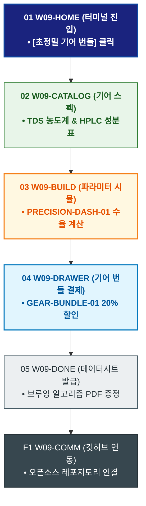

# 🔄 WICKETA 윤기준 서비스 흐름도 [초정밀 계측 TDS 농도계 & 0.1g 정밀 저울 기어 번들 구매]

> **프로젝트명**: WICKETA 데이터 엔지니어링 & 초정밀 계측 브루잉 (Precision Data Brewing)  
> **분석 대상 클라이언트**: [`[가상클라이언트_09] 윤기준_풀스택개발자_초정밀계측브루잉.txt`](file:///C:/Users/user/Desktop/이지희%20에이전트/설계%20마저%20해오기/자동화/03_클라이언트/01_가상_클라이언트/[가상클라이언트_09] 윤기준_풀스택개발자_초정밀계측브루잉.txt)  
> **기준 사이트맵 문서**: [`C:\Users\SBS\Desktop\0819 이지희\한명씩 화면 설계도 진행\자동화\04_설계_및_스토리보드\03_사이트맵\09_윤기준\사이트맵_목적1_정밀기어번들.md`](file:///C:/Users/SBS/Desktop/0819%20%EC%9D%B4%EC%A7%80%ED%9D%AC/%ED%95%9C%EB%AA%85%EC%94%A9%20%ED%99%94%EB%A9%B4%20%EC%84%A4%EA%B3%84%EB%8F%84%20%EC%A7%84%ED%96%89/%EC%9E%90%EB%8F%99%ED%99%94/04_%EC%84%A4%EA%B3%84_%EB%B0%8F_%EC%8A%A4%ED%86%A0%EB%A6%AC%EB%B3%B4%EB%93%9C/03_%EC%82%AC%EC%9D%B4%ED%8A%B8%EB%A7%B5/09_윤기준/사이트맵_목적1_정밀기어번들.md)  
> **접속 목적**: 개발자 홈카페를 위한 TDS 농도계 및 0.1g 저울 데이터 번들 결제  
> **목적별 고유 킬러 기능**: **초정밀 계측 대시보드 (`PRECISION-DASH-01`) & 개발자 기어 번들기 (`GEAR-BUNDLE-01`)**  
> **작성일자**: 2026년 8월 19일  
> **작성자**: Antigravity UI/UX 설계팀  
> **문서 인코딩**: UTF-8 (유니코드)  

---

## 1. 목적별 핵심 서비스 흐름 개요

TDS(총용존고형물) 농도계와 0.1g 정밀 저울의 계측 스펙을 확인하고, 463종 HPLC 성분표 데이터시트와 함께 기어 번들을 간편 발주하는 개발자 맞춤 여정

---

## 2. 목적 맞춤형 가변 여정 스테이지 (Dynamic Journey Stages)

### 💻 Stage 1: 데이터 엔지니어링 포털 진입
- **01 정밀 계측 메인 진입 (`W09-HOME`)**: 터미널 다크 테마 로딩 ➔ [초정밀 계측 기어 번들] 퀵독 클릭
- **02 HPLC 463종 성분표 & 기어 스펙 확인 (`W09-CATALOG`)**: TDS 농도계, 0.1g 스마트 저울, 0.00mg 무카페인 시험데이터 PDF 열람

### 🧮 Stage 2: 정밀 추출 알고리즘 파라미터 시뮬레이션
- **03 추출 변수 시뮬레이터 조작 (`W09-BUILD`)**: PRECISION-DASH-01 수온(92℃), 추출시간(180초), 분쇄도 파라미터 입력
- **04 데이터 기어 번들 할인 검증 (`W09-BUILD`)**: GEAR-BUNDLE-01 20% 개발자 번들 할인 적용

### 🛒 Stage 3: Slide-out 1초 개발자 결제
- **05 주문 드로어 호출 (`W09-DRAWER`)**: 1-Click 간편결제 ➔ 결제 승인

### 📜 Stage 4: 발주 완료 & 브루잉 알고리즘 데이터시트
- **06 주문 승인 확인 (`W09-DONE`)**: 정밀 추출 파라미터 데이터시트 PDF 증정
- **F1 깃허브 오픈소스 연동 (`W09-COMM`)**: 브루잉 알고리즘 깃허브 레포지토리 연동

---

## 3. 단계별 명세표 (Flow Matrix Table)

| 단계 ID | 단계 명칭 | 사용자 행동 | 화면 접점 | 서비스/시스템 반응 | 매핑 요구사항 | 다음 진입 조건 |
| :---: | :--- | :--- | :--- | :--- | :--- | :--- |
| **01** | 기어 진입 | [정밀 기어 번들] 클릭 | `W09-HOME` | 터미널 대시보드 로딩 | `REQ-01 데이터 기획` | 02 스펙 확인 |
| **02** | 스펙 확인 | TDS 농도계 스펙 확인 | `W09-CATALOG` | HPLC 성분 데이터시트 노출 | `REQ-04 성분 데이터` | 03 파라미터 시뮬 |
| **03** | 파라미터 시뮬 | 수온/시간 파라미터 조작 | `W09-BUILD` | PRECISION-DASH-01 실시간 수율 계산 | `REQ-02 정밀 시뮬레이터`| 04 기어 담기 |
| **04** | 기어 담기 | [기어 번들 구매] 클릭 | `W09-DRAWER` | GEAR-BUNDLE-01 20% 할인 적용 | `REQ-06 번들 결제` | 05 1초 결제 |
| **05** | 1초 결제 | 간편결제 1-Click 승인 | `W09-DRAWER` | 당일 안전 패키징 및 출고 지시 | `REQ-06 출고 지시` | 06 데이터시트 |
| **06** | 데이터시트 | 브루잉 파라미터 확인 | `W09-DONE` | 알고리즘 데이터시트 PDF 발급 | `REQ-06 데이터시트` | F1 깃허브 연동 |
| **F1** | 깃허브 연동 | 오픈소스 레포지토리 확인 | `W09-COMM` | 추출 로그 오픈소스 커뮤니티 연동 | `개발자 락인` | 여정 완료 |

---

## 4. 목적별 서비스 흐름도 다이어그램 (Mermaid)

---

## 5. 최종 품질 검토 및 연계 설계 문서

- [x] **고정 템플릿 탈피**: 목적별 특성에 맞춘 독자적 가변 스테이지 및 분기 조건 반영
- [x] **예외 상황(Fallback) 및 루프 완비**: 재고 부족, 결제 실패, 글자수 오류, 연속 출석 등의 분기/복구 파이프라인 수록
- [x] **연계 사이트맵**: [`사이트맵_목적1_정밀기어번들.md`](file:///C:/Users/SBS/Desktop/0819%20%EC%9D%B4%EC%A7%80%ED%9D%AC/%ED%95%9C%EB%AA%85%EC%94%A9%20%ED%99%94%EB%A9%B4%20%EC%84%A4%EA%B3%84%EB%8F%84%20%EC%A7%84%ED%96%89/%EC%9E%90%EB%8F%99%ED%99%94/04_%EC%84%A4%EA%B3%84_%EB%B0%8F_%EC%8A%A4%ED%86%A0%EB%A6%AC%EB%B3%B4%EB%93%9C/03_%EC%82%AC%EC%9D%B4%ED%8A%B8%EB%A7%B5/09_윤기준/사이트맵_목적1_정밀기어번들.md)
