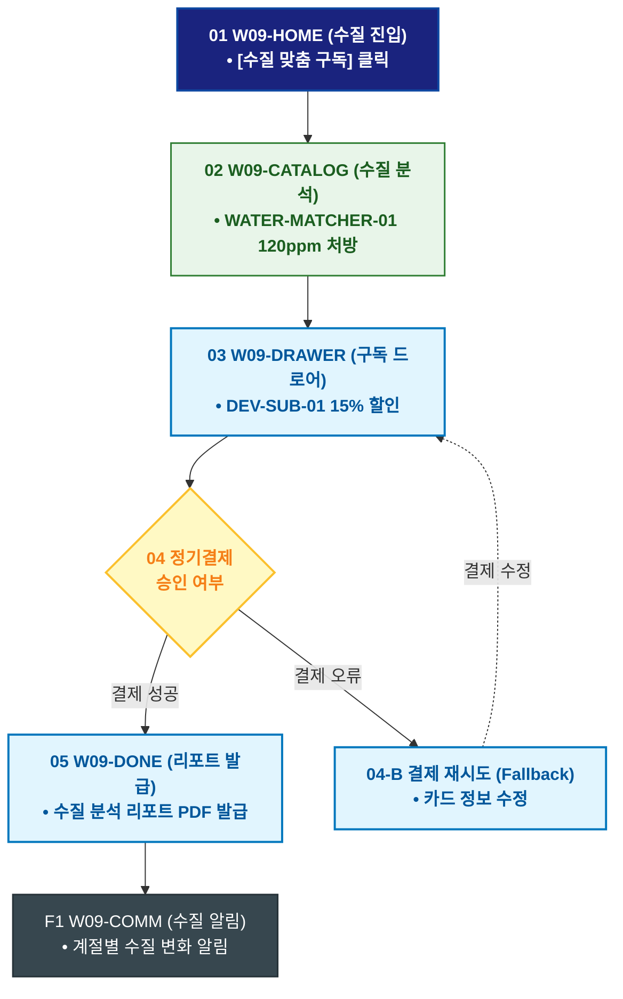

# 🔄 WICKETA 윤기준 서비스 흐름도 [거주지 수질 TDS 맞춤형 클린 티 30일 정기구독]

> **프로젝트명**: WICKETA 데이터 엔지니어링 & 초정밀 계측 브루잉 (Precision Data Brewing)  
> **분석 대상 클라이언트**: [`[가상클라이언트_09] 윤기준_풀스택개발자_초정밀계측브루잉.txt`](file:///C:/Users/user/Desktop/이지희%20에이전트/설계%20마저%20해오기/자동화/03_클라이언트/01_가상_클라이언트/[가상클라이언트_09] 윤기준_풀스택개발자_초정밀계측브루잉.txt)  
> **기준 사이트맵 문서**: [`C:\Users\SBS\Desktop\0819 이지희\한명씩 화면 설계도 진행\자동화\04_설계_및_스토리보드\03_사이트맵\09_윤기준\사이트맵_목적2_TDS정기구독.md`](file:///C:/Users/SBS/Desktop/0819%20%EC%9D%B4%EC%A7%80%ED%9D%AC/%ED%95%9C%EB%AA%85%EC%94%A9%20%ED%99%94%EB%A9%B4%20%EC%84%A4%EA%B3%84%EB%8F%84%20%EC%A7%84%ED%96%89/%EC%9E%90%EB%8F%99%ED%99%94/04_%EC%84%A4%EA%B3%84_%EB%B0%8F_%EC%8A%A4%ED%86%A0%EB%A6%AC%EB%B3%B4%EB%93%9C/03_%EC%82%AC%EC%9D%B4%ED%8A%B8%EB%A7%B5/09_윤기준/사이트맵_목적2_TDS정기구독.md)  
> **접속 목적**: 지역별 수질 데이터(TDS) 입력 및 최적 추출 티 30일 정기배송  
> **목적별 고유 킬러 기능**: **수질 데이터 매칭기 (`WATER-MATCHER-01`) & 개발자 정기구독 드로어 (`DEV-SUB-01`)**  
> **작성일자**: 2026년 8월 19일  
> **작성자**: Antigravity UI/UX 설계팀  
> **문서 인코딩**: UTF-8 (유니코드)  

---

## 1. 목적별 핵심 서비스 흐름 개요

거주 지역의 수질 데이터(경도/TDS)를 입력하여 미네랄 성분에 가장 적합한 티 블렌드를 처방받고 30일 정기배송을 신청하는 수질 기반 구독 여정

---

## 2. 목적 맞춤형 가변 여정 스테이지 (Dynamic Journey Stages)

### 💧 Stage 1: 수질 데이터 입력 & 분석
- **01 수질 매칭 홈 진입 (`W09-HOME`)**: [거주지 수질 기반 맞춤 구독] 클릭 ➔ 수질 분석 콘솔 로딩
- **02 수질 TDS 값 입력 (`W09-CATALOG`)**: WATER-MATCHER-01 지역 선택(서울 성수동 / TDS 120ppm) ➔ 스모키 얼그레이(SEC-03) 최적 매칭

### 🛒 Stage 2: 30일 맞춤 정기구독 결제
- **03 정기구독 드로어 오픈 (`W09-DRAWER`)**: DEV-SUB-01 15% 할인 적용 ➔ 1초 결제
- **04 결제 승인 (`W09-DRAWER`)**: 매월 1일 수질 최적화 블렌드 자동 출고 큐 등록

### 📊 Stage 3: 구독 승인 & 수질 변화 모니터링
- **05 구독 승인 확인 (`W09-DONE`)**: 구독 코드 발급 ➔ 수질 분석 리포트 PDF 증정
- **F1 수질 변화 알림 루프 (`W09-COMM`)**: 계절별 상수도 수질 변화 시 최적 브루잉 시간 자동 알림

---

## 3. 단계별 명세표 (Flow Matrix Table)

| 단계 ID | 단계 명칭 | 사용자 행동 | 화면 접점 | 서비스/시스템 반응 | 매핑 요구사항 | 다음 진입 조건 |
| :---: | :--- | :--- | :--- | :--- | :--- | :--- |
| **01** | 수질 진입 | [수질 맞춤 구독] 클릭 | `W09-HOME` | 수질 매칭 콘솔 활성화 | `REQ-02 수질 기획` | 02 수질 분석 |
| **02** | 수질 분석 | 지역 및 TDS(120ppm) 입력 | `W09-CATALOG` | WATER-MATCHER-01 맞춤 티 처방 | `REQ-02 수질 알고리즘`| 03 구독 호출 |
| **03** | 구독 호출 | [30일 정기구독 신청] 클릭 | `W09-DRAWER` | DEV-SUB-01 15% 할인 적용 | `REQ-06 정기구독` | 04 결제 승인 |
| **04-A** | [성공] 결제 승인 | 간편결제 1-Click 승인 | `W09-DRAWER` | 매월 정기 출고 큐 등록 | `REQ-06 결제 승인` | 05 리포트 발급 |
| **04-B** | [예외] 결제 오류 | 카드 정보 수정 (Fallback) | `W09-DRAWER` | 대체 결제창 노출 | `결제 복구` | 결제 재시도 |
| **05** | 리포트 발급 | 수질 리포트 확인 | `W09-DONE` | 수질 분석 리포트 PDF 발급 | `REQ-06 수질 리포트` | F1 수질 알림 |
| **F1** | 수질 알림 | 계절별 수질 알림 확인 | `W09-COMM` | 계절별 추출 시간 보정 알림 | `구독 지속성` | 순환 루프 |

---

## 4. 목적별 서비스 흐름도 다이어그램 (Mermaid)

---

## 5. 최종 품질 검토 및 연계 설계 문서

- [x] **고정 템플릿 탈피**: 목적별 특성에 맞춘 독자적 가변 스테이지 및 분기 조건 반영
- [x] **예외 상황(Fallback) 및 루프 완비**: 재고 부족, 결제 실패, 글자수 오류, 연속 출석 등의 분기/복구 파이프라인 수록
- [x] **연계 사이트맵**: [`사이트맵_목적2_TDS정기구독.md`](file:///C:/Users/SBS/Desktop/0819%20%EC%9D%B4%EC%A7%80%ED%9D%AC/%ED%95%9C%EB%AA%85%EC%94%A9%20%ED%99%94%EB%A9%B4%20%EC%84%A4%EA%B3%84%EB%8F%84%20%EC%A7%84%ED%96%89/%EC%9E%90%EB%8F%99%ED%99%94/04_%EC%84%A4%EA%B3%84_%EB%B0%8F_%EC%8A%A4%ED%86%A0%EB%A6%AC%EB%B3%B4%EB%93%9C/03_%EC%82%AC%EC%9D%B4%ED%8A%B8%EB%A7%B5/09_윤기준/사이트맵_목적2_TDS정기구독.md)
