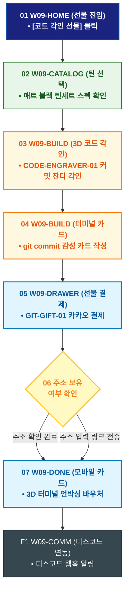

# 🔄 WICKETA 윤기준 서비스 흐름도 [동료 개발자 깃허브 커밋 잔디 & 코드 구문 3D 각인 선물]

> **프로젝트명**: WICKETA 데이터 엔지니어링 & 초정밀 계측 브루잉 (Precision Data Brewing)  
> **분석 대상 클라이언트**: [`[가상클라이언트_09] 윤기준_풀스택개발자_초정밀계측브루잉.txt`](file:///C:/Users/user/Desktop/이지희%20에이전트/설계%20마저%20해오기/자동화/03_클라이언트/01_가상_클라이언트/[가상클라이언트_09] 윤기준_풀스택개발자_초정밀계측브루잉.txt)  
> **기준 사이트맵 문서**: [`C:\Users\SBS\Desktop\0819 이지희\한명씩 화면 설계도 진행\자동화\04_설계_및_스토리보드\03_사이트맵\09_윤기준\사이트맵_목적3_코드각인선물.md`](file:///C:/Users/SBS/Desktop/0819%20%EC%9D%B4%EC%A7%80%ED%9D%AC/%ED%95%9C%EB%AA%85%EC%94%A9%20%ED%99%94%EB%A9%B4%20%EC%84%A4%EA%B3%84%EB%8F%84%20%EC%A7%84%ED%96%89/%EC%9E%90%EB%8F%99%ED%99%94/04_%EC%84%A4%EA%B3%84_%EB%B0%8F_%EC%8A%A4%ED%86%A0%EB%A6%AC%EB%B3%B4%EB%93%9C/03_%EC%82%AC%EC%9D%B4%ED%8A%B8%EB%A7%B5/09_윤기준/사이트맵_목적3_코드각인선물.md)  
> **접속 목적**: 동료 개발자를 위한 깃허브 잔디/코드 3D 레이저 각인 틴 선물 발송  
> **목적별 고유 킬러 기능**: **코드 구문 3D 레이저 각인기 (`CODE-ENGRAVER-01`) & 깃허브 웹훅 연동 (`GIT-GIFT-01`)**  
> **작성일자**: 2026년 8월 19일  
> **작성자**: Antigravity UI/UX 설계팀  
> **문서 인코딩**: UTF-8 (유니코드)  

---

## 1. 목적별 핵심 서비스 흐름 개요

매트 블랙 틴케이스에 동료의 깃허브 아이디 커밋 잔디와 시그니처 코드 구문(Python/Rust)을 3D 레이저 각인하여 카카오톡 선물하기로 발송하는 개발자 헌정 여정

---

## 2. 목적 맞춤형 가변 여정 스테이지 (Dynamic Journey Stages)

### 🎁 Stage 1: 개발자 선물 큐레이션 탐색
- **01 선물 홈 진입 (`W09-HOME`)**: [동료 개발자 코드 각인 선물] 클릭 ➔ 깃허브 기프트 콘솔 로딩
- **02 매트 블랙 틴세트 선택 (`W09-CATALOG`)**: 심야 코딩용 0.00mg 무카페인 틴세트 선택

### 🔨 Stage 2: 3D 코드 구문 레이저 각인 & 깃 잔디 연동
- **03 깃허브 아이디 입력 & 각인 시뮬레이션 (`W09-BUILD`)**:
  - CODE-ENGRAVER-01 깃허브 ID 입력 ➔ 연간 커밋 잔디 패턴 & 코드 구문(10줄) 3D 레이저 버닝 각인 프리뷰
- **04 개발자 헌정 터미널 카드 작성 (`W09-BUILD`)**: `git commit -m "Happy Birthday"` 감성 메시지 작성

### 🛒 Stage 3: 카카오톡 선물하기 결제
- **05 선물 드로어 오픈 (`W09-DRAWER`)**: GIT-GIFT-01 카카오 친구 선택 ➔ 1초 결제
- **06 주소 확인 분기 (`W09-DRAWER`)**: 주소 보유 시 즉시 출고 / 미입력 시 카카오톡 링크 전송

### 💌 Stage 4: 3D 모바일 기프트 카드 발송
- **07 3D 언박싱 코드 바우처 발급 (`W09-DONE`)**: 터미널 콘솔을 열어 코드를 푸는 인터랙티브 모바일 카드 발송
- **F1 배송 추적 & 디스코드 웹훅 (`W09-COMM`)**: 실시간 배송 조회 및 디스코드 채널 알림 연동

---

## 3. 단계별 명세표 (Flow Matrix Table)

| 단계 ID | 단계 명칭 | 사용자 행동 | 화면 접점 | 서비스/시스템 반응 | 매핑 요구사항 | 다음 진입 조건 |
| :---: | :--- | :--- | :--- | :--- | :--- | :--- |
| **01** | 선물 진입 | [코드 각인 선물] 클릭 | `W09-HOME` | 개발자 선물 콘솔 노출 | `REQ-05 선물 기획` | 02 틴 선택 |
| **02** | 틴 선택 | 매트 블랙 틴세트 선택 | `W09-CATALOG` | 상품 스펙 및 각인 옵션 노출 | `REQ-05 상품 선택` | 03 코드 각인 |
| **03** | 코드 각인 | 깃허브 ID & 코드 입력 | `W09-BUILD` | CODE-ENGRAVER-01 3D 실시간 각인 | `REQ-05 3D 각인기` | 04 터미널 카드 |
| **04** | 터미널 카드 | git 커밋 메시지 작성 | `W09-BUILD` | 터미널 테마 엽서 프리뷰 생성 | `REQ-05 감성 카드` | 05 선물 결제 |
| **05** | 선물 결제 | 카카오 친구 선택 및 결제 | `W09-DRAWER` | 카카오페이 1초 승인, 바우처 생성 | `REQ-06 선물 결제` | 06 주소 확인 |
| **06-A** | [성공] 주소 완료 | 친구 주소 즉시 확인 | `W09-DRAWER` | 당일 레이저 각인 및 출고 지시 | `배송 지정` | 07 카드 발송 |
| **06-B** | [대기] 링크 전송 | 주소 입력 링크 발송 | `W09-DRAWER` | 카카오톡 배송지 폼 발송 | `예외 처리` | 07 카드 발송 |
| **07** | 모바일 카드 | 3D 터미널 바우처 확인 | `W09-DONE` | 수령인 카카오톡 메시지 전송 | `REQ-06 모바일 카드` | F1 디스코드 연동 |
| **F1** | 디스코드 연동 | 디스코드 웹훅 알림 확인 | `W09-COMM` | 개발팀 디스코드 채널 알림 연동 | `사후 관리` | 여정 완료 |

---

## 4. 목적별 서비스 흐름도 다이어그램 (Mermaid)

---

## 5. 최종 품질 검토 및 연계 설계 문서

- [x] **고정 템플릿 탈피**: 목적별 특성에 맞춘 독자적 가변 스테이지 및 분기 조건 반영
- [x] **예외 상황(Fallback) 및 루프 완비**: 재고 부족, 결제 실패, 글자수 오류, 연속 출석 등의 분기/복구 파이프라인 수록
- [x] **연계 사이트맵**: [`사이트맵_목적3_코드각인선물.md`](file:///C:/Users/SBS/Desktop/0819%20%EC%9D%B4%EC%A7%80%ED%9D%AC/%ED%95%9C%EB%AA%85%EC%94%A9%20%ED%99%94%EB%A9%B4%20%EC%84%A4%EA%B3%84%EB%8F%84%20%EC%A7%84%ED%96%89/%EC%9E%90%EB%8F%99%ED%99%94/04_%EC%84%A4%EA%B3%84_%EB%B0%8F_%EC%8A%A4%ED%86%A0%EB%A6%AC%EB%B3%B4%EB%93%9C/03_%EC%82%AC%EC%9D%B4%ED%8A%B8%EB%A7%B5/09_윤기준/사이트맵_목적3_코드각인선물.md)
