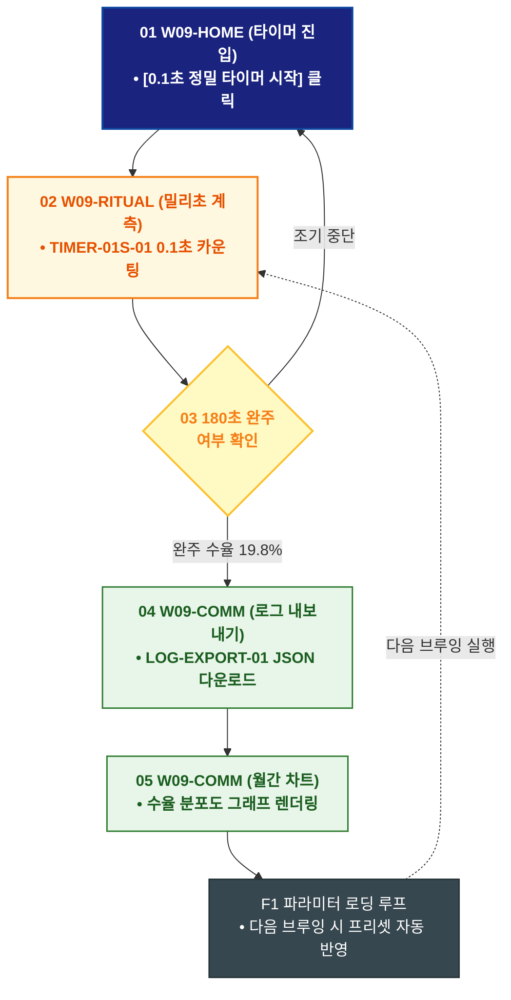

# 🔄 WICKETA 윤기준 서비스 흐름도 [0.1초 정밀 브루잉 타이머 실행 & JSON 로그 데이터 내보내기]

> **프로젝트명**: WICKETA 데이터 엔지니어링 & 초정밀 계측 브루잉 (Precision Data Brewing)  
> **분석 대상 클라이언트**: [`[가상클라이언트_09] 윤기준_풀스택개발자_초정밀계측브루잉.txt`](file:///C:/Users/user/Desktop/이지희%20에이전트/설계%20마저%20해오기/자동화/03_클라이언트/01_가상_클라이언트/[가상클라이언트_09] 윤기준_풀스택개발자_초정밀계측브루잉.txt)  
> **기준 사이트맵 문서**: [`C:\Users\SBS\Desktop\0819 이지희\한명씩 화면 설계도 진행\자동화\04_설계_및_스토리보드\03_사이트맵\09_윤기준\사이트맵_목적4_브루잉로그.md`](file:///C:/Users/SBS/Desktop/0819%20%EC%9D%B4%EC%A7%80%ED%9D%AC/%ED%95%9C%EB%AA%85%EC%94%A9%20%ED%99%94%EB%A9%B4%20%EC%84%A4%EA%B3%84%EB%8F%84%20%EC%A7%84%ED%96%89/%EC%9E%90%EB%8F%99%ED%99%94/04_%EC%84%A4%EA%B3%84_%EB%B0%8F_%EC%8A%A4%ED%86%A0%EB%A6%AC%EB%B3%B4%EB%93%9C/03_%EC%82%AC%EC%9D%B4%ED%8A%B8%EB%A7%B5/09_윤기준/사이트맵_목적4_브루잉로그.md)  
> **접속 목적**: 0.1초 단위 브루잉 타이머 기록 및 JSON/CSV 추출 로그 아카이빙  
> **목적별 고유 킬러 기능**: **0.1초 정밀 브루잉 타이머 (`TIMER-01S-01`) & JSON 로그 엑스포터 (`LOG-EXPORT-01`)**  
> **작성일자**: 2026년 8월 19일  
> **작성자**: Antigravity UI/UX 설계팀  
> **문서 인코딩**: UTF-8 (유니코드)  

---

## 1. 목적별 핵심 서비스 흐름 개요

0.1초 단위 정밀 타이머로 온수 투입 속도와 추출 시간을 실시간 계측하고, 추출 변수(수온/시간/수율)를 JSON/CSV 파일로 내보내는 개발자 브루잉 로그 루프

---

## 2. 목적 맞춤형 가변 여정 스테이지 (Dynamic Journey Stages)

### ⏱️ Stage 1: 정밀 타이머 콘솔 실행
- **01 타이머 진입 (`W09-HOME`)**: [0.1초 정밀 타이머 시작] 클릭 ➔ TIMER-01S-01 디지털 콘솔 활성화

### 📊 Stage 2: 180초 추출 계측 & 실시간 수율 연산
- **02 실시간 브루잉 계측 (`W09-RITUAL`)**: 온수 주입 시작 ➔ 0.1초 단위 밀리초 카운팅 및 3단계 교반 알림
- **03 수율 연산 및 완주 확인 (`W09-RITUAL`)**:
  - `{180초 완주 여부?}` ➔ 완주 시 TDS 1.35%, 추출 수율 19.8% 자동 연산

### 💾 Stage 3: 추출 로그 기록 & JSON 내보내기
- **04 브루잉 로그 저장 (`W09-COMM`)**: LOG-EXPORT-01 JSON/CSV 원클릭 다운로드 & 클라우드 동기화

### 🔄 Stage 4: 데이터 누적 & 깃허브 아카이브 루프
- **05 월간 브루잉 차트 확인 (`W09-COMM`)**: 30일간의 추출 수율 분포도 그래프 렌더링
- **F1 브루잉 자동 로깅 루프 (`W09-COMM`)**: 다음 브루잉 시 이전 최적 파라미터 자동 로딩 루프

---

## 3. 단계별 명세표 (Flow Matrix Table)

| 단계 ID | 단계 명칭 | 사용자 행동 | 화면 접점 | 서비스/시스템 반응 | 매핑 요구사항 | 다음 진입 조건 |
| :---: | :--- | :--- | :--- | :--- | :--- | :--- |
| **01** | 타이머 진입 | [0.1초 타이머 시작] 클릭 | `W09-HOME` | TIMER-01S-01 콘솔 로딩 | `REQ-03 타이머 기획` | 02 계측 실행 |
| **02** | 계측 실행 | 온수 주입 및 스탑워치 가동 | `W09-RITUAL` | 0.1초 단위 밀리초 카운팅 | `REQ-03 0.1초 타이머` | 03 완주 검증 |
| **03-A** | [성공] 완주 수율 연산| 180초 완주 | `W09-RITUAL` | TDS 수율(19.8%) 자동 계산 | `REQ-03 수율 계산` | 04 로그 저장 |
| **03-B** | [예외] 조기 중단 | 일시 정지 (Fallback) | `W09-RITUAL` | 현재 시점 데이터 임시 저장 | `예외 처리` | 01 타이머 진입 |
| **04** | 로그 저장 | [JSON 내보내기] 탭 | `W09-COMM` | LOG-EXPORT-01 JSON 파일 다운로드 | `REQ-03 데이터 내보내기`| 05 차트 확인 |
| **05** | 차트 확인 | 월간 수율 분포도 확인 | `W09-COMM` | 추출 데이터 시각화 차트 렌더링 | `데이터 아카이브` | F1 자동 로딩 |
| **F1** | 자동 로딩 루프 | 최적 파라미터 저장 | `W09-COMM` | 다음 브루잉 시 기본값 프리셋 반영 | `순환 루프` | 다음 브루잉 |

---

## 4. 목적별 서비스 흐름도 다이어그램 (Mermaid)

---

## 5. 최종 품질 검토 및 연계 설계 문서

- [x] **고정 템플릿 탈피**: 목적별 특성에 맞춘 독자적 가변 스테이지 및 분기 조건 반영
- [x] **예외 상황(Fallback) 및 루프 완비**: 재고 부족, 결제 실패, 글자수 오류, 연속 출석 등의 분기/복구 파이프라인 수록
- [x] **연계 사이트맵**: [`사이트맵_목적4_브루잉로그.md`](file:///C:/Users/SBS/Desktop/0819%20%EC%9D%B4%EC%A7%80%ED%9D%AC/%ED%95%9C%EB%AA%85%EC%94%A9%20%ED%99%94%EB%A9%B4%20%EC%84%A4%EA%B3%84%EB%8F%84%20%EC%A7%84%ED%96%89/%EC%9E%90%EB%8F%99%ED%99%94/04_%EC%84%A4%EA%B3%84_%EB%B0%8F_%EC%8A%A4%ED%86%A0%EB%A6%AC%EB%B3%B4%EB%93%9C/03_%EC%82%AC%EC%9D%B4%ED%8A%B8%EB%A7%B5/09_윤기준/사이트맵_목적4_브루잉로그.md)
