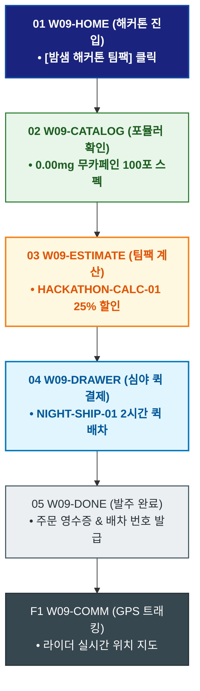

# 🔄 WICKETA 윤기준 서비스 흐름도 [밤샘 해커톤 팀원 24시간 무카페인 집중력 부스트 팩 대량 발주]

> **프로젝트명**: WICKETA 데이터 엔지니어링 & 초정밀 계측 브루잉 (Precision Data Brewing)  
> **분석 대상 클라이언트**: [`[가상클라이언트_09] 윤기준_풀스택개발자_초정밀계측브루잉.txt`](file:///C:/Users/user/Desktop/이지희%20에이전트/설계%20마저%20해오기/자동화/03_클라이언트/01_가상_클라이언트/[가상클라이언트_09] 윤기준_풀스택개발자_초정밀계측브루잉.txt)  
> **기준 사이트맵 문서**: [`C:\Users\SBS\Desktop\0819 이지희\한명씩 화면 설계도 진행\자동화\04_설계_및_스토리보드\03_사이트맵\09_윤기준\사이트맵_목적5_해커톤팀팩.md`](file:///C:/Users/SBS/Desktop/0819%20%EC%9D%B4%EC%A7%80%ED%9D%AC/%ED%95%9C%EB%AA%85%EC%94%A9%20%ED%99%94%EB%A9%B4%20%EC%84%A4%EA%B3%84%EB%8F%84%20%EC%A7%84%ED%96%89/%EC%9E%90%EB%8F%99%ED%99%94/04_%EC%84%A4%EA%B3%84_%EB%B0%8F_%EC%8A%A4%ED%86%A0%EB%A6%AC%EB%B3%B4%EB%93%9C/03_%EC%82%AC%EC%9D%B4%ED%8A%B8%EB%A7%B5/09_윤기준/사이트맵_목적5_해커톤팀팩.md)  
> **접속 목적**: 밤샘 개발팀 10인을 위한 무카페인/무설탕 24시간 에너지 부스트 팩 발주  
> **목적별 고유 킬러 기능**: **해커톤 팀팩 계산기 (`HACKATHON-CALC-01`) & 심야 퀵배송 (`NIGHT-SHIP-01`)**  
> **작성일자**: 2026년 8월 19일  
> **작성자**: Antigravity UI/UX 설계팀  
> **문서 인코딩**: UTF-8 (유니코드)  

---

## 1. 목적별 핵심 서비스 흐름 개요

밤샘 해커톤에 참가하는 개발팀 10명을 위해 카페인 크래시 없는 0.00mg 무카페인 집중력 티 100포 세트를 심야 퀵배송으로 긴급 발주하는 개발팀 주문 여정

---

## 2. 목적 맞춤형 가변 여정 스테이지 (Dynamic Journey Stages)

### 💻 Stage 1: 해커톤 에너지 팩 포털 진입
- **01 해커톤 팩 진입 (`W09-HOME`)**: [밤샘 해커톤 24시간 팀팩] 클릭 ➔ 해커톤 콘솔 로딩
- **02 무카페인 집중력 포뮬러 확인 (`W09-CATALOG`)**: 미드나잇 GABA(SEC-02) & 시트러스 마테(SEC-06) 100포 스펙 검토

### 🧮 Stage 2: 팀원 수 기반 수량 계산
- **03 팀팩 계산기 조작 (`W09-ESTIMATE`)**: HACKATHON-CALC-01 팀원(10인) 입력 ➔ 100포 세트 및 25% 팀 할인 산출
- **04 심야 특급 퀵 지정 (`W09-DRAWER`)**: NIGHT-SHIP-01 심야 2시간 내 도착 퀵배송 옵션 선택

### 🛒 Stage 3: 법인카드 1초 간편결제
- **05 1-Click 팀 결제 (`W09-DRAWER`)**: 법인 결제 승인 ➔ 라이더 즉시 배차
- **06 출고 승인 (`W09-DRAWER`)**: 물류센터 즉시 픽업 지시

### 📦 Stage 4: 발주 완료 & 실시간 라이더 트래킹
- **07 발주 접수증 확인 (`W09-DONE`)**: 해커톤 응원 메시지 & 주문 영수증 발급
- **F1 실시간 퀵 트래킹 (`W09-COMM`)**: 라이더 위치 실시간 GPS 지도 트래킹 연동

---

## 3. 단계별 명세표 (Flow Matrix Table)

| 단계 ID | 단계 명칭 | 사용자 행동 | 화면 접점 | 서비스/시스템 반응 | 매핑 요구사항 | 다음 진입 조건 |
| :---: | :--- | :--- | :--- | :--- | :--- | :--- |
| **01** | 해커톤 진입 | [해커톤 팀팩] 클릭 | `W09-HOME` | 해커톤 팀팩 콘솔 노출 | `REQ-01 해커톤 기획` | 02 포뮬러 확인 |
| **02** | 포뮬러 확인 | 0.00mg 무카페인 스펙 확인 | `W09-CATALOG` | 24시간 집중력 성적서 렌더링 | `REQ-04 성분 검증` | 03 팀팩 계산 |
| **03** | 팀팩 계산 | 팀원 수(10명) 입력 | `W09-ESTIMATE` | HACKATHON-CALC-01 25% 할인 산출 | `REQ-02 팀팩 계산기` | 04 심야 퀵 선택 |
| **04** | 심야 퀵 선택 | 심야 퀵배송 옵션 선택 | `W09-DRAWER` | NIGHT-SHIP-01 2시간 내 도착 지정 | `REQ-06 심야 퀵` | 05 1초 결제 |
| **05** | 1초 결제 | 법인카드 1-Click 승인 | `W09-DRAWER` | 라이더 즉시 배차 지시 | `REQ-06 결제 승인` | 06 발주 완료 |
| **06** | 발주 완료 | 발주 접수증 확인 | `W09-DONE` | 영수증 및 라이더 배차 번호 발급 | `REQ-06 영수증 발급` | F1 퀵 트래킹 |
| **F1** | 퀵 트래킹 | 라이더 실시간 위치 확인 | `W09-COMM` | 실시간 GPS 배송 지도 연동 | `사후 관리` | 여정 완료 |

---

## 4. 목적별 서비스 흐름도 다이어그램 (Mermaid)

---

## 5. 최종 품질 검토 및 연계 설계 문서

- [x] **고정 템플릿 탈피**: 목적별 특성에 맞춘 독자적 가변 스테이지 및 분기 조건 반영
- [x] **예외 상황(Fallback) 및 루프 완비**: 재고 부족, 결제 실패, 글자수 오류, 연속 출석 등의 분기/복구 파이프라인 수록
- [x] **연계 사이트맵**: [`사이트맵_목적5_해커톤팀팩.md`](file:///C:/Users/SBS/Desktop/0819%20%EC%9D%B4%EC%A7%80%ED%9D%AC/%ED%95%9C%EB%AA%85%EC%94%A9%20%ED%99%94%EB%A9%B4%20%EC%84%A4%EA%B3%84%EB%8F%84%20%EC%A7%84%ED%96%89/%EC%9E%90%EB%8F%99%ED%99%94/04_%EC%84%A4%EA%B3%84_%EB%B0%8F_%EC%8A%A4%ED%86%A0%EB%A6%AC%EB%B3%B4%EB%93%9C/03_%EC%82%AC%EC%9D%B4%ED%8A%B8%EB%A7%B5/09_윤기준/사이트맵_목적5_해커톤팀팩.md)
