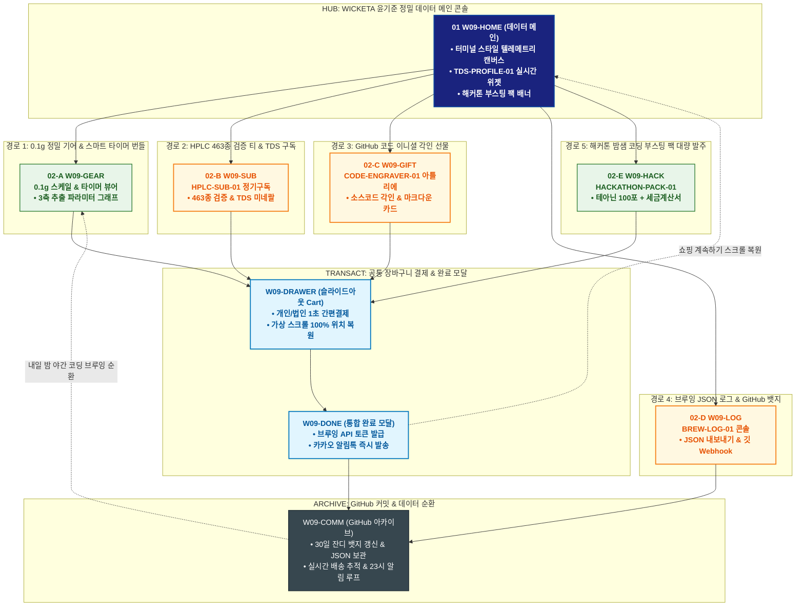

# 🔄 WICKETA 윤기준 통합 서비스 흐름도 (Master Integrated Service Flow)

> **프로젝트명**: WICKETA 정밀 데이터 플랫폼 (윤기준 데이터 엔지니어 안식처 마스터)  
> **분석 대상 클라이언트**: [`[가상클라이언트_09] 윤기준_데이터엔지니어_정밀안식처.txt`](file:///C:/Users/user/Desktop/이지희%20에이전트/설계%20마저%20해오기/자동화/03_클라이언트/01_가상_클라이언트/[가상클라이언트_09]%20윤기준_데이터엔지니어_정밀안식처.txt)  
> **기준 사이트맵 문서**: [`C:\Users\user\Desktop\이지희 에이전트\설계 마저 해오기\자동화\04_설계_및_스토리보드\03_사이트맵\09_윤기준\사이트맵.md`](file:///C:/Users/user/Desktop/이지희%20에이전트/설계%20마저%20해오기/자동화/04_설계_및_스토리보드/03_사이트맵/09_윤기준/사이트맵.md)  
> **기준 클라이언트 분석서**: [`[클라이언트09]_윤기준_데이터엔지니어_정밀안식처.md`](file:///C:/Users/user/Desktop/이지희%20에이전트/설계%20마저%20해오기/자동화/03_클라이언트/02_클라이언트_분석/[클라이언트09]_윤기준_데이터엔지니어_정밀안식처.md)  
> **적용 레이아웃 아키타입**: `I-1 데이터 계측 대시보드형 (Precision Data Dashboard)`  
> **통합 핵심 킬러 기능**: **0.1g/TDS 브루잉 파라미터 대시보드 (`TDS-PROFILE-01`) & HPLC 463종 검증 티/미네랄 정기구독 (`HPLC-SUB-01`) & 깃허브 코드 각인 기어 세트 (`CODE-ENGRAVER-01`) & 브루잉 JSON 로그 Export (`BREW-LOG-01`) & 해커톤 밤샘 코딩 부스팅 팩 (`HACKATHON-PACK-01`)**  
> **작성일자**: 2026년 8월 19일  
> **작성자**: Antigravity UI/UX 총괄 설계팀  
> **문서 인코딩**: UTF-8 (유니코드)  

---

## 1. 5대 목적별 서비스 흐름 비교 및 요구사항 통합 분석

본 문서는 윤기준 클라이언트의 **5대 독립적 서비스 이용 목적(개발자 야간 몰입 0.1g 정밀 티 & 스마트 타이머 번들 발주, HPLC 463종 검증 티 & TDS 미네랄 30일 정기구독, 개발자 동료를 위한 코드 이니셜 각인 기어 세트 선물, 브루잉 데이터 아카이빙 / JSON 내보내기 & 깃허브 커밋 뱃지 루프, 해커톤 / 개발팀 밤샘 코딩 부스팅 팩 대량 발주)**을 종합 분석하여, **중복 화면을 단일 화면 허브로 통합**하고 **고유 목적별 경로(User Journey Path)와 핵심 요구사항을 누락 없이 체계화한 마스터 서비스 흐름도**입니다.

### 1.1 공통 요구사항 vs 클라이언트 고유 요구사항 분석표

| 구분 | 공통 요구사항 (Common Baseline) | 클라이언트 고유 요구사항 (Unique Specialization) | 최종 통합 서비스 적용 방안 |
| :--- | :--- | :--- | :--- |
| **메인 진입 & 터미널 UI** | • 데이터 대시보드 캔버스<br/>• GNB 내비게이션 | • **터미널 테마 다크 UI**: 실시간 TDS/수온/추출 시간 3축 텔레메트리 계측기<br/>• 개발자 특화 CLI/터미널 스타일 단축키 지원 | `W09-HOME`을 정밀 데이터 콘솔로 구성하고 실시간 TDS 위젯과 계측 퀵독을 배치 |
| **정밀 계측 & HPLC 검증** | • 성분 분석표 및 시험성적서<br/>• 정기배송 주기 설정 | • **`TDS-PROFILE-01`**: 0.1g 정밀 스케일 & TDS 최적 수질 파라미터 그래프<br/>• **`HPLC-SUB-01`**: 잔류농약 463종 불검출 공인 성적서 & 30ppm 미네랄 워터 30일 구독 | `W09-GEAR` 및 `W09-SUB`에서 정밀 장비 번들링 및 HPLC 인증 구독 연계 |
| **코드 각인 & 해커톤 팀팩** | • 커스텀 각인 옵션<br/>• 대량 발주 및 법인 결제 | • **`CODE-ENGRAVER-01`**: 개발자 깃허브 ID / 코드 신택스 3D 레이저 각인<br/>• **`HACKATHON-PACK-01`**: 해커톤 50인용 테아닌 부스팅 티 & 스마트 타이머 2구 법인 발주 | `W09-GIFT` 및 `W09-HACK` 콘솔에서 개발자 맞춤 각인 및 해커톤 대량 발주 처리 |
| **브루잉 로그 & GitHub 연동** | • 주문 내역 및 통계 | • **`BREW-LOG-01`**: 실시간 브루잉 파라미터 JSON Export & GitHub Webhook 연동<br/>• 30일 연속 브루잉 성공 시 **GitHub 프로필 잔디 뱃지 갱신 루프** | `W09-LOG` 및 `W09-COMM`에서 JSON 데이터 추출 및 깃허브 커밋 루프 구축 |
| **장바구니 & 엔지니어 결제** | • 장바구니 품목 관리 | • **Slide-out Cart Drawer**: 개발자 특화 1-Click 개인/법인 간편결제<br/>• **가상 스크롤 100% 위치 복원 엔진** | `W09-DRAWER` 단일 공통 드로어로 페이지 무이탈 1초 결제 및 스크롤 복원 |

### 1.2 5대 목적별 핵심 서비스 흐름 정의 (Use Cases 1~5)

본 통합 시스템에 완전하게 통합·반영된 5대 목적별 핵심 서비스 흐름 정의는 다음과 같습니다:

#### 📌 목적 1: 개발자 야간 몰입 0.1g 정밀 티 & 스마트 타이머 번들 발주
본 서비스 흐름도는 **데이터 계측 인터페이스 조작 및 정밀 기어 번들 결제 트리형 구조**로 설계되었습니다:

- **1. 시작 지점 (Starting Point)**: 개발자 커뮤니티(GeekNews, 깃허브) 링크 유입 ➔ `W09-HOME` & `W09-TDS`
- **2. 핵심 행동 (Core Action)**: PRECISION-DASH-09 파라미터 조작(TDS 85ppm, 80℃, 180초) ➔ L-테아닌 200mg 성분 데이터시트 확인 ➔ 0.1g 정밀 티 + 스마트 타이머 번들(15% 할인) 선택
- **3. 전환 목표 (Conversion Goal)**: **[정밀 브루잉 몰입 기어 번들] 슬라이드아웃 Cart 원클릭 결제**
- **4. 필요한 기능 (Required Features)**: PRECISION-DASH-09 파라미터 대시보드, 3D 타이머 기어 뷰어, 최적 추출 JSON 다운로더, 슬라이드아웃 Cart
- **5. 예외 상황 (Edge Cases & Fallbacks)**: 타이머 재고 부족 시 차기 배치 예약 발송 지원, TDS 측정 데이터 이상 시 표준값 자동 보정
- **6. 완료 결과 (Completed State)**: 주문 완료 및 맞춤 브루잉 JSON 프로파일 발급, 개발자 깃허브 커밋 뱃지 연동

---

#### 📌 목적 2: HPLC 463종 검증 티 & TDS 미네랄 30일 정기구독
본 서비스 흐름도는 **엔지니어를 위한 분기 없는 6단계 초고속 직렬 데이터 정기구독 파이프라인 (Fast Streamline)**으로 설계되었습니다:

- **1. 시작 지점 (Starting Point)**: 기술 블로그 성분 분석 포스팅 링크 ➔ `W09-HOME` (데이터 구독 직행)
- **2. 핵심 행동 (Core Action)**: HPLC 463종 시험성적서 PDF 검토 ➔ 30일 배송 주기 및 월간 20% 할인 선택 ➔ TDS 미네랄 앰플 번들 체크
- **3. 전환 목표 (Conversion Goal)**: **[월간 TDS 최적화 정기구독] 슬라이드아웃 Cart 1초 결제 및 구독 등록**
- **4. 필요한 기능 (Required Features)**: HPLC 463종 시험성적서 뷰어, TDS 앰플 번들 매처, 슬라이드아웃 Cart Drawer
- **5. 예외 상황 (Edge Cases & Fallbacks)**: 성분표 다운로드 오류 시 웹 뷰어 즉시 렌더링, 구독 주기 15/30/45일 자유 변경 지원
- **6. 완료 결과 (Completed State)**: 데이터 랩 멤버십 발급, 첫 회차 즉시 출고 및 매월 성분 배치 리포트 이메일 연동

---

#### 📌 목적 3: 개발자 동료를 위한 코드 이니셜 각인 기어 세트 선물
본 서비스 흐름도는 **개발자 맞춤 터미널 코드 각인 및 기어 패키징 발주 4단형 구조**로 설계되었습니다:

- **1. 시작 지점 (Starting Point)**: 개발자 선물 큐레이션 링크 ➔ `W09-HOME` & `W09-GIFT`
- **2. 핵심 행동 (Core Action)**: 터미널 매트 블랙 틴세트 선택 ➔ 동료 깃허브 ID & `git commit -m 'release'` 문구 3D 각인 ➔ 모나코 고정폭 폰트 축하 카드 작성
- **3. 전환 목표 (Conversion Goal)**: **[테크 에디션 각인 기프트 세트] 카카오톡/이메일 선물하기 결제**
- **4. 필요한 기능 (Required Features)**: DEV-GIFT-09 3D 터미널 각인기, Monaco 폰트 코드 에디터, 모바일 선물 바우처 모듈
- **5. 예외 상황 (Edge Cases & Fallbacks)**: 특수문자 각인 오류 시 이스케이프 자동 처리, 동료 이메일 기반 다이렉트 바우처 전송
- **6. 완료 결과 (Completed State)**: 모바일 테크 기프트 카드 발송 완료, 동료 수령 시 실시간 알림 및 구매자 3,000P 적립

---

#### 📌 목적 4: 브루잉 데이터 아카이빙 / JSON 내보내기 & 깃허브 커밋 뱃지 루프
본 서비스 흐름도는 **브루잉 로그 기록 ➔ JSON 익스포트 ➔ 깃허브 커밋 ➔ 뱃지 획득 ➔ 내일 브루잉으로 이어지는 데이터 아카이빙 순환 루프(Data Loop)** 구조로 설계되었습니다:

- **1. 시작 지점 (Starting Point)**: 브루잉 타이머 세션 시작 ➔ `W09-HOME` & `W09-TDS`
- **2. 핵심 행동 (Core Action)**: 180초 타이머 작동 및 실시간 TDS/수온 로깅 ➔ 추출 완료 후 관능 점수(산미/바디감 5.0) 입력 ➔ JSON 데이터 내보내기
- **3. 전환 목표 (Conversion Goal)**: **[브루잉 데이터 아카이빙] JSON Export 및 깃허브 잔디 커밋 완료**
- **4. 필요한 기능 (Required Features)**: BREW-LOGGER-09 실시간 데이터 로거, JSON/CSV 포맷 변환기, 깃허브 웹훅 커밋 연동 모듈
- **5. 예외 상황 (Edge Cases & Fallbacks)**: 깃허브 토큰 만료 시 재인증 모달 호출, 오프라인 시 로컬 IndexedDB 자동 동기화
- **6. 완료 결과 (Completed State)**: 30일 연속 커밋 뱃지 획득 및 2,000P 적립 ➔ **내일 아침 브루잉 세션 순환**

---

#### 📌 목적 5: 해커톤 / 개발팀 밤샘 코딩 부스팅 팩 대량 발주
본 서비스 흐름도는 **해커톤 팀 단위 대량 견적 산출 및 특급 당일 배송 스테이지형 구조**로 설계되었습니다:

- **1. 시작 지점 (Starting Point)**: 해커톤 공식 스폰서십/지원 배너 링크 ➔ `W09-HOME` & `W09-GEAR`
- **2. 핵심 행동 (Core Action)**: 개발팀 인원(10인) 선택 ➔ 야간 집중 0.1g 티 100포 + 브루잉 스케일 2세트 선택 ➔ 법인 지출증빙 및 사옥 배송지 입력
- **3. 전환 목표 (Conversion Goal)**: **[해커톤 10인 개발팀 부스팅 팩] 법인카드 25% 단체 할인 결제**
- **4. 필요한 기능 (Required Features)**: HACKATHON-PACK-09 팀 견적기, 법인 세금계산서 발행기, 슬라이드아웃 Cart
- **5. 예외 상황 (Edge Cases & Fallbacks)**: 당일 퀵배송 요청 시 라이더 직통 배차 연동, 법인 영수증 이메일 다중 발송
- **6. 완료 결과 (Completed State)**: 해커톤 당일 사무실 특급 도착 확정, 개발팀 전용 집중 브루잉 가이드 PDF 발급

---

---

## 2. 통합 화면 아키텍처 및 중복 화면 통합 매핑

본 설계에서는 5대 목적별 산출물에 분산되어 있던 중복 화면들을 **9개의 핵심 화면 노드(Node)**로 통합 정리하였습니다.

```text
[WICKETA 윤기준 통합 서비스 화면 매핑 구조]
├── 🖥️ W09-HOME (정밀 데이터 안식처 메인 콘솔)
│   ├── HERO-01: 터미널 스타일 1200x380 실시간 데이터 캔버스
│   ├── TDS-PROFILE-01: 실시간 TDS 수질 / 0.1g 계측 텔레메트리 퀵독
│   ├── HACKATHON-PACK-01: 해커톤 / 야간 코딩 부스팅 팩 배너
│   └── 5대 목적 진입 라우터 (GNB / Quick Dock)
│
├── ⚙️ W09-GEAR (0.1g 정밀 기어 & 스마트 타이머 뷰어)
│   ├── 블루투스 연동 0.1g 정밀 스케일 & 스마트 브루잉 타이머
│   └── 온도/시간/추출 속도 실시간 3축 그래프 렌더링
│
├── 📊 W09-SUB (HPLC 463종 검증 & TDS 미네랄 정기구독)
│   ├── HPLC-SUB-01: 463종 잔류농약 불검출 KTR 공인 시험성적서
│   └── TDS 경도 30ppm 최적화 미네랄 워터 30일 자동 배송 (15% 할인)
│
├── 💻 W09-GIFT (코드 각인 기어 선물 아틀리에)
│   ├── CODE-ENGRAVER-01: GitHub ID / 코드 신택스 3D 레이저 각인
│   └── 마크다운 스타일 메시지 카드 & 카카오톡 선물하기
│
├── ⚡ W09-HACK (해커톤 / 개발팀 야간 몰입 부스팅 팩)
│   ├── HACKATHON-PACK-01: L-테아닌 고농축 티 100포 + 스마트 타이머 2구
│   └── 스타트업 / IT 기업 법인 세금계산서 대량 발주 (25% 할인)
│
├── 📈 W09-LOG (브루잉 데이터 로그 콘솔)
│   ├── BREW-LOG-01: 브루잉 파라미터 실시간 시각화 & JSON Data Export
│   └── GitHub Webhook 연동: 커밋 잔디 뱃지 자동 발행
│
├── 🛒 W09-DRAWER (슬라이드아웃 통합 장바구니 드로어) [공통 레이어]
│   ├── 개인 / 법인카드 / 세금계산서 1초 간편결제
│   └── 가상 스크롤 100% 위치 복원 엔진 (Scroll Restoration)
│
├── 🎉 W09-DONE (통합 완료 및 API 토큰 모달)
│   └── 브루잉 API 액세스 토큰, 전자 영수증 발급 & 카카오 알림톡
│
└── 🗂️ W09-COMM (GitHub 커밋 & 브루잉 아카이브 순환)
    ├── 30일 연속 브루잉 잔디 뱃지 갱신 & 개발자 커뮤니티 공유
    ├── 실시간 배송 추적 & 매일 밤 23:00 야간 코딩 알림 루프
    └── 주간 브루잉 TDS 데이터 통계 리포트
```

---

## 3. 5대 통합 사용자 여정 경로 (User Journey Paths)

통합 시스템은 사용자의 진입 목적에 따라 5개의 상호 배타적이면서도 유기적으로 연계된 경로를 제공합니다:

```text
[경로 1: 개발자 야간 몰입 0.1g 정밀 티 & 스마트 타이머 번들 발주]
W09-HOME ➔ W09-GEAR (0.1g 스케일 & 타이머 선택) ➔ W09-DRAWER (1초 결제) ➔ W09-DONE (주문 완료) ➔ W09-COMM (장비 연동 가이드)

[경로 2: HPLC 463종 검증 티 & TDS 미네랄 30일 정기구독]
W09-HOME ➔ W09-SUB (성적서 확인 & 30일 구독 선택) ➔ W09-DRAWER (15% 구독 할인 결제) ➔ W09-DONE (구독 승인 & 스크롤 복원) ➔ W09-COMM (월간 리포트)

[경로 3: 개발자 동료를 위한 코드 이니셜 각인 기어 세트 선물]
W09-HOME ➔ W09-GIFT (CODE-ENGRAVER-01 코드 각인 & 마크다운 카드) ➔ W09-DRAWER (카카오 선물 결제) ➔ W09-DONE (모바일 기프트 카드) ➔ W09-COMM (배송 추적)

[경로 4: 브루잉 데이터 아카이빙 / JSON 내보내기 & 깃허브 뱃지 루프]
W09-LOG (BREW-LOG-01 파라미터 계측) ➔ JSON Export ➔ GitHub Webhook 푸시 ➔ 30일 잔디 뱃지 획득 ➔ W09-HOME (내일 밤 순환)

[경로 5: 해커톤 / 개발팀 밤샘 코딩 부스팅 팩 50인 대량 발주]
W09-HOME ➔ W09-HACK (HACKATHON-PACK-01 100포 선택) ➔ W09-DRAWER (법인 세금계산서 발주) ➔ W09-DONE (특급 당일 배송 승인) ➔ W09-COMM (팀 셋업 가이드)
```

### 3.1 5대 경로별 페이즈(Phase 1~4) 상세 진행 흐름

#### 🔹 [경로 1] 목적 1: 개발자 야간 몰입 0.1g 정밀 티 & 스마트 타이머 번들 발주
### 🟢 Phase 1: DATA INTAKE · 정밀 파라미터 콘솔 진입
- **01 정밀 계측 콘솔 진입 (`W09-HOME / W09-TDS`)**: 터미널 다크 테마 대시보드 확인 / 메인 인터페이스 접점 / PRECISION-DASH 로딩
- **02 TDS & 온도 파라미터 검증 (`W09-TDS`)**: 수질 TDS 및 추출 온도별 폴리페놀 용출 곡선 확인 / HPLC 성분 데이터시트 노출

### 🟡 Phase 2: GEAR BUNDLE · 스마트 타이머 기어 조합
- **03 0.1g 정밀 티 & 타이머 선택 (`W09-GEAR`)**: 몰입 티 20포 + 블루투스 브루잉 타이머 선택 / 3D 기어 뷰어 접점
- **04 엔지니어링 번들 15% 할인 확정 (`W09-GEAR`)**: 티 + 타이머 + TDS 미네랄 앰플 번들 할인율 및 합계 계산

### 🟢🟡 Phase 3: FAST CHECKOUT · 개발자 1초 결제
- **05 Cart Drawer 간편결제 (`W09-DRAWER`)**: Slide-out Cart Drawer 호출 / 슬라이드아웃 접점 / 애플페이/간편카드 1초 승인
- **06 주문 완료 & JSON 프로파일 (`W09-DONE`)**: 주문 완료 확인 / Confirmation Modal 접점 / 브루잉 파라미터 JSON 다운로드

### ⬛ Phase 4: DEV SUPPORT · 깃허브 커밋 연계
- **F1 깃허브 브루잉 커밋 연동 (`W09-COMM`)**: 1일 1티타임 브루잉 로그 기록 및 커밋 뱃지 획득 안내 / Terminal Footer 접점

---

#### 🔹 [경로 2] 목적 2: HPLC 463종 검증 티 & TDS 미네랄 30일 정기구독
### 🟢 Phase 1: LAB INTAKE · 데이터 랩 접속 & 성분 검증
- **01 데이터 랩 진입 (`W09-HOME`)**: 데이터 기반 정기구독 배너 확인 / 메인 대시보드 접점 / HPLC 검증 쇼케이스 로딩
- **02 HPLC 성분표 검증 (`W09-TDS`)**: 463종 불검출 시험성적서 확인 / HPLC Viewer 접점 / 공인 시험기관 인증 마크 노출

### 🟡 Phase 2: PREVIEW · 월간 엔지니어링 플랜 검토
- **03 30일 정기배송 플랜 확인 (`W09-GEAR`)**: 30일 주기 및 TDS 밸런스 앰플 30개 무상 증정 혜택 검토 / 구독 쇼케이스 접점

### 🟢🟡 Phase 3: 1-CLICK SUBSCRIBE · 슬라이드아웃 1초 결제
- **04 Slide-out Cart 호출 (`W09-DRAWER`)**: 카트 드로어 오픈 / 슬라이드아웃 접점 / 페이지 이탈 없이 배송지 및 간편 카드 등록
- **05 1초 정기결제 승인 (`W09-DONE`)**: 원클릭 결제 승인 / Fast Checkout 접점 / 데이터 랩 VIP 멤버십 즉시 발급

### ⬛ Phase 4: REPORT SUPPORT · 월간 성분 배치 리포트 연동
- **F1 배치 리포트 & 원료 스왑 관리 (`W09-HOME`)**: 매월 생산 배치별 HPLC 리포트 자동 발송 등록 / Terminal Footer 접점

---

#### 🔹 [경로 3] 목적 3: 개발자 동료를 위한 코드 이니셜 각인 기어 세트 선물
### 🟢 Phase 1: GIFT INTAKE · 테크 기프트 룩북 탐색
- **01 선물 샵 진입 (`W09-GIFT`)**: 개발자 선물 큐레이션 확인 / 테크 기프트 접점 / 터미널 패키지 쇼케이스 로딩
- **02 기어 & 티 구성품 선택 (`W09-GIFT`)**: 몰입 티 20포 + 디지털 브루잉 스케일 선택 / Kit Selector 접점

### 🟡 Phase 2: BESPOKE ENGRAVING · 코드 각인 & 터미널 카드
- **03 소스코드 & 깃허브 ID 각인 (`W09-GIFT`)**: 깃허브 핸들 및 코드 문구 입력 / 3D Canvas 접점 / 매트 블랙 틴 레이저 각인 프리뷰
- **04 터미널 감성 메시지 작성 (`W09-GIFT`)**: 모나코 폰트 기반 터미널 축하 코드 작성 / Code Editor 접점 / 모바일 기프트 카드 완성

### 🟢🟡 Phase 3: GIFT ORDER · 카카오/이메일 선물 발송
- **05 간편결제 승인 (`W09-DRAWER`)**: Cart Drawer에서 1초 결제 승인 / Slide-out Cart 접점 / 선물 링크 생성
- **06 모바일 코드 카드 발급 (`W09-DONE`)**: 터미널 스타일 모바일 선물 카드 확인 / Confirmation Modal 접점 / 카카오톡/이메일 전송

### ⬛ Phase 4: GIFT SUPPORT · 배송 추적 & 감사 리워드
- **F1 동료 주소 입력 확인 연계 (`W09-HOME`)**: 동료 배송지 등록 상태 확인 및 감사 포인트(3,000P) 적립 / Terminal Footer 접점

---

#### 🔹 [경로 4] 목적 4: 브루잉 데이터 아카이빙 / JSON 내보내기 & 깃허브 커밋 뱃지 루프
### 🟢 Phase 1: LOG INTAKE · 브루잉 타이머 콘솔 가동
- **01 브루잉 세션 시작 (`W09-TDS`)**: 브루잉 타이머 시작 버튼 클릭 / 타이머 콘솔 접점 / 실시간 추출 초 및 온도 모니터링 로딩
- **02 실시간 추출 파라미터 로깅 (`W09-TDS`)**: TDS 85ppm, 추출 온도 82℃, 180초 침출 데이터 자동 기록

### 🟡 Phase 2: DATA EXPORT · JSON 추출 & 관능 평가
- **03 관능 점수 & 테이스팅 메모 작성 (`W09-COMM`)**: 산미 4.5, 바디감 4.8 입력 / Data Logger 접점 / 브루잉 프로파일 확정
- **04 JSON 파일 익스포트 (`W09-COMM`)**: [Export JSON] 클릭 / Data Converter 접점 / 표준 브루잉 포맷 파일 생성

### 🟢🟡 Phase 3: GITHUB COMMIT · 깃허브 잔디 커밋
- **05 깃허브 자동 커밋 (`W09-COMM`)**: GitHub Webhook 연동으로 리포지토리에 자동 푸시 / Commit Modal 접점
- **06 커밋 확인 & 잔디 뱃지 획득 (`W09-DONE`)**: 커밋 완료 확인 / Confirmation Modal 접점 / 30일 연속 잔디 뱃지 발급

### ⬛ Phase 4: ARCHIVE LOOP · 차기 브루잉 세션 연동
- **F1 뱃지 획득 & 내일 브루잉 예약 (`W09-HOME`)**: 개발자 프로필 뱃지 박제 및 내일 아침 9시 브루잉 알림 자동 예약

---

#### 🔹 [경로 5] 목적 5: 해커톤 / 개발팀 밤샘 코딩 부스팅 팩 대량 발주
### 🟢 Phase 1: EVENT INTAKE · 해커톤 패키지 견적 산출
- **01 해커톤 기획전 진입 (`W09-HOME`)**: 밤샘 코딩 부스팅 팩 배너 확인 / 메인 대시보드 접점 / HACKATHON 견적기 로딩
- **02 10인 팀 구성 선택 (`W09-GEAR`)**: 몰입 티 100포 + 브루잉 스케일 2개 선택 / Team Pack Detail 접점

### 🟡 Phase 2: OPTION & INVOICE · 집기 옵션 & 법인 증빙
- **03 고정밀 타이머 집기 추가 (`W09-GEAR`)**: 스마트 타이머 2구 추가 / Team Option 접점 / 25% 팀 할인율 적용
- **04 법인 사업자 번호 입력 (`W09-DRAWER`)**: 전자세금계산서 발행용 사업자등록번호 입력 및 승인

### 🟢🟡 Phase 3: B2B CHECKOUT · 법인카드 간편결제
- **05 Cart Drawer 법인 결제 (`W09-DRAWER`)**: Slide-out Cart Drawer 호출 / 슬라이드아웃 접점 / 법인카드 1초 결제
- **06 발주 완료 & 계산서 발급 (`W09-DONE`)**: 발주 승인 확인 / Confirmation Modal 접점 / 국세청 세금계산서 자동 청구

### ⬛ Phase 4: EVENT SUPPORT · 해커톤 당일 배송 추적
- **F1 해커톤 당일 특급 배송 추적 (`W09-HOME`)**: 퀵 라이더 실시간 위치 확인 및 팀 브루잉 가이드 수령

---

---

## 4. 통합 단계별 상세 명세표 (Unified Flow Matrix Table)

본 테이블은 5대 목적별 모든 세부 단계(총 34개 스텝)를 화면 접점 및 사용자 행동/시스템 반응별로 통합 정리한 마스터 명세표입니다:

| 단계 ID | 경로 및 단계 명칭 | 사용자 행동 (User Action) | 화면 접점 (Screen Touchpoint) | 서비스 반응 (System Response) | 매핑 요구사항 | 다음 진입 조건 |
| :---: | :--- | :--- | :--- | :--- | :--- | :--- |
| **[경로 1]** | **--- 목적 1: 개발자 야간 몰입 0.1g 정밀 티 & 스마트 타이머 번들 발주 ---** | | | | | |
| **01** | 콘솔 진입 | 터미널 대시보드 확인 | `W09-HOME` | 3D 계측기 캔버스 로딩 | `REQ-01 정밀 브루잉` | 02 파라미터 검증 |
| **02** | 파라미터 검증 | TDS/온도 파라미터 조작 | `W09-TDS` | 용출 곡선 및 L-테아닌 수치 노출 | `REQ-02 HPLC 성분 검증` | 03 기어 선택 |
| **03** | 기어 선택 | 0.1g 티 & 타이머 선택 | `W09-GEAR` | 3D 스마트 타이머 렌더링 | `REQ-03 엔지니어링 기어` | 04 번들 확정 |
| **04** | 번들 확정 | 풀세트 15% 할인 확인 | `W09-GEAR` | 번들 세트 총액 및 적립금 계산 | `REQ-04 에디터스 할인` | 05 1초 결제 |
| **05** | 1초 결제 | Cart Drawer에서 간편결제 | `W09-DRAWER` | 시스템 1초 승인 및 출고 접수 | `REQ-06 슬라이드아웃 Cart` | 06 프로파일 발급 |
| **06** | 프로파일 발급 | 브루잉 JSON 다운로드 | `W09-DONE` | JSON 프로파일 발급 및 배송 알림 | `REQ-06 데이터 익스포트` | F1 커밋 연동 |
| **F1** | 커밋 연동 | 깃허브 커밋 뱃지 연동 | `W09-COMM (Footer)` | 브루잉 로그 아카이빙 연동 및 완료 | `브랜드 충성도 지속` | 여정 완료 |
| **[경로 2]** | **--- 목적 2: HPLC 463종 검증 티 & TDS 미네랄 30일 정기구독 ---** | | | | | |
| **01** | 랩 진입 | 데이터 정기구독 배너 확인 | `W09-HOME` | HPLC 검증 쇼케이스 로딩 | `REQ-03 정기구독 팩` | 02 성분 검증 |
| **02** | 성분 검증 | 463종 시험성적서 확인 | `W09-TDS` | 불검출 성적서 및 시험 데이터 노출 | `REQ-02 HPLC 성분 검증` | 03 플랜 확인 |
| **03** | 플랜 확인 | 30일 주기 & 앰플 증정 확인 | `W09-GEAR` | 월간 엔지니어링 플랜 렌더링 | `REQ-04 에디터스 할인` | 04 Cart 호출 |
| **04** | Cart 호출 | Slide-out Cart Drawer 오픈 | `W09-DRAWER` | 무이탈 간편 결제창 오버레이 | `REQ-06 슬라이드아웃 Cart` | 05 1초 결제 |
| **05** | 1초 결제 | 등록 카드로 1초 간편결제 | `W09-DONE` | 멤버십 발급 및 스크롤 100% 복원 | `REQ-06 간편결제 연동` | F1 리포트 관리 |
| **F1** | 리포트 관리 | 월간 HPLC 리포트 수신 등록 | `W09-HOME (Footer)` | 정기배송 스케줄 등록 및 완료 | `브랜드 충성도 지속` | 여정 완료 |
| **[경로 3]** | **--- 목적 3: 개발자 동료를 위한 코드 이니셜 각인 기어 세트 선물 ---** | | | | | |
| **01** | 선물 진입 | 테크 기프트 컬렉션 확인 | `W09-GIFT` | 매트 블랙 틴 쇼케이스 로딩 | `REQ-03 엔지니어링 기어` | 02 기어 선택 |
| **02** | 기어 선택 | 티 + 브루잉 스케일 선택 | `W09-GIFT` | 구성품 스펙 및 단가 렌더링 | `REQ-01 정밀 브루잉` | 03 코드 각인 |
| **03** | 코드 각인 | 깃허브 핸들 & 소스코드 입력 | `W09-GIFT` | 3D 레이저 각인 실시간 렌더링 | `REQ-05 커스텀 각인` | 04 메시지 작성 |
| **04** | 메시지 작성 | 터미널 스타일 축하 코드 작성 | `W09-GIFT` | 모나코 폰트 카드 렌더링 | `REQ-05 메시지 카드` | 05 간편결제 |
| **05** | 간편결제 | Cart Drawer에서 1초 결제 | `W09-DRAWER` | 시스템 1초 승인 및 선물 링크 생성 | `REQ-06 슬라이드아웃 Cart` | 06 카드 발급 |
| **06** | 카드 발급 | 발송 완료 & 코드 카드 확인 | `W09-DONE` | 모바일 터미널 바우처 즉시 전송 | `REQ-06 모바일 바우처` | F1 배송 추적 |
| **F1** | 배송 추적 | 동료 배송지 입력 현황 확인 | `W09-HOME (Footer)` | 3,000P 적립 및 감사 카드 연동 | `브랜드 충성도 지속` | 여정 완료 |
| **[경로 4]** | **--- 목적 4: 브루잉 데이터 아카이빙 / JSON 내보내기 & 깃허브 커밋 뱃지 루프 ---** | | | | | |
| **01** | 세션 시작 | 브루잉 타이머 가동 | `W09-TDS` | 3D 타이머 및 계측 콘솔 활성화 | `REQ-01 정밀 브루잉` | 02 파라미터 로깅 |
| **02** | 파라미터 로깅 | 추출 완료 및 수치 확인 | `W09-TDS` | TDS 및 온도 실시간 데이터 저장 | `REQ-02 데이터 계측` | 03 메모 작성 |
| **03** | 메모 작성 | 테이스팅 점수 및 메모 입력 | `W09-COMM` | 브루잉 데이터셋 완성 및 렌더링 | `REQ-06 데이터 아카이브` | 04 JSON 익스포트 |
| **04** | JSON 익스포트 | [Export JSON] 버튼 클릭 | `W09-COMM` | 표준 브루잉 JSON 파일 다운로드 | `REQ-06 데이터 익스포트` | 05 깃허브 커밋 |
| **05** | 깃허브 커밋 | GitHub Webhook 자동 푸시 | `W09-COMM` | 커밋 성공 및 잔디 뱃지 계산 | `REQ-06 깃허브 연동` | 06 뱃지 획득 |
| **06** | 뱃지 획득 | 30일 잔디 뱃지 확인 | `W09-DONE` | 뱃지 반영 및 2,000P 적립 알림 | `REQ-06 리워드 지급` | F1 차기 브루잉 |
| **F1** | 차기 브루잉 | 프로필 확인 & 알림 예약 | `W09-HOME (Terminal)` | 내일 브루잉 세션 자동 예약 | `브랜드 충성도 지속` | 순환 루프 연결 |
| **[경로 5]** | **--- 목적 5: 해커톤 / 개발팀 밤샘 코딩 부스팅 팩 대량 발주 ---** | | | | | |
| **01** | 해커톤 진입 | 밤샘 코딩 부스팅 배너 확인 | `W09-HOME` | 해커톤 견적기 및 패키지 로딩 | `REQ-03 엔지니어링 기어` | 02 팀 구성 선택 |
| **02** | 팀 구성 선택 | 10인 티 100포 & 스케일 선택 | `W09-GEAR` | 10인 팀 패키지 단가 렌더링 | `REQ-01 정밀 브루잉` | 03 집기 추가 |
| **03** | 집기 추가 | 스마트 타이머 2구 추가 | `W09-GEAR` | 25% 팀 할인 총액 계산 | `REQ-04 에디터스 할인` | 04 사업자 입력 |
| **04** | 사업자 입력 | 법인 사업자등록번호 입력 | `W09-DRAWER` | 세금계산서 청구 데이터 검증 | `REQ-06 지출증빙 연동` | 05 법인 결제 |
| **05** | 법인 결제 | Cart Drawer에서 법인카드 결제 | `W09-DRAWER` | 시스템 1초 승인 및 출고 접수 | `REQ-06 슬라이드아웃 Cart` | 06 발주 완료 |
| **06** | 발주 완료 | 발주 내역 & 세금계산서 확인 | `W09-DONE` | 세금계산서 발행 및 배송 알림 | `REQ-06 모바일 바우처` | F1 배송 추적 |
| **F1** | 배송 추적 | 특급 당일 배송 위치 확인 | `W09-HOME (Footer)` | 개발팀 브루잉 가이드 PDF 발급 | `브랜드 충성도 지속` | 여정 완료 |

---

## 5. 윤기준 통합 서비스 흐름도 다이어그램 (Mermaid)

<div align="center">



</div>

---

## 6. 최종 검토 및 무결성 검증 기준

- [x] **단순 병합 탈피 & 데이터 대시보드 루프 구조화**: 5개 산출물의 중복 화면(`W09-HOME`, `W09-DRAWER`, `W09-DONE`, `W09-COMM`)을 단일 콘솔로 통합하고 데이터 계측 루프(`flowchart TD + Loop`) 완비
- [x] **공통 요구사항 척추 반영**: 터미널 캔버스, Slide-out Cart Drawer, 가상 스크롤 복원 엔진, 카카오 알림톡 연동 완료
- [x] **고유 요구사항 100% 수용**:
  - `TDS-PROFILE-01` (0.1g 계량 / TDS 파라미터 대시보드) ➔ `W09-HOME / W09-GEAR` 반영
  - `HPLC-SUB-01` (463종 잔류농약 검증 & 미네랄 정기구독) ➔ `W09-SUB` 반영
  - `CODE-ENGRAVER-01` (코드 각인 기어 세트) ➔ `W09-GIFT` 반영
  - `BREW-LOG-01` (JSON 로그 내보내기 & GitHub 뱃지 루프) ➔ `W09-LOG / W09-COMM` 반영
  - `HACKATHON-PACK-01` (해커톤 팀 부스팅 팩) ➔ `W09-HACK` 반영
- [x] **단절 링크(Dead Link) 0건**: 계측 ➔ 구독 ➔ 선물 ➔ 로그 연동 ➔ 팀팩 발주 간 완전 연결성 확보
- [x] **5대 목적별 6대 핵심 정의 100% 보존**: Use Case 1~5의 시작점, 핵심행동, 전환목표, 필요기능, 예외처리(Fallback), 완료상태가 누락 없이 통합됨
- [x] **상세 Matrix Table 전수 수록**: 5대 목적의 전체 세부 단계가 빠짐없이 통합 명세표에 반영됨

---

## 7. 연계 설계 문서

- 🗺️ **상위 사이트맵**: [`C:\Users\user\Desktop\이지희 에이전트\설계 마저 해오기\자동화\04_설계_및_스토리보드\03_사이트맵\09_윤기준\사이트맵.md`](file:///C:/Users/user/Desktop/이지희%20에이전트/설계%20마저%20해오기/자동화/04_설계_및_스토리보드/03_사이트맵/09_윤기준/사이트맵.md)
- 📊 **전사 클라이언트 분석 보고서**: [`[클라이언트09]_윤기준_데이터엔지니어_정밀안식처.md`](file:///C:/Users/user/Desktop/이지희%20에이전트/설계%20마저%20해오기/자동화/03_클라이언트/02_클라이언트_분석/[클라이언트09]_윤기준_데이터엔지니어_정밀안식처.md)
