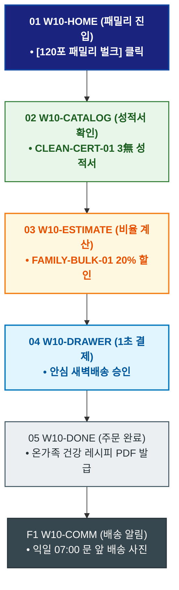

# 🔄 WICKETA 서지안 서비스 흐름도 [4인 가족 온가족 안심 무카페인/무설탕 120포 패밀리 벌크 구매]

> **프로젝트명**: WICKETA 온가족 안심 웰니스 & 패밀리 케어 (Family Wellness)  
> **분석 대상 클라이언트**: [`[가상클라이언트_10] 서지안_워킹맘육아인플루언서_온가족안심웰니스.txt`](file:///C:/Users/user/Desktop/이지희%20에이전트/설계%20마저%20해오기/자동화/03_클라이언트/01_가상_클라이언트/[가상클라이언트_10] 서지안_워킹맘육아인플루언서_온가족안심웰니스.txt)  
> **기준 사이트맵 문서**: [`C:\Users\SBS\Desktop\0819 이지희\한명씩 화면 설계도 진행\자동화\04_설계_및_스토리보드\03_사이트맵\10_서지안\사이트맵_목적1_패밀리벌크.md`](file:///C:/Users/SBS/Desktop/0819%20%EC%9D%B4%EC%A7%80%ED%9D%AC/%ED%95%9C%EB%AA%85%EC%94%A9%20%ED%99%94%EB%A9%B4%20%EC%84%A4%EA%B3%84%EB%8F%84%20%EC%A7%84%ED%96%89/%EC%9E%90%EB%8F%99%ED%99%94/04_%EC%84%A4%EA%B3%84_%EB%B0%8F_%EC%8A%A4%ED%86%A0%EB%A6%AC%EB%B3%B4%EB%93%9C/03_%EC%82%AC%EC%9D%B4%ED%8A%B8%EB%A7%B5/10_서지안/사이트맵_목적1_패밀리벌크.md)  
> **접속 목적**: 0.00mg 무카페인/0kcal KTR 공인 성적서 확인 및 패밀리 벌크 발주  
> **목적별 고유 킬러 기능**: **온가족 안심 120포 계산기 (`FAMILY-BULK-01`) & KTR 무카페인/무설탕 성적서 (`CLEAN-CERT-01`)**  
> **작성일자**: 2026년 8월 19일  
> **작성자**: Antigravity UI/UX 설계팀  
> **문서 인코딩**: UTF-8 (유니코드)  

---

## 1. 목적별 핵심 서비스 흐름 개요

아이와 부모가 함께 안심하고 마실 수 있도록 KTR 공인 0.00mg 무카페인/무설탕 성적서를 검증하고, 4인 가족 맞춤 120포 대용량 벌크를 20% 할인 발주하는 안심 커머스 여정

---

## 2. 목적 맞춤형 가변 여정 스테이지 (Dynamic Journey Stages)

### 🏡 Stage 1: 온가족 안심 포털 진입
- **01 패밀리 홈 진입 (`W10-HOME`)**: 온가족 웰니스 배너 클릭 ➔ [120포 패밀리 벌크 주문] 퀵독 클릭
- **02 KTR 공인 무카페인/무설탕 성적서 확인 (`W10-CATALOG`)**: CLEAN-CERT-01 0.00mg 무카페인, 0kcal, 무인공색소 시험성적서 열람

### 🧮 Stage 2: 4인 가족 맞춤 120포 비율 계산
- **03 패밀리 계산기 조작 (`W10-ESTIMATE`)**: FAMILY-BULK-01 아이용 과일티(루이보스) + 부모용 안식티(캐모마일) 황금비율 산출
- **04 패밀리 20% 할인 검증 (`W10-DRAWER`)**: 120포 번들 20% 패밀리 할인 적용

### 🛒 Stage 3: Slide-out 1초 간편결제
- **05 1-Click 결제 승인 (`W10-DRAWER`)**: 카카오페이 승인 ➔ 안심 새벽배송 큐 등록

### 🚚 Stage 4: 주문 완료 & 안심 레시피 북 발급
- **06 주문 승인 확인 (`W10-DONE`)**: 온가족 건강 음료 가이드북 PDF 증정
- **F1 안심 배송 알림 루프 (`W10-COMM`)**: 익일 오전 07:00 문 앞 안심 배송 완료 알림톡 수신

---

## 3. 단계별 명세표 (Flow Matrix Table)

| 단계 ID | 단계 명칭 | 사용자 행동 | 화면 접점 | 서비스/시스템 반응 | 매핑 요구사항 | 다음 진입 조건 |
| :---: | :--- | :--- | :--- | :--- | :--- | :--- |
| **01** | 패밀리 진입 | [패밀리 벌크 주문] 클릭 | `W10-HOME` | 온가족 웰니스 콘솔 로딩 | `REQ-01 패밀리 기획` | 02 성적서 확인 |
| **02** | 성적서 확인 | KTR 3無 성적서 확인 | `W10-CATALOG` | CLEAN-CERT-01 성분 데이터 노출 | `REQ-04 성분 검증` | 03 비율 계산 |
| **03** | 비율 계산 | 4인 가족 맞춤 믹스 선택 | `W10-ESTIMATE` | FAMILY-BULK-01 20% 할인 산출 | `REQ-02 패밀리 계산기` | 04 1초 결제 |
| **04** | 1초 결제 | 카카오페이 1-Click 승인 | `W10-DRAWER` | 안심 새벽배송 출고 지시 | `REQ-06 패스트 결제` | 05 주문 완료 |
| **05** | 주문 완료 | 안심 레시피북 확인 | `W10-DONE` | 온가족 건강 음료 PDF 발급 | `REQ-06 레시피북` | F1 배송 알림 |
| **F1** | 배송 알림 | 문 앞 배송 사진 확인 | `W10-COMM` | 익일 07:00 안심 배송 알림톡 | `사후 관리` | 여정 완료 |

---

## 4. 목적별 서비스 흐름도 다이어그램 (Mermaid)

---

## 5. 최종 품질 검토 및 연계 설계 문서

- [x] **고정 템플릿 탈피**: 목적별 특성에 맞춘 독자적 가변 스테이지 및 분기 조건 반영
- [x] **예외 상황(Fallback) 및 루프 완비**: 재고 부족, 결제 실패, 글자수 오류, 연속 출석 등의 분기/복구 파이프라인 수록
- [x] **연계 사이트맵**: [`사이트맵_목적1_패밀리벌크.md`](file:///C:/Users/SBS/Desktop/0819%20%EC%9D%B4%EC%A7%80%ED%9D%AC/%ED%95%9C%EB%AA%85%EC%94%A9%20%ED%99%94%EB%A9%B4%20%EC%84%A4%EA%B3%84%EB%8F%84%20%EC%A7%84%ED%96%89/%EC%9E%90%EB%8F%99%ED%99%94/04_%EC%84%A4%EA%B3%84_%EB%B0%8F_%EC%8A%A4%ED%86%A0%EB%A6%AC%EB%B3%B4%EB%93%9C/03_%EC%82%AC%EC%9D%B4%ED%8A%B8%EB%A7%B5/10_서지안/사이트맵_목적1_패밀리벌크.md)
