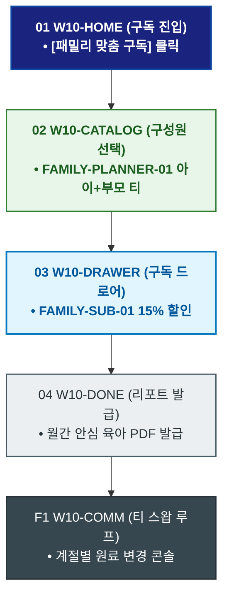

# 🔄 WICKETA 서지안 서비스 흐름도 [성장기 아이 & 부모 맞춤 힐링 티 30일 패밀리 정기구독]

> **프로젝트명**: WICKETA 온가족 안심 웰니스 & 패밀리 케어 (Family Wellness)  
> **분석 대상 클라이언트**: [`[가상클라이언트_10] 서지안_워킹맘육아인플루언서_온가족안심웰니스.txt`](file:///C:/Users/user/Desktop/이지희%20에이전트/설계%20마저%20해오기/자동화/03_클라이언트/01_가상_클라이언트/[가상클라이언트_10] 서지안_워킹맘육아인플루언서_온가족안심웰니스.txt)  
> **기준 사이트맵 문서**: [`C:\Users\SBS\Desktop\0819 이지희\한명씩 화면 설계도 진행\자동화\04_설계_및_스토리보드\03_사이트맵\10_서지안\사이트맵_목적2_패밀리구독.md`](file:///C:/Users/SBS/Desktop/0819%20%EC%9D%B4%EC%A7%80%ED%9D%AC/%ED%95%9C%EB%AA%85%EC%94%A9%20%ED%99%94%EB%A9%B4%20%EC%84%A4%EA%B3%84%EB%8F%84%20%EC%A7%84%ED%96%89/%EC%9E%90%EB%8F%99%ED%99%94/04_%EC%84%A4%EA%B3%84_%EB%B0%8F_%EC%8A%A4%ED%86%A0%EB%A6%AC%EB%B3%B4%EB%93%9C/03_%EC%82%AC%EC%9D%B4%ED%8A%B8%EB%A7%B5/10_서지안/사이트맵_목적2_패밀리구독.md)  
> **접속 목적**: 아이용 과일차와 부모용 힐링차를 매월 1일 집으로 배송받는 정기구독  
> **목적별 고유 킬러 기능**: **성장기 맞춤 티 플래너 (`FAMILY-PLANNER-01`) & 패밀리 정기구독 드로어 (`FAMILY-SUB-01`)**  
> **작성일자**: 2026년 8월 19일  
> **작성자**: Antigravity UI/UX 설계팀  
> **문서 인코딩**: UTF-8 (유니코드)  

---

## 1. 목적별 핵심 서비스 흐름 개요

아이의 성장 단계와 부모의 수면 패턴에 맞춘 힐링 티 세트를 30일 주기로 자동 배송받고, 월간 육아 케어 가이드를 함께 제공받는 패밀리 구독 여정

---

## 2. 목적 맞춤형 가변 여정 스테이지 (Dynamic Journey Stages)

### 👶 Stage 1: 패밀리 플래너 진입
- **01 구독 홈 진입 (`W10-HOME`)**: [성장기 맞춤 패밀리 구독] 클릭 ➔ 플래너 콘솔 로딩
- **02 가족 구성원별 티 선택 (`W10-CATALOG`)**: FAMILY-PLANNER-01 아이(유자 루이보스) + 부모(미드나잇 GABA) 맞춤 선택

### 🛒 Stage 2: Slide-out 15% 패밀리 정기결제
- **03 구독 드로어 오픈 (`W10-DRAWER`)**: FAMILY-SUB-01 15% 할인 적용 ➔ 1초 결제
- **04 결제 승인 (`W10-DRAWER`)**: 매월 1일 정기배송 큐 등록

### 📖 Stage 3: 구독 승인 & 월간 육아 리포트
- **05 구독 완료 확인 (`W10-DONE`)**: 구독 코드 발급 & 월간 안심 육아 리포트 PDF 증정
- **F1 월간 티 스왑 루프 (`W10-COMM`)**: 계절별 아이 건강 상태에 따른 원료 스왑 루프

---

## 3. 단계별 명세표 (Flow Matrix Table)

| 단계 ID | 단계 명칭 | 사용자 행동 | 화면 접점 | 서비스/시스템 반응 | 매핑 요구사항 | 다음 진입 조건 |
| :---: | :--- | :--- | :--- | :--- | :--- | :--- |
| **01** | 구독 진입 | [패밀리 구독] 클릭 | `W10-HOME` | 패밀리 플래너 노출 | `REQ-01 구독 기획` | 02 구성원 선택 |
| **02** | 구성원 선택 | 아이/부모 맞춤 티 조합 | `W10-CATALOG` | FAMILY-PLANNER-01 조합 렌더링 | `REQ-05 티 플래너` | 03 구독 설정 |
| **03** | 구독 설정 | 30일 플랜 선택 | `W10-DRAWER` | FAMILY-SUB-01 15% 할인 적용 | `REQ-06 정기구독` | 04 결제 승인 |
| **04** | 결제 승인 | 1-Click 간편결제 승인 | `W10-DRAWER` | 매월 1일 정기 출고 지시 | `REQ-06 결제 승인` | 05 리포트 발급 |
| **05** | 리포트 발급 | 육아 리포트 확인 | `W10-DONE` | 월간 안심 육아 PDF 발급 | `REQ-06 육아 리포트` | F1 티 스왑 루프 |
| **F1** | 티 스왑 루프 | 다음달 원료 변경 확인 | `W10-COMM` | 계절별 티 스왑 캘린더 연동 | `구독 지속성` | 순환 루프 |

---

## 4. 목적별 서비스 흐름도 다이어그램 (Mermaid)

---

## 5. 최종 품질 검토 및 연계 설계 문서

- [x] **고정 템플릿 탈피**: 목적별 특성에 맞춘 독자적 가변 스테이지 및 분기 조건 반영
- [x] **예외 상황(Fallback) 및 루프 완비**: 재고 부족, 결제 실패, 글자수 오류, 연속 출석 등의 분기/복구 파이프라인 수록
- [x] **연계 사이트맵**: [`사이트맵_목적2_패밀리구독.md`](file:///C:/Users/SBS/Desktop/0819%20%EC%9D%B4%EC%A7%80%ED%9D%AC/%ED%95%9C%EB%AA%85%EC%94%A9%20%ED%99%94%EB%A9%B4%20%EC%84%A4%EA%B3%84%EB%8F%84%20%EC%A7%84%ED%96%89/%EC%9E%90%EB%8F%99%ED%99%94/04_%EC%84%A4%EA%B3%84_%EB%B0%8F_%EC%8A%A4%ED%86%A0%EB%A6%AC%EB%B3%B4%EB%93%9C/03_%EC%82%AC%EC%9D%B4%ED%8A%B8%EB%A7%B5/10_서지안/사이트맵_목적2_패밀리구독.md)
