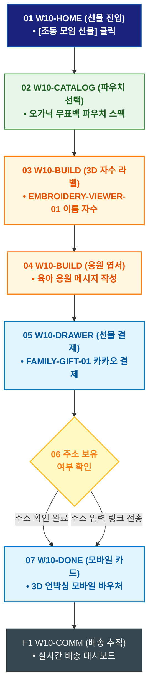

# 🔄 WICKETA 서지안 서비스 흐름도 [조리원 동기 모임/키즈파티 친환경 무표백 파우치 안심 선물]

> **프로젝트명**: WICKETA 온가족 안심 웰니스 & 패밀리 케어 (Family Wellness)  
> **분석 대상 클라이언트**: [`[가상클라이언트_10] 서지안_워킹맘육아인플루언서_온가족안심웰니스.txt`](file:///C:/Users/user/Desktop/이지희%20에이전트/설계%20마저%20해오기/자동화/03_클라이언트/01_가상_클라이언트/[가상클라이언트_10] 서지안_워킹맘육아인플루언서_온가족안심웰니스.txt)  
> **기준 사이트맵 문서**: [`C:\Users\SBS\Desktop\0819 이지희\한명씩 화면 설계도 진행\자동화\04_설계_및_스토리보드\03_사이트맵\10_서지안\사이트맵_목적3_패밀리선물.md`](file:///C:/Users/SBS/Desktop/0819%20%EC%9D%B4%EC%A7%80%ED%9D%AC/%ED%95%9C%EB%AA%85%EC%94%A9%20%ED%99%94%EB%A9%B4%20%EC%84%A4%EA%B3%84%EB%8F%84%20%EC%A7%84%ED%96%89/%EC%9E%90%EB%8F%99%ED%99%94/04_%EC%84%A4%EA%B3%84_%EB%B0%8F_%EC%8A%A4%ED%86%A0%EB%A6%AC%EB%B3%B4%EB%93%9C/03_%EC%82%AC%EC%9D%B4%ED%8A%B8%EB%A7%B5/10_서지안/사이트맵_목적3_패밀리선물.md)  
> **접속 목적**: 조동 모임 친구들을 위한 3D 아이 이름 자수 라벨 파우치 선물 발송  
> **목적별 고유 킬러 기능**: **3D 자수 라벨 시뮬레이터 (`EMBROIDERY-VIEWER-01`) & 카카오 패밀리 선물 (`FAMILY-GIFT-01`)**  
> **작성일자**: 2026년 8월 19일  
> **작성자**: Antigravity UI/UX 설계팀  
> **문서 인코딩**: UTF-8 (유니코드)  

---

## 1. 목적별 핵심 서비스 흐름 개요

조리원 동기 모임 선물용으로 친환경 무표백 코튼 파우치에 아이 이름을 3D 자수로 새겨 넣고 따뜻한 육아 응원 카드와 함께 카카오톡 선물하기로 발송하는 감성 여정

---

## 2. 목적 맞춤형 가변 여정 스테이지 (Dynamic Journey Stages)

### 🎁 Stage 1: 조동 모임 안심 선물 룩북 탐색
- **01 선물 홈 진입 (`W10-HOME`)**: [조동 모임/키즈 선물] 클릭 ➔ 친환경 기프트 쇼케이스 로딩
- **02 친환경 무표백 파우치 세트 선택 (`W10-CATALOG`)**: 오가닉 코튼 파우치 & 0.00mg 무카페인 티 세트 선택

### 🧵 Stage 2: 3D 아이 이름 자수 라벨 시뮬레이션
- **03 3D 자수 라벨 에디팅 (`W10-BUILD`)**:
  - EMBROIDERY-VIEWER-01 아이 이름 입력 ➔ 3D 오가닉 자수 실시간 시뮬레이션
- **04 육아 응원 엽서 작성 (`W10-BUILD`)**: "엄마도 아기도 건강하자" 응원 메시지 작성

### 🛒 Stage 3: 카카오톡 선물하기 결제
- **05 선물 드로어 오픈 (`W10-DRAWER`)**: FAMILY-GIFT-01 카카오 친구 선택 ➔ 1초 결제
- **06 주소 확인 분기 (`W10-DRAWER`)**: 주소 보유 시 즉시 출고 / 미입력 시 카카오톡 링크 전송

### 💌 Stage 4: 3D 모바일 기프트 카드 발송
- **07 3D 언박싱 카드 발급 (`W10-DONE`)**: 수령인에게 3D 자수 파우치 언박싱 바우처 전송
- **F1 배송 추적 & 감사 답장함 (`W10-COMM`)**: 실시간 배송 조회 및 조동 답장 수신함 연동

---

## 3. 단계별 명세표 (Flow Matrix Table)

| 단계 ID | 단계 명칭 | 사용자 행동 | 화면 접점 | 서비스/시스템 반응 | 매핑 요구사항 | 다음 진입 조건 |
| :---: | :--- | :--- | :--- | :--- | :--- | :--- |
| **01** | 선물 진입 | [조동 모임 선물] 클릭 | `W10-HOME` | 친환경 선물 쇼케이스 노출 | `REQ-05 선물 기획` | 02 파우치 선택 |
| **02** | 파우치 선택 | 무표백 오가닉 세트 선택 | `W10-CATALOG` | 상품 스펙 및 자수 옵션 노출 | `REQ-05 상품 선택` | 03 자수 라벨 |
| **03** | 자수 라벨 | 아이 이름 입력 | `W10-BUILD` | EMBROIDERY-VIEWER-01 3D 실시간 자수 | `REQ-05 3D 자수기` | 04 응원 엽서 |
| **04** | 응원 엽서 | 육아 응원 문구 작성 | `W10-BUILD` | 감성 엽서 프리뷰 실시간 생성 | `REQ-05 응원 카드` | 05 선물 결제 |
| **05** | 선물 결제 | 카카오 친구 선택 및 결제 | `W10-DRAWER` | 카카오페이 1초 승인, 바우처 생성 | `REQ-06 선물 결제` | 06 주소 확인 |
| **06-A** | [성공] 주소 완료 | 친구 주소 즉시 확인 | `W10-DRAWER` | 오가닉 패키징 및 출고 지시 | `배송 지정` | 07 카드 발송 |
| **06-B** | [대기] 링크 전송 | 주소 입력 링크 발송 | `W10-DRAWER` | 카카오톡 배송지 폼 발송 | `예외 처리` | 07 카드 발송 |
| **07** | 모바일 카드 | 3D 언박싱 카드 확인 | `W10-DONE` | 수령인 카카오톡 메시지 전송 | `REQ-06 모바일 카드` | F1 배송 추적 |
| **F1** | 배송 추적 | 실시간 배송 현황 조회 | `W10-COMM` | 배송 추적 대시보드 갱신 | `사후 관리` | 여정 완료 |

---

## 4. 목적별 서비스 흐름도 다이어그램 (Mermaid)

---

## 5. 최종 품질 검토 및 연계 설계 문서

- [x] **고정 템플릿 탈피**: 목적별 특성에 맞춘 독자적 가변 스테이지 및 분기 조건 반영
- [x] **예외 상황(Fallback) 및 루프 완비**: 재고 부족, 결제 실패, 글자수 오류, 연속 출석 등의 분기/복구 파이프라인 수록
- [x] **연계 사이트맵**: [`사이트맵_목적3_패밀리선물.md`](file:///C:/Users/SBS/Desktop/0819%20%EC%9D%B4%EC%A7%80%ED%9D%AC/%ED%95%9C%EB%AA%85%EC%94%A9%20%ED%99%94%EB%A9%B4%20%EC%84%A4%EA%B3%84%EB%8F%84%20%EC%A7%84%ED%96%89/%EC%9E%90%EB%8F%99%ED%99%94/04_%EC%84%A4%EA%B3%84_%EB%B0%8F_%EC%8A%A4%ED%86%A0%EB%A6%AC%EB%B3%B4%EB%93%9C/03_%EC%82%AC%EC%9D%B4%ED%8A%B8%EB%A7%B5/10_서지안/사이트맵_목적3_패밀리선물.md)
