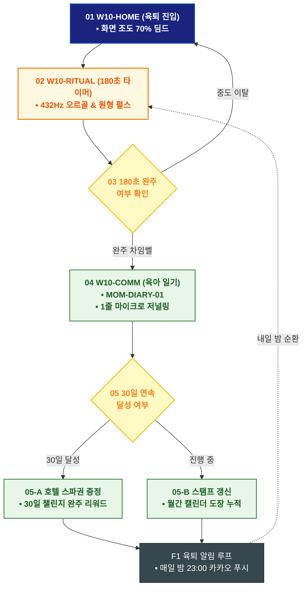

# 🔄 WICKETA 서지안 서비스 흐름도 [밤 23:00 육퇴 후 180초 힐링 안식 의식 & 감정 일기]

> **프로젝트명**: WICKETA 온가족 안심 웰니스 & 패밀리 케어 (Family Wellness)  
> **분석 대상 클라이언트**: [`[가상클라이언트_10] 서지안_워킹맘육아인플루언서_온가족안심웰니스.txt`](file:///C:/Users/user/Desktop/이지희%20에이전트/설계%20마저%20해오기/자동화/03_클라이언트/01_가상_클라이언트/[가상클라이언트_10] 서지안_워킹맘육아인플루언서_온가족안심웰니스.txt)  
> **기준 사이트맵 문서**: [`C:\Users\SBS\Desktop\0819 이지희\한명씩 화면 설계도 진행\자동화\04_설계_및_스토리보드\03_사이트맵\10_서지안\사이트맵_목적4_육퇴챌린지.md`](file:///C:/Users/SBS/Desktop/0819%20%EC%9D%B4%EC%A7%80%ED%9D%AC/%ED%95%9C%EB%AA%85%EC%94%A9%20%ED%99%94%EB%A9%B4%20%EC%84%A4%EA%B3%84%EB%8F%84%20%EC%A7%84%ED%96%89/%EC%9E%90%EB%8F%99%ED%99%94/04_%EC%84%A4%EA%B3%84_%EB%B0%8F_%EC%8A%A4%ED%86%A0%EB%A6%AC%EB%B3%B4%EB%93%9C/03_%EC%82%AC%EC%9D%B4%ED%8A%B8%EB%A7%B5/10_서지안/사이트맵_목적4_육퇴챌린지.md)  
> **접속 목적**: 육아 퇴근 후 432Hz 자장가 사운드와 함께하는 180초 힐링 명상  
> **목적별 고유 킬러 기능**: **육퇴 안식 플레이어 (`MOM-RITUAL-01`) & 마이 맘스 일기 (`MOM-DIARY-01`)**  
> **작성일자**: 2026년 8월 19일  
> **작성자**: Antigravity UI/UX 설계팀  
> **문서 인코딩**: UTF-8 (유니코드)  

---

## 1. 목적별 핵심 서비스 흐름 개요

매일 밤 23:00 육아 퇴근 후 432Hz 잔잔한 음향과 180초 브루잉 호흡 타이머로 온전한 나만의 시간을 누리고, 1줄 육아 감정 일기를 작성하는 힐링 습관 루프

---

## 2. 목적 맞춤형 가변 여정 스테이지 (Dynamic Journey Stages)

### 🌙 Stage 1: 육퇴 힐링 모드 진입
- **01 육퇴 안식 진입 (`W10-HOME`)**: 밤 23:00 육퇴 모드 알림 클릭 ➔ [180초 육퇴 힐링 시작] 탭 ➔ 화면 조도 70% 딤드

### 🧘 Stage 2: 180초 힐링 플레이어 실행
- **02 432Hz 힐링 사운드 & 호흡 (`W10-RITUAL`)**:
  - MOM-RITUAL-01 잔잔한 오르골 사운드 선택 ➔ 180초 원형 호흡 가이드
  - `{180초 완주 여부?}` ➔ 완주 시 부드러운 싱잉볼 차임벨 울림

### 📝 Stage 3: 데일리 1줄 육아 감정 일기
- **03 마이크로 저널링 (`W10-COMM`)**: MOM-DIARY-01 오늘의 육아 감정 컬러 선택 ➔ 1줄 소감 저장

### 🏆 Stage 4: 30일 맘스 챌린지 & 나이트 알림
- **04 스탬프 갱신 및 뱃지 획득 (`W10-COMM`)**:
  - `{30일 연속 달성?}` ➔ YES: 호텔 스파 이용권 뱃지 획득 ➔ 내일 밤 23:00 육퇴 알림 예약

---

## 3. 단계별 명세표 (Flow Matrix Table)

| 단계 ID | 단계 명칭 | 사용자 행동 | 화면 접점 | 서비스/시스템 반응 | 매핑 요구사항 | 다음 진입 조건 |
| :---: | :--- | :--- | :--- | :--- | :--- | :--- |
| **01** | 육퇴 진입 | [육퇴 힐링 시작] 클릭 | `W10-HOME` | 화면 조도 70% 감쇄, 플레이어 로딩 | `REQ-01 육퇴 진입` | 02 플레이어 실행 |
| **02** | 플레이어 실행 | 432Hz 오르골 선택 및 호흡 | `W10-RITUAL` | MOM-RITUAL-01 원형 펄스 타이머 작동 | `REQ-03 180초 타이머` | 03 완주 검증 |
| **03-A** | [성공] 완주 차임벨 | 180초 완주 | `W10-RITUAL` | 차임벨 울림, 일기 모달 오픈 | `REQ-03 완주 처리` | 04 일기 작성 |
| **03-B** | [예외] 중도 이탈 | 일시 정지 | `W10-RITUAL` | 진행 시간 자동 저장 후 복귀 | `예외 처리` | 01 육퇴 진입 |
| **04** | 일기 작성 | 5색 컬러 선택 및 1줄 작성 | `W10-COMM` | MOM-DIARY-01 감정 데이터 저장 | `REQ-03 육아 일기` | 05 30일 판정 |
| **05-A** | [성공] 30일 달성 | 30일 연속 출석 확인 | `W10-COMM` | 호텔 스파 이용권 뱃지 증정 | `리워드 지급` | F1 알림 루프 |
| **05-B** | [진행] 스탬프 갱신 | 출석 스탬프 확인 | `W10-COMM` | 월간 캘린더 스탬프 누적 | `리텐션 유지` | F1 알림 루프 |
| **F1** | 육퇴 알림 루프 | 내일 밤 알림 리마인더 설정 | `W10-COMM` | 매일 밤 23:00 카카오 푸시 스케줄링 | `순환 루프` | 다음날 육퇴 |

---

## 4. 목적별 서비스 흐름도 다이어그램 (Mermaid)

---

## 5. 최종 품질 검토 및 연계 설계 문서

- [x] **고정 템플릿 탈피**: 목적별 특성에 맞춘 독자적 가변 스테이지 및 분기 조건 반영
- [x] **예외 상황(Fallback) 및 루프 완비**: 재고 부족, 결제 실패, 글자수 오류, 연속 출석 등의 분기/복구 파이프라인 수록
- [x] **연계 사이트맵**: [`사이트맵_목적4_육퇴챌린지.md`](file:///C:/Users/SBS/Desktop/0819%20%EC%9D%B4%EC%A7%80%ED%9D%AC/%ED%95%9C%EB%AA%85%EC%94%A9%20%ED%99%94%EB%A9%B4%20%EC%84%A4%EA%B3%84%EB%8F%84%20%EC%A7%84%ED%96%89/%EC%9E%90%EB%8F%99%ED%99%94/04_%EC%84%A4%EA%B3%84_%EB%B0%8F_%EC%8A%A4%ED%86%A0%EB%A6%AC%EB%B3%B4%EB%93%9C/03_%EC%82%AC%EC%9D%B4%ED%8A%B8%EB%A7%B5/10_서지안/사이트맵_목적4_육퇴챌린지.md)
