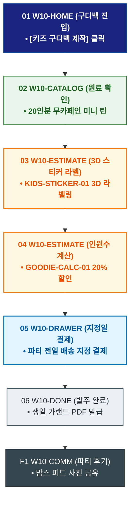

# 🔄 WICKETA 서지안 서비스 흐름도 [어린이집/유치원 생일파티 20인분 안심 키즈 구디백 대량 발주]

> **프로젝트명**: WICKETA 온가족 안심 웰니스 & 패밀리 케어 (Family Wellness)  
> **분석 대상 클라이언트**: [`[가상클라이언트_10] 서지안_워킹맘육아인플루언서_온가족안심웰니스.txt`](file:///C:/Users/user/Desktop/이지희%20에이전트/설계%20마저%20해오기/자동화/03_클라이언트/01_가상_클라이언트/[가상클라이언트_10] 서지안_워킹맘육아인플루언서_온가족안심웰니스.txt)  
> **기준 사이트맵 문서**: [`C:\Users\SBS\Desktop\0819 이지희\한명씩 화면 설계도 진행\자동화\04_설계_및_스토리보드\03_사이트맵\10_서지안\사이트맵_목적5_키즈구디백.md`](file:///C:/Users/SBS/Desktop/0819%20%EC%9D%B4%EC%A7%80%ED%9D%AC/%ED%95%9C%EB%AA%85%EC%94%A9%20%ED%99%94%EB%A9%B4%20%EC%84%A4%EA%B3%84%EB%8F%84%20%EC%A7%84%ED%96%89/%EC%9E%90%EB%8F%99%ED%99%94/04_%EC%84%A4%EA%B3%84_%EB%B0%8F_%EC%8A%A4%ED%86%A0%EB%A6%AC%EB%B3%B4%EB%93%9C/03_%EC%82%AC%EC%9D%B4%ED%8A%B8%EB%A7%B5/10_서지안/사이트맵_목적5_키즈구디백.md)  
> **접속 목적**: 유치원 생일파티용 20인분 무카페인/무설탕 미니 틴 구디백 주문  
> **목적별 고유 킬러 기능**: **키즈 구디백 계산기 (`GOODIE-CALC-01`) & 3D 캐릭터 스티커 라벨러 (`KIDS-STICKER-01`)**  
> **작성일자**: 2026년 8월 19일  
> **작성자**: Antigravity UI/UX 설계팀  
> **문서 인코딩**: UTF-8 (유니코드)  

---

## 1. 목적별 핵심 서비스 흐름 개요

어린이집 생일파티 답례품으로 20인분의 0.00mg 무카페인 과일티 미니 틴에 아이 얼굴/캐릭터 스티커를 3D로 라벨링하여 행사 전일 도착하도록 대량 발주하는 프로세스

---

## 2. 목적 맞춤형 가변 여정 스테이지 (Dynamic Journey Stages)

### 🎈 Stage 1: 키즈 구디백 쇼케이스 탐색
- **01 구디백 홈 진입 (`W10-HOME`)**: [어린이집/유치원 생일 구디백] 클릭 ➔ 구디백 콘솔 로딩
- **02 20인분 키즈 미니 틴 확인 (`W10-CATALOG`)**: 알러지 프리 0.00mg 무카페인 과일 스틱 20인분 구성 검토

### 🎨 Stage 2: 3D 캐릭터 스티커 라벨링
- **03 3D 스티커 라벨러 조작 (`W10-ESTIMATE`)**: KIDS-STICKER-01 아이 사진 및 축하 문구 입력 ➔ 3D 프리뷰
- **04 인원수 계산 (`W10-ESTIMATE`)**: GOODIE-CALC-01 20명 수량 입력 ➔ 20% 단체 할인 산출

### 🛒 Stage 3: 행사 일정 지정 및 간편결제
- **05 주문 드로어 호출 (`W10-DRAWER`)**: 생일파티 전일 도착 배송 지정 ➔ 카카오페이 1초 결제
- **06 결제 승인 (`W10-DRAWER`)**: 구디백 개별 안심 포장 지시

### 🎁 Stage 4: 발주 완료 & 생일파티 플래그 증정
- **07 발주 승인 확인 (`W10-DONE`)**: 생일파티 가랜드 디자인 PDF 증정
- **F1 파티 후기 셰어링 (`W10-COMM`)**: 키즈파티 사진 공유 피드 연동

---

## 3. 단계별 명세표 (Flow Matrix Table)

| 단계 ID | 단계 명칭 | 사용자 행동 | 화면 접점 | 서비스/시스템 반응 | 매핑 요구사항 | 다음 진입 조건 |
| :---: | :--- | :--- | :--- | :--- | :--- | :--- |
| **01** | 구디백 진입 | [키즈 구디백 제작] 클릭 | `W10-HOME` | 키즈 구디백 콘솔 노출 | `REQ-05 구디백 기획` | 02 라인업 확인 |
| **02** | 라인업 확인 | 20인분 미니 틴 확인 | `W10-CATALOG` | 0.00mg 무카페인 스펙 렌더링 | `REQ-05 상품 선택` | 03 스티커 라벨 |
| **03** | 스티커 라벨 | 아이 사진 및 문구 입력 | `W10-ESTIMATE` | KIDS-STICKER-01 3D 실시간 렌더링 | `REQ-05 라벨러` | 04 인원수 계산 |
| **04** | 인원수 계산 | 20명 수량 입력 | `W10-ESTIMATE` | GOODIE-CALC-01 20% 할인 산출 | `REQ-02 단체 계산기` | 05 주문 드로어 |
| **05** | 주문 드로어 | 파티 전일 배송 지정 결제 | `W10-DRAWER` | 안심 포장 및 지정일 출고 등록 | `REQ-06 패스트 결제` | 06 발주 완료 |
| **06** | 발주 완료 | 생일 가랜드 확인 | `W10-DONE` | 파티 가랜드 PDF 다운로드 발급 | `REQ-06 파티 가랜드` | F1 파티 후기 |
| **F1** | 파티 후기 | 키즈파티 사진 등록 | `W10-COMM` | 맘스 커뮤니티 파티 후기 연동 | `사후 확산` | 여정 완료 |

---

## 4. 목적별 서비스 흐름도 다이어그램 (Mermaid)

---

## 5. 최종 품질 검토 및 연계 설계 문서

- [x] **고정 템플릿 탈피**: 목적별 특성에 맞춘 독자적 가변 스테이지 및 분기 조건 반영
- [x] **예외 상황(Fallback) 및 루프 완비**: 재고 부족, 결제 실패, 글자수 오류, 연속 출석 등의 분기/복구 파이프라인 수록
- [x] **연계 사이트맵**: [`사이트맵_목적5_키즈구디백.md`](file:///C:/Users/SBS/Desktop/0819%20%EC%9D%B4%EC%A7%80%ED%9D%AC/%ED%95%9C%EB%AA%85%EC%94%A9%20%ED%99%94%EB%A9%B4%20%EC%84%A4%EA%B3%84%EB%8F%84%20%EC%A7%84%ED%96%89/%EC%9E%90%EB%8F%99%ED%99%94/04_%EC%84%A4%EA%B3%84_%EB%B0%8F_%EC%8A%A4%ED%86%A0%EB%A6%AC%EB%B3%B4%EB%93%9C/03_%EC%82%AC%EC%9D%B4%ED%8A%B8%EB%A7%B5/10_서지안/사이트맵_목적5_키즈구디백.md)
