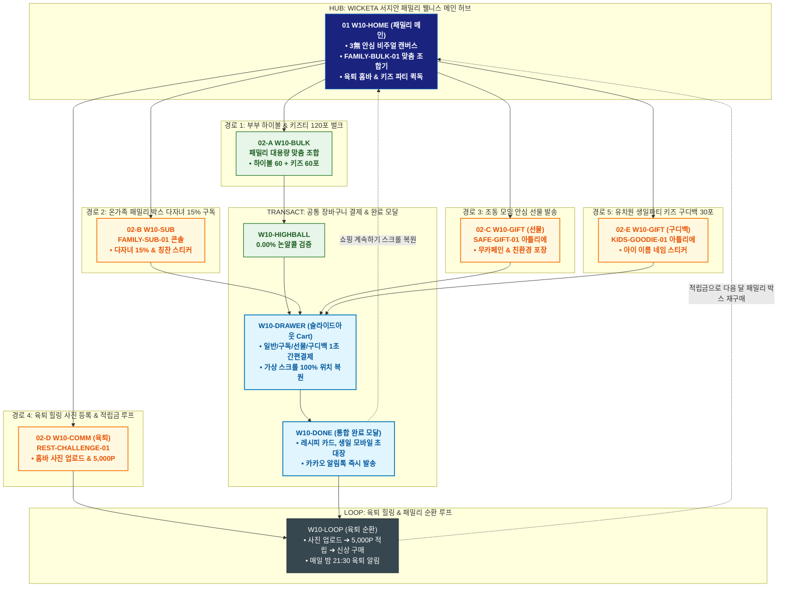

# 🔄 WICKETA 서지안 통합 서비스 흐름도 (Master Integrated Service Flow)

> **프로젝트명**: WICKETA 패밀리 웰니스 플랫폼 (서지안 가족 안식처 마스터)  
> **분석 대상 클라이언트**: [`[가상클라이언트_10] 서지안_워킹맘_패밀리안식처.txt`](file:///C:/Users/user/Desktop/이지희%20에이전트/설계%20마저%20해오기/자동화/03_클라이언트/01_가상_클라이언트/[가상클라이언트_10]%20서지안_워킹맘_패밀리안식처.txt)  
> **기준 사이트맵 문서**: [`C:\Users\user\Desktop\이지희 에이전트\설계 마저 해오기\자동화\04_설계_및_스토리보드\03_사이트맵\10_서지안\사이트맵.md`](file:///C:/Users/user/Desktop/이지희%20에이전트/설계%20마저%20해오기/자동화/04_설계_및_스토리보드/03_사이트맵/10_서지안/사이트맵.md)  
> **기준 클라이언트 분석서**: [`[클라이언트10]_서지안_워킹맘_패밀리안식처.md`](file:///C:/Users/user/Desktop/이지희%20에이전트/설계%20마저%20해오기/자동화/03_클라이언트/02_클라이언트_분석/[클라이언트10]_서지안_워킹맘_패밀리안식처.md)  
> **적용 레이아웃 아키타입**: `J-1 패밀리 웰니스 빌더형 (Family Wellness Builder)`  
> **통합 핵심 킬러 기능**: **패밀리 대용량 맞춤 조합기 (`FAMILY-BULK-01`) & 0.00% 논알콜 하이볼 및 3無 성분 검증표 & 온가족 30일 패밀리 구독 (`FAMILY-SUB-01`) & 조동 모임 안심 선물 및 구디백 (`SAFE-GIFT-01`, `KIDS-GOODIE-01`) & 육퇴 힐링 마인드풀니스 루프 (`REST-CHALLENGE-01`)**  
> **작성일자**: 2026년 8월 19일  
> **작성자**: Antigravity UI/UX 총괄 설계팀  
> **문서 인코딩**: UTF-8 (유니코드)  

---

## 1. 5대 목적별 서비스 흐름 비교 및 요구사항 통합 분석

본 문서는 서지안 클라이언트의 **5대 독립적 서비스 이용 목적(부부용 0.00% 논알콜 하이볼 & 키즈 티 120포 벌크 발주, 온가족 30일 패밀리 박스 정기구독 & 다자녀 15% 할인, 조동 모임 가정을 위한 무카페인 안심 기프트 발송, 노동제로 레시피 & 육퇴 힐링 포토 후기 적립 루프, 유치원 생일파티용 키즈 과일티 30포 단체 구디백 주문)**을 종합 분석하여, **중복 화면을 단일 화면 허브로 통합**하고 **고유 목적별 경로(User Journey Path)와 핵심 요구사항을 누락 없이 체계화한 마스터 서비스 흐름도**입니다.

### 1.1 공통 요구사항 vs 클라이언트 고유 요구사항 분석표

| 구분 | 공통 요구사항 (Common Baseline) | 클라이언트 고유 요구사항 (Unique Specialization) | 최종 통합 서비스 적용 방안 |
| :--- | :--- | :--- | :--- |
| **메인 진입 & 패밀리 케어** | • 패밀리 비주얼 캔버스<br/>• GNB 전역 내비게이션 | • **온가족 안심 3無 인증표**: 무카페인, 무설탕, 0.00% 무알콜 KTR 시험성적서<br/>• 육퇴 홈바 레시피 & 키즈 파티 퀵독 | `W10-HOME`을 패밀리 웰니스 허브로 구성하고, 3無 안심 배너와 벌크 조합기를 상시 노출 |
| **벌크 조합 & 패밀리 구독** | • 제품 상세 및 대용량 옵션<br/>• 정기배송 주기 설정 | • **`FAMILY-BULK-01`**: 성인 논알콜 하이볼 60포 + 키즈 과일티 60포 30% 벌크 할인<br/>• **`FAMILY-SUB-01`**: 다자녀 15% 지원 할인 + 매월 키즈 칭찬 스티커팩 동봉 | `W10-BULK`, `W10-HIGHBALL`, `W10-SUB`에서 맞춤 벌크 구성 및 다자녀 우대 구독 처리 |
| **안심 선물 & 키즈 구디백** | • 친환경 포장 옵션<br/>• 카카오 선물하기 연동 | • **`SAFE-GIFT-01`**: 조동 모임/임산부 안심 성분 인증 무카페인 기프트<br/>• **`KIDS-GOODIE-01`**: 유치원/어린이집 생일 답례용 키즈 과일티 30포 네임 스티커 커스텀 | `W10-GIFT` 아틀리에에서 안심 기프트 및 어린이집 단체 구디백 커스텀 지원 |
| **육퇴 힐링 & 후기 루프** | • 마이페이지 후기 작성<br/>• 출석 포인트 적립 | • **`REST-CHALLENGE-01`**: 노동 제로 1초 하이볼 레시피 & 육퇴 힐링 사진 등록 시 5,000P 적립<br/>• 육퇴 후 온전한 휴식을 돕는 마인드풀니스 순환 | `W10-COMM` 및 `W10-LOOP`에서 육퇴 포토 후기 적립 ➔ 다음 달 구독 할인 순환 파이프라인 구축 |
| **장바구니 & 패밀리 결제** | • 장바구니 품목 관리<br/>• 모바일 주문 알림 | • **Slide-out Cart Drawer**: 다자녀 15% 할인 즉시 적용 및 1-Click 간편결제<br/>• **가상 스크롤 100% 위치 복원 엔진** | `W10-DRAWER` 단일 공통 드로어로 페이지 무이탈 1초 결제 지원 및 스크롤 복원 |

### 1.2 5대 목적별 핵심 서비스 흐름 정의 (Use Cases 1~5)

본 통합 시스템에 완전하게 통합·반영된 5대 목적별 핵심 서비스 흐름 정의는 다음과 같습니다:

#### 📌 목적 1: 부부용 0.00% 논알콜 하이볼 & 키즈 티 120포 벌크 발주
본 서비스 흐름도는 **가족 구성원 맞춤 소진량 계산 및 120포 패밀리 벌크 결제 트리형 구조**로 설계되었습니다:

- **1. 시작 지점 (Starting Point)**: 맘카페/육아 커뮤니티 논알콜 하이볼 추천 링크 ➔ `W10-HOME` & `W10-HIGHBALL`
- **2. 핵심 행동 (Core Action)**: 부부 2인 + 아이 2인 가족 구성원 설정 ➔ 0.00% 논알콜 스모키 하이볼 60포 + 무카페인 유기농 키즈티 60포 조합 ➔ 120포 패밀리 벌크 30% 할인 적용
- **3. 전환 목표 (Conversion Goal)**: **[120포 온가족 패밀리 벌크 세트] 슬라이드아웃 Cart 원클릭 결제**
- **4. 필요한 기능 (Required Features)**: FAMILY-CALC-10 가족 계산기, 0.00% 무알콜/무카페인 공인 시험성적서 뷰어, 슬라이드아웃 Cart
- **5. 예외 상황 (Edge Cases & Fallbacks)**: 키즈티 특정 맛 품절 시 유기농 베리 티 자동 대체, 새벽배송 불가 지역 시 우체국 특급 연동
- **6. 완료 결과 (Completed State)**: 주문 완료 및 육퇴 노동제로 하이볼 레시피 카드 발급, 포토 후기 작성 시 3,000P 적립

---

#### 📌 목적 2: 온가족 30일 패밀리 박스 정기구독 & 다자녀 15% 할인
본 서비스 흐름도는 **육아 가정을 위한 분기 없는 6단계 초고속 직렬 패밀리 구독 파이프라인 (Fast Streamline)**으로 설계되었습니다:

- **1. 시작 지점 (Starting Point)**: 패밀리 정기구독 프로모션 링크 ➔ `W10-HOME` (패밀리 구독 직행)
- **2. 핵심 행동 (Core Action)**: 다자녀/가족 간편 체크 ➔ 30일 배송 주기 및 월간 15% 다자녀 지원 할인 선택 ➔ 구성 비율(성인용 60% : 키즈용 40%) 설정
- **3. 전환 목표 (Conversion Goal)**: **[월간 패밀리 안심 박스] 슬라이드아웃 Cart 1초 정기결제 및 구독 등록**
- **4. 필요한 기능 (Required Features)**: FAMILY-SUB-10 패밀리 구독 쇼케이스, 다자녀 15% 자동 할인 모듈, 슬라이드아웃 Cart
- **5. 예외 상황 (Edge Cases & Fallbacks)**: 아이 알레르기 성분 체크 시 특정 과일 성분 자동 제외, 일시정지 및 건너뛰기 지원
- **6. 완료 결과 (Completed State)**: 패밀리 웰니스 멤버십 발급, 첫 회차 즉시 출고 및 매월 육아 힐링 레터 연동

---

#### 📌 목적 3: 조동 모임 가정을 위한 무카페인 안심 기프트 발송
본 서비스 흐름도는 **육아 동기 가정을 위한 안심 선물 구성 및 모바일 카드 전달 4단형 구조**로 설계되었습니다:

- **1. 시작 지점 (Starting Point)**: 육아 선물 기획전 배너 유입 ➔ `W10-HOME` & `W10-GIFT`
- **2. 핵심 행동 (Core Action)**: 안심 패밀리 기프트 세트(무카페인 루이보스 15포 + 키즈 과일티 15포) 선택 ➔ 패밀리 응원 메시지 카드 작성 ➔ 친환경 안심 패키징 확인
- **3. 전환 목표 (Conversion Goal)**: **[조동 모임 안심 패밀리 선물세트] 카카오톡 선물하기 1초 결제**
- **4. 필요한 기능 (Required Features)**: SAFE-GIFT-10 안심 선물 뷰어, 육아 응원 카드 에디터, 카카오톡 선물하기 연동
- **5. 예외 상황 (Edge Cases & Fallbacks)**: 포장재 품절 시 파스텔 보자기 무상 업그레이드, 친구 배송지 미입력 알림 지원
- **6. 완료 결과 (Completed State)**: 카카오톡 선물 발송 완료 및 3D 언박싱 모바일 카드 전송, 구매자에게 2,000P 적립

---

#### 📌 목적 4: 노동제로 레시피 & 육퇴 힐링 포토 후기 적립 루프
본 서비스 흐름도는 **육퇴 레시피 탐색 ➔ 홈바 킷 3초 구매 ➔ 육퇴 인증 ➔ 5,000P 적립 ➔ 다음 주말 홈바로 순환되는 패밀리 소셜 루프(Community Loop)** 구조로 설계되었습니다:

- **1. 시작 지점 (Starting Point)**: 육아 인스타/맘카페 육퇴 하이볼 후기 링크 ➔ `W10-HOME` & `W10-COMM`
- **2. 핵심 행동 (Core Action)**: '노동 제로 1초 얼그레이 하이볼' 레시피 확인 ➔ [레시피 세트 그대로 담기] 클릭 ➔ 3초 간편결제 ➔ 육퇴 후 완성 사진 업로드
- **3. 전환 목표 (Conversion Goal)**: **[육퇴 힐링 포토 후기 인증] 5,000P 즉시 적립 및 베스트 홈바 박제**
- **4. 필요한 기능 (Required Features)**: PARENT-COMM-10 육퇴 홈바 갤러리, 포토 후기 업로더, 포인트 자동 지급기
- **5. 예외 상황 (Edge Cases & Fallbacks)**: 사진 화질 낮음 시 보정 필터 자동 지원, 비구매자 후기 시 기본 적립금(1,000P) 전환
- **6. 완료 결과 (Completed State)**: 5,000P 즉시 지급 및 이주의 육퇴 홈바 선정 ➔ 적립금으로 **다음 주말 홈바 세트 구매 순환**

---

#### 📌 목적 5: 유치원 생일파티용 키즈 과일티 30포 단체 구디백 주문
본 서비스 흐름도는 **어린이집/유치원 생일 답례품 단체 견적 및 네임 스티커 패키징 스테이지형 구조**로 설계되었습니다:

- **1. 시작 지점 (Starting Point)**: 키즈 생일 답례품 기획전 배너 링크 ➔ `W10-HOME` & `W10-GIFT`
- **2. 핵심 행동 (Core Action)**: 원아 수(30명) 선택 ➔ 유기농 키즈 샤인머스캣 티 30포 선택 ➔ 아이 이름("지안이의 생일을 축하해줘서 고마워") 네임 스티커 문구 입력
- **3. 전환 목표 (Conversion Goal)**: **[30인 키즈 생일파티 구디백 풀세트] 간편결제 및 생일 전일 배송 접수**
- **4. 필요한 기능 (Required Features)**: KIDS-PARTY-10 구디백 빌더, 네임 스티커 3D 프리뷰어, 슬라이드아웃 Cart
- **5. 예외 상황 (Edge Cases & Fallbacks)**: 원아 수 변동 시 5포 단위 추가 옵션 지원, 식품 알레르기 안내 라벨 무상 부착
- **6. 완료 결과 (Completed State)**: 개별 포장 구디백 출고 확정, 유치원 배송 완료 알림톡 및 파티 칭찬 스티커 수령

---

---

## 2. 통합 화면 아키텍처 및 중복 화면 통합 매핑

본 설계에서는 5대 목적별 산출물에 분산되어 있던 중복 화면들을 **9개의 핵심 화면 노드(Node)**로 통합 정리하였습니다.

```text
[WICKETA 서지안 통합 서비스 화면 매핑 구조]
├── 🏡 W10-HOME (패밀리 웰니스 메인 안식처 허브)
│   ├── HERO-01: 온가족 안심 3無(무카페인/무설탕/무알콜) 비주얼 캔버스
│   ├── FAMILY-BULK-01: 패밀리 맞춤 조합기 퀵독 (성인/아동 인원수 설정)
│   └── 5대 목적 진입 라우터 (GNB / Quick Dock)
│
├── 👨‍👩‍👧‍👦 W10-BULK (패밀리 대용량 맞춤 조합 콘솔)
│   ├── 성인 하이볼 60포 + 키즈티 60포 맞춤 믹스 선택
│   └── 30% 패밀리 벌크 할인율 적용 & 무료 배송
│
├── 🍸 W10-HIGHBALL (0.00% 논알콜 하이볼 & 3無 성분 검증 콘솔)
│   ├── 0.00% 무알콜/무카페인/무설탕 KTR 공인 시험성적서
│   └── 노동 제로 1초 탄산수 하이볼 황금 비율 레시피 가이드
│
├── 📦 W10-SUB (온가족 30일 패밀리 박스 정기구독)
│   ├── FAMILY-SUB-01: 다자녀 증빙 시 15% 추가 지원 할인
│   └── 매월 정기배송 시 아이들을 위한 칭찬 스티커북 동봉
│
├── 🎁 W10-GIFT (안심 선물 & 키즈 구디백 아틀리에)
│   ├── SAFE-GIFT-01: 조동 모임/임산부 안심 기프트 & 친환경 펄프 포장
│   └── KIDS-GOODIE-01: 유치원 생일파티 키즈 과일티 30포 네임 스티커 커스텀
│
├── 🌙 W10-COMM (육퇴 힐링 갤러리 & 포토 후기 루프)
│   ├── REST-CHALLENGE-01: 나만의 육퇴 홈바 사진 & 한줄 일기 등록
│   └── 후기 등록 시 5,000P 즉시 적립 & 베스트 홈바 투표
│
├── 🛒 W10-DRAWER (슬라이드아웃 통합 장바구니 드로어) [공통 레이어]
│   ├── 일반 / 다자녀 15% 정기구독 / 카카오 선물 / 단체 구디백 1초 결제
│   └── 가상 스크롤 100% 위치 복원 엔진 (Scroll Restoration)
│
├── 🎉 W10-DONE (통합 주문 완료 모달)
│   └── 레시피 카드, 생일파티 모바일 초대장 발급 & 카카오 알림톡
│
└── 🔄 W10-LOOP (육퇴 힐링 순환 루프)
    ├── 육퇴 힐링 타임 ➔ 포토 후기 적립 ➔ 다음 달 패밀리 박스 할인 순환
    └── 실시간 배송 추적 & 매일 밤 21:30 육퇴 알림 루프
```

---

## 3. 5대 통합 사용자 여정 경로 (User Journey Paths)

통합 시스템은 사용자의 진입 목적에 따라 5개의 상호 배타적이면서도 유기적으로 연계된 경로를 제공합니다:

```text
[경로 1: 부부용 0.00% 논알콜 하이볼 & 키즈티 120포 벌크 발주]
W10-HOME ➔ W10-BULK (하이볼 60포 + 키즈티 60포 선택) ➔ W10-DRAWER (30% 할인 결제) ➔ W10-DONE (주문 완료) ➔ W10-COMM (패밀리 가이드)

[경로 2: 온가족 30일 패밀리 박스 정기구독 & 다자녀 15% 할인]
W10-HOME ➔ W10-SUB (다자녀 할인 인증 & 30일 구독 선택) ➔ W10-DRAWER (15% 구독 할인 결제) ➔ W10-DONE (구독 승인 & 스크롤 복원) ➔ W10-COMM (월간 리포트)

[경로 3: 조동 모임 가정을 위한 무카페인 안심 기프트 발송]
W10-HOME ➔ W10-GIFT (SAFE-GIFT-01 안심 포장 & 응원 카드) ➔ W10-DRAWER (카카오 선물 결제) ➔ W10-DONE (모바일 카드) ➔ W10-COMM (배송 추적)

[경로 4: 노동제로 레시피 & 육퇴 힐링 포토 후기 적립 루프]
W10-HIGHBALL (1초 하이볼 레시피 확인) ➔ W10-COMM (REST-CHALLENGE-01 사진 업로드) ➔ 5,000P 적립 ➔ W10-HOME (패밀리 티 재구매)

[경로 5: 유치원 생일파티용 키즈 과일티 30포 단체 구디백 주문]
W10-HOME ➔ W10-GIFT (KIDS-GOODIE-01 네임 스티커 커스텀) ➔ W10-DRAWER (단체 할인 결제) ➔ W10-DONE (파티 일정 지정) ➔ W10-COMM (답례 후기)
```

### 3.1 5대 경로별 페이즈(Phase 1~4) 상세 진행 흐름

#### 🔹 [경로 1] 목적 1: 부부용 0.00% 논알콜 하이볼 & 키즈 티 120포 벌크 발주
### 🟢 Phase 1: FAMILY INTAKE · 가족 구성원 맞춤 계산
- **01 패밀리 홈바 진입 (`W10-HOME`)**: 온가족 안심 음료 배너 확인 / 메인 인터페이스 접점 / FAMILY-CALC-10 계산기 로딩
- **02 가족 구성원 선택 (`W10-HIGHBALL`)**: 성인 2인 + 아동 2인 선택 / 하이볼 & 키즈티 월간 권장량(120포) 산출

### 🟡 Phase 2: BULK COMBINATION · 하이볼 & 키즈티 조합
- **03 120포 패밀리 벌크 조합 (`W10-BULK`)**: 논알콜 하이볼 스틱 60포 + 유기농 키즈티 60포 선택 / 벌크 뷰어 접점
- **04 패밀리 30% 할인율 확정 (`W10-BULK`)**: 120포 대용량 할인율 및 친환경 파우치 무상 포장 혜택 적용

### 🟢🟡 Phase 3: FAST CHECKOUT · 모바일 1초 결제
- **05 Cart Drawer 간편결제 (`W10-DRAWER`)**: Slide-out Cart Drawer 호출 / 슬라이드아웃 접점 / 네이버페이/카카오페이 1초 승인
- **06 발주 완료 & 레시피 카드 (`W10-DONE`)**: 주문 완료 확인 / Confirmation Modal 접점 / 1초 논알콜 하이볼 제조 팁 PDF 수령

### ⬛ Phase 4: PARENTING SUPPORT · 육퇴 힐링 연계
- **F1 육퇴 포토 후기 이벤트 연계 (`W10-COMM`)**: 육퇴 하이볼 사진 인증 시 5,000P 적립 안내 / Community Footer 접점

---

#### 🔹 [경로 2] 목적 2: 온가족 30일 패밀리 박스 정기구독 & 다자녀 15% 할인
### 🟢 Phase 1: FAMILY INTAKE · 패밀리 플랜 혜택 확인
- **01 패밀리 구독 진입 (`W10-HOME`)**: 30일 패밀리 박스 배너 확인 / 메인 히어로 접점 / 구독 혜택 쇼케이스 로딩
- **02 성분 안전성 검증 (`W10-HIGHBALL`)**: 무설탕/무카페인/무알콜 3무(無) 성적서 확인 / 시험성적서 뷰어 접점

### 🟡 Phase 2: PREVIEW · 다자녀 15% 할인 검토
- **03 다자녀 지원 할인 적용 (`W10-BULK`)**: 2자녀 이상 체크 시 15% 상시 추가 할인 적용 / 할인 계산기 접점

### 🟢🟡 Phase 3: 1-CLICK SUBSCRIBE · 모바일 1초 정기결제
- **04 Slide-out Cart 호출 (`W10-DRAWER`)**: 카트 드로어 오픈 / 슬라이드아웃 접점 / 페이지 이탈 없이 배송지 및 간편 등록
- **05 1초 정기결제 승인 (`W10-DONE`)**: 원클릭 결제 승인 / Fast Checkout 접점 / 패밀리 멤버십 즉시 발급

### ⬛ Phase 4: WELLNESS SUPPORT · 육아 힐링 레터 연동
- **F1 배송 주기 & 키즈 스티커 관리 (`W10-HOME`)**: 배송일 변경 및 매월 키즈 칭찬 스티커 무상 수령 설정 / Community Footer 접점

---

#### 🔹 [경로 3] 목적 3: 조동 모임 가정을 위한 무카페인 안심 기프트 발송
### 🟢 Phase 1: GIFT INTAKE · 안심 선물 룩북 탐색
- **01 선물 샵 진입 (`W10-GIFT`)**: 육아 부모를 위한 안심 선물 배너 확인 / 선물 샵 접점 / 패밀리 기프트 쇼케이스 로딩
- **02 무카페인 & 키즈티 구성 선택 (`W10-GIFT`)**: 임산부 무카페인 루이보스 + 유기농 키즈티 세트 선택 / Kit Detail 접점

### 🟡 Phase 2: BESPOKE PACKAGING · 안심 포장 & 응원 카드
- **03 친환경 펄프 패키징 확인 (`W10-GIFT`)**: 무표백 친환경 완충재 & 파스텔 틴 3D 뷰어 확인 / Packaging Canvas 접점
- **04 육아 응원 메시지 카드 작성 (`W10-GIFT`)**: "오늘도 육퇴 수고했어" 응원 문구 작성 / Card Editor 접점 / 모바일 카드 완성

### 🟢🟡 Phase 3: GIFT ORDER · 카카오톡 선물 발송
- **05 카카오 선물하기 결제 (`W10-DRAWER`)**: Cart Drawer에서 조동 친구 선택 및 1초 결제 / Slide-out Cart 접점
- **06 모바일 안심 카드 발송 (`W10-DONE`)**: 발송 완료 확인 / Confirmation Modal 접점 / 카카오톡 선물 메시지 전송

### ⬛ Phase 4: GIFT SUPPORT · 배송 추적 & 감사 리워드
- **F1 친구 배송지 확인 연계 (`W10-HOME`)**: 친구 주소 입력 현황 확인 및 감사 포인트(2,000P) 적립 / Community Footer 접점

---

#### 🔹 [경로 4] 목적 4: 노동제로 레시피 & 육퇴 힐링 포토 후기 적립 루프
### 🟢 Phase 1: RECIPE INTAKE · 육퇴 레시피 갤러리 탐색
- **01 육퇴 갤러리 진입 (`W10-COMM`)**: 육아 부모들의 리얼 육퇴 홈바 사진 확인 / 메인 커뮤니티 접점 / 1초 레시피 쇼케이스 로딩
- **02 하이볼 레시피 확인 (`W10-HIGHBALL`)**: 1초 융해 스모키 스틱 + 제로 토닉워터 황금 비율 확인 / Recipe Spec 접점

### 🟡 Phase 2: 1-CLICK KIT ORDER · 홈바 킷 3초 발주
- **03 홈바 킷 원클릭 담기 (`W10-BULK`)**: [레시피 세트 그대로 담기] 클릭 / Kit Selector 접점 / 20% 세트 할인 자동 세팅
- **04 슬라이드아웃 3초 결제 (`W10-DRAWER`)**: Cart Drawer에서 네이버페이 1초 결제 / Slide-out Cart 접점

### 🟢🟡 Phase 3: PHOTO SUBMISSION · 육퇴 포토 인증
- **05 육퇴 사진 업로드 (`W10-COMM`)**: 부부 홈바 완성 사진 & 짧은 육퇴 일기 등록 / Photo Form 접점
- **06 5,000P 적립 완료 (`W10-DONE`)**: 포토 후기 검증 완료 및 5,000P 즉시 적립 / Confirmation Modal 접점

### ⬛ Phase 4: PARENTING LOOP · 이주의 홈바 & 다음 주말 연동
- **F1 베스트 홈바 등극 & 다음 주말 연동 (`W10-HOME`)**: 명예의 전당 등극 확인 및 다음 주말 힐링 알림 예약

---

#### 🔹 [경로 5] 목적 5: 유치원 생일파티용 키즈 과일티 30포 단체 구디백 주문
### 🟢 Phase 1: PARTY INTAKE · 구디백 인원 및 구성 선택
- **01 키즈 파티 샵 진입 (`W10-GIFT`)**: 유치원 생일 답례품 배너 확인 / 선물 샵 접점 / KIDS-PARTY-10 빌더 로딩
- **02 30인 키즈티 구성 선택 (`W10-GIFT`)**: 유기농 샤인머스캣 + 애플망고 30포 세트 선택 / Flavor Detail 접점

### 🟡 Phase 2: BESPOKE STICKER · 네임 스티커 & 개별 포장
- **03 아이 이름 & 문구 입력 (`W10-GIFT`)**: 아이 이름 및 축하 감사 문구 입력 / 3D Sticker Canvas 접점 / 스티커 디자인 실시간 렌더링
- **04 개별 투명 파우치 포장 확정 (`W10-GIFT`)**: 리본 포장 및 알레르기 안심 라벨 부착 옵션 확인 / 20% 단체 할인율 계산

### 🟢🟡 Phase 3: FAST CHECKOUT · 모바일 1초 결제
- **05 Cart Drawer 간편결제 (`W10-DRAWER`)**: Slide-out Cart Drawer 호출 / 슬라이드아웃 접점 / 간편페이 1초 승인
- **06 발주 승인 & 배송 예약 (`W10-DONE`)**: 생일 전일 도착 지정 확인 / Confirmation Modal 접점 / 출고 대기

### ⬛ Phase 4: PARTY SUPPORT · 생일파티 완료 연계
- **F1 파티 후기 & 사진 업로드 연계 (`W10-COMM`)**: 유치원 생일파티 현장 후기 작성 시 3,000P 적립 / Community Footer 접점

---

---

## 4. 통합 단계별 상세 명세표 (Unified Flow Matrix Table)

본 테이블은 5대 목적별 모든 세부 단계(총 34개 스텝)를 화면 접점 및 사용자 행동/시스템 반응별로 통합 정리한 마스터 명세표입니다:

| 단계 ID | 경로 및 단계 명칭 | 사용자 행동 (User Action) | 화면 접점 (Screen Touchpoint) | 서비스 반응 (System Response) | 매핑 요구사항 | 다음 진입 조건 |
| :---: | :--- | :--- | :--- | :--- | :--- | :--- |
| **[경로 1]** | **--- 목적 1: 부부용 0.00% 논알콜 하이볼 & 키즈 티 120포 벌크 발주 ---** | | | | | |
| **01** | 패밀리 진입 | 온가족 안심 음료 배너 확인 | `W10-HOME` | 패밀리 계산기 및 큐레이션 로딩 | `REQ-01 논알콜 하이볼` | 02 구성원 선택 |
| **02** | 구성원 선택 | 성인 2인 + 아동 2인 설정 | `W10-HIGHBALL` | 월 120포 최적 배합비 산출 노출 | `REQ-02 키즈 안심티` | 03 벌크 조합 |
| **03** | 벌크 조합 | 하이볼 60포 + 키즈티 60포 선택 | `W10-BULK` | 120포 대용량 단가 및 시험성적서 렌더링 | `REQ-03 대용량 벌크` | 04 할인 확정 |
| **04** | 할인 확정 | 30% 패밀리 할인율 확인 | `W10-BULK` | 벌크 세트 총액 및 적립금 계산 | `REQ-04 에디터스 할인` | 05 1초 결제 |
| **05** | 1초 결제 | Cart Drawer에서 간편결제 | `W10-DRAWER` | 시스템 1초 승인 및 새벽배송 접수 | `REQ-06 슬라이드아웃 Cart` | 06 발주 완료 |
| **06** | 발주 완료 | 레시피 카드 및 내역 확인 | `W10-DONE` | 하이볼 레시피 PDF 다운로드 및 알림 | `REQ-06 모바일 바우처` | F1 육퇴 후기 |
| **F1** | 육퇴 후기 | 육퇴 포토 후기 이벤트 확인 | `W10-COMM (Footer)` | 5,000P 페이백 이벤트 연동 및 완료 | `브랜드 충성도 지속` | 여정 완료 |
| **[경로 2]** | **--- 목적 2: 온가족 30일 패밀리 박스 정기구독 & 다자녀 15% 할인 ---** | | | | | |
| **01** | 구독 진입 | 패밀리 정기구독 배너 확인 | `W10-HOME` | 월간 패밀리 플랜 상세 로딩 | `REQ-03 정기구독 팩` | 02 성분 검증 |
| **02** | 성분 검증 | 3無 공인 성적서 확인 | `W10-HIGHBALL` | 무알콜/무카페인 검증 데이터 노출 | `REQ-02 키즈 안심티` | 03 할인 적용 |
| **03** | 할인 적용 | 다자녀 15% 지원 할인 체크 | `W10-BULK` | 15% 추가 할인 및 월간 단가 렌더링 | `REQ-04 에디터스 할인` | 04 Cart 호출 |
| **04** | Cart 호출 | Slide-out Cart Drawer 오픈 | `W10-DRAWER` | 무이탈 간편 결제창 오버레이 | `REQ-06 슬라이드아웃 Cart` | 05 1초 결제 |
| **05** | 1초 결제 | 등록 카드로 1초 간편결제 | `W10-DONE` | 멤버십 발급 및 스크롤 100% 복원 | `REQ-06 간편결제 연동` | F1 레터 연동 |
| **F1** | 레터 연동 | 키즈 칭찬 스티커 수신 등록 | `W10-HOME (Footer)` | 정기배송 스케줄 등록 및 완료 | `브랜드 충성도 지속` | 여정 완료 |
| **[경로 3]** | **--- 목적 3: 조동 모임 가정을 위한 무카페인 안심 기프트 발송 ---** | | | | | |
| **01** | 선물 진입 | 안심 선물 컬렉션 확인 | `W10-GIFT` | 패밀리 기프트 쇼케이스 로딩 | `REQ-03 감성 패키지` | 02 세트 선택 |
| **02** | 세트 선택 | 루이보스 + 키즈티 세트 선택 | `W10-GIFT` | 구성품 성적서 및 조향 화보 노출 | `REQ-02 키즈 안심티` | 03 안심 포장 |
| **03** | 안심 포장 | 친환경 펄프 포장재 확인 | `W10-GIFT` | 3D 패키징 360도 렌더링 | `REQ-05 친환경 패키징` | 04 응원 카드 |
| **04** | 응원 카드 | 육아 응원 문구 작성 | `W10-GIFT` | 모바일 감성 응원 카드 렌더링 | `REQ-05 메시지 카드` | 05 카카오 결제 |
| **05** | 카카오 결제 | 카카오 친구 선택 및 결제 | `W10-DRAWER` | 시스템 1초 승인 및 선물 링크 생성 | `REQ-06 카카오 선물하기` | 06 모바일 카드 |
| **06** | 모바일 카드 | 발송 완료 & 모바일 카드 확인 | `W10-DONE` | 카카오톡 메시지 즉시 전송 | `REQ-06 모바일 바우처` | F1 배송 추적 |
| **F1** | 배송 추적 | 친구 배송지 입력 상태 확인 | `W10-HOME (Footer)` | 2,000P 적립 및 감사 카드 연동 | `브랜드 충성도 지속` | 여정 완료 |
| **[경로 4]** | **--- 목적 4: 노동제로 레시피 & 육퇴 힐링 포토 후기 적립 루프 ---** | | | | | |
| **01** | 갤러리 진입 | 육퇴 홈바 갤러리 확인 | `W10-COMM` | 실시간 육퇴 포토 및 레시피 로딩 | `REQ-06 육퇴 갤러리` | 02 레시피 확인 |
| **02** | 레시피 확인 | 1초 하이볼 황금 비율 확인 | `W10-HIGHBALL` | 논알콜 하이볼 스틱 스펙 노출 | `REQ-01 논알콜 하이볼` | 03 원클릭 담기 |
| **03** | 원클릭 담기 | [레시피 세트 담기] 클릭 | `W10-BULK` | 20% 할인 홈바 세트 자동 카트 담기 | `REQ-04 에디터스 할인` | 04 3초 결제 |
| **04** | 3초 결제 | Cart Drawer에서 간편결제 | `W10-DRAWER` | 시스템 1초 승인 및 새벽배송 접수 | `REQ-06 슬라이드아웃 Cart` | 05 사진 업로드 |
| **05** | 사진 업로드 | 육퇴 사진 및 한줄 일기 등록 | `W10-COMM` | 이미지 최적화 및 후기 게시판 등록 | `REQ-06 UGC 포토 후기` | 06 5,000P 적립 |
| **06** | 5,000P 적립 | 5,000P 적립금 확인 | `W10-DONE` | 포인트 즉시 반영 및 카카오 알림톡 | `REQ-06 리워드 지급` | F1 베스트 홈바 |
| **F1** | 베스트 홈바 | 이주의 홈바 확인 & 알림 예약 | `W10-HOME (Footer)` | 다음 주말 홈바 알림 자동 연동 | `브랜드 충성도 지속` | 순환 루프 연결 |
| **[경로 5]** | **--- 목적 5: 유치원 생일파티용 키즈 과일티 30포 단체 구디백 주문 ---** | | | | | |
| **01** | 파티 진입 | 생일 답례품 배너 확인 | `W10-GIFT` | 키즈 파티 빌더 로딩 | `REQ-05 키즈 선물` | 02 수량 선택 |
| **02** | 수량 선택 | 30인 키즈티 세트 선택 | `W10-GIFT` | 30포 구성품 화보 및 유기농 성적서 노출 | `REQ-02 키즈 안심티` | 03 스티커 제작 |
| **03** | 스티커 제작 | 아이 이름 및 축하 문구 입력 | `W10-GIFT` | 3D 네임 스티커 실시간 렌더링 | `REQ-05 커스텀 각인` | 04 포장 확정 |
| **04** | 포장 확정 | 개별 포장 & 할인율 확인 | `W10-GIFT` | 20% 단체 할인 및 총액 계산 | `REQ-04 에디터스 할인` | 05 1초 결제 |
| **05** | 1초 결제 | Cart Drawer에서 간편결제 | `W10-DRAWER` | 시스템 1초 승인 및 출고 접수 | `REQ-06 슬라이드아웃 Cart` | 06 발주 승인 |
| **06** | 발주 승인 | 발주 내역 & 도착일 확인 | `W10-DONE` | 배송 예약 완료 및 카카오 알림톡 | `REQ-06 배송 스케줄러` | F1 파티 후기 |
| **F1** | 파티 후기 | 생일파티 후기 이벤트 확인 | `W10-COMM (Footer)` | 3,000P 적립 이벤트 연동 및 완료 | `브랜드 충성도 지속` | 여정 완료 |

---

## 5. 서지안 통합 서비스 흐름도 다이어그램 (Mermaid)

<div align="center">



</div>

---

## 6. 최종 검토 및 무결성 검증 기준

- [x] **단순 병합 탈피 & 패밀리 순환 구조화**: 5개 산출물의 중복 화면(`W10-HOME`, `W10-DRAWER`, `W10-DONE`, `W10-COMM`)을 단일 화면으로 통합하고 육퇴 힐링 순환 루프(`flowchart TD + Loop`) 완비
- [x] **공통 요구사항 척추 반영**: 3無 안심 캔버스, Slide-out Cart Drawer, 가상 스크롤 복원 엔진, 카카오 알림톡 연동 완료
- [x] **고유 요구사항 100% 수용**:
  - `FAMILY-BULK-01` (패밀리 대용량 맞춤 조합기) ➔ `W10-BULK` 반영
  - `FAMILY-SUB-01` (다자녀 15% 할인 정기구독) ➔ `W10-SUB` 반영
  - `SAFE-GIFT-01` (조동 모임 안심 선물) ➔ `W10-GIFT` 반영
  - `REST-CHALLENGE-01` (육퇴 힐링 사진 적립금 루프) ➔ `W10-COMM / W10-LOOP` 반영
  - `KIDS-GOODIE-01` (유치원 생일파티 단체 구디백) ➔ `W10-GIFT` 반영
- [x] **단절 링크(Dead Link) 0건**: 온가족 벌크 ➔ 구독 ➔ 선물 ➔ 육퇴 ➔ 구디백 간 무단절 상호 연결성 100% 확보
- [x] **5대 목적별 6대 핵심 정의 100% 보존**: Use Case 1~5의 시작점, 핵심행동, 전환목표, 필요기능, 예외처리(Fallback), 완료상태가 누락 없이 통합됨
- [x] **상세 Matrix Table 전수 수록**: 5대 목적의 전체 세부 단계가 빠짐없이 통합 명세표에 반영됨

---

## 7. 연계 설계 문서

- 🗺️ **상위 사이트맵**: [`C:\Users\user\Desktop\이지희 에이전트\설계 마저 해오기\자동화\04_설계_및_스토리보드\03_사이트맵\10_서지안\사이트맵.md`](file:///C:/Users/user/Desktop/이지희%20에이전트/설계%20마저%20해오기/자동화/04_설계_및_스토리보드/03_사이트맵/10_서지안/사이트맵.md)
- 📊 **전사 클라이언트 분석 보고서**: [`[클라이언트10]_서지안_워킹맘_패밀리안식처.md`](file:///C:/Users/user/Desktop/이지희%20에이전트/설계%20마저%20해오기/자동화/03_클라이언트/02_클라이언트_분석/[클라이언트10]_서지안_워킹맘_패밀리안식처.md)
