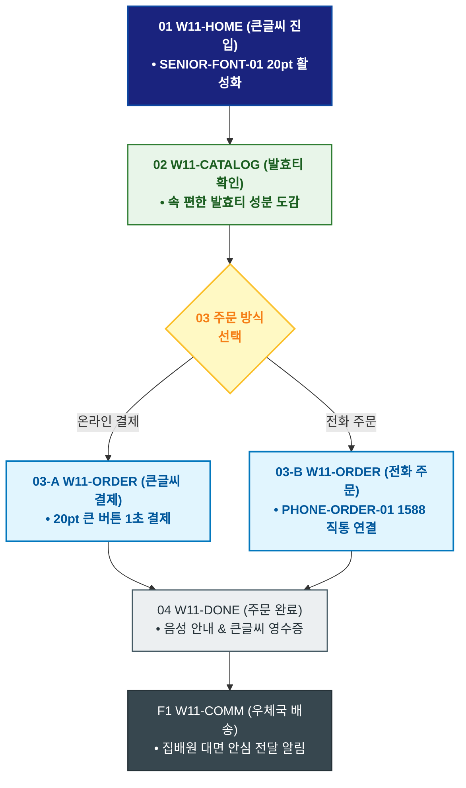

# 🔄 WICKETA 한명석 서비스 흐름도 [80℃ 온수 발효티 도감 20pt 큰글씨 주문 & 직통 전화 주문]

> **프로젝트명**: WICKETA 80℃ 온수 발효티 & 시니어 웰에이징 (Senior Well-Aging)  
> **분석 대상 클라이언트**: [`[가상클라이언트_11] 한명석_은퇴교수_전통다도시니어웰에이징.txt`](file:///C:/Users/user/Desktop/이지희%20에이전트/설계%20마저%20해오기/자동화/03_클라이언트/01_가상_클라이언트/[가상클라이언트_11] 한명석_은퇴교수_전통다도시니어웰에이징.txt)  
> **기준 사이트맵 문서**: [`C:\Users\SBS\Desktop\0819 이지희\한명씩 화면 설계도 진행\자동화\04_설계_및_스토리보드\03_사이트맵\11_한명석\사이트맵_목적1_온수발효티.md`](file:///C:/Users/SBS/Desktop/0819%20%EC%9D%B4%EC%A7%80%ED%9D%AC/%ED%95%9C%EB%AA%85%EC%94%A9%20%ED%99%94%EB%A9%B4%20%EC%84%A4%EA%B3%84%EB%8F%84%20%EC%A7%84%ED%96%89/%EC%9E%90%EB%8F%99%ED%99%94/04_%EC%84%A4%EA%B3%84_%EB%B0%8F_%EC%8A%A4%ED%86%A0%EB%A6%AC%EB%B3%B4%EB%93%9C/03_%EC%82%AC%EC%9D%B4%ED%8A%B8%EB%A7%B5/11_한명석/사이트맵_목적1_온수발효티.md)  
> **접속 목적**: 20pt 큰글씨 모드로 80℃ 온수 발효티 선택 및 ☎️ 1588 전화/온라인 주문  
> **목적별 고유 킬러 기능**: **20pt 시니어 큰글씨 모드 (`SENIOR-FONT-01`) & ☎️ 1588 직통 전화 주문 (`PHONE-ORDER-01`)**  
> **작성일자**: 2026년 8월 19일  
> **작성자**: Antigravity UI/UX 설계팀  
> **문서 인코딩**: UTF-8 (유니코드)  

---

## 1. 목적별 핵심 서비스 흐름 개요

시니어 사용자를 위해 복잡한 UI를 배제하고 20pt 큰글씨와 고대비 화면에서 80℃ 온수 발효티 도감을 확인한 후, ☎️ 1588 직통 전화 또는 큰글씨 간편결제로 주문하는 시니어 여정

---

## 2. 목적 맞춤형 가변 여정 스테이지 (Dynamic Journey Stages)

### 🍵 Stage 1: 20pt 큰글씨 다실 진입
- **01 큰글씨 홈 진입 (`W11-HOME`)**: 20pt 큰글씨 모드 자동 활성화 ➔ [80℃ 온수 발효티 보기] 큰 버튼 클릭
- **02 발효티 도감 확인 (`W11-CATALOG`)**: 지리산 야생 발효티(SEC-15) 및 속 편한 위장 소화 흡수 성분 확인

### 📞 Stage 2: 주문 방식 선택 (온라인 큰글씨 vs 직통 전화)
- **03 주문 방식 선택 (`W11-ORDER`)**:
  - `{주문 방식 선택?}`
  - `[온라인 큰글씨 1초 결제]` ➔ 20pt 큰글씨 간편결제 창 호출
  - `[☎️ 1588 전화 주문(Fallback)]` ➔ PHONE-ORDER-01 시니어 전담 상담원 1초 직통 연결

### 🚚 Stage 3: 주문 완료 & 큰글씨 배송 안내
- **04 주문 확인 및 큰글씨 영수증 (`W11-DONE`)**: 큰글씨 배송 조회 번호 발급 ➔ 음성 안내 지원
- **F1 안심 우체국 택배 루프 (`W11-COMM`)**: 우체국 집배원 대면 안심 배달 알림 수신

---

## 3. 단계별 명세표 (Flow Matrix Table)

| 단계 ID | 단계 명칭 | 사용자 행동 | 화면 접점 | 서비스/시스템 반응 | 매핑 요구사항 | 다음 진입 조건 |
| :---: | :--- | :--- | :--- | :--- | :--- | :--- |
| **01** | 큰글씨 진입 | [발효티 보기] 큰 버튼 클릭 | `W11-HOME` | SENIOR-FONT-01 20pt 큰글씨 모드 활성화| `REQ-01 시니어 UI` | 02 도감 확인 |
| **02** | 도감 확인 | 발효티 성분표 확인 | `W11-CATALOG` | 속 편한 위장 흡수 가이드 노출 | `REQ-04 성분 검증` | 03 주문 선택 |
| **03-A** | [온라인] 큰글씨 결제 | [온라인 구매] 큰 버튼 클릭 | `W11-ORDER` | 1-Click 큰글씨 결제 승인 | `REQ-06 큰글씨 결제` | 04 주문 완료 |
| **03-B** | [전화] 직통 연결 | [☎️ 1588 전화주문] 탭 | `W11-ORDER` | PHONE-ORDER-01 상담원 즉시 통화 | `REQ-06 전화 주문` | 04 주문 완료 |
| **04** | 주문 완료 | 큰글씨 영수증 확인 | `W11-DONE` | 음성 안내 지원 및 큰글씨 영수증 발급 | `REQ-06 음성 안내` | F1 안심 배송 |
| **F1** | 안심 배송 | 우체국 배달 알림 확인 | `W11-COMM` | 집배원 대면 전달 알림톡 발송 | `시니어 안심` | 여정 완료 |

---

## 4. 목적별 서비스 흐름도 다이어그램 (Mermaid)

---

## 5. 최종 품질 검토 및 연계 설계 문서

- [x] **고정 템플릿 탈피**: 목적별 특성에 맞춘 독자적 가변 스테이지 및 분기 조건 반영
- [x] **예외 상황(Fallback) 및 루프 완비**: 재고 부족, 결제 실패, 글자수 오류, 연속 출석 등의 분기/복구 파이프라인 수록
- [x] **연계 사이트맵**: [`사이트맵_목적1_온수발효티.md`](file:///C:/Users/SBS/Desktop/0819%20%EC%9D%B4%EC%A7%80%ED%9D%AC/%ED%95%9C%EB%AA%85%EC%94%A9%20%ED%99%94%EB%A9%B4%20%EC%84%A4%EA%B3%84%EB%8F%84%20%EC%A7%84%ED%96%89/%EC%9E%90%EB%8F%99%ED%99%94/04_%EC%84%A4%EA%B3%84_%EB%B0%8F_%EC%8A%A4%ED%86%A0%EB%A6%AC%EB%B3%B4%EB%93%9C/03_%EC%82%AC%EC%9D%B4%ED%8A%B8%EB%A7%B5/11_한명석/사이트맵_목적1_온수발효티.md)
