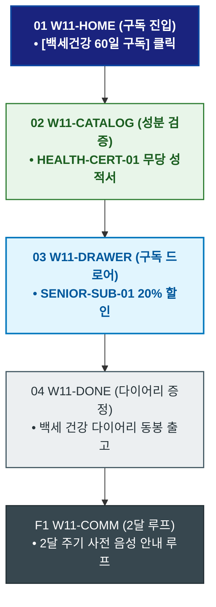

# 🔄 WICKETA 한명석 서비스 흐름도 [백세건강 혈당/혈압 안심 60일 정기구독 & 건강 다이어리]

> **프로젝트명**: WICKETA 80℃ 온수 발효티 & 시니어 웰에이징 (Senior Well-Aging)  
> **분석 대상 클라이언트**: [`[가상클라이언트_11] 한명석_은퇴교수_전통다도시니어웰에이징.txt`](file:///C:/Users/user/Desktop/이지희%20에이전트/설계%20마저%20해오기/자동화/03_클라이언트/01_가상_클라이언트/[가상클라이언트_11] 한명석_은퇴교수_전통다도시니어웰에이징.txt)  
> **기준 사이트맵 문서**: [`C:\Users\SBS\Desktop\0819 이지희\한명씩 화면 설계도 진행\자동화\04_설계_및_스토리보드\03_사이트맵\11_한명석\사이트맵_목적2_웰에이징구독.md`](file:///C:/Users/SBS/Desktop/0819%20%EC%9D%B4%EC%A7%80%ED%9D%AC/%ED%95%9C%EB%AA%85%EC%94%A9%20%ED%99%94%EB%A9%B4%20%EC%84%A4%EA%B3%84%EB%8F%84%20%EC%A7%84%ED%96%89/%EC%9E%90%EB%8F%99%ED%99%94/04_%EC%84%A4%EA%B3%84_%EB%B0%8F_%EC%8A%A4%ED%86%A0%EB%A6%AC%EB%B3%B4%EB%93%9C/03_%EC%82%AC%EC%9D%B4%ED%8A%B8%EB%A7%B5/11_한명석/사이트맵_목적2_웰에이징구독.md)  
> **접속 목적**: 60일 주기로 배송받는 백세건강 발효티 구독 및 건강 다이어리 수령  
> **목적별 고유 킬러 기능**: **혈당/혈압 안심 성분표 (`HEALTH-CERT-01`) & 60일 시니어 구독 (`SENIOR-SUB-01`)**  
> **작성일자**: 2026년 8월 19일  
> **작성자**: Antigravity UI/UX 설계팀  
> **문서 인코딩**: UTF-8 (유니코드)  

---

## 1. 목적별 핵심 서비스 흐름 개요

혈당과 혈압 걱정 없는 0.00% 무당 발효티 성분표를 검증하고, 60일마다 정기적으로 우체국 택배로 배송받으며 큰글씨 건강 다이어리를 증정받는 웰에이징 구독 여정

---

## 2. 목적 맞춤형 가변 여정 스테이지 (Dynamic Journey Stages)

### 🍵 Stage 1: 백세건강 발효티 성분 검토
- **01 건강 구독 진입 (`W11-HOME`)**: [백세건강 60일 정기구독] 클릭 ➔ 웰에이징 콘솔 로딩
- **02 혈당/혈압 안심 성분표 확인 (`W11-CATALOG`)**: HEALTH-CERT-01 0.00% 무당, 소화 효소 발효 성적서 확인

### 🛒 Stage 2: 60일 주기 설정 & 큰글씨 정기결제
- **03 60일 구독 드로어 오픈 (`W11-DRAWER`)**: SENIOR-SUB-01 20% 시니어 할인 + '백세 건강 다이어리' 증정 선택
- **04 큰글씨 간편결제 승인 (`W11-DRAWER`)**: 60일 주기 정기배송 큐 등록

### 📖 Stage 3: 구독 승인 & 건강 다이어리 증정
- **05 구독 승인 확인 (`W11-DONE`)**: 큰글씨 건강 다이어리 동봉 출고 확인
- **F1 2달 주기 안심 배송 루프 (`W11-COMM`)**: 2달마다 출고 3일 전 음성/알림톡 사전 안내 루프

---

## 3. 단계별 명세표 (Flow Matrix Table)

| 단계 ID | 단계 명칭 | 사용자 행동 | 화면 접점 | 서비스/시스템 반응 | 매핑 요구사항 | 다음 진입 조건 |
| :---: | :--- | :--- | :--- | :--- | :--- | :--- |
| **01** | 구독 진입 | [백세건강 구독] 클릭 | `W11-HOME` | 웰에이징 구독 쇼케이스 로딩 | `REQ-01 시니어 구독` | 02 성분 검증 |
| **02** | 성분 검증 | 무당/소화 성분표 확인 | `W11-CATALOG` | HEALTH-CERT-01 안심 성분표 렌더링 | `REQ-04 성분 검증` | 03 구독 설정 |
| **03** | 구독 설정 | 60일 주기 선택 | `W11-DRAWER` | SENIOR-SUB-01 20% 할인 적용 | `REQ-06 정기구독` | 04 결제 승인 |
| **04** | 결제 승인 | 큰글씨 1-Click 승인 | `W11-DRAWER` | 60일 주기 우체국 정기 출고 지시 | `REQ-06 결제 승인` | 05 다이어리 증정 |
| **05** | 다이어리 증정 | 건강 다이어리 확인 | `W11-DONE` | 큰글씨 다이어리 동봉 출고 발급 | `REQ-06 다이어리 증정`| F1 2달 루프 |
| **F1** | 2달 루프 | 2달 주기 알림 확인 | `W11-COMM` | 출고 3일 전 전화/음성 안내 루프 | `시니어 락인` | 순환 루프 |

---

## 4. 목적별 서비스 흐름도 다이어그램 (Mermaid)

---

## 5. 최종 품질 검토 및 연계 설계 문서

- [x] **고정 템플릿 탈피**: 목적별 특성에 맞춘 독자적 가변 스테이지 및 분기 조건 반영
- [x] **예외 상황(Fallback) 및 루프 완비**: 재고 부족, 결제 실패, 글자수 오류, 연속 출석 등의 분기/복구 파이프라인 수록
- [x] **연계 사이트맵**: [`사이트맵_목적2_웰에이징구독.md`](file:///C:/Users/SBS/Desktop/0819%20%EC%9D%B4%EC%A7%80%ED%9D%AC/%ED%95%9C%EB%AA%85%EC%94%A9%20%ED%99%94%EB%A9%B4%20%EC%84%A4%EA%B3%84%EB%8F%84%20%EC%A7%84%ED%96%89/%EC%9E%90%EB%8F%99%ED%99%94/04_%EC%84%A4%EA%B3%84_%EB%B0%8F_%EC%8A%A4%ED%86%A0%EB%A6%AC%EB%B3%B4%EB%93%9C/03_%EC%82%AC%EC%9D%B4%ED%8A%B8%EB%A7%B5/11_한명석/사이트맵_목적2_웰에이징구독.md)
