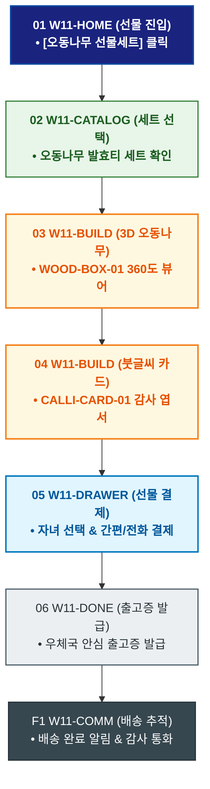

# 🔄 WICKETA 한명석 서비스 흐름도 [자녀/지인 감사 명품 전통 오동나무 한지 포장 선물세트]

> **프로젝트명**: WICKETA 80℃ 온수 발효티 & 시니어 웰에이징 (Senior Well-Aging)  
> **분석 대상 클라이언트**: [`[가상클라이언트_11] 한명석_은퇴교수_전통다도시니어웰에이징.txt`](file:///C:/Users/user/Desktop/이지희%20에이전트/설계%20마저%20해오기/자동화/03_클라이언트/01_가상_클라이언트/[가상클라이언트_11] 한명석_은퇴교수_전통다도시니어웰에이징.txt)  
> **기준 사이트맵 문서**: [`C:\Users\SBS\Desktop\0819 이지희\한명씩 화면 설계도 진행\자동화\04_설계_및_스토리보드\03_사이트맵\11_한명석\사이트맵_목적3_오동나무선물.md`](file:///C:/Users/SBS/Desktop/0819%20%EC%9D%B4%EC%A7%80%ED%9D%AC/%ED%95%9C%EB%AA%85%EC%94%A9%20%ED%99%94%EB%A9%B4%20%EC%84%A4%EA%B3%84%EB%8F%84%20%EC%A7%84%ED%96%89/%EC%9E%90%EB%8F%99%ED%99%94/04_%EC%84%A4%EA%B3%84_%EB%B0%8F_%EC%8A%A4%ED%86%A0%EB%A6%AC%EB%B3%B4%EB%93%9C/03_%EC%82%AC%EC%9D%B4%ED%8A%B8%EB%A7%B5/11_한명석/사이트맵_목적3_오동나무선물.md)  
> **접속 목적**: 자녀/지인을 위한 전통 오동나무 상자 및 한지 붓글씨 감사 카드 선물  
> **목적별 고유 킬러 기능**: **전통 오동나무 3D 패키징 (`WOOD-BOX-01`) & 붓글씨 감사 카드 (`CALLI-CARD-01`)**  
> **작성일자**: 2026년 8월 19일  
> **작성자**: Antigravity UI/UX 설계팀  
> **문서 인코딩**: UTF-8 (유니코드)  

---

## 1. 목적별 핵심 서비스 흐름 개요

최고급 전통 오동나무 상자와 한지 지함 포장 3D 시뮬레이션을 확인하고, 붓글씨 축하 문구를 더해 자녀나 지인의 자택으로 품격 있게 발송하는 프리미엄 효도/감사 선물 여정

---

## 2. 목적 맞춤형 가변 여정 스테이지 (Dynamic Journey Stages)

### 🎁 Stage 1: 전통 명품 선물 룩북 탐색
- **01 선물 홈 진입 (`W11-HOME`)**: [명품 오동나무 선물세트] 클릭 ➔ 전통 다도 선물 쇼케이스 로딩
- **02 오동나무 발효티 세트 선택 (`W11-CATALOG`)**: 지리산 발효티 + 분청사기 찻잔 세트 선택

### 🪵 Stage 2: 3D 오동나무 상자 & 한지 붓글씨 카드
- **03 3D 오동나무 패키징 확인 (`W11-BUILD`)**: WOOD-BOX-01 오동나무 결 및 한지 지함 360도 회전 확인
- **04 붓글씨 감사 문구 작성 (`W11-BUILD`)**: CALLI-CARD-01 "항상 건강하고 평안하길 바란다" 붓글씨 폰트 작성

### 🛒 Stage 3: 카카오톡 또는 전화 선물 결제
- **05 선물 결제 드로어 호출 (`W11-DRAWER`)**: 자녀 카카오톡 선택 또는 전화 결제 ➔ 1초 승인
- **06 주소 확인 분기 (`W11-DRAWER`)**: 자택 주소 즉시 지정

### 💌 Stage 4: 품격 선물 발송 & 배송 추적
- **07 발송 완료 확인 (`W11-DONE`)**: 우체국 특급 안심 포장 출고증 발급
- **F1 배송 추적 & 감사 통화 (`W11-COMM`)**: 자녀 배송 완료 알림톡 수신 및 감사 통화 연동

---

## 3. 단계별 명세표 (Flow Matrix Table)

| 단계 ID | 단계 명칭 | 사용자 행동 | 화면 접점 | 서비스/시스템 반응 | 매핑 요구사항 | 다음 진입 조건 |
| :---: | :--- | :--- | :--- | :--- | :--- | :--- |
| **01** | 선물 진입 | [오동나무 선물] 클릭 | `W11-HOME` | 전통 선물 쇼케이스 노출 | `REQ-05 선물 기획` | 02 세트 선택 |
| **02** | 세트 선택 | 오동나무 발효티 세트 선택 | `W11-CATALOG` | 최고급 자재 스펙 렌더링 | `REQ-05 상품 선택` | 03 3D 패키징 |
| **03** | 3D 패키징 | 오동나무 상자 회전 확인 | `W11-BUILD` | WOOD-BOX-01 3D 실시간 뷰어 | `REQ-05 전통 포장` | 04 붓글씨 카드 |
| **04** | 붓글씨 카드 | 감사 문구 입력 | `W11-BUILD` | CALLI-CARD-01 붓글씨 프리뷰 | `REQ-05 감사 카드` | 05 선물 결제 |
| **05** | 선물 결제 | 자녀 선택 및 결제 승인 | `W11-DRAWER` | 카카오페이 또는 전화 결제 완료 | `REQ-06 선물 결제` | 06 출고증 발급 |
| **06** | 출고증 발급 | 우체국 출고증 확인 | `W11-DONE` | 특급 안심 포장 지시서 발급 | `REQ-06 안심 출고` | F1 배송 추적 |
| **F1** | 배송 추적 | 자녀 배송 완료 확인 | `W11-COMM` | 배송 완료 알림톡 및 감사 통화 | `사후 관리` | 여정 완료 |

---

## 4. 목적별 서비스 흐름도 다이어그램 (Mermaid)

---

## 5. 최종 품질 검토 및 연계 설계 문서

- [x] **고정 템플릿 탈피**: 목적별 특성에 맞춘 독자적 가변 스테이지 및 분기 조건 반영
- [x] **예외 상황(Fallback) 및 루프 완비**: 재고 부족, 결제 실패, 글자수 오류, 연속 출석 등의 분기/복구 파이프라인 수록
- [x] **연계 사이트맵**: [`사이트맵_목적3_오동나무선물.md`](file:///C:/Users/SBS/Desktop/0819%20%EC%9D%B4%EC%A7%80%ED%9D%AC/%ED%95%9C%EB%AA%85%EC%94%A9%20%ED%99%94%EB%A9%B4%20%EC%84%A4%EA%B3%84%EB%8F%84%20%EC%A7%84%ED%96%89/%EC%9E%90%EB%8F%99%ED%99%94/04_%EC%84%A4%EA%B3%84_%EB%B0%8F_%EC%8A%A4%ED%86%A0%EB%A6%AC%EB%B3%B4%EB%93%9C/03_%EC%82%AC%EC%9D%B4%ED%8A%B8%EB%A7%B5/11_한명석/사이트맵_목적3_오동나무선물.md)
