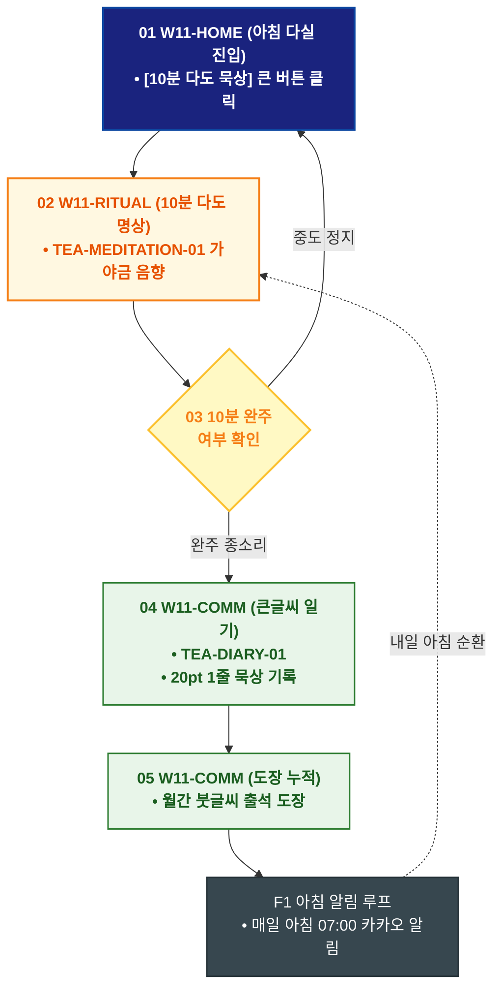

# 🔄 WICKETA 한명석 서비스 흐름도 [매일 아침 10분 온수 다도 묵상 & 큰글씨 다도 일기]

> **프로젝트명**: WICKETA 80℃ 온수 발효티 & 시니어 웰에이징 (Senior Well-Aging)  
> **분석 대상 클라이언트**: [`[가상클라이언트_11] 한명석_은퇴교수_전통다도시니어웰에이징.txt`](file:///C:/Users/user/Desktop/이지희%20에이전트/설계%20마저%20해오기/자동화/03_클라이언트/01_가상_클라이언트/[가상클라이언트_11] 한명석_은퇴교수_전통다도시니어웰에이징.txt)  
> **기준 사이트맵 문서**: [`C:\Users\SBS\Desktop\0819 이지희\한명씩 화면 설계도 진행\자동화\04_설계_및_스토리보드\03_사이트맵\11_한명석\사이트맵_목적4_다도일기루프.md`](file:///C:/Users/SBS/Desktop/0819%20%EC%9D%B4%EC%A7%80%ED%9D%AC/%ED%95%9C%EB%AA%85%EC%94%A9%20%ED%99%94%EB%A9%B4%20%EC%84%A4%EA%B3%84%EB%8F%84%20%EC%A7%84%ED%96%89/%EC%9E%90%EB%8F%99%ED%99%94/04_%EC%84%A4%EA%B3%84_%EB%B0%8F_%EC%8A%A4%ED%86%A0%EB%A6%AC%EB%B3%B4%EB%93%9C/03_%EC%82%AC%EC%9D%B4%ED%8A%B8%EB%A7%B5/11_한명석/사이트맵_목적4_다도일기루프.md)  
> **접속 목적**: 아침 기상 후 10분 전통 다도 묵상 음향 및 큰글씨 일기 기록  
> **목적별 고유 킬러 기능**: **전통 다도 명상 플레이어 (`TEA-MEDITATION-01`) & 20pt 큰글씨 다도 일기 (`TEA-DIARY-01`)**  
> **작성일자**: 2026년 8월 19일  
> **작성자**: Antigravity UI/UX 설계팀  
> **문서 인코딩**: UTF-8 (유니코드)  

---

## 1. 목적별 핵심 서비스 흐름 개요

매일 아침 07:00 기상 후 10분간 가야금/자연 소리와 함께 차를 우리며 묵상하고, 20pt 큰글씨로 오늘의 평안한 마음을 기록하는 시니어 다도 습관 루프

---

## 2. 목적 맞춤형 가변 여정 스테이지 (Dynamic Journey Stages)

### 🌅 Stage 1: 아침 다도 묵상 진입
- **01 아침 다실 진입 (`W11-HOME`)**: 아침 07:00 [오늘의 10분 다도 묵상 시작] 큰 버튼 클릭 ➔ 다도 플레이어 로딩

### 🧘 Stage 2: 10분 다도 명상 음향 실행
- **02 전통 가야금 사운드 & 다도 (`W11-RITUAL`)**:
  - TEA-MEDITATION-01 가야금 및 맑은 물소리 음향 재생 ➔ 80℃ 온수 우림 가이드
  - `{10분 완주 여부?}` ➔ 완주 시 맑은 종소리 울림

### 📝 Stage 3: 20pt 큰글씨 1줄 다도 묵상 일기
- **03 큰글씨 저널링 (`W11-COMM`)**: TEA-DIARY-01 오늘의 평온 지수 선택 ➔ 20pt 큰글씨 1줄 묵상 일기 저장

### 🏆 Stage 4: 월간 다도 캘린더 & 아침 알림 루프
- **04 출석 도장 갱신 (`W11-COMM`)**: 월간 달력에 붓글씨 출석 도장 누적
- **F1 아침 07:00 알림 루프 (`W11-COMM`)**: 매일 아침 평안한 다도 시작 카카오 푸시 예약

---

## 3. 단계별 명세표 (Flow Matrix Table)

| 단계 ID | 단계 명칭 | 사용자 행동 | 화면 접점 | 서비스/시스템 반응 | 매핑 요구사항 | 다음 진입 조건 |
| :---: | :--- | :--- | :--- | :--- | :--- | :--- |
| **01** | 다도 진입 | [10분 다도 묵상] 클릭 | `W11-HOME` | 아침 다실 콘솔 로딩 | `REQ-01 다도 진입` | 02 플레이어 실행 |
| **02** | 플레이어 실행 | 가야금 사운드 재생 & 우림 | `W11-RITUAL` | TEA-MEDITATION-01 10분 음향 가동 | `REQ-03 다도 명상` | 03 완주 검증 |
| **03-A** | [성공] 완주 종소리 | 10분 완주 | `W11-RITUAL` | 맑은 종소리 울림, 일기 창 오픈 | `REQ-03 완주 처리` | 04 일기 작성 |
| **03-B** | [예외] 중도 정지 | 일시 정지 | `W11-RITUAL` | 현재 시간 저장 후 복귀 | `예외 처리` | 01 다도 진입 |
| **04** | 일기 작성 | 20pt 큰글씨 1줄 소감 입력 | `W11-COMM` | TEA-DIARY-01 묵상 데이터 저장 | `REQ-03 큰글씨 일기` | 05 캘린더 누적 |
| **05** | 캘린더 누적 | 월간 도장 확인 | `W11-COMM` | 붓글씨 출석 도장 갱신 | `리텐션 유지` | F1 아침 알림 |
| **F1** | 아침 알림 루프 | 내일 아침 알림 설정 | `W11-COMM` | 매일 아침 07:00 카카오 푸시 예약 | `순환 루프` | 다음날 다도 |

---

## 4. 목적별 서비스 흐름도 다이어그램 (Mermaid)

---

## 5. 최종 품질 검토 및 연계 설계 문서

- [x] **고정 템플릿 탈피**: 목적별 특성에 맞춘 독자적 가변 스테이지 및 분기 조건 반영
- [x] **예외 상황(Fallback) 및 루프 완비**: 재고 부족, 결제 실패, 글자수 오류, 연속 출석 등의 분기/복구 파이프라인 수록
- [x] **연계 사이트맵**: [`사이트맵_목적4_다도일기루프.md`](file:///C:/Users/SBS/Desktop/0819%20%EC%9D%B4%EC%A7%80%ED%9D%AC/%ED%95%9C%EB%AA%85%EC%94%A9%20%ED%99%94%EB%A9%B4%20%EC%84%A4%EA%B3%84%EB%8F%84%20%EC%A7%84%ED%96%89/%EC%9E%90%EB%8F%99%ED%99%94/04_%EC%84%A4%EA%B3%84_%EB%B0%8F_%EC%8A%A4%ED%86%A0%EB%A6%AC%EB%B3%B4%EB%93%9C/03_%EC%82%AC%EC%9D%B4%ED%8A%B8%EB%A7%B5/11_한명석/사이트맵_목적4_다도일기루프.md)
