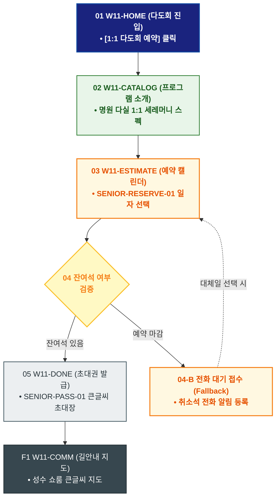

# 🔄 WICKETA 한명석 서비스 흐름도 [성수 명원 쇼룸 1:1 프라이빗 전통 다도회 예약 & 도슨트]

> **프로젝트명**: WICKETA 80℃ 온수 발효티 & 시니어 웰에이징 (Senior Well-Aging)  
> **분석 대상 클라이언트**: [`[가상클라이언트_11] 한명석_은퇴교수_전통다도시니어웰에이징.txt`](file:///C:/Users/user/Desktop/이지희%20에이전트/설계%20마저%20해오기/자동화/03_클라이언트/01_가상_클라이언트/[가상클라이언트_11] 한명석_은퇴교수_전통다도시니어웰에이징.txt)  
> **기준 사이트맵 문서**: [`C:\Users\SBS\Desktop\0819 이지희\한명씩 화면 설계도 진행\자동화\04_설계_및_스토리보드\03_사이트맵\11_한명석\사이트맵_목적5_다도회예약.md`](file:///C:/Users/SBS/Desktop/0819%20%EC%9D%B4%EC%A7%80%ED%9D%AC/%ED%95%9C%EB%AA%85%EC%94%A9%20%ED%99%94%EB%A9%B4%20%EC%84%A4%EA%B3%84%EB%8F%84%20%EC%A7%84%ED%96%89/%EC%9E%90%EB%8F%99%ED%99%94/04_%EC%84%A4%EA%B3%84_%EB%B0%8F_%EC%8A%A4%ED%86%A0%EB%A6%AC%EB%B3%B4%EB%93%9C/03_%EC%82%AC%EC%9D%B4%ED%8A%B8%EB%A7%B5/11_한명석/사이트맵_목적5_다도회예약.md)  
> **접속 목적**: 성수 쇼룸 1:1 다도 세레머니 타임슬롯 예약 및 큰글씨 모바일 초대권  
> **목적별 고유 킬러 기능**: **시니어 1:1 다도회 캘린더 (`SENIOR-RESERVE-01`) & 큰글씨 모바일 초대장 (`SENIOR-PASS-01`)**  
> **작성일자**: 2026년 8월 19일  
> **작성자**: Antigravity UI/UX 설계팀  
> **문서 인코딩**: UTF-8 (유니코드)  

---

## 1. 목적별 핵심 서비스 흐름 개요

성수 플래그십 쇼룸의 명원 다실에서 진행되는 차은채 디렉터와의 1:1 전통 다도 세레머니를 큰글씨 캘린더로 예약하고, 큰글씨 모바일 초대권을 발급받는 품격 있는 오프라인 방문 여정

---

## 2. 목적 맞춤형 가변 여정 스테이지 (Dynamic Journey Stages)

### 🏛️ Stage 1: 명원 다실 1:1 다도회 소개 확인
- **01 다도회 포털 진입 (`W11-HOME`)**: [성수 쇼룸 1:1 다도회 예약] 클릭 ➔ 명원 다실 소개 로딩
- **02 세레머니 프로그램 확인 (`W11-CATALOG`)**: 명원 1:1 다도 세션 및 전담 소믈리에 프로필 큰글씨 열람

### 📅 Stage 2: 큰글씨 예약 캘린더 & 잔여석 검증
- **03 방문 일자/시간 선택 (`W11-ESTIMATE`)**:
  - SENIOR-RESERVE-01 큰글씨 날짜 선택 ➔ `{잔여석 있음?}`
  - `[잔여석 확보]` ➔ 동반 1인 추가 및 예약 접수
  - `[예약 마감(Fallback)]` ➔ 전화 예약 대기 접수 안내

### 🎫 Stage 3: 예약 확정 & 큰글씨 모바일 초대권
- **04 모바일 초대권 발급 (`W11-DONE`)**: SENIOR-PASS-01 20pt 큰글씨 모바일 초대권 발급 ➔ 자녀 공유 지원
- **F1 쇼룸 오시는 길 큰글씨 지도 (`W11-COMM`)**: 성수 쇼룸 큰글씨 길안내 지도 및 주차 안내 발송

---

## 3. 단계별 명세표 (Flow Matrix Table)

| 단계 ID | 단계 명칭 | 사용자 행동 | 화면 접점 | 서비스/시스템 반응 | 매핑 요구사항 | 다음 진입 조건 |
| :---: | :--- | :--- | :--- | :--- | :--- | :--- |
| **01** | 다도회 진입 | [다도회 예약] 클릭 | `W11-HOME` | 명원 다실 쇼케이스 로딩 | `REQ-05 다도회 기획` | 02 프로그램 확인 |
| **02** | 프로그램 확인 | 1:1 세레머니 소개 확인 | `W11-CATALOG` | 다도 커리큘럼 큰글씨 렌더링 | `REQ-05 시향/다도` | 03 캘린더 예약 |
| **03** | 캘린더 예약 | 방문 일자/시간 선택 | `W11-ESTIMATE` | SENIOR-RESERVE-01 잔여석 쿼리 | `REQ-06 큰글씨 예약` | 04 좌석 검증 |
| **04-A** | [성공] 예약 확정 | 연락처 확인 후 [확정] | `W11-ESTIMATE` | 예약 데이터 등록 및 초대권 생성 | `REQ-06 예약 승인` | 05 초대권 발급 |
| **04-B** | [예외] 예약 마감 | 전화 대기 접수 (Fallback) | `W11-ESTIMATE` | 취소석 전화 알림 큐 등록 | `예외 복구` | 대체일 선택 |
| **05** | 초대권 발급 | 모바일 초대권 확인 | `W11-DONE` | SENIOR-PASS-01 큰글씨 초대장 발급 | `REQ-06 모바일 초대권`| F1 길안내 지도 |
| **F1** | 길안내 지도 | 쇼룸 오시는 길 확인 | `W11-COMM` | 큰글씨 쇼룸 지도 및 주차 안내 | `방문 가이드` | 여정 완료 |

---

## 4. 목적별 서비스 흐름도 다이어그램 (Mermaid)

---

## 5. 최종 품질 검토 및 연계 설계 문서

- [x] **고정 템플릿 탈피**: 목적별 특성에 맞춘 독자적 가변 스테이지 및 분기 조건 반영
- [x] **예외 상황(Fallback) 및 루프 완비**: 재고 부족, 결제 실패, 글자수 오류, 연속 출석 등의 분기/복구 파이프라인 수록
- [x] **연계 사이트맵**: [`사이트맵_목적5_다도회예약.md`](file:///C:/Users/SBS/Desktop/0819%20%EC%9D%B4%EC%A7%80%ED%9D%AC/%ED%95%9C%EB%AA%85%EC%94%A9%20%ED%99%94%EB%A9%B4%20%EC%84%A4%EA%B3%84%EB%8F%84%20%EC%A7%84%ED%96%89/%EC%9E%90%EB%8F%99%ED%99%94/04_%EC%84%A4%EA%B3%84_%EB%B0%8F_%EC%8A%A4%ED%86%A0%EB%A6%AC%EB%B3%B4%EB%93%9C/03_%EC%82%AC%EC%9D%B4%ED%8A%B8%EB%A7%B5/11_한명석/사이트맵_목적5_다도회예약.md)
