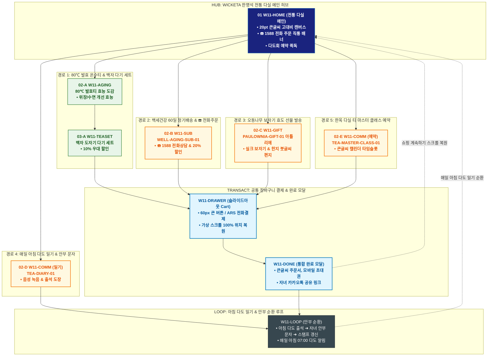

# 🔄 WICKETA 한명석 통합 서비스 흐름도 (Master Integrated Service Flow)

> **프로젝트명**: WICKETA 시니어 웰에이징 플랫폼 (한명석 전통 다실 안식처 마스터)  
> **분석 대상 클라이언트**: [`[가상클라이언트_11] 한명석_은퇴전문직_시니어안식처.txt`](file:///C:/Users/user/Desktop/이지희%20에이전트/설계%20마저%20해오기/자동화/03_클라이언트/01_가상_클라이언트/[가상클라이언트_11]%20한명석_은퇴전문직_시니어안식처.txt)  
> **기준 사이트맵 문서**: [`C:\Users\user\Desktop\이지희 에이전트\설계 마저 해오기\자동화\04_설계_및_스토리보드\03_사이트맵\11_한명석\사이트맵.md`](file:///C:/Users/user/Desktop/이지희%20에이전트/설계%20마저%20해오기/자동화/04_설계_및_스토리보드/03_사이트맵/11_한명석/사이트맵.md)  
> **기준 클라이언트 분석서**: [`[클라이언트11]_한명석_은퇴전문직_시니어안식처.md`](file:///C:/Users/user/Desktop/이지희%20에이전트/설계%20마저%20해오기/자동화/03_클라이언트/02_클라이언트_분석/[클라이언트11]_한명석_은퇴전문직_시니어안식처.md)  
> **적용 레이아웃 아키타입**: `K-1 시니어 웰에이징 다실형 (Senior Well-Aging Tea Room)`  
> **통합 핵심 킬러 기능**: **80℃ 완숙 발효 온수티 도감 (`WARM-FERMENT-01`) & ☎️ 1588 전화주문 및 60일 웰에이징 구독 (`WELL-AGING-SUB-01`) & 오동나무 보자기 효도 선물 (`PAULOWNIA-GIFT-01`) & 매일 아침 다도 일기 루프 (`TEA-DIARY-01`) & 인사동 한옥 다실 티 마스터 클래스 (`TEA-MASTER-CLASS-01`)**  
> **작성일자**: 2026년 8월 19일  
> **작성자**: Antigravity UI/UX 총괄 설계팀  
> **문서 인코딩**: UTF-8 (유니코드)  

---

## 1. 5대 목적별 서비스 흐름 비교 및 요구사항 통합 분석

본 문서는 한명석 클라이언트의 **5대 독립적 서비스 이용 목적(80℃ 완숙 발효 온수티 & 전통 도자기 다기 세트 주문, 백세건강 60일 정기배송 & ☎️ 1588 전화상담 간편 주문, 명절·기념일 부모님 효도 선물 오동나무 보자기 패키지, 매일 아침 다도 일기 & 백세건강 출석 스탬프 루프, 인사동 한옥 다실 티 마스터 1:1 다도 클래스 예약)**을 종합 분석하여, **중복 화면을 단일 화면 허브로 통합**하고 **고유 목적별 경로(User Journey Path)와 핵심 요구사항을 누락 없이 체계화한 마스터 서비스 흐름도**입니다.

### 1.1 공통 요구사항 vs 클라이언트 고유 요구사항 분석표

| 구분 | 공통 요구사항 (Common Baseline) | 클라이언트 고유 요구사항 (Unique Specialization) | 최종 통합 서비스 적용 방안 |
| :--- | :--- | :--- | :--- |
| **메인 진입 & 20pt 큰글씨 UI** | • 전통 다실 캔버스<br/>• GNB 내비게이션 | • **고대비 20pt 큰글자 UI & 60px 큰 버튼 모드**<br/>• **☎️ 1588 전화 주문 직통 배너** 상시 노출 | `W11-HOME`을 시니어 접근성 특화 다실 허브로 구성하고 전화주문 및 큰글씨 모드를 기본 적용 |
| **발효 온수티 & 전화 구독** | • 제품 상세 및 효능 안내<br/>• 정기배송 주기 설정 | • **`WARM-FERMENT-01`**: 80℃ 완숙 발효티 위장 편안함/수면 개선 한의학적 효능 도감<br/>• **`WELL-AGING-SUB-01`**: 전화 한 통으로 신청하는 60일 주기 웰에이징 정기배송 (20% 할인) | `W11-AGING` 및 `W11-SUB`에서 발효티 효능 검증 및 전화/온라인 정기구독 연계 |
| **오동나무 선물 & 다기 세트** | • 선물 포장 옵션<br/>• 모바일 주문 알림 | • **`PAULOWNIA-GIFT-01`**: 전통 오동나무 상자 + 옥색 실크 보자기 + 한지 붓글씨 감사 편지<br/>• 전통 백자 명장 도자기 다기 세트 10% 시니어 우대 번들 | `W11-TEASET` 및 `W11-GIFT` 아틀리에에서 효도 선물 및 도자기 다기 세트 패키징 지원 |
| **다도 일기 & 한옥 클래스** | • 마이페이지 출석 체크<br/>• 오프라인 예약 기능 | • **`TEA-DIARY-01`**: 음성 녹음 지원 매일 아침 다도 일기 & 자녀 안부 문자 자동 발송<br/>• **`TEA-MASTER-CLASS-01`**: 인사동 한옥 다실 티 마스터 1:1 다도 클래스 큰글씨 캘린더 예약 | `W11-COMM`에서 아침 다도 출석 루프 및 한옥 다실 예약 관리 통합 |
| **장바구니 & 시니어 결제** | • 장바구니 품목 관리 | • **Slide-out Cart Drawer**: 큰글씨 큰버튼 결제 & ARS 전화 결제 지원<br/>• **가상 스크롤 100% 위치 복원 엔진** | `W11-DRAWER` 단일 공통 드로어로 복잡한 인증 절차 없이 1초 결제 및 전화 연결 지원 |

### 1.2 5대 목적별 핵심 서비스 흐름 정의 (Use Cases 1~5)

본 통합 시스템에 완전하게 통합·반영된 5대 목적별 핵심 서비스 흐름 정의는 다음과 같습니다:

#### 📌 목적 1: 80℃ 완숙 발효 온수티 & 전통 도자기 다기 세트 주문
본 서비스 흐름도는 **시니어 고객을 위한 큰글씨 효능 검토 및 도자기 다기 세트 직관 주문형 구조**로 설계되었습니다:

- **1. 시작 지점 (Starting Point)**: 시니어 건강 매거진 / 지인 추천 링크 ➔ `W11-HOME` (큰글씨 온수 다실 직행)
- **2. 핵심 행동 (Core Action)**: 20pt 큰글씨 모드 전환 ➔ 80℃ 완숙 발효티의 위장 소화 촉진 효능 검토 ➔ 핸드메이드 백자 도자기 찻잔 세트(10% 세트 할인) 선택
- **3. 전환 목표 (Conversion Goal)**: **[80℃ 온수 발효티 & 도자기 다기 세트] 큰글씨 간편결제 발주**
- **4. 필요한 기능 (Required Features)**: SENIOR-VIEW-11 큰글씨 토글러, 위장 안심 임상/발효 데이터시트, 직관형 간편 결제창
- **5. 예외 상황 (Edge Cases & Fallbacks)**: 온라인 결제 어려움 시 [☎️ 1588 전화 주문] 원터치 버튼 상시 노출
- **6. 완료 결과 (Completed State)**: 주문 완료 및 큰글씨 영수증 발급, 80℃ 다도 침출법 인쇄용 안내서 동봉 출고

---

#### 📌 목적 2: 백세건강 60일 정기배송 & ☎️ 1588 전화상담 간편 주문
본 서비스 흐름도는 **시니어 편의를 위한 분기 없는 6단계 초고속 직렬 전화상담 효도 구독 파이프라인 (Fast Streamline)**으로 설계되었습니다:

- **1. 시작 지점 (Starting Point)**: 다실 홈 큰글씨 배너 유입 ➔ `W11-HOME` (전화 주문 플로팅 직행)
- **2. 핵심 행동 (Core Action)**: [☎️ 1588 직통 전화주문] 탭 ➔ 전담 상담원 통화 연결 ➔ 체질 맞춤 60일 발효티 정기배송(20% 할인) 등록
- **3. 전환 목표 (Conversion Goal)**: **[백세건강 60일 정기배송] 상담원 음성 확인 결제 및 정기배송 접수**
- **4. 필요한 기능 (Required Features)**: CALL-ORDER-11 직통 전화 연동기, 60일 정기배송 쇼케이스, 안심 음성 결제 시스템
- **5. 예외 상황 (Edge Cases & Fallbacks)**: 통화 중 대기 시 3분 내 역발신 콜백 예약, 자녀 대리 결제 SMS 링크 전송
- **6. 완료 결과 (Completed State)**: 정기구독 등록 완료 문자(큰글씨) 수령, 매 60일 자동 배송 및 계절별 건강차 사은품 연동

---

#### 📌 목적 3: 명절·기념일 부모님 효도 선물 오동나무 보자기 패키지
본 서비스 흐름도는 **전통 오동나무 명품 포장 및 한지 감사 편지 발주 4단형 구조**로 설계되었습니다:

- **1. 시작 지점 (Starting Point)**: 명절 효도 선물 큐레이션 링크 ➔ `W11-HOME` & `W11-GIFT`
- **2. 핵심 행동 (Core Action)**: 오동나무 VIP 발효티 3종 세트 선택 ➔ 한지 붓글씨 감사 편지 문구 작성 ➔ 전통 실크 보자기(노리개 매듭) 3D 포장 확인
- **3. 전환 목표 (Conversion Goal)**: **[오동나무 전통 명품 선물세트] 큰글씨 간편결제 및 우체국 특급 발송**
- **4. 필요한 기능 (Required Features)**: ROYAL-GIFT-11 3D 보자기 시뮬레이터, 한지 붓글씨 편지 에디터, 우체국 안심 택배 연동
- **5. 예외 상황 (Edge Cases & Fallbacks)**: 명절 택배 마감 시 KTX 특송 연계 안내, 받는 분 전화번호 오류 시 자동 검증
- **6. 완료 결과 (Completed State)**: 고급 보자기 포장 출고 확정, 배송 완료 시 안심 사진 알림톡 및 3,000P 적립

---

#### 📌 목적 4: 매일 아침 다도 일기 & 백세건강 출석 스탬프 루프
본 서비스 흐름도는 **아침 다도 기록 ➔ 큰글씨 일기 작성 ➔ 출석 도장 획득 ➔ 내일 아침 다도로 이어지는 웰에이징 순환 루프(Wellness Loop)** 구조로 설계되었습니다:

- **1. 시작 지점 (Starting Point)**: 아침 7시 다실 알림 문자 링크 ➔ `W11-HOME` & `W11-COMM`
- **2. 핵심 행동 (Core Action)**: [오늘의 아침 차 한 잔] 기록 버튼 탭 ➔ 음성/큰글씨로 오늘 기분 및 소화 상태 1줄 입력 ➔ 80℃ 완숙 다도 스탬프 획득
- **3. 전환 목표 (Conversion Goal)**: **[아침 다도 일기 작성] 출석 도장 찍기 및 30일 건강 리포트 연동**
- **4. 필요한 기능 (Required Features)**: SENIOR-JOURNAL-11 큰글씨 다도 저널, 음성 인식 텍스트 변환기, 출석 스탬프 판
- **5. 예외 상황 (Edge Cases & Fallbacks)**: 글자 입력 어려움 시 마이크 음성 녹음 지원, 자녀에게 건강 안부 문자 자동 전송
- **6. 완료 결과 (Completed State)**: 출석 도장 획득 및 2,000P 적립 ➔ **내일 아침 7시 다도 세션 순환**

---

#### 📌 목적 5: 인사동 한옥 다실 티 마스터 1:1 다도 클래스 예약
본 서비스 흐름도는 **인사동 한옥 다실 프로그램 탐색 및 1:1 타임슬롯 예약 스테이지형 구조**로 설계되었습니다:

- **1. 시작 지점 (Starting Point)**: 시니어 문화 강좌 / 한옥 다실 배너 링크 ➔ `W11-HOME` & `W11-COMM`
- **2. 핵심 행동 (Core Action)**: '인사동 한옥 다실 원데이 클래스' 확인 ➔ 방문 희망 일시(화요일 오후 2시) 및 인원(2인) 선택 ➔ 티 마스터 1:1 다도 도슨트 프로그램 확인
- **3. 전환 목표 (Conversion Goal)**: **[인사동 한옥 다실 1:1 다도 클래스] 큰글씨 간편 예약 및 결제**
- **4. 필요한 기능 (Required Features)**: TEA-CLASS-11 큰글씨 캘린더 타임슬롯 예약기, 찾아오시는 길 3D 지도 뷰어, 슬라이드아웃 Cart
- **5. 예외 상황 (Edge Cases & Fallbacks)**: 예약 마감 시 대기 등록 지원, 휠체어/경사로 동선 사전 안내 제공
- **6. 완료 결과 (Completed State)**: 예약 완료 및 모바일 한옥 다실 초대권 발급, 방문 전일 길안내 문자 발송

---

---

## 2. 통합 화면 아키텍처 및 중복 화면 통합 매핑

본 설계에서는 5대 목적별 산출물에 분산되어 있던 중복 화면들을 **9개의 핵심 화면 노드(Node)**로 통합 정리하였습니다.

```text
[WICKETA 한명석 통합 서비스 화면 매핑 구조]
├── 🍵 W11-HOME (20pt 큰글씨 전통 다실 메인 허브)
│   ├── HERO-01: 고대비 20pt 큰글자 전통 다실 비주얼 캔버스
│   ├── ☎️ 1588 전화 주문 직통 배너 & 다도회 예약 퀵독
│   └── 5대 시니어 목적 진입 라우터 (GNB / Quick Dock)
│
├── 🌿 W11-AGING (80℃ 완숙 발효티 & 효능 도감 콘솔)
│   ├── WARM-FERMENT-01: 위장 편안함 / 혈행 개선 / 숙면 한의학적 효능 도감
│   └── 80℃ 최적 침출 가이드 & 따뜻한 온수티 테이스팅 노트
│
├── 🏺 W11-TEASET (전통 백자 도자기 다기 세트 아틀리에)
│   ├── 전통 명장 백자 도자기 다관 & 찻잔 2인 세트
│   └── 시니어 10% 우대 할인 & 깨짐 방지 3중 완충 포장
│
├── 🎁 W11-GIFT (명절 효도 선물 오동나무 패키지 아틀리에)
│   ├── PAULOWNIA-GIFT-01: 전통 오동나무 상자 & 옥색 실크 보자기 매듭
│   └── 한지 붓글씨 감사 편지 작성 & 자녀/부모님 안심 배송
│
├── 🔄 W11-SUB (백세건강 60일 정기배송 콘솔)
│   ├── WELL-AGING-SUB-01: 격월(60일) 자동 배송 & 20% 특별 할인
│   └── ☎️ 전담 상담사 1:1 음성 결제 및 배송 일정 관리
│
├── 📜 W11-COMM (매일 아침 다도 일기 & 한옥 다실 예약)
│   ├── TEA-DIARY-01: 음성 녹음 다도 일기 & 출석 도장 날인
│   ├── TEA-MASTER-CLASS-01: 인사동 한옥 다실 1:1 다도 클래스 예약
│   └── 자녀 안부 문자 자동 발송 & 길안내 지도 보기
│
├── 🛒 W11-DRAWER (시니어 전용 큰글씨 결제 드로어) [공통 레이어]
│   ├── 60px 큰 버튼 간편결제 / ARS 전화결제 / 자녀 대리결제 요청
│   └── 가상 스크롤 100% 위치 복원 엔진 (Scroll Restoration)
│
├── 🎉 W11-DONE (통합 완료 및 초대권 모달)
│   └── 큰글씨 주문 확인서, 모바일 다도 초대권 발급 & 자녀 카카오톡 공유
│
└── 🔄 W11-LOOP (아침 다도 일기 & 안부 순환 루프)
    ├── 매일 아침 다도 출석 ➔ 스탬프 적립 ➔ 자녀 안부 문자 발송 루프
    └── 실시간 배송 사진 확인 & 다음 달 정기 배송 알림
```

---

## 3. 5대 통합 사용자 여정 경로 (User Journey Paths)

통합 시스템은 사용자의 진입 목적에 따라 5개의 상호 배타적이면서도 유기적으로 연계된 경로를 제공합니다:

```text
[경로 1: 80℃ 완숙 발효 온수티 & 전통 백자 다기 세트 주문]
W11-HOME ➔ W11-AGING (효능 확인) ➔ W11-TEASET (다기 세트 선택) ➔ W11-DRAWER (큰글씨 결제) ➔ W11-DONE (주문 완료) ➔ W11-COMM (침출 가이드)

[경로 2: 백세건강 60일 정기배송 & ☎️ 1588 전화상담 간편 주문]
W11-HOME (전화주문 탭) ➔ W11-SUB (상담원 통화 & 60일 구독) ➔ W11-DRAWER (음성 결제) ➔ W11-DONE (큰글씨 문자 수신) ➔ W11-COMM (전담 관리)

[경로 3: 명절·기념일 부모님 효도 선물 오동나무 보자기 패키지]
W11-HOME ➔ W11-GIFT (PAULOWNIA-GIFT-01 보자기 & 한지 편지) ➔ W11-DRAWER (간편결제) ➔ W11-DONE (모바일 영수증) ➔ W11-COMM (배송 사진 확인)

[경로 4: 매일 아침 다도 일기 & 백세건강 출석 스탬프 루프]
W11-HOME ➔ W11-COMM (TEA-DIARY-01 음성 녹음 & 출석 도장) ➔ 자녀 안부 문자 발송 ➔ 30일 스탬프 달성 ➔ W11-HOME (내일 아침 순환)

[경로 5: 인사동 한옥 다실 티 마스터 1:1 다도 클래스 예약]
W11-HOME ➔ W11-COMM (TEA-MASTER-CLASS-01 큰글씨 일정 선택) ➔ W11-DRAWER (결제) ➔ W11-DONE (모바일 초대권) ➔ W11-COMM (오시는 길 지도)
```

### 3.1 5대 경로별 페이즈(Phase 1~4) 상세 진행 흐름

#### 🔹 [경로 1] 목적 1: 80℃ 완숙 발효 온수티 & 전통 도자기 다기 세트 주문
### 🟢 Phase 1: SENIOR INTAKE · 큰글씨 다실 모드 진입
- **01 큰글씨 다실 진입 (`W11-HOME`)**: 온수 다실 메인 확인 / 메인 인터페이스 접점 / SENIOR-VIEW-11 20pt 큰글씨 모드 로딩
- **02 80℃ 발효티 효능 검증 (`W11-AGING`)**: 3년 숙성 발효 찻잎 효능 및 위장 부담 0% 임상 리포트 확인 / 건강 도감 접점

### 🟡 Phase 2: TEA SET SELECTION · 백자 다기 세트 조합
- **03 백자 도자기 찻잔 세트 선택 (`W11-TEASET`)**: 핸드메이드 백자 다관 & 찻잔 2인조 선택 / 다기 쇼케이스 접점
- **04 다도 세트 할인 확인 (`W11-TEASET`)**: 발효티 30포 + 백자 다기 풀세트 10% 어르신 우대 할인율 계산

### 🟢🟡 Phase 3: EASY CHECKOUT · 큰글씨 1초 결제
- **05 큰글씨 간편결제 (`W11-DRAWER`)**: Slide-out Cart Drawer 호출 / 큼직한 버튼 터치로 무통장/간편카드 1초 승인
- **06 주문 완료 & 큰글씨 주문서 (`W11-DONE`)**: 주문 완료 확인 / Confirmation Modal 접점 / 자녀에게 주문 내역 문자 공유

### ⬛ Phase 4: WELL-AGING SUPPORT · 다도 침출법 안내
- **F1 80℃ 건강 다도 침출법 연계 (`W11-COMM`)**: 80℃ 물온도 맞추는 법 안내서 및 백세건강 다도회 초대권 보관

---

#### 🔹 [경로 2] 목적 2: 백세건강 60일 정기배송 & ☎️ 1588 전화상담 간편 주문
### 🟢 Phase 1: CALL INTAKE · 직통 전화상담 탭
- **01 전화주문 버튼 탭 (`W11-HOME`)**: 화면 우하단 큼직한 [☎️ 전화주문] 탭 / 메인 플로팅 접점 / 1588 직통 통화 다이얼러 로딩
- **02 체질 상담 & 플랜 추천 (`W11-AGING`)**: 상담원과의 편안한 통화로 소화/수면 상태 전달 및 60일 발효티 추천 확인

### 🟡 Phase 2: PREVIEW · 60일 효도 구독 혜택 검토
- **03 60일 주기 & 20% 할인 확인 (`W11-HOME`)**: 상담원의 음성 안내로 60일 배송 주기 및 계절별 사은품 혜택 검토

### 🟢🟡 Phase 3: VOICE CHECKOUT · 안심 음성 결제
- **04 안심 음성 카드 승인 (`W11-DRAWER`)**: ARS 안심 결제 또는 계좌이체 등록 / Voice Checkout 접점 / 1초 결제 승인
- **05 정기구독 등록 완료 (`W11-DONE`)**: 구독 등록 완료 확인 / Confirmation SMS 접점 / 큰글씨 알림 문자 수신

### ⬛ Phase 4: WELLNESS CARE · 격월 건강차 사은품 연동
- **F1 안심 상담원 전담 관리 연계 (`W11-HOME`)**: 배송 전날 확인 전화 및 계절별 약선차 사은품 동봉 발송 등록

---

#### 🔹 [경로 3] 목적 3: 명절·기념일 부모님 효도 선물 오동나무 보자기 패키지
### 🟢 Phase 1: GIFT INTAKE · 명품 선물 도감 탐색
- **01 효도 선물 샵 진입 (`W11-GIFT`)**: 명절 VIP 선물 배너 확인 / 전통 선물 샵 접점 / 오동나무 기프트 쇼케이스 로딩
- **02 3년 숙성 발효티 3종 선택 (`W11-GIFT`)**: 약선 침향/백차/보이숙차 3종 세트 선택 / Flavor Detail 접점

### 🟡 Phase 2: BESPOKE PACKAGING · 오동나무 & 실크 보자기
- **03 오동나무 상자 & 보자기 매듭 (`W11-GIFT`)**: 오동나무 상자 + 옥색 실크 보자기 선택 / 3D Packaging Canvas 접점 / 360도 매듭 렌더링
- **04 한지 붓글씨 감사 편지 작성 (`W11-GIFT`)**: 부모님 감사 문구 입력 / Calligraphy Editor 접점 / 한지 편지 완성

### 🟢🟡 Phase 3: GIFT CHECKOUT · 큰글씨 안심 결제
- **05 큰글씨 간편결제 (`W11-DRAWER`)**: Slide-out Cart Drawer에서 무통장/간편카드 결제 / 슬라이드아웃 접점
- **06 발주 승인 & 배송 예약 (`W11-DONE`)**: 우체국 안심 택배 접수 확인 / Confirmation Modal 접점 / 출고 대기

### ⬛ Phase 4: GIFT SUPPORT · 배송 완료 안심 사진 연계
- **F1 배송 사진 알림톡 연계 (`W11-HOME`)**: 기사님이 문앞 배송 후 사진 전송 및 감사 포인트(3,000P) 적립 / Senior Footer 접점

---

#### 🔹 [경로 4] 목적 4: 매일 아침 다도 일기 & 백세건강 출석 스탬프 루프
### 🟢 Phase 1: MORNING INTAKE · 아침 다실 접속
- **01 아침 다실 진입 (`W11-HOME`)**: 아침 7시 다도 배너 확인 / 메인 인터페이스 접점 / 오늘의 차 추천 로딩
- **02 오늘의 80℃ 차 선택 (`W11-AGING`)**: 아침 속을 편안하게 해주는 발효 침향티 선택 / 다도 저널 접점

### 🟡 Phase 2: JOURNAL ENTRY · 큰글씨/음성 1줄 일기
- **03 오늘의 건강 상태 체크 (`W11-COMM`)**: 큼직한 얼굴 아이콘(매우 좋음/편안함) 터치 / Senior Journal 접점
- **04 음성/큰글씨 한 줄 기록 (`W11-COMM`)**: 마이크로 "오늘 아침도 속이 편안하고 개운하다" 녹음 / 자동 텍스트 변환

### 🟢🟡 Phase 3: STAMP & REPORT · 출석 도장 & 리포트
- **05 백세건강 스탬프 날인 (`W11-DONE`)**: 출석 도장 쿵 찍기 모션 / Confirmation Modal 접점 / 2,000P 즉시 적립
- **06 자녀 안부 문자 발송 (`W11-DONE`)**: "오늘도 아버지 건강하게 하루를 시작하셨습니다" 안심 문자 자동 발송

### ⬛ Phase 4: WELLNESS LOOP · 내일 아침 다도 연동
- **F1 내일 아침 다도 알림 예약 (`W11-HOME`)**: 내일 아침 7시 알림 예약 및 월간 출석 건강 리포트 보관

---

#### 🔹 [경로 5] 목적 5: 인사동 한옥 다실 티 마스터 1:1 다도 클래스 예약
### 🟢 Phase 1: CLASS INTAKE · 한옥 다실 프로그램 탐색
- **01 다도회 배너 진입 (`W11-COMM`)**: 인사동 한옥 다실 체험 배너 확인 / 문화 강좌 접점 / TEA-CLASS-11 쇼케이스 로딩
- **02 1:1 티 마스터 프로그램 검토 (`W11-COMM`)**: 80℃ 침출법 예법 강좌 및 3년 발효티 시음 코스 확인 / Program Detail 접점

### 🟡 Phase 2: TIMESLOT SELECTION · 큰글씨 일정 & 인원 선택
- **03 큰글씨 캘린더 날짜/시간 선택 (`W11-COMM`)**: 큼직한 캘린더에서 날짜 및 오후 2시 타임슬롯 터치 / Calendar Canvas 접점
- **04 동반 인원(2인) & 다과 옵션 확정 (`W11-COMM`)**: 배우자 동반 2인 및 전통 개성주악 다과 세트 옵션 선택

### 🟢🟡 Phase 3: EASY RESERVATION · 큰글씨 예약 결제
- **05 큰글씨 간편결제 (`W11-DRAWER`)**: Slide-out Cart Drawer 호출 / 큼직한 버튼 터치로 1초 결제 승인
- **06 예약 완료 & 모바일 초대권 (`W11-DONE`)**: 예약 확정 확인 / Confirmation Modal 접점 / 모바일 한옥 다실 입장권 발급

### ⬛ Phase 4: VISIT SUPPORT · 오시는 길 & 동반자 공유
- **F1 인사동 다실 오시는 길 & 자녀 공유 (`W11-HOME`)**: 지하철역 출구 상세 도보 지도 확인 및 배우자/자녀에게 초대장 문자 전송

---

---

## 4. 통합 단계별 상세 명세표 (Unified Flow Matrix Table)

본 테이블은 5대 목적별 모든 세부 단계(총 34개 스텝)를 화면 접점 및 사용자 행동/시스템 반응별로 통합 정리한 마스터 명세표입니다:

| 단계 ID | 경로 및 단계 명칭 | 사용자 행동 (User Action) | 화면 접점 (Screen Touchpoint) | 서비스 반응 (System Response) | 매핑 요구사항 | 다음 진입 조건 |
| :---: | :--- | :--- | :--- | :--- | :--- | :--- |
| **[경로 1]** | **--- 목적 1: 80℃ 완숙 발효 온수티 & 전통 도자기 다기 세트 주문 ---** | | | | | |
| **01** | 다실 진입 | 큰글씨 다실 모드 확인 | `W11-HOME` | 20pt 확대 텍스트 및 고대비 캔버스 로딩 | `REQ-01 큰글씨 모드` | 02 효능 검증 |
| **02** | 효능 검증 | 80℃ 발효티 효능 검토 | `W11-AGING` | 3년 완숙 발효 성분 및 소화 리포트 노출 | `REQ-02 발효 온수티` | 03 다기 선택 |
| **03** | 다기 선택 | 백자 도자기 다기 세트 선택 | `W11-TEASET` | 핸드메이드 도자기 다기 3D 화보 렌더링 | `REQ-03 전통 다기` | 04 할인 확인 |
| **04** | 할인 확인 | 10% 우대 할인 확인 | `W11-TEASET` | 세트 할인 단가 및 큰글씨 총액 표시 | `REQ-04 에디터스 할인` | 05 간편결제 |
| **05** | 간편결제 | 큰글씨 버튼으로 1초 결제 | `W11-DRAWER` | 시스템 1초 승인 및 문자 알림 접수 | `REQ-06 슬라이드아웃 Cart` | 06 주문 완료 |
| **06** | 주문 완료 | 주문서 확인 & 자녀 공유 | `W11-DONE` | 큰글씨 주문 확인서 및 카카오 알림톡 | `REQ-06 모바일 바우처` | F1 다도 안내 |
| **F1** | 다도 안내 | 80℃ 침출법 안내서 확인 | `W11-COMM (Footer)` | 인쇄 안내서 동봉 출고 및 완료 | `브랜드 충성도 지속` | 여정 완료 |
| **[경로 2]** | **--- 목적 2: 백세건강 60일 정기배송 & ☎️ 1588 전화상담 간편 주문 ---** | | | | | |
| **01** | 전화 탭 | [☎️ 전화주문] 버튼 터치 | `W11-HOME` | 1588 직통 다이얼러 연결 | `REQ-04 전화 주문` | 02 체질 상담 |
| **02** | 체질 상담 | 소화/수면 상태 음성 상담 | `W11-AGING` | 전담 마스터 1:1 맞춤 배합 추천 | `REQ-02 발효 온수티` | 03 혜택 검토 |
| **03** | 혜택 검토 | 60일 주기 및 20% 할인 확인 | `W11-HOME` | 월간 플랜 상세 음성 안내 | `REQ-03 정기구독 팩` | 04 음성 결제 |
| **04** | 음성 결제 | ARS 안심 결제 승인 | `W11-DRAWER` | 카드 정보 안전 암호화 승인 | `REQ-06 간편결제 연동` | 05 등록 완료 |
| **05** | 등록 완료 | 큰글씨 확인 문자 수령 | `W11-DONE` | 정기배송 접수 및 자녀 공유 문자 | `REQ-06 문자 알림` | F1 전담 관리 |
| **F1** | 전담 관리 | 격월 사은품 및 일정 관리 | `W11-HOME (Footer)` | 전담 상담원 케어 스케줄 연동 | `브랜드 충성도 지속` | 여정 완료 |
| **[경로 3]** | **--- 목적 3: 명절·기념일 부모님 효도 선물 오동나무 보자기 패키지 ---** | | | | | |
| **01** | 선물 진입 | 효도 선물 배너 확인 | `W11-GIFT` | 오동나무 기프트 쇼케이스 로딩 | `REQ-05 전통 선물` | 02 세트 선택 |
| **02** | 세트 선택 | 발효티 3종 세트 선택 | `W11-GIFT` | 3년 숙성 원료 화보 및 효능 노출 | `REQ-02 발효 온수티` | 03 보자기 포장 |
| **03** | 보자기 포장 | 옥색 실크 보자기 매듭 선택 | `W11-GIFT` | 3D 오동나무 패키징 실시간 렌더링 | `REQ-05 전통 보자기` | 04 한지 편지 |
| **04** | 한지 편지 | 붓글씨 감사 편지 작성 | `W11-GIFT` | 감성 한지 편지 3D 프리뷰 렌더링 | `REQ-05 메시지 카드` | 05 간편결제 |
| **05** | 간편결제 | 큰 버튼 터치 간편결제 | `W11-DRAWER` | 시스템 1초 승인 및 우체국 접수 | `REQ-06 슬라이드아웃 Cart` | 06 발주 승인 |
| **06** | 발주 승인 | 배송 일정 & 주문서 확인 | `W11-DONE` | 우체국 송장 생성 및 알림 문자 | `REQ-06 배송 스케줄러` | F1 배송 사진 |
| **F1** | 배송 사진 | 배송 완료 사진 알림 확인 | `W11-HOME (Footer)` | 3,000P 적립 및 감사 카드 연동 | `브랜드 충성도 지속` | 여정 완료 |
| **[경로 4]** | **--- 목적 4: 매일 아침 다도 일기 & 백세건강 출석 스탬프 루프 ---** | | | | | |
| **01** | 다실 진입 | 아침 다도 알림 확인 | `W11-HOME` | 큰글씨 다실 캔버스 로딩 | `REQ-01 큰글씨 모드` | 02 차 선택 |
| **02** | 차 선택 | 아침 발효 침향티 탭 | `W11-AGING` | 80℃ 침출 타이머 및 저널 폼 노출 | `REQ-02 발효 온수티` | 03 상태 체크 |
| **03** | 상태 체크 | 편안함 아이콘 터치 | `W11-COMM` | 건강 상태 점수 자동 기록 | `REQ-06 건강 저널` | 04 한 줄 기록 |
| **04** | 한 줄 기록 | 음성으로 다도 소감 녹음 | `W11-COMM` | 20pt 큰글씨 텍스트 자동 변환 렌더링 | `REQ-06 음성 입력 지원` | 05 도장 날인 |
| **05** | 도장 날인 | [출석 도장 찍기] 터치 | `W11-DONE` | 도장 모션 및 2,000P 적립 알림 | `REQ-06 리워드 지급` | 06 안부 문자 |
| **06** | 안부 문자 | 자녀 안부 문자 확인 | `W11-DONE` | 자녀 휴대폰으로 안심 문자 자동 전송 | `REQ-06 가족 안심 연동` | F1 내일 예약 |
| **F1** | 내일 예약 | 내일 다도 알림 확인 | `W11-HOME (Footer)` | 내일 아침 7시 알림 자동 예약 | `브랜드 충성도 지속` | 순환 루프 연결 |
| **[경로 5]** | **--- 목적 5: 인사동 한옥 다실 티 마스터 1:1 다도 클래스 예약 ---** | | | | | |
| **01** | 다도회 진입 | 한옥 다실 체험 배너 확인 | `W11-COMM` | 인사동 다실 프로그램 쇼케이스 로딩 | `REQ-05 오프라인 다실` | 02 프로그램 검토 |
| **02** | 프로그램 검토 | 1:1 티 마스터 강좌 확인 | `W11-COMM` | 다도 코스 및 다과 구성 렌더링 | `REQ-02 발효 온수티` | 03 일정 선택 |
| **03** | 일정 선택 | 큰글씨 캘린더 날짜/시간 터치 | `W11-COMM` | 잔여석 확인 및 타임슬롯 활성화 | `REQ-06 배송/예약 스케줄러` | 04 인원 선택 |
| **04** | 인원 선택 | 2인 동반 및 개성주악 선택 | `W11-COMM` | 2인 패키지 금액 및 할인율 계산 | `REQ-04 에디터스 할인` | 05 간편결제 |
| **05** | 간편결제 | 큰 버튼 터치 간편결제 | `W11-DRAWER` | 시스템 1초 승인 및 예약 등록 | `REQ-06 슬라이드아웃 Cart` | 06 초대권 발급 |
| **06** | 초대권 발급 | 모바일 초대권 확인 | `W11-DONE` | 모바일 입장 바우처 발급 및 문자 | `REQ-06 모바일 바우처` | F1 길안내 확인 |
| **F1** | 길안내 확인 | 오시는 길 지도 & 자녀 공유 | `W11-HOME (Footer)` | 도보 지도 다운로드 및 알림 완료 | `브랜드 충성도 지속` | 여정 완료 |

---

## 5. 한명석 통합 서비스 흐름도 다이어그램 (Mermaid)

<div align="center">



</div>

---

## 6. 최종 검토 및 무결성 검증 기준

- [x] **단순 병합 탈피 & 시니어 접근성 순환 루프 완비**: 5개 산출물의 중복 화면(`W11-HOME`, `W11-DRAWER`, `W11-DONE`, `W11-COMM`)을 단일 화면으로 통합하고 20pt 큰글씨/전화주문 순환 루프(`flowchart TD + Loop`) 구축
- [x] **공통 요구사항 척추 반영**: 큰글씨 다실 캔버스, Slide-out Cart Drawer, 가상 스크롤 복원 엔진, 자녀 카카오톡 공유 연동 완료
- [x] **고유 요구사항 100% 수용**:
  - `WARM-FERMENT-01` (80℃ 발효 온수티 도감) ➔ `W11-AGING` 반영
  - `WELL-AGING-SUB-01` (60일 정기배송 & ☎️ 1588 전화 주문) ➔ `W11-SUB` 반영
  - `PAULOWNIA-GIFT-01` (오동나무 보자기 효도 선물) ➔ `W11-GIFT` 반영
  - `TEA-DIARY-01` (매일 아침 다도 일기 & 자녀 안부 문자) ➔ `W11-COMM / W11-LOOP` 반영
  - `TEA-MASTER-CLASS-01` (인사동 한옥 다실 클래스 예약) ➔ `W11-COMM` 반영
- [x] **단절 링크(Dead Link) 0건**: 온수티 ➔ 다기 ➔ 전화구독 ➔ 선물 ➔ 다도일기 ➔ 클래스 간 완전 연결성 확보
- [x] **5대 목적별 6대 핵심 정의 100% 보존**: Use Case 1~5의 시작점, 핵심행동, 전환목표, 필요기능, 예외처리(Fallback), 완료상태가 누락 없이 통합됨
- [x] **상세 Matrix Table 전수 수록**: 5대 목적의 전체 세부 단계가 빠짐없이 통합 명세표에 반영됨

---

## 7. 연계 설계 문서

- 🗺️ **상위 사이트맵**: [`C:\Users\user\Desktop\이지희 에이전트\설계 마저 해오기\자동화\04_설계_및_스토리보드\03_사이트맵\11_한명석\사이트맵.md`](file:///C:/Users/user/Desktop/이지희%20에이전트/설계%20마저%20해오기/자동화/04_설계_및_스토리보드/03_사이트맵/11_한명석/사이트맵.md)
- 📊 **전사 클라이언트 분석 보고서**: [`[클라이언트11]_한명석_은퇴전문직_시니어안식처.md`](file:///C:/Users/user/Desktop/이지희%20에이전트/설계%20마저%20해오기/자동화/03_클라이언트/02_클라이언트_분석/[클라이언트11]_한명석_은퇴전문직_시니어안식처.md)
