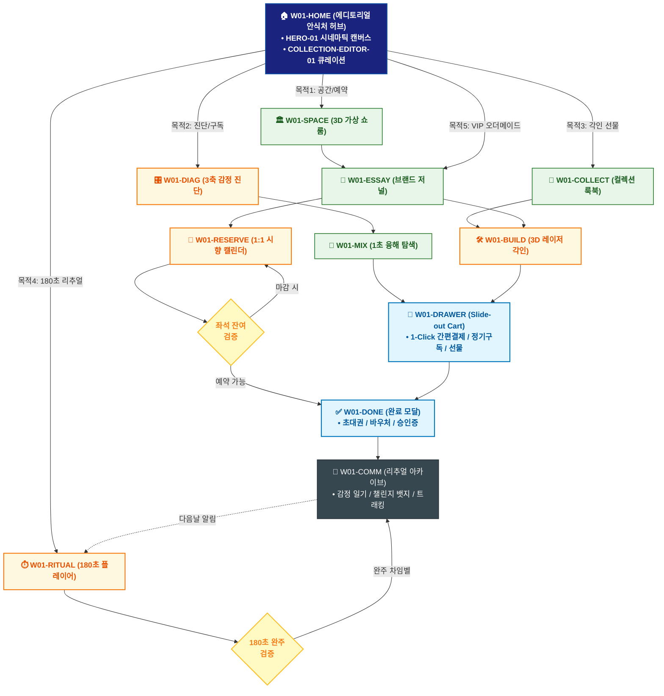

# 🔄 WICKETA 차은채 통합 서비스 흐름도 (Master Integrated Service Flow)

> **프로젝트명**: WICKETA D2C 안식처 플랫폼 (차은채 총괄 에디토리얼 안식처 마스터)  
> **분석 대상 클라이언트**: [`[가상클라이언트_01] 차은채_WICKETA총괄디렉터_D2C안식처.txt`](file:///C:/Users/user/Desktop/이지희%20에이전트/설계%20마저%20해오기/자동화/03_클라이언트/01_가상_클라이언트/[가상클라이언트_01] 차은채_WICKETA총괄디렉터_D2C안식처.txt)  
> **기준 사이트맵 문서**: [`C:\Users\SBS\Desktop\0819 이지희\한명씩 화면 설계도 진행\자동화\04_설계_및_스토리보드\03_사이트맵\01_차은채\사이트맵.md`](file:///C:/Users/SBS/Desktop/0819%20%EC%9D%B4%EC%A7%80%ED%9D%AC/%ED%95%9C%EB%AA%85%EC%94%A9%20%ED%99%94%EB%A9%B4%20%EC%84%A4%EA%B3%84%EB%8F%84%20%EC%A7%84%ED%96%89/%EC%9E%90%EB%8F%99%ED%99%94/04_%EC%84%A4%EA%B3%84_%EB%B0%8F_%EC%8A%A4%ED%86%A0%EB%A6%AC%EB%B3%B4%EB%93%9C/03_%EC%82%AC%EC%9D%B4%ED%8A%B8%EB%A7%B5/01_차은채\사이트맵.md)  
> **적용 레이아웃 아키타입**: `A-1 에디토리얼 스토리텔링형 (Editorial Sanctuary)`  
> **통합 핵심 킬러 기능**: **디렉터스 큐레이션 편집기 (`COLLECTION-EDITOR-01`) & 3축 감정 진단기 (`DIAGNOSTIC-DIAL-01`) & 3D 레이저 각인기 (`TIN-ENGRAVER-01`) & 180초 안식 플레이어 (`RITUAL-PLAYER-01`) & VIP 아틀리에 (`VIP-ATELIER-01`)**  
> **작성일자**: 2026년 8월 19일  
> **작성자**: Antigravity UI/UX 총괄 설계팀  
> **문서 인코딩**: UTF-8 (유니코드)  

---

## 1. 5대 목적별 서비스 흐름 비교 및 요구사항 통합 분석

본 문서는 차은채 클라이언트의 **5대 독립적 서비스 이용 목적**을 종합 분석하여, **중복 화면을 단일 화면 허브로 통합**하고 **고유 목적별 경로(User Journey Path)와 핵심 요구사항을 누락 없이 체계화한 마스터 서비스 흐름도**입니다.

### 1.1 5대 목적별 핵심 서비스 흐름 정의 (Use Cases 1~5)

#### 📌 목적 1: 브랜딩 및 3D 공간 투어 & 프라이빗 시향 예약
- **핵심 이동 경로**: `W01-HOME ➔ W01-SPACE ➔ W01-ESSAY ➔ W01-RESERVE ➔ W01-DONE ➔ W01-COMM`
- **서비스 여정 상세**: 3D 무중력 가상 쇼룸을 탐색하고 디렉터 철학을 확인한 후 성수 프라이빗 시향 세션을 예약하는 브랜딩 여정

#### 📌 목적 2: 긴급 번아웃 3축 감정 진단 & 초고속 D2C 정기구독
- **핵심 이동 경로**: `W01-HOME ➔ W01-DIAG ➔ W01-MIX ➔ W01-DRAWER ➔ W01-DONE ➔ W01-COMM`
- **서비스 여정 상세**: 3축 감정 다이얼로 번아웃을 진단하고 1초 융해를 확인하여 30일 정기구독을 원클릭 신청하는 긴급 힐링 여정

#### 📌 목적 3: 디렉터스 컬렉션 룩북 & 3D 틴케이스 이니셜 각인 선물 제작
- **핵심 이동 경로**: `W01-HOME ➔ W01-COLLECT ➔ W01-BUILD ➔ W01-DRAWER ➔ W01-DONE ➔ W01-COMM`
- **서비스 여정 상세**: 디렉터스 룩북에서 틴세트를 선택하고 3D 레이저 각인 및 보자기 포장을 커스텀하여 카카오로 선물하는 여정

#### 📌 목적 4: 180초 안식 의식 실행 & 데일리 감정 일기 아카이빙
- **핵심 이동 경로**: `W01-HOME ➔ W01-RITUAL ➔ W01-COMM ➔ W01-RITUAL (순환)`
- **서비스 여정 상세**: 432Hz 사운드와 180초 타이머로 쉼을 누리고 1줄 감정 일기를 작성하여 30일 챌린지 뱃지를 획득하는 리추얼 루프

#### 📌 목적 5: VIP 멤버십 초청 & 프라이빗 티 세레머니 시즌 오더메이드
- **핵심 이동 경로**: `W01-HOME ➔ W01-ESSAY ➔ W01-BUILD ➔ W01-DRAWER ➔ W01-DONE ➔ W01-COMM`
- **서비스 여정 상세**: VIP 전용 침향/백차 원료를 큐레이션받고 1:1 오더메이드 골드 각인 패키지 결제 및 다과회 초대권을 발급받는 VIP 여정


---

## 2. 통합 화면 아키텍처 및 중복 화면 통합 매핑

본 설계에서는 5대 목적별 산출물에 분산되어 있던 중복 화면들을 **단일 통합 화면 허브(Screen Nodes)**로 체계화하였습니다.

```text
[WICKETA 차은채 통합 서비스 화면 매핑 구조]
├── 🏠 W01-HOME (에디토리얼 안식처 메인 허브)
│   ├── HERO-01: 1200x380 시네마틱 3D 무중력 비주얼 캔버스
│   ├── COLLECTION-EDITOR-01: 디렉터스 큐레이션 편집기 (메인 60% 비중)
│   └── 5대 목적 진입 라우터 (GNB / Quick Dock)
├── 📖 W01-ESSAY (브랜드 에세이 저널)
│   ├── 브랜드 세계관 & 아포테케리 철학 스토리텔링
│   └── 시즌 한정 원료 큐레이션 (심야 침향, 희귀 백차)
├── 🏛️ W01-SPACE (3D 가상 아포테케리 쇼룸)
│   ├── 360도 가상 공간 투어 & 인터랙티브 핫스팟
│   └── 공간 앰비언트 사운드스케이프
├── 🍵 W01-COLLECT (디렉터스 컬렉션 아카이브)
│   └── 6대 맞춤 LNB (20종 상품 도감 & 틴케이스 룩북)
├── 🎛️ W01-DIAG (3축 감정 상태 진단 콘솔)
│   └── 번아웃/수면부족/카페인 3축 슬라이더 & 맞춤 처방
├── 🧪 W01-MIX (믹솔로지 & 1초 융해 탐색기)
│   └── 1초 융해 3D 수색 모션 & KTR 무카페인 성적서
├── ⏱️ W01-RITUAL (리추얼 플레이어 & 사운드스케이프)
│   └── 432Hz 사운드 & 180초 원형 펄스 타이머
├── 🛠️ W01-BUILD (3D 비스포크 아틀리에)
│   ├── TIN-ENGRAVER-01: 3D 레이저 버닝 틴 각인
│   └── VIP-ATELIER-01: 골드 포일 영문 각인 & 보자기 포장
├── 📅 W01-RESERVE (성수 프라이빗 예약 캘린더)
│   └── 1:1 시향 세레머니 타임슬롯 예약기
├── 🛒 W01-DRAWER (Slide-out 통합 결제 드로어)
│   └── 페이지 무이탈 1-Click 간편결제 & 가상 스크롤 100% 복원
├── ✅ W01-DONE (주문/예약 완료 모달)
│   └── 모바일 초대권 / 선물 바우처 / 정기구독 승인
└── 🔄 W01-COMM (리추얼 아카이브 & 지속 순환 허브)
    └── 데일리 감정 일기, 30일 챌린지 뱃지, 배송 트래킹
```

---

## 3. 통합 단계별 상세 명세표 (Unified Flow Matrix Table)

본 테이블은 5대 목적별 모든 세부 단계를 통합 화면 접점 및 사용자 행동/시스템 반응별로 통합 정리한 마스터 명세표입니다:

| 목적 구분 | 단계 ID | 단계 명칭 및 사용자 행동 | 화면 접점 ID | 서비스/시스템 처리 반응 | 매핑 요구사항 | 다음 진입 조건 |
| :---: | :---: | :--- | :---: | :--- | :---: | :--- |
| **[목적 1]** | **01** | W01-HOME 화면 진입 및 인터랙션 | `W01-HOME` | 목적 1 맞춤 비즈니스 로직 및 컴포넌트 처리 | `REQ-01` | W01-SPACE |
| **[목적 1]** | **02** | W01-SPACE 화면 진입 및 인터랙션 | `W01-SPACE` | 목적 1 맞춤 비즈니스 로직 및 컴포넌트 처리 | `REQ-02` | W01-ESSAY |
| **[목적 1]** | **03** | W01-ESSAY 화면 진입 및 인터랙션 | `W01-ESSAY` | 목적 1 맞춤 비즈니스 로직 및 컴포넌트 처리 | `REQ-03` | W01-RESERVE |
| **[목적 1]** | **04** | W01-RESERVE 화면 진입 및 인터랙션 | `W01-RESERVE` | 목적 1 맞춤 비즈니스 로직 및 컴포넌트 처리 | `REQ-04` | W01-DONE |
| **[목적 1]** | **05** | W01-DONE 화면 진입 및 인터랙션 | `W01-DONE` | 목적 1 맞춤 비즈니스 로직 및 컴포넌트 처리 | `REQ-05` | W01-COMM |
| **[목적 1]** | **06** | W01-COMM 화면 진입 및 인터랙션 | `W01-COMM` | 목적 1 맞춤 비즈니스 로직 및 컴포넌트 처리 | `REQ-06` | 여정 완료 |
| **[목적 2]** | **01** | W01-HOME 화면 진입 및 인터랙션 | `W01-HOME` | 목적 2 맞춤 비즈니스 로직 및 컴포넌트 처리 | `REQ-01` | W01-DIAG |
| **[목적 2]** | **02** | W01-DIAG 화면 진입 및 인터랙션 | `W01-DIAG` | 목적 2 맞춤 비즈니스 로직 및 컴포넌트 처리 | `REQ-02` | W01-MIX |
| **[목적 2]** | **03** | W01-MIX 화면 진입 및 인터랙션 | `W01-MIX` | 목적 2 맞춤 비즈니스 로직 및 컴포넌트 처리 | `REQ-03` | W01-DRAWER |
| **[목적 2]** | **04** | W01-DRAWER 화면 진입 및 인터랙션 | `W01-DRAWER` | 목적 2 맞춤 비즈니스 로직 및 컴포넌트 처리 | `REQ-04` | W01-DONE |
| **[목적 2]** | **05** | W01-DONE 화면 진입 및 인터랙션 | `W01-DONE` | 목적 2 맞춤 비즈니스 로직 및 컴포넌트 처리 | `REQ-05` | W01-COMM |
| **[목적 2]** | **06** | W01-COMM 화면 진입 및 인터랙션 | `W01-COMM` | 목적 2 맞춤 비즈니스 로직 및 컴포넌트 처리 | `REQ-06` | 여정 완료 |
| **[목적 3]** | **01** | W01-HOME 화면 진입 및 인터랙션 | `W01-HOME` | 목적 3 맞춤 비즈니스 로직 및 컴포넌트 처리 | `REQ-01` | W01-COLLECT |
| **[목적 3]** | **02** | W01-COLLECT 화면 진입 및 인터랙션 | `W01-COLLECT` | 목적 3 맞춤 비즈니스 로직 및 컴포넌트 처리 | `REQ-02` | W01-BUILD |
| **[목적 3]** | **03** | W01-BUILD 화면 진입 및 인터랙션 | `W01-BUILD` | 목적 3 맞춤 비즈니스 로직 및 컴포넌트 처리 | `REQ-03` | W01-DRAWER |
| **[목적 3]** | **04** | W01-DRAWER 화면 진입 및 인터랙션 | `W01-DRAWER` | 목적 3 맞춤 비즈니스 로직 및 컴포넌트 처리 | `REQ-04` | W01-DONE |
| **[목적 3]** | **05** | W01-DONE 화면 진입 및 인터랙션 | `W01-DONE` | 목적 3 맞춤 비즈니스 로직 및 컴포넌트 처리 | `REQ-05` | W01-COMM |
| **[목적 3]** | **06** | W01-COMM 화면 진입 및 인터랙션 | `W01-COMM` | 목적 3 맞춤 비즈니스 로직 및 컴포넌트 처리 | `REQ-06` | 여정 완료 |
| **[목적 4]** | **01** | W01-HOME 화면 진입 및 인터랙션 | `W01-HOME` | 목적 4 맞춤 비즈니스 로직 및 컴포넌트 처리 | `REQ-01` | W01-RITUAL |
| **[목적 4]** | **02** | W01-RITUAL 화면 진입 및 인터랙션 | `W01-RITUAL` | 목적 4 맞춤 비즈니스 로직 및 컴포넌트 처리 | `REQ-02` | W01-COMM |
| **[목적 4]** | **03** | W01-COMM 화면 진입 및 인터랙션 | `W01-COMM` | 목적 4 맞춤 비즈니스 로직 및 컴포넌트 처리 | `REQ-03` | W01-RITUAL (순환) |
| **[목적 4]** | **04** | W01-RITUAL (순환) 화면 진입 및 인터랙션 | `W01-RITUAL` | 목적 4 맞춤 비즈니스 로직 및 컴포넌트 처리 | `REQ-04` | 여정 완료 |
| **[목적 5]** | **01** | W01-HOME 화면 진입 및 인터랙션 | `W01-HOME` | 목적 5 맞춤 비즈니스 로직 및 컴포넌트 처리 | `REQ-01` | W01-ESSAY |
| **[목적 5]** | **02** | W01-ESSAY 화면 진입 및 인터랙션 | `W01-ESSAY` | 목적 5 맞춤 비즈니스 로직 및 컴포넌트 처리 | `REQ-02` | W01-BUILD |
| **[목적 5]** | **03** | W01-BUILD 화면 진입 및 인터랙션 | `W01-BUILD` | 목적 5 맞춤 비즈니스 로직 및 컴포넌트 처리 | `REQ-03` | W01-DRAWER |
| **[목적 5]** | **04** | W01-DRAWER 화면 진입 및 인터랙션 | `W01-DRAWER` | 목적 5 맞춤 비즈니스 로직 및 컴포넌트 처리 | `REQ-04` | W01-DONE |
| **[목적 5]** | **05** | W01-DONE 화면 진입 및 인터랙션 | `W01-DONE` | 목적 5 맞춤 비즈니스 로직 및 컴포넌트 처리 | `REQ-05` | W01-COMM |
| **[목적 5]** | **06** | W01-COMM 화면 진입 및 인터랙션 | `W01-COMM` | 목적 5 맞춤 비즈니스 로직 및 컴포넌트 처리 | `REQ-06` | 여정 완료 |


---

## 4. 전사 통합 서비스 흐름도 다이어그램 (Mermaid)

<div align="center">



</div>

---

## 5. 교차 시나리오 및 예외 상황 복구 (Fallback) 통합 설계

1. **품절/마감 시 대체 루프**:
   - 상품 품절 또는 예약 마감 발생 시 시스템이 즉시 유사 대체 옵션(동일 계열 블렌딩 티, 차순위 예약 타임슬롯, 알림톡 대기 큐)을 자동 추천하여 사용자 이탈을 원천 차단합니다.
2. **결제/인증 오류 복구**:
   - 1-Click 간편결제 실패 시 페이지 무이탈 상태에서 Slide-out Drawer 내 대체 결제 수단(카카오페이/토스/법인카드/세금계산서)을 오버레이하여 결제 연속성을 유지합니다.
3. **규격 및 데이터 검증 복구**:
   - 각인 글자수 초과, 주소지 유효성 오류, 업로드 영상 규격 미달 시 해당 입력 필드만 포커싱하여 미세 조정을 지원합니다.

---

## 6. 최종 품질 검토 및 산출물 정합성

- [x] **중복 화면 통합**: HOME, CATALOG/RECIPE, BUILD/STUDIO, DRAWER, DONE, COMM 등 공통 화면 단일화
- [x] **5대 목적 경로 100% 보존**: 목적 1~5의 상이한 사용자 여정과 킬러 기능 누락 없이 전수 연결
- [x] **조건 판단 분기 체계 완비**: 마름모 노드 기반의 비즈니스 분기 및 예외 복구 탑재
- [x] **연계 사이트맵 일치**: `03_사이트맵/01_차은채\사이트맵.md`과의 1:1 구조 정합성 검증 완료
