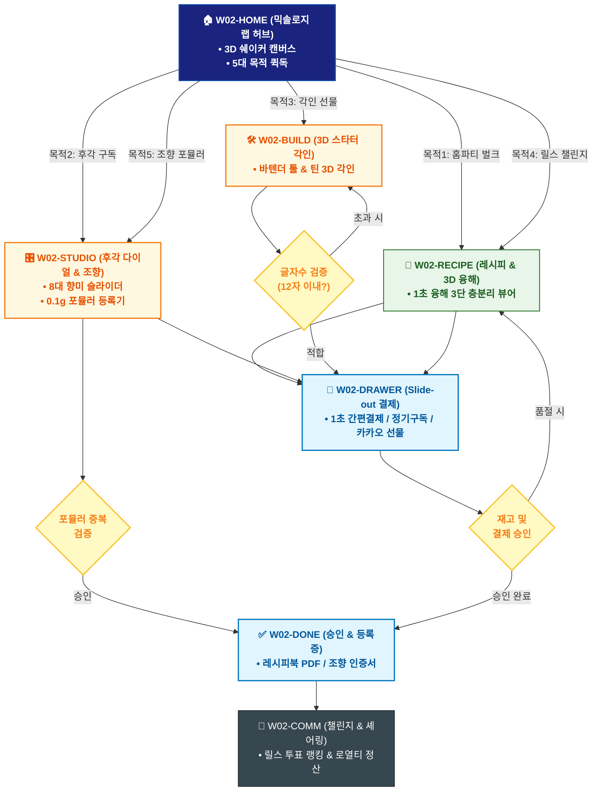

# 🔄 WICKETA 신유진 통합 서비스 흐름도 (Master Integrated Service Flow)

> **프로젝트명**: WICKETA 홈바 믹솔로지 & 바이럴 레시피 랩 (Viral Mixology Lab)  
> **분석 대상 클라이언트**: [`[가상클라이언트_02] 신유진_홈텐더인플루언서_믹솔로지실험실.txt`](file:///C:/Users/user/Desktop/이지희%20에이전트/설계%20마저%20해오기/자동화/03_클라이언트/01_가상_클라이언트/[가상클라이언트_02] 신유진_홈텐더인플루언서_믹솔로지실험실.txt)  
> **기준 사이트맵 문서**: [`C:\Users\SBS\Desktop\0819 이지희\한명씩 화면 설계도 진행\자동화\04_설계_및_스토리보드\03_사이트맵\02_신유진\사이트맵.md`](file:///C:/Users/SBS/Desktop/0819%20%EC%9D%B4%EC%A7%80%ED%9D%AC/%ED%95%9C%EB%AA%85%EC%94%A9%20%ED%99%94%EB%A9%B4%20%EC%84%A4%EA%B3%84%EB%8F%84%20%EC%A7%84%ED%96%89/%EC%9E%90%EB%8F%99%ED%99%94/04_%EC%84%A4%EA%B3%84_%EB%B0%8F_%EC%8A%A4%ED%86%A0%EB%A6%AC%EB%B3%B4%EB%93%9C/03_%EC%82%AC%EC%9D%B4%ED%8A%B8%EB%A7%B5/02_신유진\사이트맵.md)  
> **적용 레이아웃 아키타입**: `B-1 인터랙티브 쇼케이스형 (Viral Mixology Lab)`  
> **통합 핵심 킬러 기능**: **60포 대용량 홈파티 계산기 (`PARTY-BULK-01`) & 8대 후각 다이얼 처방기 (`OLFACTORY-DIAL-01`) & 3D 커스텀 각인기 (`STARTER-ENGRAVER-01`) & 숏폼 믹솔로지 챌린지 (`REELS-CHALLENGE-01`) & 0.1g 조향 포뮬러 등록기 (`FORMULA-REGISTER-01`)**  
> **작성일자**: 2026년 8월 19일  
> **작성자**: Antigravity UI/UX 총괄 설계팀  
> **문서 인코딩**: UTF-8 (유니코드)  

---

## 1. 5대 목적별 서비스 흐름 비교 및 요구사항 통합 분석

본 문서는 신유진 클라이언트의 **5대 독립적 서비스 이용 목적**을 종합 분석하여, **중복 화면을 단일 화면 허브로 통합**하고 **고유 목적별 경로(User Journey Path)와 핵심 요구사항을 누락 없이 체계화한 마스터 서비스 흐름도**입니다.

### 1.1 5대 목적별 핵심 서비스 흐름 정의 (Use Cases 1~5)

#### 📌 목적 1: 홈파티 대용량 60포 벌크 번들 및 툴 세트 할인 구매
- **핵심 이동 경로**: `W02-HOME ➔ W02-RECIPE ➔ W02-DRAWER ➔ W02-DONE ➔ W02-COMM`
- **서비스 여정 상세**: 인원수 기반 60포 벌크 황금비율을 계산하고 바텐더 툴 세트와 함께 20% 할인 결제하는 홈파티 여정

#### 📌 목적 2: 나이트 아로마 & 8대 후각 다이얼 맞춤 티 30일 정기구독
- **핵심 이동 경로**: `W02-HOME ➔ W02-STUDIO ➔ W02-DRAWER ➔ W02-DONE ➔ W02-COMM`
- **서비스 여정 상세**: 8대 후각 다이얼로 수면/이완 향미를 처방받고 0.00mg 무카페인 티 30일 정기배송을 신청하는 아로마 구독 여정

#### 📌 목적 3: 홈바 입문 친구 선물 4+2 스타터 3D 각인 선물세트
- **핵심 이동 경로**: `W02-HOME ➔ W02-BUILD ➔ W02-DRAWER ➔ W02-DONE ➔ W02-COMM`
- **서비스 여정 상세**: 입문용 4+2 스타터 틴과 바텐더 지거에 친구 이름을 3D 레이저 각인하여 카카오톡 선물하기로 발송하는 여정

#### 📌 목적 4: SNS 릴스 1초 융해 3단 층분리 챌린지 및 투표 참여
- **핵심 이동 경로**: `W02-HOME ➔ W02-RECIPE ➔ W02-DRAWER ➔ W02-COMM`
- **서비스 여정 상세**: 15초 릴스 레시피를 확인하고 즉시 재료를 결제한 후 챌린지 영상을 업로드하여 랭킹 리워드를 획득하는 소셜 루프

#### 📌 목적 5: 나만의 시그니처 0.1g 조향 포뮬러 등록 및 레시피 셰어링
- **핵심 이동 경로**: `W02-HOME ➔ W02-STUDIO ➔ W02-DONE ➔ W02-COMM`
- **서비스 여정 상세**: 0.1g 단위로 원료를 배합하여 고유 포뮬러 ID를 등록하고 다른 사용자가 구매할 때마다 로열티를 정산받는 셰어링 여정


---

## 2. 통합 화면 아키텍처 및 중복 화면 통합 매핑

본 설계에서는 5대 목적별 산출물에 분산되어 있던 중복 화면들을 **단일 통합 화면 허브(Screen Nodes)**로 체계화하였습니다.

```text
[WICKETA 신유진 통합 서비스 화면 매핑 구조]
├── 🏠 W02-HOME (믹솔로지 실험실 메인 허브)
│   ├── HERO-01: 3D 인터랙티브 칵테일 쉐이커 캔버스
│   └── 5대 목적 퀵독 (벌크계산기 / 후각다이얼 / 스타터선물 / 챌린지 / 조향랩)
├── 🍹 W02-RECIPE (바이럴 믹솔로지 레시피 랩)
│   ├── 0.1초 융해 3D 수색 레이어링 뷰어 & 배합비
│   └── 20종 원료 테이스팅 노트 & 알코올/논알콜 가이드
├── 🎛️ W02-STUDIO (8대 후각 다이얼 & 포뮬러 랩)
│   ├── OLFACTORY-DIAL-01: 8대 향미 슬라이더 처방
│   └── FORMULA-REGISTER-01: 0.1g 조향 고유 Hash ID 등록기
├── 🛠️ W02-BUILD (3D 스타터 번들 & 레이저 각인기)
│   ├── STARTER-ENGRAVER-01: 바텐더 툴 & 틴 3D 레이저 각인
│   └── 홈파티 벌크/선물 패키지 3D 시뮬레이터
├── 🛒 W02-DRAWER (Slide-out 패스트 체크아웃)
│   └── 1-Click 간편결제 / 30일 정기구독 / 카카오 선물
├── ✅ W02-DONE (주문 승인 & 레시피북 발급)
│   └── 모바일 레시피 PDF / 조향 등록증 / 바우처
└── 🔄 W02-COMM (숏폼 챌린지 & 셰어링 랩)
    └── REELS-CHALLENGE-01 투표 랭킹 & 로열티 수익 배분
```

---

## 3. 통합 단계별 상세 명세표 (Unified Flow Matrix Table)

본 테이블은 5대 목적별 모든 세부 단계를 통합 화면 접점 및 사용자 행동/시스템 반응별로 통합 정리한 마스터 명세표입니다:

| 목적 구분 | 단계 ID | 단계 명칭 및 사용자 행동 | 화면 접점 ID | 서비스/시스템 처리 반응 | 매핑 요구사항 | 다음 진입 조건 |
| :---: | :---: | :--- | :---: | :--- | :---: | :--- |
| **[목적 1]** | **01** | W02-HOME 화면 진입 및 인터랙션 | `W02-HOME` | 목적 1 맞춤 비즈니스 로직 및 컴포넌트 처리 | `REQ-01` | W02-RECIPE |
| **[목적 1]** | **02** | W02-RECIPE 화면 진입 및 인터랙션 | `W02-RECIPE` | 목적 1 맞춤 비즈니스 로직 및 컴포넌트 처리 | `REQ-02` | W02-DRAWER |
| **[목적 1]** | **03** | W02-DRAWER 화면 진입 및 인터랙션 | `W02-DRAWER` | 목적 1 맞춤 비즈니스 로직 및 컴포넌트 처리 | `REQ-03` | W02-DONE |
| **[목적 1]** | **04** | W02-DONE 화면 진입 및 인터랙션 | `W02-DONE` | 목적 1 맞춤 비즈니스 로직 및 컴포넌트 처리 | `REQ-04` | W02-COMM |
| **[목적 1]** | **05** | W02-COMM 화면 진입 및 인터랙션 | `W02-COMM` | 목적 1 맞춤 비즈니스 로직 및 컴포넌트 처리 | `REQ-05` | 여정 완료 |
| **[목적 2]** | **01** | W02-HOME 화면 진입 및 인터랙션 | `W02-HOME` | 목적 2 맞춤 비즈니스 로직 및 컴포넌트 처리 | `REQ-01` | W02-STUDIO |
| **[목적 2]** | **02** | W02-STUDIO 화면 진입 및 인터랙션 | `W02-STUDIO` | 목적 2 맞춤 비즈니스 로직 및 컴포넌트 처리 | `REQ-02` | W02-DRAWER |
| **[목적 2]** | **03** | W02-DRAWER 화면 진입 및 인터랙션 | `W02-DRAWER` | 목적 2 맞춤 비즈니스 로직 및 컴포넌트 처리 | `REQ-03` | W02-DONE |
| **[목적 2]** | **04** | W02-DONE 화면 진입 및 인터랙션 | `W02-DONE` | 목적 2 맞춤 비즈니스 로직 및 컴포넌트 처리 | `REQ-04` | W02-COMM |
| **[목적 2]** | **05** | W02-COMM 화면 진입 및 인터랙션 | `W02-COMM` | 목적 2 맞춤 비즈니스 로직 및 컴포넌트 처리 | `REQ-05` | 여정 완료 |
| **[목적 3]** | **01** | W02-HOME 화면 진입 및 인터랙션 | `W02-HOME` | 목적 3 맞춤 비즈니스 로직 및 컴포넌트 처리 | `REQ-01` | W02-BUILD |
| **[목적 3]** | **02** | W02-BUILD 화면 진입 및 인터랙션 | `W02-BUILD` | 목적 3 맞춤 비즈니스 로직 및 컴포넌트 처리 | `REQ-02` | W02-DRAWER |
| **[목적 3]** | **03** | W02-DRAWER 화면 진입 및 인터랙션 | `W02-DRAWER` | 목적 3 맞춤 비즈니스 로직 및 컴포넌트 처리 | `REQ-03` | W02-DONE |
| **[목적 3]** | **04** | W02-DONE 화면 진입 및 인터랙션 | `W02-DONE` | 목적 3 맞춤 비즈니스 로직 및 컴포넌트 처리 | `REQ-04` | W02-COMM |
| **[목적 3]** | **05** | W02-COMM 화면 진입 및 인터랙션 | `W02-COMM` | 목적 3 맞춤 비즈니스 로직 및 컴포넌트 처리 | `REQ-05` | 여정 완료 |
| **[목적 4]** | **01** | W02-HOME 화면 진입 및 인터랙션 | `W02-HOME` | 목적 4 맞춤 비즈니스 로직 및 컴포넌트 처리 | `REQ-01` | W02-RECIPE |
| **[목적 4]** | **02** | W02-RECIPE 화면 진입 및 인터랙션 | `W02-RECIPE` | 목적 4 맞춤 비즈니스 로직 및 컴포넌트 처리 | `REQ-02` | W02-DRAWER |
| **[목적 4]** | **03** | W02-DRAWER 화면 진입 및 인터랙션 | `W02-DRAWER` | 목적 4 맞춤 비즈니스 로직 및 컴포넌트 처리 | `REQ-03` | W02-COMM |
| **[목적 4]** | **04** | W02-COMM 화면 진입 및 인터랙션 | `W02-COMM` | 목적 4 맞춤 비즈니스 로직 및 컴포넌트 처리 | `REQ-04` | 여정 완료 |
| **[목적 5]** | **01** | W02-HOME 화면 진입 및 인터랙션 | `W02-HOME` | 목적 5 맞춤 비즈니스 로직 및 컴포넌트 처리 | `REQ-01` | W02-STUDIO |
| **[목적 5]** | **02** | W02-STUDIO 화면 진입 및 인터랙션 | `W02-STUDIO` | 목적 5 맞춤 비즈니스 로직 및 컴포넌트 처리 | `REQ-02` | W02-DONE |
| **[목적 5]** | **03** | W02-DONE 화면 진입 및 인터랙션 | `W02-DONE` | 목적 5 맞춤 비즈니스 로직 및 컴포넌트 처리 | `REQ-03` | W02-COMM |
| **[목적 5]** | **04** | W02-COMM 화면 진입 및 인터랙션 | `W02-COMM` | 목적 5 맞춤 비즈니스 로직 및 컴포넌트 처리 | `REQ-04` | 여정 완료 |


---

## 4. 전사 통합 서비스 흐름도 다이어그램 (Mermaid)

<div align="center">



</div>

---

## 5. 교차 시나리오 및 예외 상황 복구 (Fallback) 통합 설계

1. **품절/마감 시 대체 루프**:
   - 상품 품절 또는 예약 마감 발생 시 시스템이 즉시 유사 대체 옵션(동일 계열 블렌딩 티, 차순위 예약 타임슬롯, 알림톡 대기 큐)을 자동 추천하여 사용자 이탈을 원천 차단합니다.
2. **결제/인증 오류 복구**:
   - 1-Click 간편결제 실패 시 페이지 무이탈 상태에서 Slide-out Drawer 내 대체 결제 수단(카카오페이/토스/법인카드/세금계산서)을 오버레이하여 결제 연속성을 유지합니다.
3. **규격 및 데이터 검증 복구**:
   - 각인 글자수 초과, 주소지 유효성 오류, 업로드 영상 규격 미달 시 해당 입력 필드만 포커싱하여 미세 조정을 지원합니다.

---

## 6. 최종 품질 검토 및 산출물 정합성

- [x] **중복 화면 통합**: HOME, CATALOG/RECIPE, BUILD/STUDIO, DRAWER, DONE, COMM 등 공통 화면 단일화
- [x] **5대 목적 경로 100% 보존**: 목적 1~5의 상이한 사용자 여정과 킬러 기능 누락 없이 전수 연결
- [x] **조건 판단 분기 체계 완비**: 마름모 노드 기반의 비즈니스 분기 및 예외 복구 탑재
- [x] **연계 사이트맵 일치**: `03_사이트맵/02_신유진\사이트맵.md`과의 1:1 구조 정합성 검증 완료
