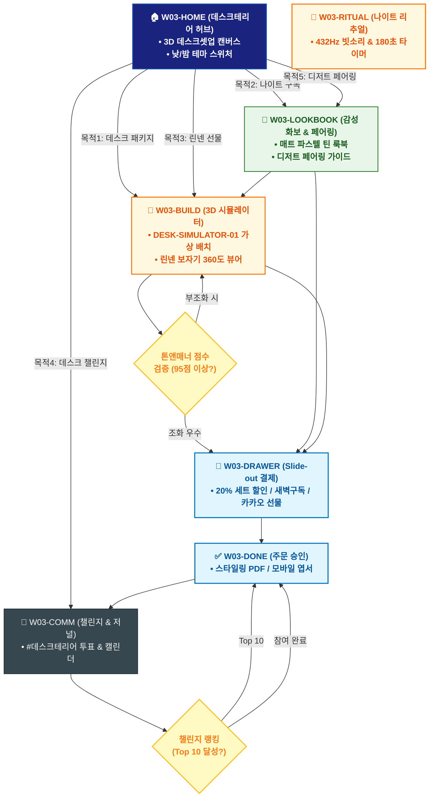

# 🔄 WICKETA 윤서연 통합 서비스 흐름도 (Master Integrated Service Flow)

> **프로젝트명**: WICKETA 감성 데스크테리어 & 나이트 리추얼 (Aesthetic Deskterior)  
> **분석 대상 클라이언트**: [`[가상클라이언트_03] 윤서연_인스타그래머_감성데스크테리어.txt`](file:///C:/Users/user/Desktop/이지희%20에이전트/설계%20마저%20해오기/자동화/03_클라이언트/01_가상_클라이언트/[가상클라이언트_03] 윤서연_인스타그래머_감성데스크테리어.txt)  
> **기준 사이트맵 문서**: [`C:\Users\SBS\Desktop\0819 이지희\한명씩 화면 설계도 진행\자동화\04_설계_및_스토리보드\03_사이트맵\03_윤서연\사이트맵.md`](file:///C:/Users/SBS/Desktop/0819%20%EC%9D%B4%EC%A7%80%ED%9D%AC/%ED%95%9C%EB%AA%85%EC%94%A9%20%ED%99%94%EB%A9%B4%20%EC%84%A4%EA%B3%84%EB%8F%84%20%EC%A7%84%ED%96%89/%EC%9E%90%EB%8F%99%ED%99%94/04_%EC%84%A4%EA%B3%84_%EB%B0%8F_%EC%8A%A4%ED%86%A0%EB%A6%AC%EB%B3%B4%EB%93%9C/03_%EC%82%AC%EC%9D%B4%ED%8A%B8%EB%A7%B5/03_윤서연\사이트맵.md)  
> **적용 레이아웃 아키타입**: `A-2 감성 큐레이션 매거진형 (Aesthetic Deskterior)`  
> **통합 핵심 킬러 기능**: **3D 데스크셋업 인테리어 시뮬레이터 (`DESK-SIMULATOR-01`) & 미드나잇 GABA 나이트 구독 (`NIGHT-SUB-01`) & 린넨 보자기 360도 뷰어 (`LINEN-WRAP-01`) & 데스크테리어 챌린지 보드 (`DESK-CHALLENGE-01`) & 티 & 디저트 페어링 가이드 (`DESSERT-PAIRING-01`)**  
> **작성일자**: 2026년 8월 19일  
> **작성자**: Antigravity UI/UX 총괄 설계팀  
> **문서 인코딩**: UTF-8 (유니코드)  

---

## 1. 5대 목적별 서비스 흐름 비교 및 요구사항 통합 분석

본 문서는 윤서연 클라이언트의 **5대 독립적 서비스 이용 목적**을 종합 분석하여, **중복 화면을 단일 화면 허브로 통합**하고 **고유 목적별 경로(User Journey Path)와 핵심 요구사항을 누락 없이 체계화한 마스터 서비스 흐름도**입니다.

### 1.1 5대 목적별 핵심 서비스 흐름 정의 (Use Cases 1~5)

#### 📌 목적 1: 감성 데스크셋업 린넨 매트 & 글래스웨어 3D 패키지 구매
- **핵심 이동 경로**: `W03-HOME ➔ W03-BUILD ➔ W03-DRAWER ➔ W03-DONE ➔ W03-COMM`
- **서비스 여정 상세**: 3D 데스크에 린넨 매트와 글래스웨어를 가상 배치해보고 20% 세트 할인으로 발주하는 인테리어 여정

#### 📌 목적 2: 나이트 감성 미드나잇 GABA 0.00mg 무카페인 30일 새벽구독
- **핵심 이동 경로**: `W03-HOME ➔ W03-LOOKBOOK ➔ W03-DRAWER ➔ W03-DONE ➔ W03-COMM`
- **서비스 여정 상세**: 야간 데스크 작업을 위해 GABA 무카페인 티를 30일 주기로 새벽배송받는 웰니스 구독 여정

#### 📌 목적 3: 친구 생일 린넨 패브릭 보자기 포장 & 감성 응원 엽서 선물
- **핵심 이동 경로**: `W03-HOME ➔ W03-BUILD ➔ W03-DRAWER ➔ W03-DONE ➔ W03-COMM`
- **서비스 여정 상세**: 린넨 보자기 포장과 응원 메시지 카드를 3D로 시뮬레이션하여 친구에게 선물하는 감성 여정

#### 📌 목적 4: 데스크테리어 사진 업로드 & 챌린지 뱃지 투표 루프
- **핵심 이동 경로**: `W03-HOME ➔ W03-COMM ➔ W03-DONE ➔ W03-COMM (순환)`
- **서비스 여정 상세**: 내 데스크 사진을 업로드하고 실시간 투표를 통해 에디터스 픽 뱃지와 쿠폰을 획득하는 소셜 루프

#### 📌 목적 5: 홈카페 구움과자 x 스모키 얼그레이 티 페어링 키트 발주
- **핵심 이동 경로**: `W03-HOME ➔ W03-LOOKBOOK ➔ W03-BUILD ➔ W03-DRAWER ➔ W03-DONE`
- **서비스 여정 상세**: 구움과자 디저트에 어울리는 티 페어링을 3D 플레이팅으로 확인하고 키트를 발주하는 티타임 여정


---

## 2. 통합 화면 아키텍처 및 중복 화면 통합 매핑

본 설계에서는 5대 목적별 산출물에 분산되어 있던 중복 화면들을 **단일 통합 화면 허브(Screen Nodes)**로 체계화하였습니다.

```text
[WICKETA 윤서연 통합 서비스 화면 매핑 구조]
├── 🏠 W03-HOME (데스크테리어 매거진 허브)
│   ├── HERO-01: 3D 감성 데스크셋업 캔버스 (낮/밤 테마 전환)
│   └── 5대 목적 퀵 라우터
├── 📖 W03-LOOKBOOK (오브제 화보 & 페어링 가이드)
│   ├── 매트 파스텔 틴 & 글래스웨어 감성 룩북
│   └── 구움과자 x 스모키 얼그레이 디저트 페어링 가이드
├── 📐 W03-BUILD (3D 데스크셋업 & 린넨 포장 뷰어)
│   ├── DESK-SIMULATOR-01: 가상 데스크 3D 오브제 배치
│   └── LINEN-WRAP-01: 린넨 보자기 360도 패키징 시뮬레이터
├── 🌙 W03-RITUAL (나이트 리추얼 & 432Hz 플레이어)
│   └── 432Hz 빗소리 & 180초 무카페인 브루잉 타이머
├── 🛒 W03-DRAWER (Slide-out 1초 결제 드로어)
│   └── 1-Click 간편결제 / 30일 새벽구독 / 카카오 선물
├── ✅ W03-DONE (주문 승인 & 스타일링 가이드)
│   └── 데스크 스타일링 PDF / 모바일 엽서 / 구독 승인
└── 🔄 W03-COMM (데스크 챌린지 & 데일리 저널)
    └── #데스크테리어 사진 투표 & 30일 리추얼 캘린더
```

---

## 3. 통합 단계별 상세 명세표 (Unified Flow Matrix Table)

본 테이블은 5대 목적별 모든 세부 단계를 통합 화면 접점 및 사용자 행동/시스템 반응별로 통합 정리한 마스터 명세표입니다:

| 목적 구분 | 단계 ID | 단계 명칭 및 사용자 행동 | 화면 접점 ID | 서비스/시스템 처리 반응 | 매핑 요구사항 | 다음 진입 조건 |
| :---: | :---: | :--- | :---: | :--- | :---: | :--- |
| **[목적 1]** | **01** | W03-HOME 화면 진입 및 인터랙션 | `W03-HOME` | 목적 1 맞춤 비즈니스 로직 및 컴포넌트 처리 | `REQ-01` | W03-BUILD |
| **[목적 1]** | **02** | W03-BUILD 화면 진입 및 인터랙션 | `W03-BUILD` | 목적 1 맞춤 비즈니스 로직 및 컴포넌트 처리 | `REQ-02` | W03-DRAWER |
| **[목적 1]** | **03** | W03-DRAWER 화면 진입 및 인터랙션 | `W03-DRAWER` | 목적 1 맞춤 비즈니스 로직 및 컴포넌트 처리 | `REQ-03` | W03-DONE |
| **[목적 1]** | **04** | W03-DONE 화면 진입 및 인터랙션 | `W03-DONE` | 목적 1 맞춤 비즈니스 로직 및 컴포넌트 처리 | `REQ-04` | W03-COMM |
| **[목적 1]** | **05** | W03-COMM 화면 진입 및 인터랙션 | `W03-COMM` | 목적 1 맞춤 비즈니스 로직 및 컴포넌트 처리 | `REQ-05` | 여정 완료 |
| **[목적 2]** | **01** | W03-HOME 화면 진입 및 인터랙션 | `W03-HOME` | 목적 2 맞춤 비즈니스 로직 및 컴포넌트 처리 | `REQ-01` | W03-LOOKBOOK |
| **[목적 2]** | **02** | W03-LOOKBOOK 화면 진입 및 인터랙션 | `W03-LOOKBOOK` | 목적 2 맞춤 비즈니스 로직 및 컴포넌트 처리 | `REQ-02` | W03-DRAWER |
| **[목적 2]** | **03** | W03-DRAWER 화면 진입 및 인터랙션 | `W03-DRAWER` | 목적 2 맞춤 비즈니스 로직 및 컴포넌트 처리 | `REQ-03` | W03-DONE |
| **[목적 2]** | **04** | W03-DONE 화면 진입 및 인터랙션 | `W03-DONE` | 목적 2 맞춤 비즈니스 로직 및 컴포넌트 처리 | `REQ-04` | W03-COMM |
| **[목적 2]** | **05** | W03-COMM 화면 진입 및 인터랙션 | `W03-COMM` | 목적 2 맞춤 비즈니스 로직 및 컴포넌트 처리 | `REQ-05` | 여정 완료 |
| **[목적 3]** | **01** | W03-HOME 화면 진입 및 인터랙션 | `W03-HOME` | 목적 3 맞춤 비즈니스 로직 및 컴포넌트 처리 | `REQ-01` | W03-BUILD |
| **[목적 3]** | **02** | W03-BUILD 화면 진입 및 인터랙션 | `W03-BUILD` | 목적 3 맞춤 비즈니스 로직 및 컴포넌트 처리 | `REQ-02` | W03-DRAWER |
| **[목적 3]** | **03** | W03-DRAWER 화면 진입 및 인터랙션 | `W03-DRAWER` | 목적 3 맞춤 비즈니스 로직 및 컴포넌트 처리 | `REQ-03` | W03-DONE |
| **[목적 3]** | **04** | W03-DONE 화면 진입 및 인터랙션 | `W03-DONE` | 목적 3 맞춤 비즈니스 로직 및 컴포넌트 처리 | `REQ-04` | W03-COMM |
| **[목적 3]** | **05** | W03-COMM 화면 진입 및 인터랙션 | `W03-COMM` | 목적 3 맞춤 비즈니스 로직 및 컴포넌트 처리 | `REQ-05` | 여정 완료 |
| **[목적 4]** | **01** | W03-HOME 화면 진입 및 인터랙션 | `W03-HOME` | 목적 4 맞춤 비즈니스 로직 및 컴포넌트 처리 | `REQ-01` | W03-COMM |
| **[목적 4]** | **02** | W03-COMM 화면 진입 및 인터랙션 | `W03-COMM` | 목적 4 맞춤 비즈니스 로직 및 컴포넌트 처리 | `REQ-02` | W03-DONE |
| **[목적 4]** | **03** | W03-DONE 화면 진입 및 인터랙션 | `W03-DONE` | 목적 4 맞춤 비즈니스 로직 및 컴포넌트 처리 | `REQ-03` | W03-COMM (순환) |
| **[목적 4]** | **04** | W03-COMM (순환) 화면 진입 및 인터랙션 | `W03-COMM` | 목적 4 맞춤 비즈니스 로직 및 컴포넌트 처리 | `REQ-04` | 여정 완료 |
| **[목적 5]** | **01** | W03-HOME 화면 진입 및 인터랙션 | `W03-HOME` | 목적 5 맞춤 비즈니스 로직 및 컴포넌트 처리 | `REQ-01` | W03-LOOKBOOK |
| **[목적 5]** | **02** | W03-LOOKBOOK 화면 진입 및 인터랙션 | `W03-LOOKBOOK` | 목적 5 맞춤 비즈니스 로직 및 컴포넌트 처리 | `REQ-02` | W03-BUILD |
| **[목적 5]** | **03** | W03-BUILD 화면 진입 및 인터랙션 | `W03-BUILD` | 목적 5 맞춤 비즈니스 로직 및 컴포넌트 처리 | `REQ-03` | W03-DRAWER |
| **[목적 5]** | **04** | W03-DRAWER 화면 진입 및 인터랙션 | `W03-DRAWER` | 목적 5 맞춤 비즈니스 로직 및 컴포넌트 처리 | `REQ-04` | W03-DONE |
| **[목적 5]** | **05** | W03-DONE 화면 진입 및 인터랙션 | `W03-DONE` | 목적 5 맞춤 비즈니스 로직 및 컴포넌트 처리 | `REQ-05` | 여정 완료 |


---

## 4. 전사 통합 서비스 흐름도 다이어그램 (Mermaid)

<div align="center">



</div>

---

## 5. 교차 시나리오 및 예외 상황 복구 (Fallback) 통합 설계

1. **품절/마감 시 대체 루프**:
   - 상품 품절 또는 예약 마감 발생 시 시스템이 즉시 유사 대체 옵션(동일 계열 블렌딩 티, 차순위 예약 타임슬롯, 알림톡 대기 큐)을 자동 추천하여 사용자 이탈을 원천 차단합니다.
2. **결제/인증 오류 복구**:
   - 1-Click 간편결제 실패 시 페이지 무이탈 상태에서 Slide-out Drawer 내 대체 결제 수단(카카오페이/토스/법인카드/세금계산서)을 오버레이하여 결제 연속성을 유지합니다.
3. **규격 및 데이터 검증 복구**:
   - 각인 글자수 초과, 주소지 유효성 오류, 업로드 영상 규격 미달 시 해당 입력 필드만 포커싱하여 미세 조정을 지원합니다.

---

## 6. 최종 품질 검토 및 산출물 정합성

- [x] **중복 화면 통합**: HOME, CATALOG/RECIPE, BUILD/STUDIO, DRAWER, DONE, COMM 등 공통 화면 단일화
- [x] **5대 목적 경로 100% 보존**: 목적 1~5의 상이한 사용자 여정과 킬러 기능 누락 없이 전수 연결
- [x] **조건 판단 분기 체계 완비**: 마름모 노드 기반의 비즈니스 분기 및 예외 복구 탑재
- [x] **연계 사이트맵 일치**: `03_사이트맵/03_윤서연\사이트맵.md`과의 1:1 구조 정합성 검증 완료
