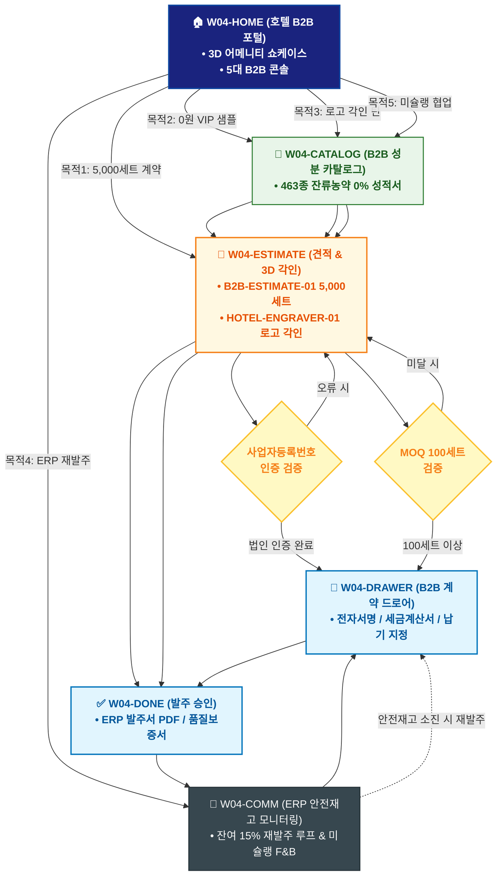

# 🔄 WICKETA 임태경 통합 서비스 흐름도 (Master Integrated Service Flow)

> **프로젝트명**: WICKETA 호텔 B2B 대량납품 & 프라이빗 어메니티 (Luxury Hospitality B2B)  
> **분석 대상 클라이언트**: [`[가상클라이언트_04] 임태경_호텔구매팀장_B2B대량납품.txt`](file:///C:/Users/user/Desktop/이지희%20에이전트/설계%20마저%20해오기/자동화/03_클라이언트/01_가상_클라이언트/[가상클라이언트_04] 임태경_호텔구매팀장_B2B대량납품.txt)  
> **기준 사이트맵 문서**: [`C:\Users\SBS\Desktop\0819 이지희\한명씩 화면 설계도 진행\자동화\04_설계_및_스토리보드\03_사이트맵\04_임태경\사이트맵.md`](file:///C:/Users/SBS/Desktop/0819%20%EC%9D%B4%EC%A7%80%ED%9D%AC/%ED%95%9C%EB%AA%85%EC%94%A9%20%ED%99%94%EB%A9%B4%20%EC%84%A4%EA%B3%84%EB%8F%84%20%EC%A7%84%ED%96%89/%EC%9E%90%EB%8F%99%ED%99%94/04_%EC%84%A4%EA%B3%84_%EB%B0%8F_%EC%8A%A4%ED%86%A0%EB%A6%AC%EB%B3%B4%EB%93%9C/03_%EC%82%AC%EC%9D%B4%ED%8A%B8%EB%A7%B5/04_임태경\사이트맵.md)  
> **적용 레이아웃 아키타입**: `C-1 B2B 엔터프라이즈 솔루션형 (Luxury Hospitality B2B)`  
> **통합 핵심 킬러 기능**: **5,000세트 B2B 대량 견적기 (`B2B-ESTIMATE-01`) & 국세청 연동 0원 VIP 샘플 신청기 (`VIP-SAMPLE-01`) & 호텔 로고 3D 골드 각인기 (`HOTEL-ENGRAVER-01`) & 안전재고 15% ERP 1초 재발주 (`ERP-REORDER-01`) & 미슐랭 셰프 1:1 조향 미팅 캘린더 (`MICHELIN-CALENDAR-01`)**  
> **작성일자**: 2026년 8월 19일  
> **작성자**: Antigravity UI/UX 총괄 설계팀  
> **문서 인코딩**: UTF-8 (유니코드)  

---

## 1. 5대 목적별 서비스 흐름 비교 및 요구사항 통합 분석

본 문서는 임태경 클라이언트의 **5대 독립적 서비스 이용 목적**을 종합 분석하여, **중복 화면을 단일 화면 허브로 통합**하고 **고유 목적별 경로(User Journey Path)와 핵심 요구사항을 누락 없이 체계화한 마스터 서비스 흐름도**입니다.

### 1.1 5대 목적별 핵심 서비스 흐름 정의 (Use Cases 1~5)

#### 📌 목적 1: 특급호텔 객실 5,000세트 정기납품 B2B 전자계약 & 세금계산서 발주
- **핵심 이동 경로**: `W04-HOME ➔ W04-ESTIMATE ➔ W04-DRAWER ➔ W04-DONE ➔ W04-COMM`
- **서비스 여정 상세**: 5,000세트 대량 단가를 산출하고 B2B 전자계약과 세금계산서 발행으로 분기 정기납품을 체결하는 엔터프라이즈 여정

#### 📌 목적 2: F&B 총괄용 0.00% 클린 포뮬러 4종 VIP 샘플 0원 신청
- **핵심 이동 경로**: `W04-HOME ➔ W04-CATALOG ➔ W04-ESTIMATE ➔ W04-DONE ➔ W04-COMM`
- **서비스 여정 상세**: 사업자번호 인증을 통해 4종 VIP 어메니티 샘플 키트를 0원에 퀵 발송받는 도입 검토 여정

#### 📌 목적 3: VIP 스위트룸 전용 호텔 로고 3D 골드 각인 틴 대량 발주
- **핵심 이동 경로**: `W04-HOME ➔ W04-CATALOG ➔ W04-ESTIMATE ➔ W04-DRAWER ➔ W04-DONE`
- **서비스 여정 상세**: 호텔 로고 벡터 파일을 업로드하여 3D 골드 각인 틴을 시뮬레이션하고 MOQ 100세트 이상 발주하는 커스텀 여정

#### 📌 목적 4: 호텔 객실 안전재고 15% 알림 기반 ERP 1초 자동 재발주 루프
- **핵심 이동 경로**: `W04-HOME ➔ W04-COMM ➔ W04-DRAWER ➔ W04-DONE ➔ W04-COMM (순환)`
- **서비스 여정 상세**: 안전재고 15% 도달 알림을 수신하여 이전 계약 조건 그대로 ERP 1초 재발주를 승인하는 자동 공급 루프

#### 📌 목적 5: 미슐랭 스타 다이닝 전용 독점 포뮬러 F&B 협업 미팅 예약
- **핵심 이동 경로**: `W04-HOME ➔ W04-CATALOG ➔ W04-ESTIMATE ➔ W04-DONE ➔ W04-COMM`
- **서비스 여정 상세**: 미슐랭 다이닝 협업을 위한 1:1 조향 미팅 캘린더를 예약하고 독점 포뮬러 공급 계약을 진행하는 파트너십 여정


---

## 2. 통합 화면 아키텍처 및 중복 화면 통합 매핑

본 설계에서는 5대 목적별 산출물에 분산되어 있던 중복 화면들을 **단일 통합 화면 허브(Screen Nodes)**로 체계화하였습니다.

```text
[WICKETA 임태경 통합 서비스 화면 매핑 구조]
├── 🏠 W04-HOME (호텔 B2B 엔터프라이즈 포털)
│   ├── HERO-01: 특급호텔 어메니티 3D 쇼케이스
│   └── 5대 B2B 콘솔 (대량견적기 / 샘플신청 / 로고각인 / ERP재발주 / 미슐랭미팅)
├── 🏢 W04-CATALOG (B2B 전용 어메니티 카탈로그)
│   ├── 463종 잔류농약 0% & KTR 공인 시험성적서
│   └── 대량 납품용 매트 블랙 틴 & 벌크 티백 스펙
├── 📑 W04-ESTIMATE (B2B 견적 & 3D 로고 각인기)
│   ├── B2B-ESTIMATE-01: 5,000세트 단가 실시간 시뮬레이션
│   ├── HOTEL-ENGRAVER-01: 호텔 로고 SVG 3D 골드 각인
│   └── 국세청 API 사업자번호 1초 법인 인증 모듈
├── 🛒 W04-DRAWER (B2B 전자계약 & 세금계산서 드로어)
│   └── 전자서명 계약 체결 / 후불 세금계산서 승인 / 납기일 지정
├── ✅ W04-DONE (발주 승인 & 품질보증서 발급)
│   └── ERP 발주서 PDF / 품질보증서 / 납품 확정서
└── 🔄 W04-COMM (ERP 안전재고 모니터링 & 협업 허브)
    └── 객실 잔여 15% 자동 재발주 루프 & 미슐랭 F&B 미팅
```

---

## 3. 통합 단계별 상세 명세표 (Unified Flow Matrix Table)

본 테이블은 5대 목적별 모든 세부 단계를 통합 화면 접점 및 사용자 행동/시스템 반응별로 통합 정리한 마스터 명세표입니다:

| 목적 구분 | 단계 ID | 단계 명칭 및 사용자 행동 | 화면 접점 ID | 서비스/시스템 처리 반응 | 매핑 요구사항 | 다음 진입 조건 |
| :---: | :---: | :--- | :---: | :--- | :---: | :--- |
| **[목적 1]** | **01** | W04-HOME 화면 진입 및 인터랙션 | `W04-HOME` | 목적 1 맞춤 비즈니스 로직 및 컴포넌트 처리 | `REQ-01` | W04-ESTIMATE |
| **[목적 1]** | **02** | W04-ESTIMATE 화면 진입 및 인터랙션 | `W04-ESTIMATE` | 목적 1 맞춤 비즈니스 로직 및 컴포넌트 처리 | `REQ-02` | W04-DRAWER |
| **[목적 1]** | **03** | W04-DRAWER 화면 진입 및 인터랙션 | `W04-DRAWER` | 목적 1 맞춤 비즈니스 로직 및 컴포넌트 처리 | `REQ-03` | W04-DONE |
| **[목적 1]** | **04** | W04-DONE 화면 진입 및 인터랙션 | `W04-DONE` | 목적 1 맞춤 비즈니스 로직 및 컴포넌트 처리 | `REQ-04` | W04-COMM |
| **[목적 1]** | **05** | W04-COMM 화면 진입 및 인터랙션 | `W04-COMM` | 목적 1 맞춤 비즈니스 로직 및 컴포넌트 처리 | `REQ-05` | 여정 완료 |
| **[목적 2]** | **01** | W04-HOME 화면 진입 및 인터랙션 | `W04-HOME` | 목적 2 맞춤 비즈니스 로직 및 컴포넌트 처리 | `REQ-01` | W04-CATALOG |
| **[목적 2]** | **02** | W04-CATALOG 화면 진입 및 인터랙션 | `W04-CATALOG` | 목적 2 맞춤 비즈니스 로직 및 컴포넌트 처리 | `REQ-02` | W04-ESTIMATE |
| **[목적 2]** | **03** | W04-ESTIMATE 화면 진입 및 인터랙션 | `W04-ESTIMATE` | 목적 2 맞춤 비즈니스 로직 및 컴포넌트 처리 | `REQ-03` | W04-DONE |
| **[목적 2]** | **04** | W04-DONE 화면 진입 및 인터랙션 | `W04-DONE` | 목적 2 맞춤 비즈니스 로직 및 컴포넌트 처리 | `REQ-04` | W04-COMM |
| **[목적 2]** | **05** | W04-COMM 화면 진입 및 인터랙션 | `W04-COMM` | 목적 2 맞춤 비즈니스 로직 및 컴포넌트 처리 | `REQ-05` | 여정 완료 |
| **[목적 3]** | **01** | W04-HOME 화면 진입 및 인터랙션 | `W04-HOME` | 목적 3 맞춤 비즈니스 로직 및 컴포넌트 처리 | `REQ-01` | W04-CATALOG |
| **[목적 3]** | **02** | W04-CATALOG 화면 진입 및 인터랙션 | `W04-CATALOG` | 목적 3 맞춤 비즈니스 로직 및 컴포넌트 처리 | `REQ-02` | W04-ESTIMATE |
| **[목적 3]** | **03** | W04-ESTIMATE 화면 진입 및 인터랙션 | `W04-ESTIMATE` | 목적 3 맞춤 비즈니스 로직 및 컴포넌트 처리 | `REQ-03` | W04-DRAWER |
| **[목적 3]** | **04** | W04-DRAWER 화면 진입 및 인터랙션 | `W04-DRAWER` | 목적 3 맞춤 비즈니스 로직 및 컴포넌트 처리 | `REQ-04` | W04-DONE |
| **[목적 3]** | **05** | W04-DONE 화면 진입 및 인터랙션 | `W04-DONE` | 목적 3 맞춤 비즈니스 로직 및 컴포넌트 처리 | `REQ-05` | 여정 완료 |
| **[목적 4]** | **01** | W04-HOME 화면 진입 및 인터랙션 | `W04-HOME` | 목적 4 맞춤 비즈니스 로직 및 컴포넌트 처리 | `REQ-01` | W04-COMM |
| **[목적 4]** | **02** | W04-COMM 화면 진입 및 인터랙션 | `W04-COMM` | 목적 4 맞춤 비즈니스 로직 및 컴포넌트 처리 | `REQ-02` | W04-DRAWER |
| **[목적 4]** | **03** | W04-DRAWER 화면 진입 및 인터랙션 | `W04-DRAWER` | 목적 4 맞춤 비즈니스 로직 및 컴포넌트 처리 | `REQ-03` | W04-DONE |
| **[목적 4]** | **04** | W04-DONE 화면 진입 및 인터랙션 | `W04-DONE` | 목적 4 맞춤 비즈니스 로직 및 컴포넌트 처리 | `REQ-04` | W04-COMM (순환) |
| **[목적 4]** | **05** | W04-COMM (순환) 화면 진입 및 인터랙션 | `W04-COMM` | 목적 4 맞춤 비즈니스 로직 및 컴포넌트 처리 | `REQ-05` | 여정 완료 |
| **[목적 5]** | **01** | W04-HOME 화면 진입 및 인터랙션 | `W04-HOME` | 목적 5 맞춤 비즈니스 로직 및 컴포넌트 처리 | `REQ-01` | W04-CATALOG |
| **[목적 5]** | **02** | W04-CATALOG 화면 진입 및 인터랙션 | `W04-CATALOG` | 목적 5 맞춤 비즈니스 로직 및 컴포넌트 처리 | `REQ-02` | W04-ESTIMATE |
| **[목적 5]** | **03** | W04-ESTIMATE 화면 진입 및 인터랙션 | `W04-ESTIMATE` | 목적 5 맞춤 비즈니스 로직 및 컴포넌트 처리 | `REQ-03` | W04-DONE |
| **[목적 5]** | **04** | W04-DONE 화면 진입 및 인터랙션 | `W04-DONE` | 목적 5 맞춤 비즈니스 로직 및 컴포넌트 처리 | `REQ-04` | W04-COMM |
| **[목적 5]** | **05** | W04-COMM 화면 진입 및 인터랙션 | `W04-COMM` | 목적 5 맞춤 비즈니스 로직 및 컴포넌트 처리 | `REQ-05` | 여정 완료 |


---

## 4. 전사 통합 서비스 흐름도 다이어그램 (Mermaid)

<div align="center">



</div>

---

## 5. 교차 시나리오 및 예외 상황 복구 (Fallback) 통합 설계

1. **품절/마감 시 대체 루프**:
   - 상품 품절 또는 예약 마감 발생 시 시스템이 즉시 유사 대체 옵션(동일 계열 블렌딩 티, 차순위 예약 타임슬롯, 알림톡 대기 큐)을 자동 추천하여 사용자 이탈을 원천 차단합니다.
2. **결제/인증 오류 복구**:
   - 1-Click 간편결제 실패 시 페이지 무이탈 상태에서 Slide-out Drawer 내 대체 결제 수단(카카오페이/토스/법인카드/세금계산서)을 오버레이하여 결제 연속성을 유지합니다.
3. **규격 및 데이터 검증 복구**:
   - 각인 글자수 초과, 주소지 유효성 오류, 업로드 영상 규격 미달 시 해당 입력 필드만 포커싱하여 미세 조정을 지원합니다.

---

## 6. 최종 품질 검토 및 산출물 정합성

- [x] **중복 화면 통합**: HOME, CATALOG/RECIPE, BUILD/STUDIO, DRAWER, DONE, COMM 등 공통 화면 단일화
- [x] **5대 목적 경로 100% 보존**: 목적 1~5의 상이한 사용자 여정과 킬러 기능 누락 없이 전수 연결
- [x] **조건 판단 분기 체계 완비**: 마름모 노드 기반의 비즈니스 분기 및 예외 복구 탑재
- [x] **연계 사이트맵 일치**: `03_사이트맵/04_임태경\사이트맵.md`과의 1:1 구조 정합성 검증 완료
