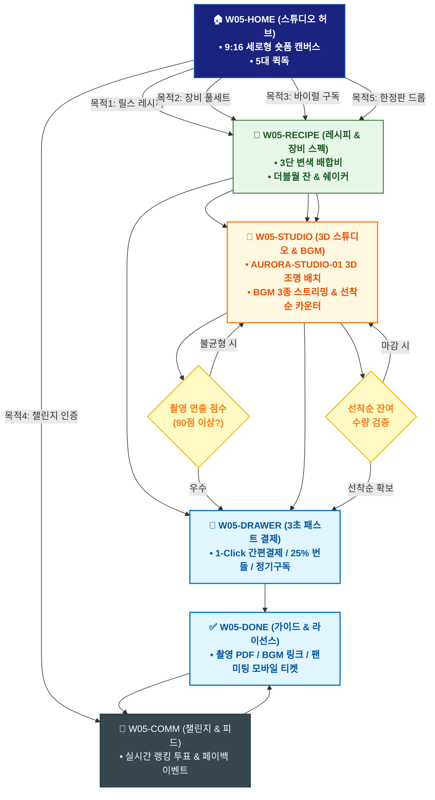

# 🔄 WICKETA 송아린 통합 서비스 흐름도 (Master Integrated Service Flow)

> **프로젝트명**: WICKETA 숏폼 믹솔로지 & 바이럴 크리에이터 스튜디오 (Short-form Studio)  
> **분석 대상 클라이언트**: [`[가상클라이언트_05] 송아린_푸드크리에이터_숏폼믹솔로지.txt`](file:///C:/Users/user/Desktop/이지희%20에이전트/설계%20마저%20해오기/자동화/03_클라이언트/01_가상_클라이언트/[가상클라이언트_05] 송아린_푸드크리에이터_숏폼믹솔로지.txt)  
> **기준 사이트맵 문서**: [`C:\Users\SBS\Desktop\0819 이지희\한명씩 화면 설계도 진행\자동화\04_설계_및_스토리보드\03_사이트맵\05_송아린\사이트맵.md`](file:///C:/Users/SBS/Desktop/0819%20%EC%9D%B4%EC%A7%80%ED%9D%AC/%ED%95%9C%EB%AA%85%EC%94%A9%20%ED%99%94%EB%A9%B4%20%EC%84%A4%EA%B3%84%EB%8F%84%20%EC%A7%84%ED%96%89/%EC%9E%90%EB%8F%99%ED%99%94/04_%EC%84%A4%EA%B3%84_%EB%B0%8F_%EC%8A%A4%ED%86%A0%EB%A6%AC%EB%B3%B4%EB%93%9C/03_%EC%82%AC%EC%9D%B4%ED%8A%B8%EB%A7%B5/05_송아린\사이트맵.md)  
> **적용 레이아웃 아키타입**: `B-2 숏폼 미디어 커머스형 (Short-form Reels Studio)`  
> **통합 핵심 킬러 기능**: **9:16 숏폼 레시피 플레이어 (`REELS-PLAYER-01`) & 3초 패스트 체크아웃 (`FAST-CHECKOUT-01`) & 3D 스튜디오 장비 시뮬레이터 (`AURORA-STUDIO-01`) & 크리에이터 트렌드 구독 (`VIRAL-SUB-01`) & 선착순 한정판 드롭 (`LIMITED-DROP-01`)**  
> **작성일자**: 2026년 8월 19일  
> **작성자**: Antigravity UI/UX 총괄 설계팀  
> **문서 인코딩**: UTF-8 (유니코드)  

---

## 1. 5대 목적별 서비스 흐름 비교 및 요구사항 통합 분석

본 문서는 송아린 클라이언트의 **5대 독립적 서비스 이용 목적**을 종합 분석하여, **중복 화면을 단일 화면 허브로 통합**하고 **고유 목적별 경로(User Journey Path)와 핵심 요구사항을 누락 없이 체계화한 마스터 서비스 흐름도**입니다.

### 1.1 5대 목적별 핵심 서비스 흐름 정의 (Use Cases 1~5)

#### 📌 목적 1: 인스타 릴스 15초 3단 수색 변환 레시피 즉시 구매
- **핵심 이동 경로**: `W05-HOME ➔ W05-RECIPE ➔ W05-DRAWER ➔ W05-DONE ➔ W05-COMM`
- **서비스 여정 상세**: 릴스 영상 감상 후 3단 변색 에이드 키트를 3초 만에 원클릭 구매하고 촬영 가이드를 획득하는 패스트 커머스 여정

#### 📌 목적 2: 홈카페 숏폼 촬영 스튜디오 장비 풀세트 3D 번들 구매
- **핵심 이동 경로**: `W05-HOME ➔ W05-RECIPE ➔ W05-STUDIO ➔ W05-DRAWER ➔ W05-DONE ➔ W05-COMM`
- **서비스 여정 상세**: 더블월 잔과 조명을 3D 가상 배치하여 연출 점수 90점 이상 획득 시 25% 번들 할인으로 발주하는 스튜디오 여정

#### 📌 목적 3: 매월 신규 바이럴 믹솔로지 레시피 팩 30일 정기구독
- **핵심 이동 경로**: `W05-HOME ➔ W05-RECIPE ➔ W05-STUDIO ➔ W05-DRAWER ➔ W05-DONE ➔ W05-COMM`
- **서비스 여정 상세**: 매월 화제의 신메뉴 원료 2종과 상업용 릴스 BGM 음원 라이선스를 정기배송 받는 크리에이터 구독 여정

#### 📌 목적 4: 릴스 챌린지 영상 업로드 & 실시간 랭킹 투표 참여
- **핵심 이동 경로**: `W05-HOME ➔ W05-COMM ➔ W05-DONE ➔ W05-COMM (순환)`
- **서비스 여정 상세**: 15초 홈카페 영상을 업로드하고 실시간 투표를 통해 1위 골드 트로피 및 상금을 획득하는 소셜 루프

#### 📌 목적 5: 송아린 콜라보레이션 리미티드 에디션 한정판 키트 구매
- **핵심 이동 경로**: `W05-HOME ➔ W05-RECIPE ➔ W05-STUDIO ➔ W05-DRAWER ➔ W05-DONE ➔ W05-COMM`
- **서비스 여정 상세**: 선착순 500개 한정판 홀로그램 틴세트를 결제하고 라이브 팬미팅 초대권을 획득하는 한정판 드롭 여정


---

## 2. 통합 화면 아키텍처 및 중복 화면 통합 매핑

본 설계에서는 5대 목적별 산출물에 분산되어 있던 중복 화면들을 **단일 통합 화면 허브(Screen Nodes)**로 체계화하였습니다.

```text
[WICKETA 송아린 통합 서비스 화면 매핑 구조]
├── 🏠 W05-HOME (크리에이터 스튜디오 메인 허브)
│   ├── HERO-01: 9:16 세로형 숏폼 비디오 캔버스 & 음원 플레이어
│   └── 5대 목적 퀵독 (릴스구매 / 장비세트 / 바이럴구독 / 챌린지 / 한정판드롭)
├── 🍹 W05-RECIPE (바이럴 믹솔로지 레시피 랩)
│   ├── 15초 3단 수색 변환 레시피 & 배합비 가이드
│   └── 글래스웨어/바텐더 쉐이커 스펙 & 조향 화보
├── 📸 W05-STUDIO (3D 가상 스튜디오 & 음원 라이브러리)
│   ├── AURORA-STUDIO-01: 3D 글래스 & 조명 가상 배치기
│   ├── BGM-LICENSE-01: 상업용 릴스 음원 3종 미리듣기
│   └── LIMITED-DROP-01: 선착순 500개 실시간 카운터
├── 🛒 W05-DRAWER (Slide-out 3초 패스트 체크아웃)
│   └── 1-Click 간편결제 / 15% 세트 할인 / 정기구독 / 한정판 번호표
├── ✅ W05-DONE (주문 승인 & 가이드북 발급)
│   └── 릴스 촬영 노하우 PDF / 음원 라이선스 / 팬미팅 초대권
└── 🔄 W05-COMM (릴스 챌린지 & 바이럴 피드)
    └── #15초믹솔로지 실시간 투표 랭킹 & 페이백 이벤트
```

---

## 3. 통합 단계별 상세 명세표 (Unified Flow Matrix Table)

본 테이블은 5대 목적별 모든 세부 단계를 통합 화면 접점 및 사용자 행동/시스템 반응별로 통합 정리한 마스터 명세표입니다:

| 목적 구분 | 단계 ID | 단계 명칭 및 사용자 행동 | 화면 접점 ID | 서비스/시스템 처리 반응 | 매핑 요구사항 | 다음 진입 조건 |
| :---: | :---: | :--- | :---: | :--- | :---: | :--- |
| **[목적 1]** | **01** | W05-HOME 화면 진입 및 인터랙션 | `W05-HOME` | 목적 1 맞춤 비즈니스 로직 및 컴포넌트 처리 | `REQ-01` | W05-RECIPE |
| **[목적 1]** | **02** | W05-RECIPE 화면 진입 및 인터랙션 | `W05-RECIPE` | 목적 1 맞춤 비즈니스 로직 및 컴포넌트 처리 | `REQ-02` | W05-DRAWER |
| **[목적 1]** | **03** | W05-DRAWER 화면 진입 및 인터랙션 | `W05-DRAWER` | 목적 1 맞춤 비즈니스 로직 및 컴포넌트 처리 | `REQ-03` | W05-DONE |
| **[목적 1]** | **04** | W05-DONE 화면 진입 및 인터랙션 | `W05-DONE` | 목적 1 맞춤 비즈니스 로직 및 컴포넌트 처리 | `REQ-04` | W05-COMM |
| **[목적 1]** | **05** | W05-COMM 화면 진입 및 인터랙션 | `W05-COMM` | 목적 1 맞춤 비즈니스 로직 및 컴포넌트 처리 | `REQ-05` | 여정 완료 |
| **[목적 2]** | **01** | W05-HOME 화면 진입 및 인터랙션 | `W05-HOME` | 목적 2 맞춤 비즈니스 로직 및 컴포넌트 처리 | `REQ-01` | W05-RECIPE |
| **[목적 2]** | **02** | W05-RECIPE 화면 진입 및 인터랙션 | `W05-RECIPE` | 목적 2 맞춤 비즈니스 로직 및 컴포넌트 처리 | `REQ-02` | W05-STUDIO |
| **[목적 2]** | **03** | W05-STUDIO 화면 진입 및 인터랙션 | `W05-STUDIO` | 목적 2 맞춤 비즈니스 로직 및 컴포넌트 처리 | `REQ-03` | W05-DRAWER |
| **[목적 2]** | **04** | W05-DRAWER 화면 진입 및 인터랙션 | `W05-DRAWER` | 목적 2 맞춤 비즈니스 로직 및 컴포넌트 처리 | `REQ-04` | W05-DONE |
| **[목적 2]** | **05** | W05-DONE 화면 진입 및 인터랙션 | `W05-DONE` | 목적 2 맞춤 비즈니스 로직 및 컴포넌트 처리 | `REQ-05` | W05-COMM |
| **[목적 2]** | **06** | W05-COMM 화면 진입 및 인터랙션 | `W05-COMM` | 목적 2 맞춤 비즈니스 로직 및 컴포넌트 처리 | `REQ-06` | 여정 완료 |
| **[목적 3]** | **01** | W05-HOME 화면 진입 및 인터랙션 | `W05-HOME` | 목적 3 맞춤 비즈니스 로직 및 컴포넌트 처리 | `REQ-01` | W05-RECIPE |
| **[목적 3]** | **02** | W05-RECIPE 화면 진입 및 인터랙션 | `W05-RECIPE` | 목적 3 맞춤 비즈니스 로직 및 컴포넌트 처리 | `REQ-02` | W05-STUDIO |
| **[목적 3]** | **03** | W05-STUDIO 화면 진입 및 인터랙션 | `W05-STUDIO` | 목적 3 맞춤 비즈니스 로직 및 컴포넌트 처리 | `REQ-03` | W05-DRAWER |
| **[목적 3]** | **04** | W05-DRAWER 화면 진입 및 인터랙션 | `W05-DRAWER` | 목적 3 맞춤 비즈니스 로직 및 컴포넌트 처리 | `REQ-04` | W05-DONE |
| **[목적 3]** | **05** | W05-DONE 화면 진입 및 인터랙션 | `W05-DONE` | 목적 3 맞춤 비즈니스 로직 및 컴포넌트 처리 | `REQ-05` | W05-COMM |
| **[목적 3]** | **06** | W05-COMM 화면 진입 및 인터랙션 | `W05-COMM` | 목적 3 맞춤 비즈니스 로직 및 컴포넌트 처리 | `REQ-06` | 여정 완료 |
| **[목적 4]** | **01** | W05-HOME 화면 진입 및 인터랙션 | `W05-HOME` | 목적 4 맞춤 비즈니스 로직 및 컴포넌트 처리 | `REQ-01` | W05-COMM |
| **[목적 4]** | **02** | W05-COMM 화면 진입 및 인터랙션 | `W05-COMM` | 목적 4 맞춤 비즈니스 로직 및 컴포넌트 처리 | `REQ-02` | W05-DONE |
| **[목적 4]** | **03** | W05-DONE 화면 진입 및 인터랙션 | `W05-DONE` | 목적 4 맞춤 비즈니스 로직 및 컴포넌트 처리 | `REQ-03` | W05-COMM (순환) |
| **[목적 4]** | **04** | W05-COMM (순환) 화면 진입 및 인터랙션 | `W05-COMM` | 목적 4 맞춤 비즈니스 로직 및 컴포넌트 처리 | `REQ-04` | 여정 완료 |
| **[목적 5]** | **01** | W05-HOME 화면 진입 및 인터랙션 | `W05-HOME` | 목적 5 맞춤 비즈니스 로직 및 컴포넌트 처리 | `REQ-01` | W05-RECIPE |
| **[목적 5]** | **02** | W05-RECIPE 화면 진입 및 인터랙션 | `W05-RECIPE` | 목적 5 맞춤 비즈니스 로직 및 컴포넌트 처리 | `REQ-02` | W05-STUDIO |
| **[목적 5]** | **03** | W05-STUDIO 화면 진입 및 인터랙션 | `W05-STUDIO` | 목적 5 맞춤 비즈니스 로직 및 컴포넌트 처리 | `REQ-03` | W05-DRAWER |
| **[목적 5]** | **04** | W05-DRAWER 화면 진입 및 인터랙션 | `W05-DRAWER` | 목적 5 맞춤 비즈니스 로직 및 컴포넌트 처리 | `REQ-04` | W05-DONE |
| **[목적 5]** | **05** | W05-DONE 화면 진입 및 인터랙션 | `W05-DONE` | 목적 5 맞춤 비즈니스 로직 및 컴포넌트 처리 | `REQ-05` | W05-COMM |
| **[목적 5]** | **06** | W05-COMM 화면 진입 및 인터랙션 | `W05-COMM` | 목적 5 맞춤 비즈니스 로직 및 컴포넌트 처리 | `REQ-06` | 여정 완료 |


---

## 4. 전사 통합 서비스 흐름도 다이어그램 (Mermaid)

<div align="center">



</div>

---

## 5. 교차 시나리오 및 예외 상황 복구 (Fallback) 통합 설계

1. **품절/마감 시 대체 루프**:
   - 상품 품절 또는 예약 마감 발생 시 시스템이 즉시 유사 대체 옵션(동일 계열 블렌딩 티, 차순위 예약 타임슬롯, 알림톡 대기 큐)을 자동 추천하여 사용자 이탈을 원천 차단합니다.
2. **결제/인증 오류 복구**:
   - 1-Click 간편결제 실패 시 페이지 무이탈 상태에서 Slide-out Drawer 내 대체 결제 수단(카카오페이/토스/법인카드/세금계산서)을 오버레이하여 결제 연속성을 유지합니다.
3. **규격 및 데이터 검증 복구**:
   - 각인 글자수 초과, 주소지 유효성 오류, 업로드 영상 규격 미달 시 해당 입력 필드만 포커싱하여 미세 조정을 지원합니다.

---

## 6. 최종 품질 검토 및 산출물 정합성

- [x] **중복 화면 통합**: HOME, CATALOG/RECIPE, BUILD/STUDIO, DRAWER, DONE, COMM 등 공통 화면 단일화
- [x] **5대 목적 경로 100% 보존**: 목적 1~5의 상이한 사용자 여정과 킬러 기능 누락 없이 전수 연결
- [x] **조건 판단 분기 체계 완비**: 마름모 노드 기반의 비즈니스 분기 및 예외 복구 탑재
- [x] **연계 사이트맵 일치**: `03_사이트맵/05_송아린\사이트맵.md`과의 1:1 구조 정합성 검증 완료
