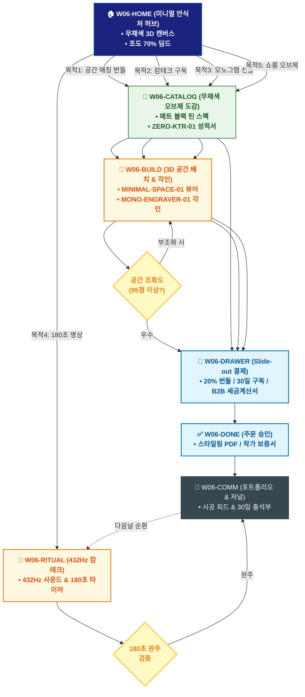

# 🔄 WICKETA 이도은 통합 서비스 흐름도 (Master Integrated Service Flow)

> **프로젝트명**: WICKETA 미니멀 인테리어 & 캄테크 안식처 (Minimal Calm-Tech)  
> **분석 대상 클라이언트**: [`[가상클라이언트_06] 이도은_인테리어디자이너_미니멀캄테크.txt`](file:///C:/Users/user/Desktop/이지희%20에이전트/설계%20마저%20해오기/자동화/03_클라이언트/01_가상_클라이언트/[가상클라이언트_06] 이도은_인테리어디자이너_미니멀캄테크.txt)  
> **기준 사이트맵 문서**: [`C:\Users\SBS\Desktop\0819 이지희\한명씩 화면 설계도 진행\자동화\04_설계_및_스토리보드\03_사이트맵\06_이도은\사이트맵.md`](file:///C:/Users/SBS/Desktop/0819%20%EC%9D%B4%EC%A7%80%ED%9D%AC/%ED%95%9C%EB%AA%85%EC%94%A9%20%ED%99%94%EB%A9%B4%20%EC%84%A4%EA%B3%84%EB%8F%84%20%EC%A7%84%ED%96%89/%EC%9E%90%EB%8F%99%ED%99%94/04_%EC%84%A4%EA%B3%84_%EB%B0%8F_%EC%8A%A4%ED%86%A0%EB%A6%AC%EB%B3%B4%EB%93%9C/03_%EC%82%AC%EC%9D%B4%ED%8A%B8%EB%A7%B5/06_이도은\사이트맵.md)  
> **적용 레이아웃 아키타입**: `A-3 미니멀 건축/오브제 갤러리형 (Minimal Calm-Tech)`  
> **통합 핵심 킬러 기능**: **미니멀 3D 공간 뷰어 (`MINIMAL-SPACE-01`) & KTR 공인 무카페인 성적서 뷰어 (`ZERO-KTR-01`) & 모노그램 3D 레이저 각인기 (`MONO-ENGRAVER-01`) & 432Hz 캄테크 플레이어 (`CALM-PLAYER-01`) & 디자이너 B2B 견적기 (`DESIGNER-ESTIMATE-01`)**  
> **작성일자**: 2026년 8월 19일  
> **작성자**: Antigravity UI/UX 총괄 설계팀  
> **문서 인코딩**: UTF-8 (유니코드)  

---

## 1. 5대 목적별 서비스 흐름 비교 및 요구사항 통합 분석

본 문서는 이도은 클라이언트의 **5대 독립적 서비스 이용 목적**을 종합 분석하여, **중복 화면을 단일 화면 허브로 통합**하고 **고유 목적별 경로(User Journey Path)와 핵심 요구사항을 누락 없이 체계화한 마스터 서비스 흐름도**입니다.

### 1.1 5대 목적별 핵심 서비스 흐름 정의 (Use Cases 1~5)

#### 📌 목적 1: 미니멀 인테리어 모노크롬 무채색 틴 & 글래스웨어 번들 구매
- **핵심 이동 경로**: `W06-HOME ➔ W06-CATALOG ➔ W06-BUILD ➔ W06-DRAWER ➔ W06-DONE ➔ W06-COMM`
- **서비스 여정 상세**: 무채색 틴을 3D 선반에 가상 배치하여 조화도 95점 획득 시 20% 번들 할인으로 발주하는 인테리어 여정

#### 📌 목적 2: 디자이너 심야 캄테크 0.00mg 무카페인 30일 정기구독
- **핵심 이동 경로**: `W06-HOME ➔ W06-CATALOG ➔ W06-DRAWER ➔ W06-DONE ➔ W06-COMM`
- **서비스 여정 상세**: KTR 0.00mg 무카페인 성적서를 확인하고 30일 정기구독을 원클릭으로 결제하는 캄테크 여정

#### 📌 목적 3: 클라이언트 입주 축하 영문 모노그램 각인 선물세트
- **핵심 이동 경로**: `W06-HOME ➔ W06-CATALOG ➔ W06-BUILD ➔ W06-DRAWER ➔ W06-DONE ➔ W06-COMM`
- **서비스 여정 상세**: 무채색 틴에 고객 영문 이니셜을 3D 레이저 각인하고 패브릭 보자기 포장과 함께 카카오로 선물하는 여정

#### 📌 목적 4: 180초 캄테크 미니멀 명상 타이머 실행 & 감정 일기
- **핵심 이동 경로**: `W06-HOME ➔ W06-RITUAL ➔ W06-COMM ➔ W06-RITUAL (순환)`
- **서비스 여정 상세**: 432Hz 자연 음향과 180초 호흡 후 1줄 무채색 감정 일기를 작성하여 30일 완주 리워드를 획득하는 루프

#### 📌 목적 5: 인테리어 디자이너 쇼룸 전용 다기 오브제 커스텀 주문
- **핵심 이동 경로**: `W06-HOME ➔ W06-CATALOG ➔ W06-BUILD ➔ W06-DRAWER ➔ W06-DONE`
- **서비스 여정 상세**: 도예 작가 협업 다기 오브제를 쇼룸에 3D 배치하고 디자이너 20% B2B 특별 할인으로 발주하는 전문 프로젝트 여정


---

## 2. 통합 화면 아키텍처 및 중복 화면 통합 매핑

본 설계에서는 5대 목적별 산출물에 분산되어 있던 중복 화면들을 **단일 통합 화면 허브(Screen Nodes)**로 체계화하였습니다.

```text
[WICKETA 이도은 통합 서비스 화면 매핑 구조]
├── 🏠 W06-HOME (미니멀 안식처 메인 허브)
│   ├── HERO-01: 무채색 모노크롬 3D 캔버스 (조도 70% 딤드 전환)
│   └── 5대 미니멀 콘솔 (공간매칭 / 캄테크구독 / 모노그램선물 / 180초명상 / 쇼룸오브제)
├── 🏢 W06-CATALOG (무채색 오브제 카탈로그)
│   ├── 매트 블랙 / 쿨 그레이 틴 & 글래스웨어 스펙
│   └── ZERO-KTR-01 0.00mg 무카페인 공인 시험성적서
├── 📐 W06-BUILD (3D 공간 배치 & 모노그램 각인기)
│   ├── MINIMAL-SPACE-01: 3D 가상 선반 오브제 배치기
│   ├── MONO-ENGRAVER-01: 영문 모노그램 3D 레이저 각인
│   └── OBJECT-PLACER-01: 쇼룸 전용 다기 오브제 3D 배치
├── 🌙 W06-RITUAL (432Hz 캄테크 플레이어)
│   └── 432Hz 자연 음향 & 180초 원형 펄스 호흡 타이머
├── 🛒 W06-DRAWER (Slide-out 미니멀 결제 드로어)
│   └── 1-Click 간편결제 / 30일 캄테크 구독 / B2B 세금계산서
├── ✅ W06-DONE (주문 승인 & 작품 보증서 발급)
│   └── 인테리어 스타일링 PDF / 작가 보증서 / 모바일 바우처
└── 🔄 W06-COMM (공간 포트폴리오 & 마이크로 저널)
    └── 미니멀 인테리어 시공 피드 & 30일 명상 출석부
```

---

## 3. 통합 단계별 상세 명세표 (Unified Flow Matrix Table)

본 테이블은 5대 목적별 모든 세부 단계를 통합 화면 접점 및 사용자 행동/시스템 반응별로 통합 정리한 마스터 명세표입니다:

| 목적 구분 | 단계 ID | 단계 명칭 및 사용자 행동 | 화면 접점 ID | 서비스/시스템 처리 반응 | 매핑 요구사항 | 다음 진입 조건 |
| :---: | :---: | :--- | :---: | :--- | :---: | :--- |
| **[목적 1]** | **01** | W06-HOME 화면 진입 및 인터랙션 | `W06-HOME` | 목적 1 맞춤 비즈니스 로직 및 컴포넌트 처리 | `REQ-01` | W06-CATALOG |
| **[목적 1]** | **02** | W06-CATALOG 화면 진입 및 인터랙션 | `W06-CATALOG` | 목적 1 맞춤 비즈니스 로직 및 컴포넌트 처리 | `REQ-02` | W06-BUILD |
| **[목적 1]** | **03** | W06-BUILD 화면 진입 및 인터랙션 | `W06-BUILD` | 목적 1 맞춤 비즈니스 로직 및 컴포넌트 처리 | `REQ-03` | W06-DRAWER |
| **[목적 1]** | **04** | W06-DRAWER 화면 진입 및 인터랙션 | `W06-DRAWER` | 목적 1 맞춤 비즈니스 로직 및 컴포넌트 처리 | `REQ-04` | W06-DONE |
| **[목적 1]** | **05** | W06-DONE 화면 진입 및 인터랙션 | `W06-DONE` | 목적 1 맞춤 비즈니스 로직 및 컴포넌트 처리 | `REQ-05` | W06-COMM |
| **[목적 1]** | **06** | W06-COMM 화면 진입 및 인터랙션 | `W06-COMM` | 목적 1 맞춤 비즈니스 로직 및 컴포넌트 처리 | `REQ-06` | 여정 완료 |
| **[목적 2]** | **01** | W06-HOME 화면 진입 및 인터랙션 | `W06-HOME` | 목적 2 맞춤 비즈니스 로직 및 컴포넌트 처리 | `REQ-01` | W06-CATALOG |
| **[목적 2]** | **02** | W06-CATALOG 화면 진입 및 인터랙션 | `W06-CATALOG` | 목적 2 맞춤 비즈니스 로직 및 컴포넌트 처리 | `REQ-02` | W06-DRAWER |
| **[목적 2]** | **03** | W06-DRAWER 화면 진입 및 인터랙션 | `W06-DRAWER` | 목적 2 맞춤 비즈니스 로직 및 컴포넌트 처리 | `REQ-03` | W06-DONE |
| **[목적 2]** | **04** | W06-DONE 화면 진입 및 인터랙션 | `W06-DONE` | 목적 2 맞춤 비즈니스 로직 및 컴포넌트 처리 | `REQ-04` | W06-COMM |
| **[목적 2]** | **05** | W06-COMM 화면 진입 및 인터랙션 | `W06-COMM` | 목적 2 맞춤 비즈니스 로직 및 컴포넌트 처리 | `REQ-05` | 여정 완료 |
| **[목적 3]** | **01** | W06-HOME 화면 진입 및 인터랙션 | `W06-HOME` | 목적 3 맞춤 비즈니스 로직 및 컴포넌트 처리 | `REQ-01` | W06-CATALOG |
| **[목적 3]** | **02** | W06-CATALOG 화면 진입 및 인터랙션 | `W06-CATALOG` | 목적 3 맞춤 비즈니스 로직 및 컴포넌트 처리 | `REQ-02` | W06-BUILD |
| **[목적 3]** | **03** | W06-BUILD 화면 진입 및 인터랙션 | `W06-BUILD` | 목적 3 맞춤 비즈니스 로직 및 컴포넌트 처리 | `REQ-03` | W06-DRAWER |
| **[목적 3]** | **04** | W06-DRAWER 화면 진입 및 인터랙션 | `W06-DRAWER` | 목적 3 맞춤 비즈니스 로직 및 컴포넌트 처리 | `REQ-04` | W06-DONE |
| **[목적 3]** | **05** | W06-DONE 화면 진입 및 인터랙션 | `W06-DONE` | 목적 3 맞춤 비즈니스 로직 및 컴포넌트 처리 | `REQ-05` | W06-COMM |
| **[목적 3]** | **06** | W06-COMM 화면 진입 및 인터랙션 | `W06-COMM` | 목적 3 맞춤 비즈니스 로직 및 컴포넌트 처리 | `REQ-06` | 여정 완료 |
| **[목적 4]** | **01** | W06-HOME 화면 진입 및 인터랙션 | `W06-HOME` | 목적 4 맞춤 비즈니스 로직 및 컴포넌트 처리 | `REQ-01` | W06-RITUAL |
| **[목적 4]** | **02** | W06-RITUAL 화면 진입 및 인터랙션 | `W06-RITUAL` | 목적 4 맞춤 비즈니스 로직 및 컴포넌트 처리 | `REQ-02` | W06-COMM |
| **[목적 4]** | **03** | W06-COMM 화면 진입 및 인터랙션 | `W06-COMM` | 목적 4 맞춤 비즈니스 로직 및 컴포넌트 처리 | `REQ-03` | W06-RITUAL (순환) |
| **[목적 4]** | **04** | W06-RITUAL (순환) 화면 진입 및 인터랙션 | `W06-RITUAL` | 목적 4 맞춤 비즈니스 로직 및 컴포넌트 처리 | `REQ-04` | 여정 완료 |
| **[목적 5]** | **01** | W06-HOME 화면 진입 및 인터랙션 | `W06-HOME` | 목적 5 맞춤 비즈니스 로직 및 컴포넌트 처리 | `REQ-01` | W06-CATALOG |
| **[목적 5]** | **02** | W06-CATALOG 화면 진입 및 인터랙션 | `W06-CATALOG` | 목적 5 맞춤 비즈니스 로직 및 컴포넌트 처리 | `REQ-02` | W06-BUILD |
| **[목적 5]** | **03** | W06-BUILD 화면 진입 및 인터랙션 | `W06-BUILD` | 목적 5 맞춤 비즈니스 로직 및 컴포넌트 처리 | `REQ-03` | W06-DRAWER |
| **[목적 5]** | **04** | W06-DRAWER 화면 진입 및 인터랙션 | `W06-DRAWER` | 목적 5 맞춤 비즈니스 로직 및 컴포넌트 처리 | `REQ-04` | W06-DONE |
| **[목적 5]** | **05** | W06-DONE 화면 진입 및 인터랙션 | `W06-DONE` | 목적 5 맞춤 비즈니스 로직 및 컴포넌트 처리 | `REQ-05` | 여정 완료 |


---

## 4. 전사 통합 서비스 흐름도 다이어그램 (Mermaid)

<div align="center">



</div>

---

## 5. 교차 시나리오 및 예외 상황 복구 (Fallback) 통합 설계

1. **품절/마감 시 대체 루프**:
   - 상품 품절 또는 예약 마감 발생 시 시스템이 즉시 유사 대체 옵션(동일 계열 블렌딩 티, 차순위 예약 타임슬롯, 알림톡 대기 큐)을 자동 추천하여 사용자 이탈을 원천 차단합니다.
2. **결제/인증 오류 복구**:
   - 1-Click 간편결제 실패 시 페이지 무이탈 상태에서 Slide-out Drawer 내 대체 결제 수단(카카오페이/토스/법인카드/세금계산서)을 오버레이하여 결제 연속성을 유지합니다.
3. **규격 및 데이터 검증 복구**:
   - 각인 글자수 초과, 주소지 유효성 오류, 업로드 영상 규격 미달 시 해당 입력 필드만 포커싱하여 미세 조정을 지원합니다.

---

## 6. 최종 품질 검토 및 산출물 정합성

- [x] **중복 화면 통합**: HOME, CATALOG/RECIPE, BUILD/STUDIO, DRAWER, DONE, COMM 등 공통 화면 단일화
- [x] **5대 목적 경로 100% 보존**: 목적 1~5의 상이한 사용자 여정과 킬러 기능 누락 없이 전수 연결
- [x] **조건 판단 분기 체계 완비**: 마름모 노드 기반의 비즈니스 분기 및 예외 복구 탑재
- [x] **연계 사이트맵 일치**: `03_사이트맵/06_이도은\사이트맵.md`과의 1:1 구조 정합성 검증 완료
