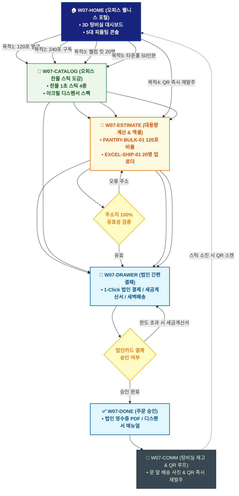

# 🔄 WICKETA 박지후 통합 서비스 흐름도 (Master Integrated Service Flow)

> **프로젝트명**: WICKETA 오피스 탕비실 웰니스 & 퀵커머스 (Office Wellness)  
> **분석 대상 클라이언트**: [`[가상클라이언트_07] 박지후_스타트업피플팀_오피스탕비실.txt`](file:///C:/Users/user/Desktop/이지희%20에이전트/설계%20마저%20해오기/자동화/03_클라이언트/01_가상_클라이언트/[가상클라이언트_07] 박지후_스타트업피플팀_오피스탕비실.txt)  
> **기준 사이트맵 문서**: [`C:\Users\SBS\Desktop\0819 이지희\한명씩 화면 설계도 진행\자동화\04_설계_및_스토리보드\03_사이트맵\07_박지후\사이트맵.md`](file:///C:/Users/SBS/Desktop/0819%20%EC%9D%B4%EC%A7%80%ED%9D%AC/%ED%95%9C%EB%AA%85%EC%94%A9%20%ED%99%94%EB%A9%B4%20%EC%84%A4%EA%B3%84%EB%8F%84%20%EC%A7%84%ED%96%89/%EC%9E%90%EB%8F%99%ED%99%94/04_%EC%84%A4%EA%B3%84_%EB%B0%8F_%EC%8A%A4%ED%86%A0%EB%A6%AC%EB%B3%B4%EB%93%9C/03_%EC%82%AC%EC%9D%B4%ED%8A%B8%EB%A7%B5/07_박지후\사이트맵.md)  
> **적용 레이아웃 아키타입**: `C-2 오피스 퀵커머스 & 대용량 벌크형 (Office Wellness)`  
> **통합 핵심 킬러 기능**: **탕비실 120포 대용량 계산기 (`PANTRY-BULK-01`) & 아크릴 디스펜서 0원 렌탈 (`PANTRY-DISPENSER-01`) & 엑셀 대량 주소지 업로더 (`EXCEL-SHIP-01`) & 탕비실 QR 즉시 발주기 (`PANTRY-QR-01`) & 타운홀 케이터링 계산기 (`TOWNHALL-CALC-01`)**  
> **작성일자**: 2026년 8월 19일  
> **작성자**: Antigravity UI/UX 총괄 설계팀  
> **문서 인코딩**: UTF-8 (유니코드)  

---

## 1. 5대 목적별 서비스 흐름 비교 및 요구사항 통합 분석

본 문서는 박지후 클라이언트의 **5대 독립적 서비스 이용 목적**을 종합 분석하여, **중복 화면을 단일 화면 허브로 통합**하고 **고유 목적별 경로(User Journey Path)와 핵심 요구사항을 누락 없이 체계화한 마스터 서비스 흐름도**입니다.

### 1.1 5대 목적별 핵심 서비스 흐름 정의 (Use Cases 1~5)

#### 📌 목적 1: 스타트업 탕비실 120포 대용량 벌크 믹스 세트 법인 구매
- **핵심 이동 경로**: `W07-HOME ➔ W07-CATALOG ➔ W07-ESTIMATE ➔ W07-DRAWER ➔ W07-DONE ➔ W07-COMM`
- **서비스 여정 상세**: 직원 30인 선호도 기반 120포 벌크를 자동 계산하고 법인카드로 결제하여 익일 07:00 새벽배송을 받는 프로세스

#### 📌 목적 2: 오피스 240포 정기구독 & 아크릴 디스펜서 무료 렌탈
- **핵심 이동 경로**: `W07-HOME ➔ W07-CATALOG ➔ W07-DRAWER ➔ W07-DONE ➔ W07-COMM`
- **서비스 여정 상세**: 매월 240포 스틱을 정기배송받고 4단 아크릴 디스펜서를 무료 렌탈받는 오피스 복지 구독 여정

#### 📌 목적 3: 신규 입사자 웰컴 온보딩 텀블러 & 티 키트 대량 발송
- **핵심 이동 경로**: `W07-HOME ➔ W07-CATALOG ➔ W07-ESTIMATE ➔ W07-DRAWER ➔ W07-DONE ➔ W07-COMM`
- **서비스 여정 상세**: 입사자 20명 주소지 엑셀을 업로드하여 개별 웰컴 카드와 함께 자택으로 익일 발송하는 온보딩 여정

#### 📌 목적 4: 탕비실 디스펜서 QR 스캔 1초 법인 재발주 루프
- **핵심 이동 경로**: `W07-HOME ➔ W07-ESTIMATE ➔ W07-DRAWER ➔ W07-DONE ➔ W07-COMM (순환)`
- **서비스 여정 상세**: 디스펜서 QR 코드를 스캔하여 이전 주문 조건 그대로 1초 만에 법인 재발주를 완료하는 초고속 보충 루프

#### 📌 목적 5: 전사 타운홀 미팅 50인분 스파클링 에이드 케이터링 패키지 발주
- **핵심 이동 경로**: `W07-HOME ➔ W07-CATALOG ➔ W07-ESTIMATE ➔ W07-DRAWER ➔ W07-DONE`
- **서비스 여정 상세**: 전사 타운홀 50인분 무알콜 에이드와 대형 디스펜서를 당일 오전 지정 시간까지 납품받는 케이터링 발주 프로세스


---

## 2. 통합 화면 아키텍처 및 중복 화면 통합 매핑

본 설계에서는 5대 목적별 산출물에 분산되어 있던 중복 화면들을 **단일 통합 화면 허브(Screen Nodes)**로 체계화하였습니다.

```text
[WICKETA 박지후 통합 서비스 화면 매핑 구조]
├── 🏠 W07-HOME (오피스 웰니스 포털 메인 허브)
│   ├── HERO-01: 오피스 탕비실 웰니스 3D 대시보드
│   └── 5대 피플팀 콘솔 (120포벌크 / 240포구독 / 웰컴킷 / QR재발주 / 타운홀)
├── 🏢 W07-CATALOG (오피스 전용 찬물 1초 스틱 카탈로그)
│   ├── 찬물 1초 스틱 4종 & 아크릴 디스펜서 스펙
│   └── 0.00% 스파클링 에이드 50인분 패키지
├── 📑 W07-ESTIMATE (탕비실 계산기 & 엑셀 업로더)
│   ├── PANTRY-BULK-01: 직원수 기반 120포 벌크 황금비율 계산기
│   ├── EXCEL-SHIP-01: 20명 입사자 주소지 일괄 파싱 모듈
│   └── TOWNHALL-CALC-01: 타운홀 50인분 케이터링 산출기
├── 🛒 W07-DRAWER (법인 간편결제 & 새벽배송 드로어)
│   └── 법인카드 1초 승인 / 세금계산서 후불 / 익일 07:00 도착 지정
├── ✅ W07-DONE (발주 승인 & 영수증 발급)
│   └── 법인 영수증 PDF / 디스펜서 매뉴얼 / 대량 송장
└── 🔄 W07-COMM (탕비실 재고 모니터링 & QR 루프)
    └── 탕비실 배송 알림톡 & 디스펜서 QR 1초 재발주 연동
```

---

## 3. 통합 단계별 상세 명세표 (Unified Flow Matrix Table)

본 테이블은 5대 목적별 모든 세부 단계를 통합 화면 접점 및 사용자 행동/시스템 반응별로 통합 정리한 마스터 명세표입니다:

| 목적 구분 | 단계 ID | 단계 명칭 및 사용자 행동 | 화면 접점 ID | 서비스/시스템 처리 반응 | 매핑 요구사항 | 다음 진입 조건 |
| :---: | :---: | :--- | :---: | :--- | :---: | :--- |
| **[목적 1]** | **01** | W07-HOME 화면 진입 및 인터랙션 | `W07-HOME` | 목적 1 맞춤 비즈니스 로직 및 컴포넌트 처리 | `REQ-01` | W07-CATALOG |
| **[목적 1]** | **02** | W07-CATALOG 화면 진입 및 인터랙션 | `W07-CATALOG` | 목적 1 맞춤 비즈니스 로직 및 컴포넌트 처리 | `REQ-02` | W07-ESTIMATE |
| **[목적 1]** | **03** | W07-ESTIMATE 화면 진입 및 인터랙션 | `W07-ESTIMATE` | 목적 1 맞춤 비즈니스 로직 및 컴포넌트 처리 | `REQ-03` | W07-DRAWER |
| **[목적 1]** | **04** | W07-DRAWER 화면 진입 및 인터랙션 | `W07-DRAWER` | 목적 1 맞춤 비즈니스 로직 및 컴포넌트 처리 | `REQ-04` | W07-DONE |
| **[목적 1]** | **05** | W07-DONE 화면 진입 및 인터랙션 | `W07-DONE` | 목적 1 맞춤 비즈니스 로직 및 컴포넌트 처리 | `REQ-05` | W07-COMM |
| **[목적 1]** | **06** | W07-COMM 화면 진입 및 인터랙션 | `W07-COMM` | 목적 1 맞춤 비즈니스 로직 및 컴포넌트 처리 | `REQ-06` | 여정 완료 |
| **[목적 2]** | **01** | W07-HOME 화면 진입 및 인터랙션 | `W07-HOME` | 목적 2 맞춤 비즈니스 로직 및 컴포넌트 처리 | `REQ-01` | W07-CATALOG |
| **[목적 2]** | **02** | W07-CATALOG 화면 진입 및 인터랙션 | `W07-CATALOG` | 목적 2 맞춤 비즈니스 로직 및 컴포넌트 처리 | `REQ-02` | W07-DRAWER |
| **[목적 2]** | **03** | W07-DRAWER 화면 진입 및 인터랙션 | `W07-DRAWER` | 목적 2 맞춤 비즈니스 로직 및 컴포넌트 처리 | `REQ-03` | W07-DONE |
| **[목적 2]** | **04** | W07-DONE 화면 진입 및 인터랙션 | `W07-DONE` | 목적 2 맞춤 비즈니스 로직 및 컴포넌트 처리 | `REQ-04` | W07-COMM |
| **[목적 2]** | **05** | W07-COMM 화면 진입 및 인터랙션 | `W07-COMM` | 목적 2 맞춤 비즈니스 로직 및 컴포넌트 처리 | `REQ-05` | 여정 완료 |
| **[목적 3]** | **01** | W07-HOME 화면 진입 및 인터랙션 | `W07-HOME` | 목적 3 맞춤 비즈니스 로직 및 컴포넌트 처리 | `REQ-01` | W07-CATALOG |
| **[목적 3]** | **02** | W07-CATALOG 화면 진입 및 인터랙션 | `W07-CATALOG` | 목적 3 맞춤 비즈니스 로직 및 컴포넌트 처리 | `REQ-02` | W07-ESTIMATE |
| **[목적 3]** | **03** | W07-ESTIMATE 화면 진입 및 인터랙션 | `W07-ESTIMATE` | 목적 3 맞춤 비즈니스 로직 및 컴포넌트 처리 | `REQ-03` | W07-DRAWER |
| **[목적 3]** | **04** | W07-DRAWER 화면 진입 및 인터랙션 | `W07-DRAWER` | 목적 3 맞춤 비즈니스 로직 및 컴포넌트 처리 | `REQ-04` | W07-DONE |
| **[목적 3]** | **05** | W07-DONE 화면 진입 및 인터랙션 | `W07-DONE` | 목적 3 맞춤 비즈니스 로직 및 컴포넌트 처리 | `REQ-05` | W07-COMM |
| **[목적 3]** | **06** | W07-COMM 화면 진입 및 인터랙션 | `W07-COMM` | 목적 3 맞춤 비즈니스 로직 및 컴포넌트 처리 | `REQ-06` | 여정 완료 |
| **[목적 4]** | **01** | W07-HOME 화면 진입 및 인터랙션 | `W07-HOME` | 목적 4 맞춤 비즈니스 로직 및 컴포넌트 처리 | `REQ-01` | W07-ESTIMATE |
| **[목적 4]** | **02** | W07-ESTIMATE 화면 진입 및 인터랙션 | `W07-ESTIMATE` | 목적 4 맞춤 비즈니스 로직 및 컴포넌트 처리 | `REQ-02` | W07-DRAWER |
| **[목적 4]** | **03** | W07-DRAWER 화면 진입 및 인터랙션 | `W07-DRAWER` | 목적 4 맞춤 비즈니스 로직 및 컴포넌트 처리 | `REQ-03` | W07-DONE |
| **[목적 4]** | **04** | W07-DONE 화면 진입 및 인터랙션 | `W07-DONE` | 목적 4 맞춤 비즈니스 로직 및 컴포넌트 처리 | `REQ-04` | W07-COMM (순환) |
| **[목적 4]** | **05** | W07-COMM (순환) 화면 진입 및 인터랙션 | `W07-COMM` | 목적 4 맞춤 비즈니스 로직 및 컴포넌트 처리 | `REQ-05` | 여정 완료 |
| **[목적 5]** | **01** | W07-HOME 화면 진입 및 인터랙션 | `W07-HOME` | 목적 5 맞춤 비즈니스 로직 및 컴포넌트 처리 | `REQ-01` | W07-CATALOG |
| **[목적 5]** | **02** | W07-CATALOG 화면 진입 및 인터랙션 | `W07-CATALOG` | 목적 5 맞춤 비즈니스 로직 및 컴포넌트 처리 | `REQ-02` | W07-ESTIMATE |
| **[목적 5]** | **03** | W07-ESTIMATE 화면 진입 및 인터랙션 | `W07-ESTIMATE` | 목적 5 맞춤 비즈니스 로직 및 컴포넌트 처리 | `REQ-03` | W07-DRAWER |
| **[목적 5]** | **04** | W07-DRAWER 화면 진입 및 인터랙션 | `W07-DRAWER` | 목적 5 맞춤 비즈니스 로직 및 컴포넌트 처리 | `REQ-04` | W07-DONE |
| **[목적 5]** | **05** | W07-DONE 화면 진입 및 인터랙션 | `W07-DONE` | 목적 5 맞춤 비즈니스 로직 및 컴포넌트 처리 | `REQ-05` | 여정 완료 |


---

## 4. 전사 통합 서비스 흐름도 다이어그램 (Mermaid)

<div align="center">



</div>

---

## 5. 교차 시나리오 및 예외 상황 복구 (Fallback) 통합 설계

1. **품절/마감 시 대체 루프**:
   - 상품 품절 또는 예약 마감 발생 시 시스템이 즉시 유사 대체 옵션(동일 계열 블렌딩 티, 차순위 예약 타임슬롯, 알림톡 대기 큐)을 자동 추천하여 사용자 이탈을 원천 차단합니다.
2. **결제/인증 오류 복구**:
   - 1-Click 간편결제 실패 시 페이지 무이탈 상태에서 Slide-out Drawer 내 대체 결제 수단(카카오페이/토스/법인카드/세금계산서)을 오버레이하여 결제 연속성을 유지합니다.
3. **규격 및 데이터 검증 복구**:
   - 각인 글자수 초과, 주소지 유효성 오류, 업로드 영상 규격 미달 시 해당 입력 필드만 포커싱하여 미세 조정을 지원합니다.

---

## 6. 최종 품질 검토 및 산출물 정합성

- [x] **중복 화면 통합**: HOME, CATALOG/RECIPE, BUILD/STUDIO, DRAWER, DONE, COMM 등 공통 화면 단일화
- [x] **5대 목적 경로 100% 보존**: 목적 1~5의 상이한 사용자 여정과 킬러 기능 누락 없이 전수 연결
- [x] **조건 판단 분기 체계 완비**: 마름모 노드 기반의 비즈니스 분기 및 예외 복구 탑재
- [x] **연계 사이트맵 일치**: `03_사이트맵/07_박지후\사이트맵.md`과의 1:1 구조 정합성 검증 완료
