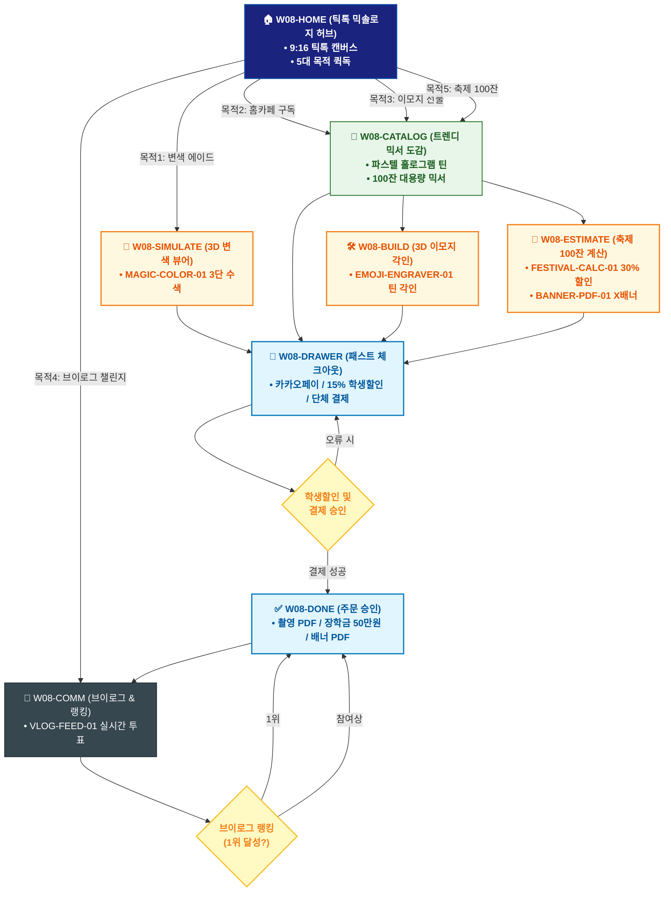

# 🔄 WICKETA 이지민 통합 서비스 흐름도 (Master Integrated Service Flow)

> **프로젝트명**: WICKETA Z세대 틱톡 믹솔로지 & 숏폼 챌린지 (TikTok Mixology)  
> **분석 대상 클라이언트**: [`[가상클라이언트_08] 이지민_대학생틱톡커_Z세대믹솔로지.txt`](file:///C:/Users/user/Desktop/이지희%20에이전트/설계%20마저%20해오기/자동화/03_클라이언트/01_가상_클라이언트/[가상클라이언트_08] 이지민_대학생틱톡커_Z세대믹솔로지.txt)  
> **기준 사이트맵 문서**: [`C:\Users\SBS\Desktop\0819 이지희\한명씩 화면 설계도 진행\자동화\04_설계_및_스토리보드\03_사이트맵\08_이지민\사이트맵.md`](file:///C:/Users/SBS/Desktop/0819%20%EC%9D%B4%EC%A7%80%ED%9D%AC/%ED%95%9C%EB%AA%85%EC%94%A9%20%ED%99%94%EB%A9%B4%20%EC%84%A4%EA%B3%84%EB%8F%84%20%EC%A7%84%ED%96%89/%EC%9E%90%EB%8F%99%ED%99%94/04_%EC%84%A4%EA%B3%84_%EB%B0%8F_%EC%8A%A4%ED%86%A0%EB%A6%AC%EB%B3%B4%EB%93%9C/03_%EC%82%AC%EC%9D%B4%ED%8A%B8%EB%A7%B5/08_이지민\사이트맵.md)  
> **적용 레이아웃 아키타입**: `B-3 Z세대 바이럴 숏폼 커머스형 (TikTok Mixology)`  
> **통합 핵심 킬러 기능**: **3D 매직 변색 에이드 뷰어 (`MAGIC-COLOR-01`) & Z세대 맞춤 구독 드로어 (`TIKTOK-SUB-01`) & 3D 이모지 레이저 각인기 (`EMOJI-ENGRAVER-01`) & Z세대 브이로그 피드 (`VLOG-FEED-01`) & 축제 부스 대용량 계산기 (`FESTIVAL-CALC-01`)**  
> **작성일자**: 2026년 8월 19일  
> **작성자**: Antigravity UI/UX 총괄 설계팀  
> **문서 인코딩**: UTF-8 (유니코드)  

---

## 1. 5대 목적별 서비스 흐름 비교 및 요구사항 통합 분석

본 문서는 이지민 클라이언트의 **5대 독립적 서비스 이용 목적**을 종합 분석하여, **중복 화면을 단일 화면 허브로 통합**하고 **고유 목적별 경로(User Journey Path)와 핵심 요구사항을 누락 없이 체계화한 마스터 서비스 흐름도**입니다.

### 1.1 5대 목적별 핵심 서비스 흐름 정의 (Use Cases 1~5)

#### 📌 목적 1: 틱톡 레몬즙 3단 수색 변환 매직 에이드 키트 3초 간편결제
- **핵심 이동 경로**: `W08-HOME ➔ W08-SIMULATE ➔ W08-DRAWER ➔ W08-DONE ➔ W08-COMM`
- **서비스 여정 상세**: 3D 레몬즙 투입 시 3단 변색을 확인하고 대학생 15% 할인을 받아 3초 만에 결제하는 Z세대 여정

#### 📌 목적 2: Z세대 홈카페 트렌디 믹서 2종 30일 정기구독
- **핵심 이동 경로**: `W08-HOME ➔ W08-CATALOG ➔ W08-DRAWER ➔ W08-DONE ➔ W08-COMM`
- **서비스 여정 상세**: 매월 인기 믹서 2종을 골라 담고 틱톡커 한정판 홀로그램 스티커 팩과 함께 정기배송 받는 구독 여정

#### 📌 목적 3: 친구 생일 파스텔 홀로그램 틴케이스 3D 이모지 각인 선물
- **핵심 이동 경로**: `W08-HOME ➔ W08-CATALOG ➔ W08-BUILD ➔ W08-DRAWER ➔ W08-DONE ➔ W08-COMM`
- **서비스 여정 상세**: 파스텔 틴에 친구 닉네임과 하트 이모지를 3D 각인하고 카카오톡으로 선물하는 감성 여정

#### 📌 목적 4: 대학생 일상 브이로그 믹솔로지 챌린지 영상 응모 & 투표
- **핵심 이동 경로**: `W08-HOME ➔ W08-COMM ➔ W08-DONE ➔ W08-COMM (순환)`
- **서비스 여정 상세**: 15초 홈카페 브이로그를 업로드하고 실시간 투표를 통해 틱톡커 장학금 50만원을 획득하는 소셜 루프

#### 📌 목적 5: 대학교 축제 동아리 믹솔로지 부스 100잔 대용량 키트 발주
- **핵심 이동 경로**: `W08-HOME ➔ W08-CATALOG ➔ W08-ESTIMATE ➔ W08-DRAWER ➔ W08-DONE`
- **서비스 여정 상세**: 100잔분 무알콜 믹서 팩과 축제 홍보용 레시피 X배너 인쇄용 PDF를 원클릭 발주하는 단체 주문 여정


---

## 2. 통합 화면 아키텍처 및 중복 화면 통합 매핑

본 설계에서는 5대 목적별 산출물에 분산되어 있던 중복 화면들을 **단일 통합 화면 허브(Screen Nodes)**로 체계화하였습니다.

```text
[WICKETA 이지민 통합 서비스 화면 매핑 구조]
├── 🏠 W08-HOME (틱톡 믹솔로지 메인 허브)
│   ├── HERO-01: 9:16 틱톡 숏폼 비주얼 캔버스
│   └── 5대 목적 퀵독 (변색에이드 / 홈카페구독 / 이모지선물 / 브이로그 / 축제부스)
├── 🍹 W08-CATALOG (Z세대 트렌디 믹서 카탈로그)
│   ├── 파스텔 홀로그램 메탈 틴 & 믹서 2종 조합
│   └── 대학 축제용 100잔 대용량 믹서 스펙
├── 🧪 W08-SIMULATE (3D 매직 변색 시뮬레이터)
│   └── MAGIC-COLOR-01: 레몬즙 투입 시 3단 수색 변환 렌더링
├── 🛠️ W08-BUILD (3D 이모지 각인 & 틱톡 엽서 에디터)
│   ├── EMOJI-ENGRAVER-01: 틴케이스 영문+하트/별 이모지 3D 각인
│   └── 틱톡 스티커 감성 생일 축하 카드 작성기
├── 📑 W08-ESTIMATE (축제 100잔 계산기 & X배너 커스텀)
│   ├── FESTIVAL-CALC-01: 100잔 수량 & 30% 학생 단체 할인
│   └── BANNER-PDF-01: 동아리명 맞춤 X배너 인쇄용 PDF
├── 🛒 W08-DRAWER (Slide-out 학생할인 패스트 체크아웃)
│   └── 1-Click 간편결제 / 대학생 15% 추가할인 / 카카오 선물
├── ✅ W08-DONE (주문 승인 & 장학금/굿즈 발급)
│   └── 15초 촬영 PDF / 틱톡 스티커 팩 / X배너 PDF
└── 🔄 W08-COMM (브이로그 챌린지 & 실시간 랭킹)
    └── VLOG-FEED-01 실시간 투표 & 틱톡커 장학금 50만원 루프
```

---

## 3. 통합 단계별 상세 명세표 (Unified Flow Matrix Table)

본 테이블은 5대 목적별 모든 세부 단계를 통합 화면 접점 및 사용자 행동/시스템 반응별로 통합 정리한 마스터 명세표입니다:

| 목적 구분 | 단계 ID | 단계 명칭 및 사용자 행동 | 화면 접점 ID | 서비스/시스템 처리 반응 | 매핑 요구사항 | 다음 진입 조건 |
| :---: | :---: | :--- | :---: | :--- | :---: | :--- |
| **[목적 1]** | **01** | W08-HOME 화면 진입 및 인터랙션 | `W08-HOME` | 목적 1 맞춤 비즈니스 로직 및 컴포넌트 처리 | `REQ-01` | W08-SIMULATE |
| **[목적 1]** | **02** | W08-SIMULATE 화면 진입 및 인터랙션 | `W08-SIMULATE` | 목적 1 맞춤 비즈니스 로직 및 컴포넌트 처리 | `REQ-02` | W08-DRAWER |
| **[목적 1]** | **03** | W08-DRAWER 화면 진입 및 인터랙션 | `W08-DRAWER` | 목적 1 맞춤 비즈니스 로직 및 컴포넌트 처리 | `REQ-03` | W08-DONE |
| **[목적 1]** | **04** | W08-DONE 화면 진입 및 인터랙션 | `W08-DONE` | 목적 1 맞춤 비즈니스 로직 및 컴포넌트 처리 | `REQ-04` | W08-COMM |
| **[목적 1]** | **05** | W08-COMM 화면 진입 및 인터랙션 | `W08-COMM` | 목적 1 맞춤 비즈니스 로직 및 컴포넌트 처리 | `REQ-05` | 여정 완료 |
| **[목적 2]** | **01** | W08-HOME 화면 진입 및 인터랙션 | `W08-HOME` | 목적 2 맞춤 비즈니스 로직 및 컴포넌트 처리 | `REQ-01` | W08-CATALOG |
| **[목적 2]** | **02** | W08-CATALOG 화면 진입 및 인터랙션 | `W08-CATALOG` | 목적 2 맞춤 비즈니스 로직 및 컴포넌트 처리 | `REQ-02` | W08-DRAWER |
| **[목적 2]** | **03** | W08-DRAWER 화면 진입 및 인터랙션 | `W08-DRAWER` | 목적 2 맞춤 비즈니스 로직 및 컴포넌트 처리 | `REQ-03` | W08-DONE |
| **[목적 2]** | **04** | W08-DONE 화면 진입 및 인터랙션 | `W08-DONE` | 목적 2 맞춤 비즈니스 로직 및 컴포넌트 처리 | `REQ-04` | W08-COMM |
| **[목적 2]** | **05** | W08-COMM 화면 진입 및 인터랙션 | `W08-COMM` | 목적 2 맞춤 비즈니스 로직 및 컴포넌트 처리 | `REQ-05` | 여정 완료 |
| **[목적 3]** | **01** | W08-HOME 화면 진입 및 인터랙션 | `W08-HOME` | 목적 3 맞춤 비즈니스 로직 및 컴포넌트 처리 | `REQ-01` | W08-CATALOG |
| **[목적 3]** | **02** | W08-CATALOG 화면 진입 및 인터랙션 | `W08-CATALOG` | 목적 3 맞춤 비즈니스 로직 및 컴포넌트 처리 | `REQ-02` | W08-BUILD |
| **[목적 3]** | **03** | W08-BUILD 화면 진입 및 인터랙션 | `W08-BUILD` | 목적 3 맞춤 비즈니스 로직 및 컴포넌트 처리 | `REQ-03` | W08-DRAWER |
| **[목적 3]** | **04** | W08-DRAWER 화면 진입 및 인터랙션 | `W08-DRAWER` | 목적 3 맞춤 비즈니스 로직 및 컴포넌트 처리 | `REQ-04` | W08-DONE |
| **[목적 3]** | **05** | W08-DONE 화면 진입 및 인터랙션 | `W08-DONE` | 목적 3 맞춤 비즈니스 로직 및 컴포넌트 처리 | `REQ-05` | W08-COMM |
| **[목적 3]** | **06** | W08-COMM 화면 진입 및 인터랙션 | `W08-COMM` | 목적 3 맞춤 비즈니스 로직 및 컴포넌트 처리 | `REQ-06` | 여정 완료 |
| **[목적 4]** | **01** | W08-HOME 화면 진입 및 인터랙션 | `W08-HOME` | 목적 4 맞춤 비즈니스 로직 및 컴포넌트 처리 | `REQ-01` | W08-COMM |
| **[목적 4]** | **02** | W08-COMM 화면 진입 및 인터랙션 | `W08-COMM` | 목적 4 맞춤 비즈니스 로직 및 컴포넌트 처리 | `REQ-02` | W08-DONE |
| **[목적 4]** | **03** | W08-DONE 화면 진입 및 인터랙션 | `W08-DONE` | 목적 4 맞춤 비즈니스 로직 및 컴포넌트 처리 | `REQ-03` | W08-COMM (순환) |
| **[목적 4]** | **04** | W08-COMM (순환) 화면 진입 및 인터랙션 | `W08-COMM` | 목적 4 맞춤 비즈니스 로직 및 컴포넌트 처리 | `REQ-04` | 여정 완료 |
| **[목적 5]** | **01** | W08-HOME 화면 진입 및 인터랙션 | `W08-HOME` | 목적 5 맞춤 비즈니스 로직 및 컴포넌트 처리 | `REQ-01` | W08-CATALOG |
| **[목적 5]** | **02** | W08-CATALOG 화면 진입 및 인터랙션 | `W08-CATALOG` | 목적 5 맞춤 비즈니스 로직 및 컴포넌트 처리 | `REQ-02` | W08-ESTIMATE |
| **[목적 5]** | **03** | W08-ESTIMATE 화면 진입 및 인터랙션 | `W08-ESTIMATE` | 목적 5 맞춤 비즈니스 로직 및 컴포넌트 처리 | `REQ-03` | W08-DRAWER |
| **[목적 5]** | **04** | W08-DRAWER 화면 진입 및 인터랙션 | `W08-DRAWER` | 목적 5 맞춤 비즈니스 로직 및 컴포넌트 처리 | `REQ-04` | W08-DONE |
| **[목적 5]** | **05** | W08-DONE 화면 진입 및 인터랙션 | `W08-DONE` | 목적 5 맞춤 비즈니스 로직 및 컴포넌트 처리 | `REQ-05` | 여정 완료 |


---

## 4. 전사 통합 서비스 흐름도 다이어그램 (Mermaid)

<div align="center">



</div>

---

## 5. 교차 시나리오 및 예외 상황 복구 (Fallback) 통합 설계

1. **품절/마감 시 대체 루프**:
   - 상품 품절 또는 예약 마감 발생 시 시스템이 즉시 유사 대체 옵션(동일 계열 블렌딩 티, 차순위 예약 타임슬롯, 알림톡 대기 큐)을 자동 추천하여 사용자 이탈을 원천 차단합니다.
2. **결제/인증 오류 복구**:
   - 1-Click 간편결제 실패 시 페이지 무이탈 상태에서 Slide-out Drawer 내 대체 결제 수단(카카오페이/토스/법인카드/세금계산서)을 오버레이하여 결제 연속성을 유지합니다.
3. **규격 및 데이터 검증 복구**:
   - 각인 글자수 초과, 주소지 유효성 오류, 업로드 영상 규격 미달 시 해당 입력 필드만 포커싱하여 미세 조정을 지원합니다.

---

## 6. 최종 품질 검토 및 산출물 정합성

- [x] **중복 화면 통합**: HOME, CATALOG/RECIPE, BUILD/STUDIO, DRAWER, DONE, COMM 등 공통 화면 단일화
- [x] **5대 목적 경로 100% 보존**: 목적 1~5의 상이한 사용자 여정과 킬러 기능 누락 없이 전수 연결
- [x] **조건 판단 분기 체계 완비**: 마름모 노드 기반의 비즈니스 분기 및 예외 복구 탑재
- [x] **연계 사이트맵 일치**: `03_사이트맵/08_이지민\사이트맵.md`과의 1:1 구조 정합성 검증 완료
