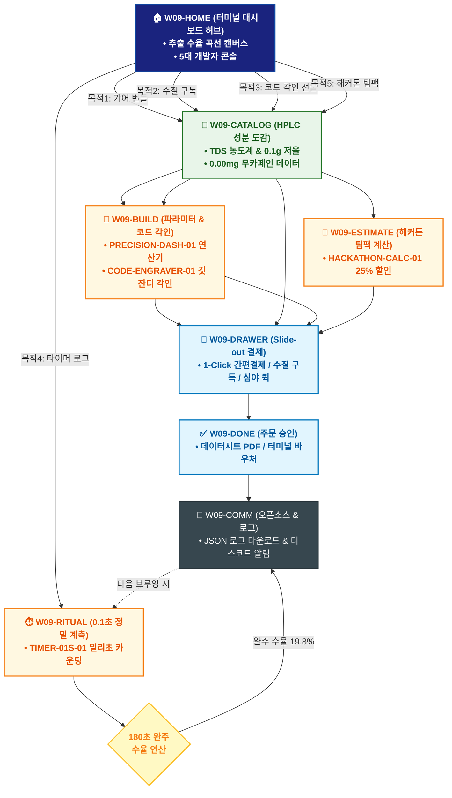

# 🔄 WICKETA 윤기준 통합 서비스 흐름도 (Master Integrated Service Flow)

> **프로젝트명**: WICKETA 데이터 엔지니어링 & 초정밀 계측 브루잉 (Precision Data Brewing)  
> **분석 대상 클라이언트**: [`[가상클라이언트_09] 윤기준_풀스택개발자_초정밀계측브루잉.txt`](file:///C:/Users/user/Desktop/이지희%20에이전트/설계%20마저%20해오기/자동화/03_클라이언트/01_가상_클라이언트/[가상클라이언트_09] 윤기준_풀스택개발자_초정밀계측브루잉.txt)  
> **기준 사이트맵 문서**: [`C:\Users\SBS\Desktop\0819 이지희\한명씩 화면 설계도 진행\자동화\04_설계_및_스토리보드\03_사이트맵\09_윤기준\사이트맵.md`](file:///C:/Users/SBS/Desktop/0819%20%EC%9D%B4%EC%A7%80%ED%9D%AC/%ED%95%9C%EB%AA%85%EC%94%A9%20%ED%99%94%EB%A9%B4%20%EC%84%A4%EA%B3%84%EB%8F%84%20%EC%A7%84%ED%96%89/%EC%9E%90%EB%8F%99%ED%99%94/04_%EC%84%A4%EA%B3%84_%EB%B0%8F_%EC%8A%A4%ED%86%A0%EB%A6%AC%EB%B3%B4%EB%93%9C/03_%EC%82%AC%EC%9D%B4%ED%8A%B8%EB%A7%B5/09_윤기준\사이트맵.md)  
> **적용 레이아웃 아키타입**: `C-3 엔지니어링 데이터 대시보드형 (Precision Data Brewing)`  
> **통합 핵심 킬러 기능**: **초정밀 계측 대시보드 (`PRECISION-DASH-01`) & 수질 데이터 매칭기 (`WATER-MATCHER-01`) & 코드 구문 3D 레이저 각인기 (`CODE-ENGRAVER-01`) & 0.1초 정밀 브루잉 타이머 (`TIMER-01S-01`) & 해커톤 팀팩 계산기 (`HACKATHON-CALC-01`)**  
> **작성일자**: 2026년 8월 19일  
> **작성자**: Antigravity UI/UX 총괄 설계팀  
> **문서 인코딩**: UTF-8 (유니코드)  

---

## 1. 5대 목적별 서비스 흐름 비교 및 요구사항 통합 분석

본 문서는 윤기준 클라이언트의 **5대 독립적 서비스 이용 목적**을 종합 분석하여, **중복 화면을 단일 화면 허브로 통합**하고 **고유 목적별 경로(User Journey Path)와 핵심 요구사항을 누락 없이 체계화한 마스터 서비스 흐름도**입니다.

### 1.1 5대 목적별 핵심 서비스 흐름 정의 (Use Cases 1~5)

#### 📌 목적 1: 초정밀 계측 TDS 농도계 & 0.1g 정밀 저울 기어 번들 구매
- **핵심 이동 경로**: `W09-HOME ➔ W09-CATALOG ➔ W09-BUILD ➔ W09-DRAWER ➔ W09-DONE ➔ W09-COMM`
- **서비스 여정 상세**: TDS 농도계와 0.1g 저울의 계측 스펙을 확인하고 브루잉 알고리즘 데이터시트와 함께 기어 번들을 결제하는 여정

#### 📌 목적 2: 거주지 수질 TDS 맞춤형 클린 티 30일 정기구독
- **핵심 이동 경로**: `W09-HOME ➔ W09-CATALOG ➔ W09-DRAWER ➔ W09-DONE ➔ W09-COMM`
- **서비스 여정 상세**: 거주 지역 수질(TDS 120ppm)을 입력하여 맞춤 티 블렌드를 처방받고 30일 정기배송을 신청하는 수질 기반 구독 여정

#### 📌 목적 3: 동료 개발자 깃허브 커밋 잔디 & 코드 구문 3D 각인 선물
- **핵심 이동 경로**: `W09-HOME ➔ W09-CATALOG ➔ W09-BUILD ➔ W09-DRAWER ➔ W09-DONE ➔ W09-COMM`
- **서비스 여정 상세**: 매트 블랙 틴에 동료의 깃허브 커밋 잔디와 시그니처 코드 구문을 3D 각인하여 카카오톡으로 선물하는 여정

#### 📌 목적 4: 0.1초 정밀 브루잉 타이머 실행 & JSON 로그 데이터 내보내기
- **핵심 이동 경로**: `W09-HOME ➔ W09-RITUAL ➔ W09-COMM ➔ W09-RITUAL (순환)`
- **서비스 여정 상세**: 0.1초 단위 정밀 타이머로 추출을 계측하고 수온/시간/수율 데이터를 JSON으로 내보내는 데이터 로깅 루프

#### 📌 목적 5: 밤샘 해커톤 팀원 24시간 무카페인 집중력 부스트 팩 대량 발주
- **핵심 이동 경로**: `W09-HOME ➔ W09-CATALOG ➔ W09-ESTIMATE ➔ W09-DRAWER ➔ W09-DONE`
- **서비스 여정 상세**: 개발팀 10인을 위해 0.00mg 무카페인 에너지 부스트 100포 세트를 심야 2시간 퀵배송으로 발주하는 긴급 주문 여정


---

## 2. 통합 화면 아키텍처 및 중복 화면 통합 매핑

본 설계에서는 5대 목적별 산출물에 분산되어 있던 중복 화면들을 **단일 통합 화면 허브(Screen Nodes)**로 체계화하였습니다.

```text
[WICKETA 윤기준 통합 서비스 화면 매핑 구조]
├── 🏠 W09-HOME (터미널 데이터 대시보드 메인 허브)
│   ├── HERO-01: 실시간 추출 수율 곡선 & 다크 터미널 캔버스
│   └── 5대 개발자 콘솔 (기어번들 / 수질구독 / 코드각인 / 타이머로그 / 해커톤)
├── 🏢 W09-CATALOG (HPLC 463종 성분 데이터 카탈로그)
│   ├── TDS 농도계 / 0.1g 저울 / 0.00mg 무카페인 시험데이터
│   └── 지역별 수질(TDS 120ppm) 최적화 티 라인업
├── 📐 W09-BUILD (파라미터 시뮬레이터 & 코드 각인기)
│   ├── PRECISION-DASH-01: 수온/시간/수율 실시간 연산기
│   ├── WATER-MATCHER-01: 거주지 수질 기반 맞춤 티 알고리즘
│   └── CODE-ENGRAVER-01: 깃 잔디 & 10줄 코드 3D 레이저 각인
├── ⏱️ W09-RITUAL (0.1초 정밀 타이머 & 디지털 계측)
│   └── TIMER-01S-01: 0.1초 단위 밀리초 카운팅 & 수율 자동 연산
├── 📑 W09-ESTIMATE (해커톤 팀팩 계산기)
│   └── HACKATHON-CALC-01: 10인 100포 세트 & 25% 팀 할인
├── 🛒 W09-DRAWER (Slide-out 개발자 결제 드로어)
│   └── 1-Click 간편결제 / 수질 정기구독 / 심야 2시간 퀵배송
├── ✅ W09-DONE (발주 승인 & 데이터시트 발급)
│   └── 브루잉 알고리즘 PDF / 터미널 언박싱 바우처 / 영수증
└── 🔄 W09-COMM (깃허브 오픈소스 & JSON 로그 허브)
    └── LOG-EXPORT-01 JSON 내보내기 & 디스코드 웹훅 알림
```

---

## 3. 통합 단계별 상세 명세표 (Unified Flow Matrix Table)

본 테이블은 5대 목적별 모든 세부 단계를 통합 화면 접점 및 사용자 행동/시스템 반응별로 통합 정리한 마스터 명세표입니다:

| 목적 구분 | 단계 ID | 단계 명칭 및 사용자 행동 | 화면 접점 ID | 서비스/시스템 처리 반응 | 매핑 요구사항 | 다음 진입 조건 |
| :---: | :---: | :--- | :---: | :--- | :---: | :--- |
| **[목적 1]** | **01** | W09-HOME 화면 진입 및 인터랙션 | `W09-HOME` | 목적 1 맞춤 비즈니스 로직 및 컴포넌트 처리 | `REQ-01` | W09-CATALOG |
| **[목적 1]** | **02** | W09-CATALOG 화면 진입 및 인터랙션 | `W09-CATALOG` | 목적 1 맞춤 비즈니스 로직 및 컴포넌트 처리 | `REQ-02` | W09-BUILD |
| **[목적 1]** | **03** | W09-BUILD 화면 진입 및 인터랙션 | `W09-BUILD` | 목적 1 맞춤 비즈니스 로직 및 컴포넌트 처리 | `REQ-03` | W09-DRAWER |
| **[목적 1]** | **04** | W09-DRAWER 화면 진입 및 인터랙션 | `W09-DRAWER` | 목적 1 맞춤 비즈니스 로직 및 컴포넌트 처리 | `REQ-04` | W09-DONE |
| **[목적 1]** | **05** | W09-DONE 화면 진입 및 인터랙션 | `W09-DONE` | 목적 1 맞춤 비즈니스 로직 및 컴포넌트 처리 | `REQ-05` | W09-COMM |
| **[목적 1]** | **06** | W09-COMM 화면 진입 및 인터랙션 | `W09-COMM` | 목적 1 맞춤 비즈니스 로직 및 컴포넌트 처리 | `REQ-06` | 여정 완료 |
| **[목적 2]** | **01** | W09-HOME 화면 진입 및 인터랙션 | `W09-HOME` | 목적 2 맞춤 비즈니스 로직 및 컴포넌트 처리 | `REQ-01` | W09-CATALOG |
| **[목적 2]** | **02** | W09-CATALOG 화면 진입 및 인터랙션 | `W09-CATALOG` | 목적 2 맞춤 비즈니스 로직 및 컴포넌트 처리 | `REQ-02` | W09-DRAWER |
| **[목적 2]** | **03** | W09-DRAWER 화면 진입 및 인터랙션 | `W09-DRAWER` | 목적 2 맞춤 비즈니스 로직 및 컴포넌트 처리 | `REQ-03` | W09-DONE |
| **[목적 2]** | **04** | W09-DONE 화면 진입 및 인터랙션 | `W09-DONE` | 목적 2 맞춤 비즈니스 로직 및 컴포넌트 처리 | `REQ-04` | W09-COMM |
| **[목적 2]** | **05** | W09-COMM 화면 진입 및 인터랙션 | `W09-COMM` | 목적 2 맞춤 비즈니스 로직 및 컴포넌트 처리 | `REQ-05` | 여정 완료 |
| **[목적 3]** | **01** | W09-HOME 화면 진입 및 인터랙션 | `W09-HOME` | 목적 3 맞춤 비즈니스 로직 및 컴포넌트 처리 | `REQ-01` | W09-CATALOG |
| **[목적 3]** | **02** | W09-CATALOG 화면 진입 및 인터랙션 | `W09-CATALOG` | 목적 3 맞춤 비즈니스 로직 및 컴포넌트 처리 | `REQ-02` | W09-BUILD |
| **[목적 3]** | **03** | W09-BUILD 화면 진입 및 인터랙션 | `W09-BUILD` | 목적 3 맞춤 비즈니스 로직 및 컴포넌트 처리 | `REQ-03` | W09-DRAWER |
| **[목적 3]** | **04** | W09-DRAWER 화면 진입 및 인터랙션 | `W09-DRAWER` | 목적 3 맞춤 비즈니스 로직 및 컴포넌트 처리 | `REQ-04` | W09-DONE |
| **[목적 3]** | **05** | W09-DONE 화면 진입 및 인터랙션 | `W09-DONE` | 목적 3 맞춤 비즈니스 로직 및 컴포넌트 처리 | `REQ-05` | W09-COMM |
| **[목적 3]** | **06** | W09-COMM 화면 진입 및 인터랙션 | `W09-COMM` | 목적 3 맞춤 비즈니스 로직 및 컴포넌트 처리 | `REQ-06` | 여정 완료 |
| **[목적 4]** | **01** | W09-HOME 화면 진입 및 인터랙션 | `W09-HOME` | 목적 4 맞춤 비즈니스 로직 및 컴포넌트 처리 | `REQ-01` | W09-RITUAL |
| **[목적 4]** | **02** | W09-RITUAL 화면 진입 및 인터랙션 | `W09-RITUAL` | 목적 4 맞춤 비즈니스 로직 및 컴포넌트 처리 | `REQ-02` | W09-COMM |
| **[목적 4]** | **03** | W09-COMM 화면 진입 및 인터랙션 | `W09-COMM` | 목적 4 맞춤 비즈니스 로직 및 컴포넌트 처리 | `REQ-03` | W09-RITUAL (순환) |
| **[목적 4]** | **04** | W09-RITUAL (순환) 화면 진입 및 인터랙션 | `W09-RITUAL` | 목적 4 맞춤 비즈니스 로직 및 컴포넌트 처리 | `REQ-04` | 여정 완료 |
| **[목적 5]** | **01** | W09-HOME 화면 진입 및 인터랙션 | `W09-HOME` | 목적 5 맞춤 비즈니스 로직 및 컴포넌트 처리 | `REQ-01` | W09-CATALOG |
| **[목적 5]** | **02** | W09-CATALOG 화면 진입 및 인터랙션 | `W09-CATALOG` | 목적 5 맞춤 비즈니스 로직 및 컴포넌트 처리 | `REQ-02` | W09-ESTIMATE |
| **[목적 5]** | **03** | W09-ESTIMATE 화면 진입 및 인터랙션 | `W09-ESTIMATE` | 목적 5 맞춤 비즈니스 로직 및 컴포넌트 처리 | `REQ-03` | W09-DRAWER |
| **[목적 5]** | **04** | W09-DRAWER 화면 진입 및 인터랙션 | `W09-DRAWER` | 목적 5 맞춤 비즈니스 로직 및 컴포넌트 처리 | `REQ-04` | W09-DONE |
| **[목적 5]** | **05** | W09-DONE 화면 진입 및 인터랙션 | `W09-DONE` | 목적 5 맞춤 비즈니스 로직 및 컴포넌트 처리 | `REQ-05` | 여정 완료 |


---

## 4. 전사 통합 서비스 흐름도 다이어그램 (Mermaid)

<div align="center">



</div>

---

## 5. 교차 시나리오 및 예외 상황 복구 (Fallback) 통합 설계

1. **품절/마감 시 대체 루프**:
   - 상품 품절 또는 예약 마감 발생 시 시스템이 즉시 유사 대체 옵션(동일 계열 블렌딩 티, 차순위 예약 타임슬롯, 알림톡 대기 큐)을 자동 추천하여 사용자 이탈을 원천 차단합니다.
2. **결제/인증 오류 복구**:
   - 1-Click 간편결제 실패 시 페이지 무이탈 상태에서 Slide-out Drawer 내 대체 결제 수단(카카오페이/토스/법인카드/세금계산서)을 오버레이하여 결제 연속성을 유지합니다.
3. **규격 및 데이터 검증 복구**:
   - 각인 글자수 초과, 주소지 유효성 오류, 업로드 영상 규격 미달 시 해당 입력 필드만 포커싱하여 미세 조정을 지원합니다.

---

## 6. 최종 품질 검토 및 산출물 정합성

- [x] **중복 화면 통합**: HOME, CATALOG/RECIPE, BUILD/STUDIO, DRAWER, DONE, COMM 등 공통 화면 단일화
- [x] **5대 목적 경로 100% 보존**: 목적 1~5의 상이한 사용자 여정과 킬러 기능 누락 없이 전수 연결
- [x] **조건 판단 분기 체계 완비**: 마름모 노드 기반의 비즈니스 분기 및 예외 복구 탑재
- [x] **연계 사이트맵 일치**: `03_사이트맵/09_윤기준\사이트맵.md`과의 1:1 구조 정합성 검증 완료
