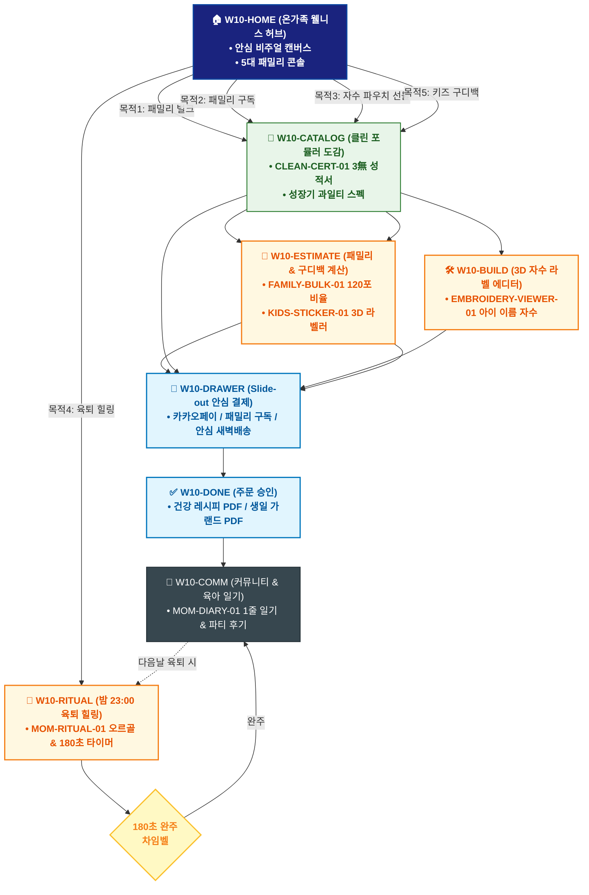

# 🔄 WICKETA 서지안 통합 서비스 흐름도 (Master Integrated Service Flow)

> **프로젝트명**: WICKETA 온가족 안심 웰니스 & 패밀리 케어 (Family Wellness)  
> **분석 대상 클라이언트**: [`[가상클라이언트_10] 서지안_워킹맘육아인플루언서_온가족안심웰니스.txt`](file:///C:/Users/user/Desktop/이지희%20에이전트/설계%20마저%20해오기/자동화/03_클라이언트/01_가상_클라이언트/[가상클라이언트_10] 서지안_워킹맘육아인플루언서_온가족안심웰니스.txt)  
> **기준 사이트맵 문서**: [`C:\Users\SBS\Desktop\0819 이지희\한명씩 화면 설계도 진행\자동화\04_설계_및_스토리보드\03_사이트맵\10_서지안\사이트맵.md`](file:///C:/Users/SBS/Desktop/0819%20%EC%9D%B4%EC%A7%80%ED%9D%AC/%ED%95%9C%EB%AA%85%EC%94%A9%20%ED%99%94%EB%A9%B4%20%EC%84%A4%EA%B3%84%EB%8F%84%20%EC%A7%84%ED%96%89/%EC%9E%90%EB%8F%99%ED%99%94/04_%EC%84%A4%EA%B3%84_%EB%B0%8F_%EC%8A%A4%ED%86%A0%EB%A6%AC%EB%B3%B4%EB%93%9C/03_%EC%82%AC%EC%9D%B4%ED%8A%B8%EB%A7%B5/10_서지안\사이트맵.md)  
> **적용 레이아웃 아키타입**: `A-4 온가족 안심 웰니스 매거진형 (Family Wellness)`  
> **통합 핵심 킬러 기능**: **온가족 안심 120포 계산기 (`FAMILY-BULK-01`) & 성장기 맞춤 티 플래너 (`FAMILY-PLANNER-01`) & 3D 자수 라벨 시뮬레이터 (`EMBROIDERY-VIEWER-01`) & 육퇴 안식 플레이어 (`MOM-RITUAL-01`) & 키즈 구디백 계산기 (`GOODIE-CALC-01`)**  
> **작성일자**: 2026년 8월 19일  
> **작성자**: Antigravity UI/UX 총괄 설계팀  
> **문서 인코딩**: UTF-8 (유니코드)  

---

## 1. 5대 목적별 서비스 흐름 비교 및 요구사항 통합 분석

본 문서는 서지안 클라이언트의 **5대 독립적 서비스 이용 목적**을 종합 분석하여, **중복 화면을 단일 화면 허브로 통합**하고 **고유 목적별 경로(User Journey Path)와 핵심 요구사항을 누락 없이 체계화한 마스터 서비스 흐름도**입니다.

### 1.1 5대 목적별 핵심 서비스 흐름 정의 (Use Cases 1~5)

#### 📌 목적 1: 4인 가족 온가족 안심 무카페인/무설탕 120포 패밀리 벌크 구매
- **핵심 이동 경로**: `W10-HOME ➔ W10-CATALOG ➔ W10-ESTIMATE ➔ W10-DRAWER ➔ W10-DONE ➔ W10-COMM`
- **서비스 여정 상세**: KTR 공인 무카페인/무설탕 성적서를 확인하고 4인 가족 맞춤 120포 대용량 벌크를 20% 할인 결제하는 안심 여정

#### 📌 목적 2: 성장기 아이 & 부모 맞춤 힐링 티 30일 패밀리 정기구독
- **핵심 이동 경로**: `W10-HOME ➔ W10-CATALOG ➔ W10-DRAWER ➔ W10-DONE ➔ W10-COMM`
- **서비스 여정 상세**: 아이용 과일차와 부모용 안식차를 매월 집으로 배송받고 월간 육아 리포트를 제공받는 패밀리 구독 여정

#### 📌 목적 3: 조리원 동기 모임/키즈파티 친환경 무표백 파우치 안심 선물
- **핵심 이동 경로**: `W10-HOME ➔ W10-CATALOG ➔ W10-BUILD ➔ W10-DRAWER ➔ W10-DONE ➔ W10-COMM`
- **서비스 여정 상세**: 친환경 파우치에 아이 이름을 3D 자수로 새겨 육아 응원 카드와 함께 카카오톡으로 선물하는 감성 여정

#### 📌 목적 4: 밤 23:00 육퇴 후 180초 힐링 안식 의식 & 감정 일기
- **핵심 이동 경로**: `W10-HOME ➔ W10-RITUAL ➔ W10-COMM ➔ W10-RITUAL (순환)`
- **서비스 여정 상세**: 밤 23:00 육퇴 후 432Hz 오르골 음향과 180초 호흡으로 힐링하고 1줄 육아 감정 일기를 작성하는 습관 루프

#### 📌 목적 5: 어린이집/유치원 생일파티 20인분 안심 키즈 구디백 대량 발주
- **핵심 이동 경로**: `W10-HOME ➔ W10-CATALOG ➔ W10-ESTIMATE ➔ W10-DRAWER ➔ W10-DONE`
- **서비스 여정 상세**: 유치원 생일파티용 20인분 무카페인 과일티 미니 틴에 3D 캐릭터 라벨을 부착하여 대량 발주하는 프로세스


---

## 2. 통합 화면 아키텍처 및 중복 화면 통합 매핑

본 설계에서는 5대 목적별 산출물에 분산되어 있던 중복 화면들을 **단일 통합 화면 허브(Screen Nodes)**로 체계화하였습니다.

```text
[WICKETA 서지안 통합 서비스 화면 매핑 구조]
├── 🏠 W10-HOME (온가족 웰니스 매거진 메인 허브)
│   ├── HERO-01: 온가족 안심 비주얼 캔버스 (낮/육퇴 23:00 모드)
│   └── 5대 패밀리 콘솔 (120포벌크 / 패밀리구독 / 자수선물 / 육퇴힐링 / 키즈구디백)
├── 🏢 W10-CATALOG (온가족 안심 클린 포뮬러 카탈로그)
│   ├── CLEAN-CERT-01 0.00mg 무카페인/0kcal/3無 성적서
│   └── 성장기 과일티 & 오가닉 무표백 파우치 스펙
├── 📑 W10-ESTIMATE (패밀리/구디백 계산기 & 라벨러)
│   ├── FAMILY-BULK-01: 4인 가족 맞춤 120포 황금비율 계산기
│   ├── KIDS-STICKER-01: 아이 사진/캐릭터 3D 스티커 라벨러
│   └── GOODIE-CALC-01: 유치원 20인분 단체 20% 할인기
├── 🛠️ W10-BUILD (3D 아이 이름 자수 에디터)
│   ├── EMBROIDERY-VIEWER-01: 파우치 3D 오가닉 자수 시뮬레이터
│   └── 따뜻한 육아 응원 메시지 카드 작성기
├── 🌙 W10-RITUAL (밤 23:00 육퇴 안식 플레이어)
│   └── MOM-RITUAL-01: 432Hz 오르골 음향 & 180초 호흡 가이드
├── 🛒 W10-DRAWER (Slide-out 안심 결제 드로어)
│   └── 카카오페이 1초 승인 / 30일 패밀리 구독 / 안심 새벽배송
├── ✅ W10-DONE (주문 승인 & 안심 레시피북 발급)
│   └── 건강 레시피 PDF / 생일 가랜드 PDF / 모바일 바우처
└── 🔄 W10-COMM (육아 커뮤니티 & 마이 맘스 일기)
    └── MOM-DIARY-01 육아 감정 일기 & 키즈파티 후기 피드
```

---

## 3. 통합 단계별 상세 명세표 (Unified Flow Matrix Table)

본 테이블은 5대 목적별 모든 세부 단계를 통합 화면 접점 및 사용자 행동/시스템 반응별로 통합 정리한 마스터 명세표입니다:

| 목적 구분 | 단계 ID | 단계 명칭 및 사용자 행동 | 화면 접점 ID | 서비스/시스템 처리 반응 | 매핑 요구사항 | 다음 진입 조건 |
| :---: | :---: | :--- | :---: | :--- | :---: | :--- |
| **[목적 1]** | **01** | W10-HOME 화면 진입 및 인터랙션 | `W10-HOME` | 목적 1 맞춤 비즈니스 로직 및 컴포넌트 처리 | `REQ-01` | W10-CATALOG |
| **[목적 1]** | **02** | W10-CATALOG 화면 진입 및 인터랙션 | `W10-CATALOG` | 목적 1 맞춤 비즈니스 로직 및 컴포넌트 처리 | `REQ-02` | W10-ESTIMATE |
| **[목적 1]** | **03** | W10-ESTIMATE 화면 진입 및 인터랙션 | `W10-ESTIMATE` | 목적 1 맞춤 비즈니스 로직 및 컴포넌트 처리 | `REQ-03` | W10-DRAWER |
| **[목적 1]** | **04** | W10-DRAWER 화면 진입 및 인터랙션 | `W10-DRAWER` | 목적 1 맞춤 비즈니스 로직 및 컴포넌트 처리 | `REQ-04` | W10-DONE |
| **[목적 1]** | **05** | W10-DONE 화면 진입 및 인터랙션 | `W10-DONE` | 목적 1 맞춤 비즈니스 로직 및 컴포넌트 처리 | `REQ-05` | W10-COMM |
| **[목적 1]** | **06** | W10-COMM 화면 진입 및 인터랙션 | `W10-COMM` | 목적 1 맞춤 비즈니스 로직 및 컴포넌트 처리 | `REQ-06` | 여정 완료 |
| **[목적 2]** | **01** | W10-HOME 화면 진입 및 인터랙션 | `W10-HOME` | 목적 2 맞춤 비즈니스 로직 및 컴포넌트 처리 | `REQ-01` | W10-CATALOG |
| **[목적 2]** | **02** | W10-CATALOG 화면 진입 및 인터랙션 | `W10-CATALOG` | 목적 2 맞춤 비즈니스 로직 및 컴포넌트 처리 | `REQ-02` | W10-DRAWER |
| **[목적 2]** | **03** | W10-DRAWER 화면 진입 및 인터랙션 | `W10-DRAWER` | 목적 2 맞춤 비즈니스 로직 및 컴포넌트 처리 | `REQ-03` | W10-DONE |
| **[목적 2]** | **04** | W10-DONE 화면 진입 및 인터랙션 | `W10-DONE` | 목적 2 맞춤 비즈니스 로직 및 컴포넌트 처리 | `REQ-04` | W10-COMM |
| **[목적 2]** | **05** | W10-COMM 화면 진입 및 인터랙션 | `W10-COMM` | 목적 2 맞춤 비즈니스 로직 및 컴포넌트 처리 | `REQ-05` | 여정 완료 |
| **[목적 3]** | **01** | W10-HOME 화면 진입 및 인터랙션 | `W10-HOME` | 목적 3 맞춤 비즈니스 로직 및 컴포넌트 처리 | `REQ-01` | W10-CATALOG |
| **[목적 3]** | **02** | W10-CATALOG 화면 진입 및 인터랙션 | `W10-CATALOG` | 목적 3 맞춤 비즈니스 로직 및 컴포넌트 처리 | `REQ-02` | W10-BUILD |
| **[목적 3]** | **03** | W10-BUILD 화면 진입 및 인터랙션 | `W10-BUILD` | 목적 3 맞춤 비즈니스 로직 및 컴포넌트 처리 | `REQ-03` | W10-DRAWER |
| **[목적 3]** | **04** | W10-DRAWER 화면 진입 및 인터랙션 | `W10-DRAWER` | 목적 3 맞춤 비즈니스 로직 및 컴포넌트 처리 | `REQ-04` | W10-DONE |
| **[목적 3]** | **05** | W10-DONE 화면 진입 및 인터랙션 | `W10-DONE` | 목적 3 맞춤 비즈니스 로직 및 컴포넌트 처리 | `REQ-05` | W10-COMM |
| **[목적 3]** | **06** | W10-COMM 화면 진입 및 인터랙션 | `W10-COMM` | 목적 3 맞춤 비즈니스 로직 및 컴포넌트 처리 | `REQ-06` | 여정 완료 |
| **[목적 4]** | **01** | W10-HOME 화면 진입 및 인터랙션 | `W10-HOME` | 목적 4 맞춤 비즈니스 로직 및 컴포넌트 처리 | `REQ-01` | W10-RITUAL |
| **[목적 4]** | **02** | W10-RITUAL 화면 진입 및 인터랙션 | `W10-RITUAL` | 목적 4 맞춤 비즈니스 로직 및 컴포넌트 처리 | `REQ-02` | W10-COMM |
| **[목적 4]** | **03** | W10-COMM 화면 진입 및 인터랙션 | `W10-COMM` | 목적 4 맞춤 비즈니스 로직 및 컴포넌트 처리 | `REQ-03` | W10-RITUAL (순환) |
| **[목적 4]** | **04** | W10-RITUAL (순환) 화면 진입 및 인터랙션 | `W10-RITUAL` | 목적 4 맞춤 비즈니스 로직 및 컴포넌트 처리 | `REQ-04` | 여정 완료 |
| **[목적 5]** | **01** | W10-HOME 화면 진입 및 인터랙션 | `W10-HOME` | 목적 5 맞춤 비즈니스 로직 및 컴포넌트 처리 | `REQ-01` | W10-CATALOG |
| **[목적 5]** | **02** | W10-CATALOG 화면 진입 및 인터랙션 | `W10-CATALOG` | 목적 5 맞춤 비즈니스 로직 및 컴포넌트 처리 | `REQ-02` | W10-ESTIMATE |
| **[목적 5]** | **03** | W10-ESTIMATE 화면 진입 및 인터랙션 | `W10-ESTIMATE` | 목적 5 맞춤 비즈니스 로직 및 컴포넌트 처리 | `REQ-03` | W10-DRAWER |
| **[목적 5]** | **04** | W10-DRAWER 화면 진입 및 인터랙션 | `W10-DRAWER` | 목적 5 맞춤 비즈니스 로직 및 컴포넌트 처리 | `REQ-04` | W10-DONE |
| **[목적 5]** | **05** | W10-DONE 화면 진입 및 인터랙션 | `W10-DONE` | 목적 5 맞춤 비즈니스 로직 및 컴포넌트 처리 | `REQ-05` | 여정 완료 |


---

## 4. 전사 통합 서비스 흐름도 다이어그램 (Mermaid)

<div align="center">



</div>

---

## 5. 교차 시나리오 및 예외 상황 복구 (Fallback) 통합 설계

1. **품절/마감 시 대체 루프**:
   - 상품 품절 또는 예약 마감 발생 시 시스템이 즉시 유사 대체 옵션(동일 계열 블렌딩 티, 차순위 예약 타임슬롯, 알림톡 대기 큐)을 자동 추천하여 사용자 이탈을 원천 차단합니다.
2. **결제/인증 오류 복구**:
   - 1-Click 간편결제 실패 시 페이지 무이탈 상태에서 Slide-out Drawer 내 대체 결제 수단(카카오페이/토스/법인카드/세금계산서)을 오버레이하여 결제 연속성을 유지합니다.
3. **규격 및 데이터 검증 복구**:
   - 각인 글자수 초과, 주소지 유효성 오류, 업로드 영상 규격 미달 시 해당 입력 필드만 포커싱하여 미세 조정을 지원합니다.

---

## 6. 최종 품질 검토 및 산출물 정합성

- [x] **중복 화면 통합**: HOME, CATALOG/RECIPE, BUILD/STUDIO, DRAWER, DONE, COMM 등 공통 화면 단일화
- [x] **5대 목적 경로 100% 보존**: 목적 1~5의 상이한 사용자 여정과 킬러 기능 누락 없이 전수 연결
- [x] **조건 판단 분기 체계 완비**: 마름모 노드 기반의 비즈니스 분기 및 예외 복구 탑재
- [x] **연계 사이트맵 일치**: `03_사이트맵/10_서지안\사이트맵.md`과의 1:1 구조 정합성 검증 완료
