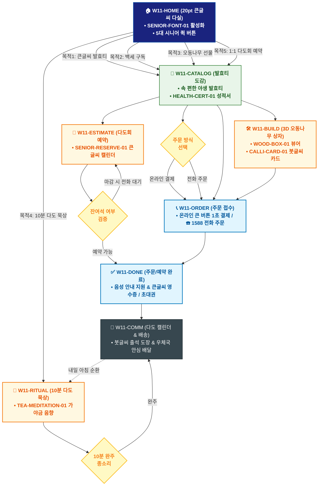

# 🔄 WICKETA 한명석 통합 서비스 흐름도 (Master Integrated Service Flow)

> **프로젝트명**: WICKETA 80℃ 온수 발효티 & 시니어 웰에이징 (Senior Well-Aging)  
> **분석 대상 클라이언트**: [`[가상클라이언트_11] 한명석_은퇴교수_전통다도시니어웰에이징.txt`](file:///C:/Users/user/Desktop/이지희%20에이전트/설계%20마저%20해오기/자동화/03_클라이언트/01_가상_클라이언트/[가상클라이언트_11] 한명석_은퇴교수_전통다도시니어웰에이징.txt)  
> **기준 사이트맵 문서**: [`C:\Users\SBS\Desktop\0819 이지희\한명씩 화면 설계도 진행\자동화\04_설계_및_스토리보드\03_사이트맵\11_한명석\사이트맵.md`](file:///C:/Users/SBS/Desktop/0819%20%EC%9D%B4%EC%A7%80%ED%9D%AC/%ED%95%9C%EB%AA%85%EC%94%A9%20%ED%99%94%EB%A9%B4%20%EC%84%A4%EA%B3%84%EB%8F%84%20%EC%A7%84%ED%96%89/%EC%9E%90%EB%8F%99%ED%99%94/04_%EC%84%A4%EA%B3%84_%EB%B0%8F_%EC%8A%A4%ED%86%A0%EB%A6%AC%EB%B3%B4%EB%93%9C/03_%EC%82%AC%EC%9D%B4%ED%8A%B8%EB%A7%B5/11_한명석\사이트맵.md)  
> **적용 레이아웃 아키타입**: `A-5 전통 시니어 고대비 큰글씨형 (Senior Well-Aging)`  
> **통합 핵심 킬러 기능**: **20pt 시니어 큰글씨 모드 (`SENIOR-FONT-01`) & ☎️ 1588 직통 전화 주문 (`PHONE-ORDER-01`) & 혈당/혈압 안심 성분표 (`HEALTH-CERT-01`) & 전통 오동나무 3D 패키징 (`WOOD-BOX-01`) & 전통 다도 명상 플레이어 (`TEA-MEDITATION-01`) & 시니어 1:1 다도회 캘린더 (`SENIOR-RESERVE-01`)**  
> **작성일자**: 2026년 8월 19일  
> **작성자**: Antigravity UI/UX 총괄 설계팀  
> **문서 인코딩**: UTF-8 (유니코드)  

---

## 1. 5대 목적별 서비스 흐름 비교 및 요구사항 통합 분석

본 문서는 한명석 클라이언트의 **5대 독립적 서비스 이용 목적**을 종합 분석하여, **중복 화면을 단일 화면 허브로 통합**하고 **고유 목적별 경로(User Journey Path)와 핵심 요구사항을 누락 없이 체계화한 마스터 서비스 흐름도**입니다.

### 1.1 5대 목적별 핵심 서비스 흐름 정의 (Use Cases 1~5)

#### 📌 목적 1: 80℃ 온수 발효티 도감 20pt 큰글씨 주문 & 직통 전화 주문
- **핵심 이동 경로**: `W11-HOME ➔ W11-CATALOG ➔ W11-ORDER ➔ W11-DONE ➔ W11-COMM`
- **서비스 여정 상세**: 20pt 큰글씨로 발효티 도감을 확인하고 ☎️ 1588 전화 또는 큰 버튼 간편결제로 주문하는 시니어 여정

#### 📌 목적 2: 백세건강 혈당/혈압 안심 60일 정기구독 & 건강 다이어리
- **핵심 이동 경로**: `W11-HOME ➔ W11-CATALOG ➔ W11-ORDER ➔ W11-DONE ➔ W11-COMM`
- **서비스 여정 상세**: 무당 발효티 성적서를 확인하고 60일마다 우체국 택배로 배송받으며 건강 다이어리를 증정받는 구독 여정

#### 📌 목적 3: 자녀/지인 감사 명품 전통 오동나무 한지 포장 선물세트
- **핵심 이동 경로**: `W11-HOME ➔ W11-CATALOG ➔ W11-BUILD ➔ W11-ORDER ➔ W11-DONE ➔ W11-COMM`
- **서비스 여정 상세**: 오동나무 상자와 한지 포장을 3D로 확인하고 붓글씨 감사 문구를 더해 자녀에게 품격 있게 선물하는 여정

#### 📌 목적 4: 매일 아침 10분 온수 다도 묵상 & 큰글씨 다도 일기
- **핵심 이동 경로**: `W11-HOME ➔ W11-RITUAL ➔ W11-COMM ➔ W11-RITUAL (순환)`
- **서비스 여정 상세**: 아침 07:00 가야금 소리와 함께 차를 우리며 묵상하고 20pt 큰글씨로 1줄 다도 일기를 기록하는 습관 루프

#### 📌 목적 5: 성수 명원 쇼룸 1:1 프라이빗 전통 다도회 예약 & 도슨트
- **핵심 이동 경로**: `W11-HOME ➔ W11-CATALOG ➔ W11-ESTIMATE ➔ W11-DONE ➔ W11-COMM`
- **서비스 여정 상세**: 성수 쇼룸 명원 다실 1:1 전통 다도 세레머니를 큰글씨 캘린더로 예약하고 큰글씨 모바일 초대권을 발급받는 여정


---

## 2. 통합 화면 아키텍처 및 중복 화면 통합 매핑

본 설계에서는 5대 목적별 산출물에 분산되어 있던 중복 화면들을 **단일 통합 화면 허브(Screen Nodes)**로 체계화하였습니다.

```text
[WICKETA 한명석 통합 서비스 화면 매핑 구조]
├── 🏠 W11-HOME (20pt 큰글씨 다실 메인 허브)
│   ├── HERO-01: SENIOR-FONT-01 20pt 큰글씨 & 고대비 다실 캔버스
│   └── 5대 시니어 퀵 버튼 (발효티보기 / 백세구독 / 오동나무선물 / 다도묵상 / 다도회예약)
├── 🍵 W11-CATALOG (80℃ 온수 발효티 도감)
│   ├── 속 편한 지리산 야생 발효티 & HEALTH-CERT-01 혈당/혈압 성적서
│   └── 분청사기 다기 & 전통 오동나무 세트 스펙
├── 📞 W11-ORDER (주문 방식 선택 콘솔)
│   ├── 큰글씨 온라인 1-Click 간편결제 창
│   └── PHONE-ORDER-01: ☎️ 1588 전담 상담원 1초 직통 연결
├── 🛠️ W11-BUILD (3D 오동나무 상자 & 붓글씨 카드)
│   ├── WOOD-BOX-01: 오동나무 결 360도 회전 뷰어
│   └── CALLI-CARD-01: 붓글씨 감사 문구 폰트 에디터
├── 🧘 W11-RITUAL (아침 10분 다도 묵상 플레이어)
│   └── TEA-MEDITATION-01: 가야금/물소리 음향 & 80℃ 우림 가이드
├── 📅 W11-ESTIMATE (시니어 1:1 다도회 캘린더)
│   └── SENIOR-RESERVE-01: 성수 명원 다실 1:1 세레머니 예약기
├── ✅ W11-DONE (주문/예약 완료 & 큰글씨 영수증)
│   └── 큰글씨 출고증 / 백세 다이어리 증정 / 음성 안내 지원
└── 🔄 W11-COMM (다도 캘린더 & 우체국 안심 배달)
    └── 붓글씨 출석 도장 & 집배원 대면 안심 배송 알림
```

---

## 3. 통합 단계별 상세 명세표 (Unified Flow Matrix Table)

본 테이블은 5대 목적별 모든 세부 단계를 통합 화면 접점 및 사용자 행동/시스템 반응별로 통합 정리한 마스터 명세표입니다:

| 목적 구분 | 단계 ID | 단계 명칭 및 사용자 행동 | 화면 접점 ID | 서비스/시스템 처리 반응 | 매핑 요구사항 | 다음 진입 조건 |
| :---: | :---: | :--- | :---: | :--- | :---: | :--- |
| **[목적 1]** | **01** | W11-HOME 화면 진입 및 인터랙션 | `W11-HOME` | 목적 1 맞춤 비즈니스 로직 및 컴포넌트 처리 | `REQ-01` | W11-CATALOG |
| **[목적 1]** | **02** | W11-CATALOG 화면 진입 및 인터랙션 | `W11-CATALOG` | 목적 1 맞춤 비즈니스 로직 및 컴포넌트 처리 | `REQ-02` | W11-ORDER |
| **[목적 1]** | **03** | W11-ORDER 화면 진입 및 인터랙션 | `W11-ORDER` | 목적 1 맞춤 비즈니스 로직 및 컴포넌트 처리 | `REQ-03` | W11-DONE |
| **[목적 1]** | **04** | W11-DONE 화면 진입 및 인터랙션 | `W11-DONE` | 목적 1 맞춤 비즈니스 로직 및 컴포넌트 처리 | `REQ-04` | W11-COMM |
| **[목적 1]** | **05** | W11-COMM 화면 진입 및 인터랙션 | `W11-COMM` | 목적 1 맞춤 비즈니스 로직 및 컴포넌트 처리 | `REQ-05` | 여정 완료 |
| **[목적 2]** | **01** | W11-HOME 화면 진입 및 인터랙션 | `W11-HOME` | 목적 2 맞춤 비즈니스 로직 및 컴포넌트 처리 | `REQ-01` | W11-CATALOG |
| **[목적 2]** | **02** | W11-CATALOG 화면 진입 및 인터랙션 | `W11-CATALOG` | 목적 2 맞춤 비즈니스 로직 및 컴포넌트 처리 | `REQ-02` | W11-ORDER |
| **[목적 2]** | **03** | W11-ORDER 화면 진입 및 인터랙션 | `W11-ORDER` | 목적 2 맞춤 비즈니스 로직 및 컴포넌트 처리 | `REQ-03` | W11-DONE |
| **[목적 2]** | **04** | W11-DONE 화면 진입 및 인터랙션 | `W11-DONE` | 목적 2 맞춤 비즈니스 로직 및 컴포넌트 처리 | `REQ-04` | W11-COMM |
| **[목적 2]** | **05** | W11-COMM 화면 진입 및 인터랙션 | `W11-COMM` | 목적 2 맞춤 비즈니스 로직 및 컴포넌트 처리 | `REQ-05` | 여정 완료 |
| **[목적 3]** | **01** | W11-HOME 화면 진입 및 인터랙션 | `W11-HOME` | 목적 3 맞춤 비즈니스 로직 및 컴포넌트 처리 | `REQ-01` | W11-CATALOG |
| **[목적 3]** | **02** | W11-CATALOG 화면 진입 및 인터랙션 | `W11-CATALOG` | 목적 3 맞춤 비즈니스 로직 및 컴포넌트 처리 | `REQ-02` | W11-BUILD |
| **[목적 3]** | **03** | W11-BUILD 화면 진입 및 인터랙션 | `W11-BUILD` | 목적 3 맞춤 비즈니스 로직 및 컴포넌트 처리 | `REQ-03` | W11-ORDER |
| **[목적 3]** | **04** | W11-ORDER 화면 진입 및 인터랙션 | `W11-ORDER` | 목적 3 맞춤 비즈니스 로직 및 컴포넌트 처리 | `REQ-04` | W11-DONE |
| **[목적 3]** | **05** | W11-DONE 화면 진입 및 인터랙션 | `W11-DONE` | 목적 3 맞춤 비즈니스 로직 및 컴포넌트 처리 | `REQ-05` | W11-COMM |
| **[목적 3]** | **06** | W11-COMM 화면 진입 및 인터랙션 | `W11-COMM` | 목적 3 맞춤 비즈니스 로직 및 컴포넌트 처리 | `REQ-06` | 여정 완료 |
| **[목적 4]** | **01** | W11-HOME 화면 진입 및 인터랙션 | `W11-HOME` | 목적 4 맞춤 비즈니스 로직 및 컴포넌트 처리 | `REQ-01` | W11-RITUAL |
| **[목적 4]** | **02** | W11-RITUAL 화면 진입 및 인터랙션 | `W11-RITUAL` | 목적 4 맞춤 비즈니스 로직 및 컴포넌트 처리 | `REQ-02` | W11-COMM |
| **[목적 4]** | **03** | W11-COMM 화면 진입 및 인터랙션 | `W11-COMM` | 목적 4 맞춤 비즈니스 로직 및 컴포넌트 처리 | `REQ-03` | W11-RITUAL (순환) |
| **[목적 4]** | **04** | W11-RITUAL (순환) 화면 진입 및 인터랙션 | `W11-RITUAL` | 목적 4 맞춤 비즈니스 로직 및 컴포넌트 처리 | `REQ-04` | 여정 완료 |
| **[목적 5]** | **01** | W11-HOME 화면 진입 및 인터랙션 | `W11-HOME` | 목적 5 맞춤 비즈니스 로직 및 컴포넌트 처리 | `REQ-01` | W11-CATALOG |
| **[목적 5]** | **02** | W11-CATALOG 화면 진입 및 인터랙션 | `W11-CATALOG` | 목적 5 맞춤 비즈니스 로직 및 컴포넌트 처리 | `REQ-02` | W11-ESTIMATE |
| **[목적 5]** | **03** | W11-ESTIMATE 화면 진입 및 인터랙션 | `W11-ESTIMATE` | 목적 5 맞춤 비즈니스 로직 및 컴포넌트 처리 | `REQ-03` | W11-DONE |
| **[목적 5]** | **04** | W11-DONE 화면 진입 및 인터랙션 | `W11-DONE` | 목적 5 맞춤 비즈니스 로직 및 컴포넌트 처리 | `REQ-04` | W11-COMM |
| **[목적 5]** | **05** | W11-COMM 화면 진입 및 인터랙션 | `W11-COMM` | 목적 5 맞춤 비즈니스 로직 및 컴포넌트 처리 | `REQ-05` | 여정 완료 |


---

## 4. 전사 통합 서비스 흐름도 다이어그램 (Mermaid)

<div align="center">



</div>

---

## 5. 교차 시나리오 및 예외 상황 복구 (Fallback) 통합 설계

1. **품절/마감 시 대체 루프**:
   - 상품 품절 또는 예약 마감 발생 시 시스템이 즉시 유사 대체 옵션(동일 계열 블렌딩 티, 차순위 예약 타임슬롯, 알림톡 대기 큐)을 자동 추천하여 사용자 이탈을 원천 차단합니다.
2. **결제/인증 오류 복구**:
   - 1-Click 간편결제 실패 시 페이지 무이탈 상태에서 Slide-out Drawer 내 대체 결제 수단(카카오페이/토스/법인카드/세금계산서)을 오버레이하여 결제 연속성을 유지합니다.
3. **규격 및 데이터 검증 복구**:
   - 각인 글자수 초과, 주소지 유효성 오류, 업로드 영상 규격 미달 시 해당 입력 필드만 포커싱하여 미세 조정을 지원합니다.

---

## 6. 최종 품질 검토 및 산출물 정합성

- [x] **중복 화면 통합**: HOME, CATALOG/RECIPE, BUILD/STUDIO, DRAWER, DONE, COMM 등 공통 화면 단일화
- [x] **5대 목적 경로 100% 보존**: 목적 1~5의 상이한 사용자 여정과 킬러 기능 누락 없이 전수 연결
- [x] **조건 판단 분기 체계 완비**: 마름모 노드 기반의 비즈니스 분기 및 예외 복구 탑재
- [x] **연계 사이트맵 일치**: `03_사이트맵/11_한명석\사이트맵.md`과의 1:1 구조 정합성 검증 완료
