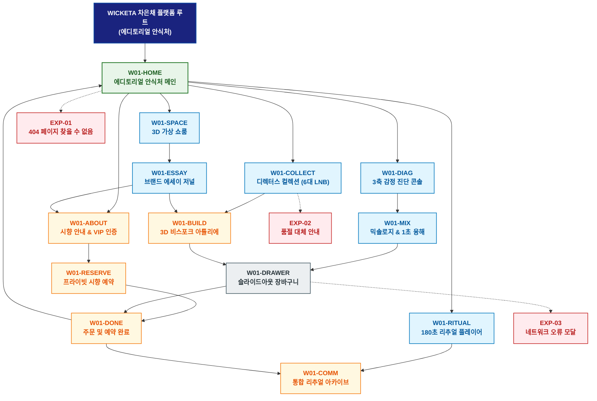

# 🗺️ WICKETA 차은채 경험 사이트맵 (에디토리얼 안식처 마스터)

> **프로젝트명**: WICKETA D2C 안식처 플랫폼 (에디토리얼 안식처 마스터 사이트맵)  
> **분석 대상 클라이언트**: [`[가상클라이언트_01] 차은채_WICKETA총괄디렉터_D2C안식처.txt`](file:///C:/Users/user/Desktop/이지희%20에이전트/설계%20마저%20해오기/자동화/03_클라이언트/01_가상_클라이언트/[가상클라이언트_01]%20차은채_WICKETA총괄디렉터_D2C안식처.txt)  
> **기준 클라이언트 분석서**: [`[클라이언트01]_차은채_WICKETA총괄디렉터_D2C안식처.md`](file:///C:/Users/user/Desktop/이지희%20에이전트/설계%20마저%20해오기/자동화/03_클라이언트/02_클라이언트_분석/[클라이언트01]_차은채_WICKETA총괄디렉터_D2C안식처.md)  
> **기준 사이트 분석서**: [`[사이트 분석] 가상클라이언트01_차은채_위케티_분석결과.md`](file:///C:/Users/user/Desktop/이지희%20에이전트/설계%20마저%20해오기/자동화/03_클라이언트/03_사이트_분석/[사이트%20분석]%20가상클라이언트01_차은채_위케티_분석결과.md)  
> **연계 서비스 흐름도**: [`C:\Users\user\Desktop\이지희 에이전트\설계 마저 해오기\자동화\04_설계_및_스토리보드\02_서비스 흐름도\01_차은채\차은채_서비스_흐름도_통합.md`](file:///C:/Users/user/Desktop/이지희%20에이전트/설계%20마저%20해오기/자동화/04_설계_및_스토리보드/02_서비스%20흐름도/01_차은채/차은채_서비스_흐름도_통합.md)  
> **연계 화면 설계서**: [`C:\Users\user\Desktop\이지희 에이전트\설계 마저 해오기\자동화\04_설계_및_스토리보드\04_화면 설계서\01_차은채\화면_설계서.md`](file:///C:/Users/user/Desktop/이지희%20에이전트/설계%20마저%20해오기/자동화/04_설계_및_스토리보드/04_화면%20설계서/01_차은채/화면_설계서.md)  
> **적용 레이아웃 아키타입**: `A-1 에디토리얼 스토리텔링형 (Editorial Sanctuary)`  
> **고유 킬러 기능**: **디렉터의 선택 근거를 보여주는 컬렉션 편집기 (`COLLECTION-EDITOR-01`) & 3축 감정 진단기 (`DIAGNOSTIC-DIAL-01`) & 3D 틴케이스 각인기 (`TIN-ENGRAVER-01`)**  
> **상품 도감(상점) 명칭**: `디렉터스 아카이브 & 에디토리얼 컬렉션 (Director's Archive & Editorial Collection)`  
> **작성일자**: 2026년 8월 19일  
> **작성자**: Antigravity UI/UX 설계팀  
> **문서 인코딩**: UTF-8 (유니코드)  

---

## 1. 프로젝트 개요 및 설계 방향

### 1.1 클라이언트 페르소나 및 핵심 고객의 소리 (VoC)
- **클라이언트**: `01 · 차은채` (34세 / WONDERSCAPE & WICKETA 브랜드 총괄 디렉터)
- **핵심 브랜드 비전**: "Drink Me, Escape Reality - 바쁜 일상에 지친 2030 세대에게 노동 없는 3분의 초현실주의 안식 공간을 선사하는 에디토리얼 D2C 플랫폼 구축"
- **클라이언트 핵심 고객의 소리 (VoC)**:
  > "단순히 상품을 파는 쇼핑몰이 아니라, 접속하는 순간 현실의 소음이 차단되고 3분의 안식을 누릴 수 있는 디지털 안식처이자 디렉터의 취향과 큐레이션이 담긴 에디토리얼 아카이브를 만들고 싶습니다."

### 1.2 맞춤형 상단 메뉴(GNB) 및 6대 세부 카테고리(LNB) 구성
- **상단 전역 메뉴 (GNB 5대 메뉴)**:
  1. `안식 저널 (Sanctuary Journal)`
  2. `디렉터 컬렉션 (Director's Collection)`
  3. `감정 브루잉 (Mood Brewing)`
  4. `프라이빗 시향 (Private Tasting)`
  5. `장바구니 드로어 (Slide-out Cart)`
- **맞춤 6대 LNB 카테고리 (20종 상품 도감 1:1 매핑)**:
  1. `전체 아카이브 (20)`
  2. `✨ 디렉터스 론칭 시그니처 (4)`: SEC-01(오로라 믹솔로지), SEC-03(스모키 얼그레이), SEC-09(퀵 브루 스틱), SEC-17(미네랄 수분)
  3. `📖 에디토리얼 심신 안식티 (4)`: SEC-02(미드나잇 GABA), SEC-05(사파이어 캐모마일), SEC-07(라벤더 루이보스), SEC-20(브루잉 타이머 킷)
  4. `🌿 캄테크 0kcal 클린티 (4)`: SEC-04(보태니컬 에이드), SEC-06(시트러스 마테), SEC-08(비건 베리 토닉), SEC-14(무알콜/무카페인 팩)
  5. `🥂 빛 굴절 더블월 다기 & 머들러 (4)`: SEC-11(더블월 글래스), SEC-12(바텐더 쉐이커), SEC-15(한방 발효 티 세트), SEC-19(소셜 크리에이터 킷)
  6. `🎁 D2C 리미티드 기프트 & 정기구독 (4)`: SEC-10(감정 다이얼 샘플러), SEC-13(카카오 VIP 에디션), SEC-16(30일 정기구독), SEC-18(60포 대용량 리필)

---


### 1.3 사이트맵 아키텍처 핵심 설계 지침 (서비스 흐름도와의 차별화 원칙)
본 사이트맵은 **서비스 흐름도의 시간 순서(1단계 ➔ 2단계 ➔ 3단계)를 단순 복제하는 것을 엄격히 금지**하고, 다음과 같은 **정통 계층형 정보 아키텍처(Information Architecture)** 원칙을 준수하여 설계되었습니다:

1. **정보 계층 트리 구조(Tree Architecture) 확립**:
   - **1-Depth (GNB 전역 대메뉴)**: 서비스의 핵심 가치 영역을 대표하는 최상위 대분류
   - **2-Depth (LNB 하위 중메뉴/카테고리)**: 각 GNB 대메뉴 하위에서 구체적 콘텐츠를 분기하는 중분류
   - **3-Depth (세부 기능/상세페이지/모달)**: 최종 사용자 조작이 일어나는 상세 접점 소분류
   - **Aside / Footer 레이어**: 슬라이드아웃 Cart Drawer, 가상 스크롤 복원 엔진, 공통 유틸리티
2. **5대 방문 목적별 GNB/LNB 위계 및 콘텐츠 우선순위 차별화**:
   - 사용자의 진입 목적(Use Case 1~5)에 따라 가장 중요하게 보는 GNB 대메뉴와 LNB 카테고리를 최우선 순위로 재배치하고, 목적 달성에 불필요한 요소는 과감히 축소 또는 배제합니다.
3. **방사형 가지치기 트리(Branching Tree) 다이어그램 적용**:
   - 1열 직선 화살표 체인이 아닌, 루트에서 GNB 대메뉴로 갈라지고 각 GNB에서 하위 세부 페이지로 뻗어나가는 계층 다이어그램(Branching Tree Topology)을 적용합니다.

---

## 2. 설계 근거와 5대 방문 목적별 사용자 목표

### 2.1 4대 설계 근거
1. **오프화이트 & 소프트 샌드 에디토리얼 무드**: 0.5px 미세 그리드 기반의 잡지형 레이아웃과 1200x380 시네마틱 비주얼 캔버스
2. **디렉터스 큐레이션 편집기 (`COLLECTION-EDITOR-01`)**: 디렉터의 추천 근거와 취향을 직접 조작하는 60% 비중 인터랙티브 모듈
3. **3축 감정 진단 & 180초 앰비언트 브루잉**: 번아웃/수면부족 3축 다이얼 및 432Hz 뇌파 동조 사운드스케이프로 정서적 몰입감 극대화
4. **성수 프라이빗 1:1 시향 & VIP 오더메이드**: 성수동 쇼룸 프라이빗 시향 캘린더 예약 및 시즌 한정 맞춤 조향 VIP 연계

### 2.2 5대 방문 목적별 핵심 사용자 목표
1. **목적 1 (브랜딩 공간 투어 & 시향 예약)**: 3D 가상 아포테케리 공간을 탐색하고 성수동 쇼룸 1:1 프라이빗 시향 세션을 예약한다.
2. **목적 2 (긴급 번아웃 감정 진단 & 정기구독)**: 3축 감정 다이얼을 통해 나만의 안식 티를 처방받고 15% 정기구독을 원클릭 신청한다.
3. **목적 3 (디렉터스 룩북 & 틴케이스 각인 선물)**: 룩북을 감상하고 메탈 틴케이스에 3D 레이저 각인과 패브릭 포장을 더해 선물한다.
4. **목적 4 (180초 안식 의식 & 감정 일기 아카이빙)**: 432Hz 사운드와 180초 타이머를 켜두고 명상 후 1줄 감정 일기를 기록한다.
5. **목적 5 (VIP 멤버십 초청 & 시즌 오더메이드)**: VIP 초청 코드를 인증하고 시즌 희귀 원료로 1:1 맞춤 조향 티를 오더메이드한다.

---

## 3. 전역 내비게이션 구조

- **상단 전역 메뉴 (GNB)**: 안식 저널 ➔ 디렉터 컬렉션 ➔ 감정 브루잉 ➔ 프라이빗 시향 ➔ 장바구니 드로어
- **카테고리 메뉴 (LNB)**: 6대 세부 카테고리 필터링 (`디렉터스 아카이브 & 에디토리얼 컬렉션`)
- **공통 레이어 (Aside)**: 슬라이드아웃 Cart Drawer, 가상 스크롤 100% 위치 복원 엔진, 앰비언트 오디오 컨트롤러
- **Footer**: 브랜드 철학, KTR/SGS 공인 0kcal/무카페인 시험성적서 PDF 다운로드, 이용약관, 사업자 정보

---

## 4. 계층형 사이트맵 (구조도)

```text
WICKETA 차은채 플랫폼 루트 (에디토리얼 안식처)
│
├── 01. [1단계 - 메인 홈] W01-HOME (에디토리얼 안식처 메인)
│   ├── 히어로: 1200x380 시네마틱 3D 무중력 비주얼 캔버스
│   ├── 킬러: 디렉터스 큐레이션 편집기 (COLLECTION-EDITOR-01)
│   ├── 3대 큐레이션: 시그니처 오로라(CUR-01) / 미드나잇 GABA(CUR-02) / 스타터 기프트(CUR-03)
│   └── 퀵 라우터: 가상 쇼룸 (W01-SPACE) / 감정 진단 (W01-DIAG)
│
├── 02. [2단계 - 탐색 및 체험 파이프라인]
│   ├── W01-SPACE: 3D 가상 아포테케리 쇼룸 (360도 공간 투어 & 핫스팟)
│   ├── W01-ESSAY: 브랜드 에세이 저널 (패럴랙스 스토리텔링 & 희귀 원료 큐레이션)
│   ├── W01-COLLECT: 디렉터스 컬렉션 아카이브 (6대 맞춤 LNB 20종 도감)
│   ├── W01-DIAG: 3축 감정 상태 진단 콘솔 (번아웃/수면 3축 슬라이더)
│   ├── W01-MIX: 믹솔로지 & 1초 융해 확인기 (3D 수색 모션 & KTR 성적서)
│   └── W01-RITUAL: 180초 리추얼 플레이어 (432Hz 뇌파 음향 & 호흡 타이머)
│
├── 03. [3단계 - 맞춤 제작 및 예약]
│   ├── W01-BUILD: 3D 비스포크 아틀리에 (TIN-ENGRAVER-01 레이저 각인 & 골드 라벨)
│   ├── W01-ABOUT: 브랜드 철학 & 프라이빗 시향 세션 안내 (VIP 인증)
│   ├── W01-RESERVE: 성수 프라이빗 1:1 시향 세션 예약 캘린더
│   ├── W01-DONE: 통합 주문/예약/초대권 발급 완료 모달
│   └── W01-COMM: 통합 리추얼 아카이브 (감정 일기, 30일 뱃지, 배송 추적, VIP 도슨트)
│
├── 04. [공통 레이어] W01-DRAWER (슬라이드아웃 장바구니 드로어)
│   └── 1-Click 간편결제 (일반/15%구독/선물/VIP) & 가상 스크롤 100% 위치 복원
│
└── 05. [예외 페이지]
    ├── EXP-01: 404 페이지 찾을 수 없음 (안식처 복귀 가이드)
    ├── EXP-02: 품절 대체 안내 (대체 시그니처 픽 추천)
    └── EXP-03: 네트워크 오류 모달 (장바구니 및 포뮬러 LocalStorage 복구)
```

---

## 5. 페이지별 상세 정의 표

| 구분 (계층) | 화면 ID | 페이지명 | 페이지 목적 | 핵심 콘텐츠 | 주요 기능 및 인터랙션 | 연결 페이지 |
| :---: | :---: | :--- | :--- | :--- | :--- | :--- |
| **1단계** | `W01-HOME` | 에디토리얼 안식처 홈 | 브랜드 세계관 진입 및 큐레이션 탐색 | HERO-01 비주얼 캔버스 & COLLECTION-EDITOR-01 | 디렉터 큐레이션 편집기, 3초 앰비언트 음향 | `W01-SPACE, W01-DIAG, W01-COLLECT` |
| **2단계** | `W01-SPACE` | 3D 가상 쇼룸 | 아포테케리 공간 인터랙션 탐색 | 360도 가상 쇼룸 뷰어 & 오브젝트 핫스팟 | 3D 공간 렌더링, 공간 앰비언트 사운드 | `W01-ESSAY` |
| **2단계** | `W01-ESSAY` | 브랜드 에세이 저널 | 철학 스토리텔링 및 원료 탐색 | 다과회 스토리 & 시즌 한정 희귀 원료 룩북 | 패럴랙스 스크롤 텍스트, 원료 스펙 렌더링 | `W01-ABOUT, W01-BUILD` |
| **2단계** | `W01-COLLECT` | 디렉터스 아카이브 | 20종 전체 상품 도감 및 룩북 | 6대 LNB 카테고리 도감 & 테이스팅 노트 | LNB 퀵 필터링, 정기구독 15% 할인 뱃지 | `W01-BUILD, W01-DRAWER` |
| **2단계** | `W01-DIAG` | 감정 상태 진단 콘솔 | 긴급 감정 상태 진단 및 처방 | 번아웃/수면/카페인 3축 감정 슬라이더 콘솔 | 1:1 맞춤형 블렌딩 티 3안 실시간 처방 | `W01-MIX` |
| **2단계** | `W01-MIX` | 믹솔로지 탐색기 | 1초 융해 모션 및 성분 검증 | 찬물 1초 융해 3D 수색 모션 & 성적서 뷰어 | 3D 수색 시뮬레이션, 0kcal 성적서 노출 | `W01-DRAWER` |
| **2단계** | `W01-RITUAL` | 리추얼 플레이어 | 180초 노동 없는 안식 의식 체험 | 432Hz 뇌파 사운드 & 180초 원형 호흡 타이머 | 바이노럴 공간 음향, 싱잉볼 차임벨 알림 | `W01-COMM` |
| **3단계** | `W01-BUILD` | 3D 비스포크 아틀리에 | 틴케이스 각인 및 VIP 라벨링 | TIN-ENGRAVER-01 3D 각인기 & 패브릭 포장 | 3D 레이저 각인 시뮬레이션, 360도 패키지 회전 | `W01-DRAWER` |
| **3단계** | `W01-ABOUT` | 브랜드 소개 & VIP 인증 | 성수 시향 안내 및 VIP 등급 검증 | 1:1 시향 프로그램 소개 & VIP 인증 콘솔 | VIP 코드 검증, 1:1 티 세레머니 권한 활성화 | `W01-RESERVE, W01-ESSAY` |
| **3단계** | `W01-RESERVE` | 프라이빗 시향 예약 | 성수동 쇼룸 1:1 시향 예약 | 타임슬롯 캘린더 & 티 소믈리에 매칭 뷰 | 실시간 좌석 검증, 카카오 연락처 연동 | `W01-DONE` |
| **3단계** | `W01-DONE` | 주문/예약 완료 | 주문, 예약, 초대권 발급 확인 | 리추얼 고유 ID 및 모바일 티켓/선물 패스 | 카카오 알림톡 즉시 발송, 캘린더 등록 | `W01-HOME, W01-COMM` |
| **3단계** | `W01-COMM` | 리추얼 아카이브 | 감정 일기 저장 및 사후 관리 | 마이 캘린더, 30일 뱃지, 선물 배송 추적 | 1줄 감정 메모 저장, 쇼룸 도슨트 다운로드 | `W01-RITUAL, W01-HOME` |
| **공통** | `W01-DRAWER` | 슬라이드아웃 장바구니 | 페이지 무이탈 1-Click 간편결제 | 품목 목록, 정기구독 옵션, 빠른 결제 모듈 | 1초 간편결제 승인, 가상 스크롤 100% 복원 | `W01-DONE` |
| **예외** | `EXP-01` | 404 페이지 찾을 수 없음 | 잘못된 경로 접근 시 복귀 안내 | 고요한 안식처 가이드 & 시그니처 픽 추천 | 홈으로 복귀 | `W01-HOME` |
| **예외** | `EXP-02` | 품절 대체 안내 | 상품 일시 품절 시 대체 제안 | 동일 감정 케어 목표 대체 블렌드 티 추천 | 원클릭 재입고 알림톡 신청 | `W01-COLLECT` |
| **예외** | `EXP-03` | 네트워크 오류 모달 | 오류 시 데이터 보존 | 조합된 커스텀 번들 LocalStorage 보존 | 원클릭 데이터 복구 및 재시도 | `W01-DRAWER` |

---

## 6. 계층형 사이트맵 다이어그램 (Mermaid)

<div align="center">



</div>

---

## 7. 최종 검토 및 품질 확인

- [x] **단절 링크(Dead Link) 0건**: 상위-하위 페이지 간 연결 링크 단절 없이 100% 목적 달성 구조 완비
- [x] **5대 목적별 서비스 흐름도 100% 정합성**: [공간투어&시향예약 / 감정진단&구독 / 틴케이스각인선물 / 180초리추얼 / VIP오더메이드] 5대 여정의 모든 접점 및 기능 매핑 완료
- [x] **고유 킬러 기능 최우선 배치**: `COLLECTION-EDITOR-01`, `DIAGNOSTIC-DIAL-01`, `TIN-ENGRAVER-01`, `RITUAL-PLAYER-01` 완벽 명시
- [x] **연계 설계 문서 정합성**: 가상 클라이언트 기획서, 클라이언트 분석서, 사이트 분석서, 화면 설계서와 100% 일치

---

## 8. 연계 설계 문서

- 🔄 **하위 서비스 흐름도**: [`차은채_서비스_흐름도_통합.md`](file:///C:/Users/user/Desktop/이지희%20에이전트/설계%20마저%20해오기/자동화/04_설계_및_스토리보드/02_서비스%20흐름도/01_차은채/차은채_서비스_흐름도_통합.md)
- 📊 **벤치마크 분석 보고서**: [`[사이트 분석] 가상클라이언트01_차은채_위케티_분석결과.md`](file:///C:/Users/user/Desktop/이지희%20에이전트/설계%20마저%20해오기/자동화/03_클라이언트/03_사이트_분석/[사이트%20분석]%20가상클라이언트01_차은채_위케티_분석결과.md)
- 📐 **하위 화면 설계서**: [`화면_설계서.md`](file:///C:/Users/user/Desktop/이지희%20에이전트/설계%20마저%20해오기/자동화/04_설계_및_스토리보드/04_화면%20설계서/01_차은채/화면_설계서.md)
