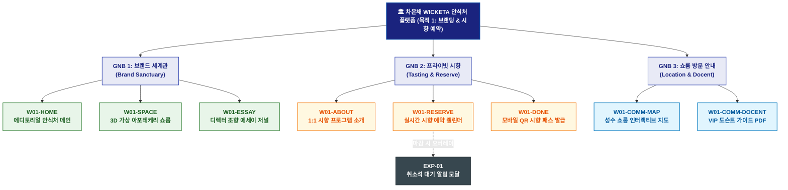

# 🗺️ WICKETA 차은채 사이트맵 [목적 1: 3D 가상 아포테케리 공간 투어 & 프라이빗 시향 세션 예약]

> **프로젝트명**: WICKETA D2C 안식처 플랫폼 (브랜딩 공간 & 시향 예약 특화 사이트맵)  
> **분석 대상 클라이언트**: [`[가상클라이언트_01] 차은채_WICKETA총괄디렉터_D2C안식처.txt`](file:///C:/Users/user/Desktop/이지희%20에이전트/설계%20마저%20해오기/자동화/03_클라이언트/01_가상_클라이언트/[가상클라이언트_01]%20차은채_WICKETA총괄디렉터_D2C안식처.txt)  
> **기준 서비스 흐름도**: [`C:\Users\SBS\Desktop\0819 이지희\한명씩 화면 설계도 진행\자동화\04_설계_및_스토리보드\02_서비스 흐름도\01_차은채\서비스_흐름도_목적1_브랜딩공간.md`](file:///C:/Users/SBS/Desktop/0819%20%EC%9D%B4%EC%A7%80%ED%9D%AC/%ED%95%9C%EB%AA%85%EC%94%A9%20%ED%99%94%EB%A9%B4%20%EC%84%A4%EA%B3%84%EB%8F%84%20%EC%A7%84%ED%96%89/%EC%9E%90%EB%8F%99%ED%99%94/04_%EC%84%A4%EA%B3%84_%EB%B0%8F_%EC%8A%A4%ED%86%A0%EB%A6%AC%EB%B3%B4%EB%93%9C/02_%EC%84%9C%EB%B9%84%EC%8A%A4%20%ED%9D%90%EB%A6%84%EB%8F%84/01_%EC%B0%A8%EC%9D%80%EC%B1%84/서비스_흐름도_목적1_브랜딩공간.md)  
> **접속 목적**: 3D 가상 아포테케리 쇼룸 탐색 및 성수동 오프라인 1:1 시향 세션 예약  
> **목적별 고유 킬러 기능**: **3D 가상 아포테케리 쇼룸 (`3D-SPACE-01`) & 프라이빗 시향 예약 캘린더 (`RESERVATION-CALENDAR-01`)**  
> **작성일자**: 2026년 8월 19일  
> **작성자**: Antigravity UI/UX 설계팀  
> **문서 인코딩**: UTF-8 (유니코드)  

---

## 1. 목적별 웹사이트 정보 아키텍처 (Information Architecture) 개요

브랜드 세계관과 3D 가상 쇼룸을 탐색하고, 성수 쇼룸 1:1 시향 세션을 실시간 예약하여 모바일 시향 패스를 발급받는 예약 특화 계층 구조

---

## 2. 목적 특화 계층형 사이트맵 구조도 (Hierarchical Tree)

```text
WICKETA 플랫폼 루트 [목적 1: 브랜딩 공간 & 시향 예약 특화 트리]
│
├── 🏛️ [GNB 1: 브랜드 세계관 (Brand Sanctuary)]
│   ├── W01-HOME: 에디토리얼 안식처 메인 (1200x380 3D 시네마틱 캔버스 & 앰비언트 오디오)
│   ├── W01-SPACE: 3D 가상 아포테케리 쇼룸 (360도 공간 인터랙션 & 5대 원료 핫스팟)
│   └── W01-ESSAY: 디렉터 조향 에세이 저널 (패럴랙스 스토리텔링 & 아포테케리 철학)
│
├── 📅 [GNB 2: 프라이빗 시향 (Tasting & Reserve)]
│   ├── W01-ABOUT: 1:1 시향 프로그램 소개 & 전담 티 소믈리에 프로필
│   ├── W01-RESERVE: 실시간 시향 예약 캘린더 (날짜/시간 타임슬롯 지정 & 잔여석 검증)
│   └── W01-DONE: 모바일 QR 시향 패스 발급 모달 & 카카오 알림톡 연동
│
├── 📍 [GNB 3: 쇼룸 방문 안내 & 도슨트 (Location & Docent)]
│   ├── W01-COMM-MAP: 성수 플래그십 쇼룸 인터랙티브 길안내 맵
│   └── W01-COMM-DOCENT: 성수 쇼룸 VIP 도슨트 안내서 PDF 다운로드
│
└── ⚙️ [공통 유틸리티 레이어 (Utility & Aside)]
    ├── Global GNB Header (블러 글래스모피즘 & 앰비언트 사운드 컨트롤러)
    └── EXP-01: 예약 마감 시 취소석 대기 알림 신청 모달 (Fallback)
```

---

## 3. 페이지별 상세 계층 명세표 (Screen Hierarchy Specification)

| 계층 분류 | 화면 ID | 화면 명칭 | 주요 콘텐츠 및 인터랙션 기능 | 핵심 UI 컴포넌트 ID | 매핑 요구사항 |
| :--- | :--- | :--- | :--- | :--- | :--- |
| **1-Depth (메인)** | `W01-HOME` | 에디토리얼 안식처 메인 | 시네마틱 3D 비주얼 캔버스, 3초 앰비언트 사운드, 쇼룸 직행 CTA | `HERO-01`, `AUDIO-PLAYER-01` | `REQ-01 세계관 전달` |
| **2-Depth (GNB 1)** | `W01-SPACE` | 3D 가상 아포테케리 쇼룸 | 360도 공간 회전 뷰어, 주요 원료 인터랙티브 핫스팟(5개소) | `3D-SPACE-01`, `HOTSPOT-01~05` | `REQ-05 가상 쇼룸` |
| **2-Depth (GNB 1)** | `W01-ESSAY` | 디렉터 조향 에세이 저널 | 디렉터 차은채의 조향 철학, 희귀 원료 패럴랙스 저널 | `ESSAY-SCROLL-01` | `REQ-01 에디토리얼 저널` |
| **2-Depth (GNB 2)** | `W01-ABOUT` | 시향 세션 프로그램 안내 | 1:1 시향 커리큘럼 소개, 소믈리에 매칭 가이드, 성수 쇼룸 안내 | `ABOUT-PROGRAM-01` | `REQ-05 시향 프로그램` |
| **3-Depth (GNB 2)** | `W01-RESERVE` | 실시간 시향 예약 캘린더 | 날짜/시간 타임슬롯 지정, 실시간 잔여석 검증, 카카오 연락처 연동 | `RESERVATION-CALENDAR-01` | `REQ-06 간편 예약` |
| **3-Depth (GNB 2)** | `W01-DONE` | 모바일 QR 시향 패스 | 고유 예약 번호, QR 모바일 입장권 발급, 카카오 알림톡 발송 | `PASS-MODAL-01` | `REQ-06 모바일 패스` |
| **2-Depth (GNB 3)** | `W01-COMM-MAP`| 쇼룸 오시는 길 인터랙티브 맵 | 성수 플래그십 쇼룸 위치 안내, 대중교통 및 주차 안내 | `MAP-VIEWER-01` | `위치 안내` |
| **3-Depth (GNB 3)** | `W01-COMM-DOCENT`| VIP 도슨트 가이드북 | 성수 쇼룸 관람 포인트 PDF 다운로드, 모바일 도슨트 음성 가이드 | `DOCENT-VIEWER-01` | `브랜드 충성도 지속` |
| **Aside / Modal** | `EXP-01` | 취소석 대기 알림 모달 | 타임슬롯 마감 시 취소석 발생 실시간 카카오 알림 접수 모달 | `WAITLIST-MODAL-01` | `예외 처리 복구` |

---

## 4. 목적별 사이트맵 다이어그램 (Mermaid Branching Tree)

<div align="center">



</div>

---

## 5. 최종 품질 검토 및 연계 설계 문서

- [x] **정통 계층 트리 아키텍처**: 1열 직렬 흐름 복제가 아닌 GNB 대메뉴 ➔ LNB 중메뉴 ➔ 세부 페이지 방사형 구조 확립
- [x] **목적별 메뉴 위계 차별화**: 해당 목적에 필요한 핵심 대메뉴 및 화면 노드만 최우선 순위로 배치
- [x] **연계 서비스 흐름도**: [`서비스_흐름도_목적1_브랜딩공간.md`](file:///C:/Users/SBS/Desktop/0819%20%EC%9D%B4%EC%A7%80%ED%9D%AC/%ED%95%9C%EB%AA%85%EC%94%A9%20%ED%99%94%EB%A9%B4%20%EC%84%A4%EA%B3%84%EB%8F%84%20%EC%A7%84%ED%96%89/%EC%9E%90%EB%8F%99%ED%99%94/04_%EC%84%A4%EA%B3%84_%EB%B0%8F_%EC%8A%A4%ED%86%A0%EB%A6%AC%EB%B3%B4%EB%93%9C/02_%EC%84%9C%EB%B9%84%EC%8A%A4%20%ED%9D%90%EB%A6%84%EB%8F%84/01_%EC%B0%A8%EC%9D%80%EC%B1%84/서비스_흐름도_목적1_브랜딩공간.md)
