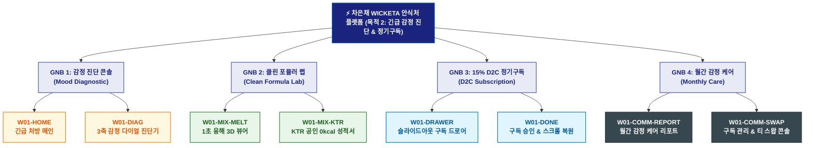

# 🗺️ WICKETA 차은채 사이트맵 [목적 2: 긴급 번아웃 3축 감정 진단 & 초고속 D2C 정기구독]

> **프로젝트명**: WICKETA D2C 안식처 플랫폼 (감정 처방 & 초고속 정기구독 특화 사이트맵)  
> **분석 대상 클라이언트**: [`[가상클라이언트_01] 차은채_WICKETA총괄디렉터_D2C안식처.txt`](file:///C:/Users/user/Desktop/이지희%20에이전트/설계%20마저%20해오기/자동화/03_클라이언트/01_가상_클라이언트/[가상클라이언트_01]%20차은채_WICKETA총괄디렉터_D2C안식처.txt)  
> **기준 서비스 흐름도**: [`C:\Users\SBS\Desktop\0819 이지희\한명씩 화면 설계도 진행\자동화\04_설계_및_스토리보드\02_서비스 흐름도\01_차은채\서비스_흐름도_목적2_감정구독.md`](file:///C:/Users/SBS/Desktop/0819%20%EC%9D%B4%EC%A7%80%ED%9D%AC/%ED%95%9C%EB%AA%85%EC%94%A9%20%ED%99%94%EB%A9%B4%20%EC%84%A4%EA%B3%84%EB%8F%84%20%EC%A7%84%ED%96%89/%EC%9E%90%EB%8F%99%ED%99%94/04_%EC%84%A4%EA%B3%84_%EB%B0%8F_%EC%8A%A4%ED%86%A0%EB%A6%AC%EB%B3%B4%EB%93%9C/02_%EC%84%9C%EB%B9%84%EC%8A%A4%20%ED%9D%90%EB%A6%84%EB%8F%84/01_%EC%B0%A8%EC%9D%80%EC%B1%84/서비스_흐름도_목적2_감정구독.md)  
> **접속 목적**: 긴급 번아웃 3축 감정 진단 및 15% D2C 정기구독 1초 완료  
> **목적별 고유 킬러 기능**: **3축 감정 다이얼 진단기 (`DIAGNOSTIC-DIAL-01`) & 15% 정기구독 Slide-out Cart (`FAST-SUBSCRIPTION-01`)**  
> **작성일자**: 2026년 8월 19일  
> **작성자**: Antigravity UI/UX 설계팀  
> **문서 인코딩**: UTF-8 (유니코드)  

---

## 1. 목적별 웹사이트 정보 아키텍처 (Information Architecture) 개요

퇴근 후 번아웃 상태에서 3축 다이얼로 안식 티를 처방받고 1초 융해 확인 후 페이지 무이탈 1-Click 정기구독을 완료하는 패스트 커머스 특화 계층 구조

---

## 2. 목적 특화 계층형 사이트맵 구조도 (Hierarchical Tree)

```text
WICKETA 플랫폼 루트 [목적 2: 긴급 감정 진단 & 정기구독 특화 트리]
│
├── ⚡ [GNB 1: 긴급 감정 진단 콘솔 (Mood Diagnostic)]
│   ├── W01-HOME: 긴급 처방 히어로 배너 & 3초 진단 퀵독
│   └── W01-DIAG: 3축 감정 다이얼 진단기 (번아웃/수면/카페인 슬라이더 & 1:1 맞춤 티 3안 처방)
│
├── 🔬 [GNB 2: 클린 포뮬러 랩 (Clean Formula Lab)]
│   ├── W01-MIX-MELT: 찬물 1초 융해 3D 수색 애니메이션 뷰어
│   └── W01-MIX-KTR: KTR 공인 0kcal / 0.00mg 무카페인 시험성적서 모달
│
├── 🛒 [GNB 3: 15% D2C 정기구독 (D2C Subscription)]
│   ├── W01-DRAWER: 슬라이드아웃 정기구독 드로어 (15% 자동할인, 30일 주기 설정, 간편결제)
│   └── W01-DONE: 정기구독 승인 확인 모달 & 가상 스크롤 100% 위치 복원
│
└── 🌿 [GNB 4: 월간 감정 케어 (Monthly Care)]
    ├── W01-COMM-REPORT: 월간 감정 변화 트래킹 통계 리포트
    └── W01-COMM-SWAP: 다음 달 블렌드 스왑(Swap) 및 배송 스케줄 관리
```

---

## 3. 페이지별 상세 계층 명세표 (Screen Hierarchy Specification)

| 계층 분류 | 화면 ID | 화면 명칭 | 주요 콘텐츠 및 인터랙션 기능 | 핵심 UI 컴포넌트 ID | 매핑 요구사항 |
| :--- | :--- | :--- | :--- | :--- | :--- |
| **1-Depth (메인)** | `W01-HOME` | 긴급 감정 처방 메인 | 긴급 처방 히어로 배너, [3초 감정 진단] 직행 퀵독 | `HERO-01`, `QUICK-DIAG-01` | `REQ-02 신속 진입` |
| **2-Depth (GNB 1)** | `W01-DIAG` | 3축 감정 진단 콘솔 | 번아웃/수면부족/카페인 3축 슬라이더, 맞춤 블렌딩 3안 도출 | `DIAGNOSTIC-DIAL-01` | `REQ-02 감정 진단기` |
| **2-Depth (GNB 2)** | `W01-MIX-MELT`| 1초 융해 3D 뷰어 | 찬물/탄산수 1초 용해 3D 수색 변화 시뮬레이션 | `MELTING-VIEWER-01` | `REQ-04 클린 포뮬러` |
| **3-Depth (GNB 2)** | `W01-MIX-KTR` | KTR 공인 성적서 모달 | 0kcal, 0.00mg 무카페인 공인 시험성적서 PDF 열람 | `KTR-CERT-01` | `REQ-04 공인 성적서` |
| **Aside / Overlay** | `W01-DRAWER` | 슬라이드아웃 구독 드로어 | 페이지 무이탈 15% 정기할인 결제, 30일 배송 설정, 간편결제 | `DRAWER-SUB-01` | `REQ-06 Cart Drawer` |
| **Modal / Done** | `W01-DONE` | 정기구독 승인 모달 | 구독 코드 발급, 알림톡 발송, **진단 위치로 100% 스크롤 복원** | `SUB-DONE-MODAL-01` | `REQ-06 스크롤 복원` |
| **2-Depth (GNB 4)** | `W01-COMM-REPORT`| 월간 감정 케어 리포트 | 월간 감정 변화 그래프, 맞춤 브루잉 가이드라인 | `MONTHLY-CARE-01` | `구독 케어` |
| **3-Depth (GNB 4)** | `W01-COMM-SWAP` | 구독 관리 & 티 스왑 콘솔 | 다음 달 정기배송일 변경, 블렌드 종류 변경(Swap) | `SWAP-CONSOLE-01` | `구독 지속성 유지` |

---

## 4. 목적별 사이트맵 다이어그램 (Mermaid Branching Tree)

<div align="center">



</div>

---

## 5. 최종 품질 검토 및 연계 설계 문서

- [x] **정통 계층 트리 아키텍처**: 1열 직렬 흐름 복제가 아닌 GNB 대메뉴 ➔ LNB 중메뉴 ➔ 세부 페이지 방사형 구조 확립
- [x] **목적별 메뉴 위계 차별화**: 해당 목적에 필요한 핵심 대메뉴 및 화면 노드만 최우선 순위로 배치
- [x] **연계 서비스 흐름도**: [`서비스_흐름도_목적2_감정구독.md`](file:///C:/Users/SBS/Desktop/0819%20%EC%9D%B4%EC%A7%80%ED%9D%AC/%ED%95%9C%EB%AA%85%EC%94%A9%20%ED%99%94%EB%A9%B4%20%EC%84%A4%EA%B3%84%EB%8F%84%20%EC%A7%84%ED%96%89/%EC%9E%90%EB%8F%99%ED%99%94/04_%EC%84%A4%EA%B3%84_%EB%B0%8F_%EC%8A%A4%ED%86%A0%EB%A6%AC%EB%B3%B4%EB%93%9C/02_%EC%84%9C%EB%B9%84%EC%8A%A4%20%ED%9D%90%EB%A6%84%EB%8F%84/01_%EC%B0%A8%EC%9D%80%EC%B1%84/서비스_흐름도_목적2_감정구독.md)
