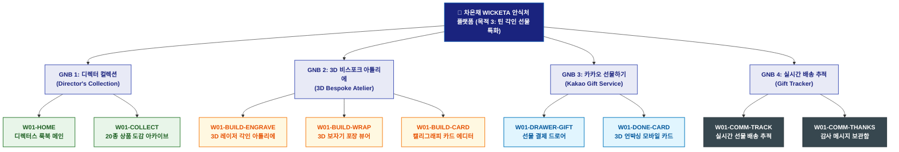

# 🗺️ WICKETA 차은채 사이트맵 [목적 3: 디렉터스 룩북 & 3D 틴케이스 이니셜 각인 선물 제작]

> **프로젝트명**: WICKETA D2C 안식처 플랫폼 (비스포크 틴 각인 & 선물 특화 사이트맵)  
> **분석 대상 클라이언트**: [`[가상클라이언트_01] 차은채_WICKETA총괄디렉터_D2C안식처.txt`](file:///C:/Users/user/Desktop/이지희%20에이전트/설계%20마저%20해오기/자동화/03_클라이언트/01_가상_클라이언트/[가상클라이언트_01]%20차은채_WICKETA총괄디렉터_D2C안식처.txt)  
> **기준 서비스 흐름도**: [`C:\Users\SBS\Desktop\0819 이지희\한명씩 화면 설계도 진행\자동화\04_설계_및_스토리보드\02_서비스 흐름도\01_차은채\서비스_흐름도_목적3_틴케이스선물.md`](file:///C:/Users/SBS/Desktop/0819%20%EC%9D%B4%EC%A7%80%ED%9D%AC/%ED%95%9C%EB%AA%85%EC%94%A9%20%ED%99%94%EB%A9%B4%20%EC%84%A4%EA%B3%84%EB%8F%84%20%EC%A7%84%ED%96%89/%EC%9E%90%EB%8F%99%ED%99%94/04_%EC%84%A4%EA%B3%84_%EB%B0%8F_%EC%8A%A4%ED%86%A0%EB%A6%AC%EB%B3%B4%EB%93%9C/02_%EC%84%9C%EB%B9%84%EC%8A%A4%20%ED%9D%90%EB%A6%84%EB%8F%84/01_%EC%B0%A8%EC%9D%80%EC%B1%84/서비스_흐름도_목적3_틴케이스선물.md)  
> **접속 목적**: 디렉터스 컬렉션 룩북 감상 및 메탈 틴 3D 레이저 각인 선물 발송  
> **목적별 고유 킬러 기능**: **3D 라이브 레이저 버닝 각인기 (`TIN-ENGRAVER-01`) & 패브릭 보자기 포장 시뮬레이터 (`FABRIC-VIEWER-01`)**  
> **작성일자**: 2026년 8월 19일  
> **작성자**: Antigravity UI/UX 설계팀  
> **문서 인코딩**: UTF-8 (유니코드)  

---

## 1. 목적별 웹사이트 정보 아키텍처 (Information Architecture) 개요

디렉터스 룩북을 감상하고 메탈 틴에 영문 이니셜 3D 각인과 패브릭 보자기 포장을 더해 카카오톡 선물하기로 전송하는 비스포크 커스텀 계층 구조

---

## 2. 목적 특화 계층형 사이트맵 구조도 (Hierarchical Tree)

```text
WICKETA 플랫폼 루트 [목적 3: 틴케이스 각인 선물 특화 트리]
│
├── 📖 [GNB 1: 디렉터스 컬렉션 (Director's Collection)]
│   ├── W01-HOME: 디렉터스 룩북 화보 메인
│   └── W01-COLLECT: 6대 LNB 카테고리 20종 상품 도감 & 조향 테이스팅 룩북
│
├── 🔨 [GNB 2: 3D 비스포크 아틀리에 (3D Bespoke Atelier)]
│   ├── W01-BUILD-ENGRAVE: 메탈 틴 실시간 3D 레이저 버닝 각인기 (TIN-ENGRAVER-01)
│   ├── W01-BUILD-WRAP: 친환경 패브릭 보자기 360도 포장 시뮬레이터
│   └── W01-BUILD-CARD: 캘리그래피 손글씨 감성 메시지 카드 에디터
│
├── 🎁 [GNB 3: 카카오 선물하기 (Kakao Gift Service)]
│   ├── W01-DRAWER-GIFT: 카카오 친구 선택 & 1-Click 선물 결제 드로어
│   └── W01-DONE-CARD: 3D 언박싱 모바일 기프트 카드 발급 모달
│
└── 📦 [GNB 4: 실시간 배송 추적 (Gift Tracker)]
    ├── W01-COMM-TRACK: 친구 배송지 입력 상태 및 실시간 배송 대시보드
    └── W01-COMM-THANKS: 수령자 감사 메시지 보관함
```

---

## 3. 페이지별 상세 계층 명세표 (Screen Hierarchy Specification)

| 계층 분류 | 화면 ID | 화면 명칭 | 주요 콘텐츠 및 인터랙션 기능 | 핵심 UI 컴포넌트 ID | 매핑 요구사항 |
| :--- | :--- | :--- | :--- | :--- | :--- |
| **1-Depth (메인)** | `W01-HOME` | 디렉터스 룩북 메인 | 리미티드 화보 룩북 배너, [틴케이스 각인] 직행 퀵독 | `HERO-01`, `LOOKBOOK-BANNER-01` | `REQ-01 에디토리얼 룩북` |
| **2-Depth (GNB 1)** | `W01-COLLECT`| 20종 상품 도감 아카이브 | 6대 맞춤 LNB 카테고리, 20종 조향 테이스팅 도감 화보 | `LNB-COLLECT-01` | `REQ-05 디렉터스 컬렉션` |
| **2-Depth (GNB 2)** | `W01-BUILD-ENGRAVE`| 3D 레이저 각인 아틀리에 | TIN-ENGRAVER-01 영문 이니셜 10자 3D 실시간 버닝 각인 | `TIN-ENGRAVER-01` | `REQ-05 3D 각인기` |
| **3-Depth (GNB 2)** | `W01-BUILD-WRAP`| 3D 보자기 포장 뷰어 | 친환경 린넨/세이지 보자기 매듭 360도 회전 시뮬레이터 | `FABRIC-01` | `REQ-05 패브릭 포장` |
| **3-Depth (GNB 2)** | `W01-BUILD-CARD`| 캘리그래피 카드 작성기 | 축하 문구 입력, 감성 손글씨 폰트 프리뷰 | `CARD-EDITOR-01` | `REQ-05 감성 메시지` |
| **Aside / Drawer**| `W01-DRAWER-GIFT`| 선물 결제 드로어 | 카카오톡 친구 선택, 1-Click 선물 결제, 스크롤 100% 복원 | `DRAWER-GIFT-01` | `REQ-06 카카오 선물하기` |
| **Modal / Done** | `W01-DONE-CARD` | 3D 언박싱 모바일 카드 | 3D 언박싱 모바일 바우처 발급, 카카오톡 즉시 전송 | `GIFT-CARD-MODAL-01` | `REQ-06 모바일 카드` |
| **2-Depth (GNB 4)** | `W01-COMM-TRACK`| 실시간 선물 배송 추적 | 친구 배송지 입력 여부 확인, 실시간 택배 배송 조회 | `GIFT-TRACKER-01` | `선물 사후 관리` |
| **3-Depth (GNB 4)** | `W01-COMM-THANKS`| 감사 메시지 보관함 | 선물을 받은 친구의 감사 답장 카드 확인 | `THANKS-BOX-01` | `소셜 관계 지속` |

---

## 4. 목적별 사이트맵 다이어그램 (Mermaid Branching Tree)

<div align="center">



</div>

---

## 5. 최종 품질 검토 및 연계 설계 문서

- [x] **정통 계층 트리 아키텍처**: 1열 직렬 흐름 복제가 아닌 GNB 대메뉴 ➔ LNB 중메뉴 ➔ 세부 페이지 방사형 구조 확립
- [x] **목적별 메뉴 위계 차별화**: 해당 목적에 필요한 핵심 대메뉴 및 화면 노드만 최우선 순위로 배치
- [x] **연계 서비스 흐름도**: [`서비스_흐름도_목적3_틴케이스선물.md`](file:///C:/Users/SBS/Desktop/0819%20%EC%9D%B4%EC%A7%80%ED%9D%AC/%ED%95%9C%EB%AA%85%EC%94%A9%20%ED%99%94%EB%A9%B4%20%EC%84%A4%EA%B3%84%EB%8F%84%20%EC%A7%84%ED%96%89/%EC%9E%90%EB%8F%99%ED%99%94/04_%EC%84%A4%EA%B3%84_%EB%B0%8F_%EC%8A%A4%ED%86%A0%EB%A6%AC%EB%B3%B4%EB%93%9C/02_%EC%84%9C%EB%B9%84%EC%8A%A4%20%ED%9D%90%EB%A6%84%EB%8F%84/01_%EC%B0%A8%EC%9D%80%EC%B1%84/서비스_흐름도_목적3_틴케이스선물.md)
