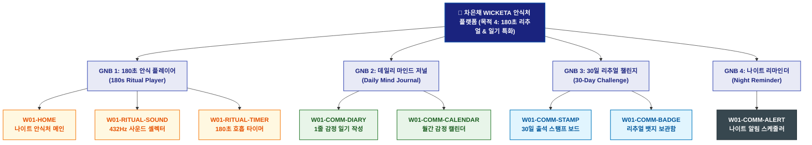

# 🗺️ WICKETA 차은채 사이트맵 [목적 4: 180초 안식 의식 실행 & 데일리 감정 일기 아카이빙]

> **프로젝트명**: WICKETA D2C 안식처 플랫폼 (리추얼 플레이어 & 마인드 아카이빙 특화 사이트맵)  
> **분석 대상 클라이언트**: [`[가상클라이언트_01] 차은채_WICKETA총괄디렉터_D2C안식처.txt`](file:///C:/Users/user/Desktop/이지희%20에이전트/설계%20마저%20해오기/자동화/03_클라이언트/01_가상_클라이언트/[가상클라이언트_01]%20차은채_WICKETA총괄디렉터_D2C안식처.txt)  
> **기준 서비스 흐름도**: [`C:\Users\SBS\Desktop\0819 이지희\한명씩 화면 설계도 진행\자동화\04_설계_및_스토리보드\02_서비스 흐름도\01_차은채\서비스_흐름도_목적4_리추얼기록.md`](file:///C:/Users/SBS/Desktop/0819%20%EC%9D%B4%EC%A7%80%ED%9D%AC/%ED%95%9C%EB%AA%85%EC%94%A9%20%ED%99%94%EB%A9%B4%20%EC%84%A4%EA%B3%84%EB%8F%84%20%EC%A7%84%ED%96%89/%EC%9E%90%EB%8F%99%ED%99%94/04_%EC%84%A4%EA%B3%84_%EB%B0%8F_%EC%8A%A4%ED%86%A0%EB%A6%AC%EB%B3%B4%EB%93%9C/02_%EC%84%9C%EB%B9%84%EC%8A%A4%20%ED%9D%90%EB%A6%84%EB%8F%84/01_%EC%B0%A8%EC%9D%80%EC%B1%84/서비스_흐름도_목적4_리추얼기록.md)  
> **접속 목적**: 180초 안식 의식 실행 및 데일리 감정 일기 30일 챌린지  
> **목적별 고유 킬러 기능**: **432Hz 사운드 & 180초 호흡 타이머 (`RITUAL-PLAYER-01`) & 마이 감정 캘린더 (`EMOTION-CALENDAR-01`)**  
> **작성일자**: 2026년 8월 19일  
> **작성자**: Antigravity UI/UX 설계팀  
> **문서 인코딩**: UTF-8 (유니코드)  

---

## 1. 목적별 웹사이트 정보 아키텍처 (Information Architecture) 개요

쇼핑/결제 요소를 배제하고 432Hz 사운드와 180초 호흡 명상, 1줄 감정 일기 및 30일 챌린지 뱃지에 집중한 웰니스 습관 특화 계층 구조

---

## 2. 목적 특화 계층형 사이트맵 구조도 (Hierarchical Tree)

```text
WICKETA 플랫폼 루트 [목적 4: 180초 리추얼 & 감정 일기 특화 트리]
│
├── 🧘 [GNB 1: 180초 안식 플레이어 (180s Ritual Player)]
│   ├── W01-HOME: 나이트 다크 앰비언트 모드 메인 (원클릭 시작 퀵독)
│   ├── W01-RITUAL-SOUND: 432Hz 뇌파 사운드스케이프 선택기 (비 소리, 숲, 싱잉볼)
│   └── W01-RITUAL-TIMER: 180초 원형 펄스 호흡 가이드 & 싱잉볼 완료 차임벨
│
├── 📝 [GNB 2: 데일리 마인드 저널 (Daily Mind Journal)]
│   ├── W01-COMM-DIARY: 5색 감정 컬러 선택 & 데일리 1줄 감정 일기 작성 모달
│   └── W01-COMM-CALENDAR: 월간 감정 컬러 캘린더 (EMOTION-CALENDAR-01)
│
├── 🏆 [GNB 3: 30일 리추얼 챌린지 (30-Day Challenge)]
│   ├── W01-COMM-STAMP: 30일 연속 출석 스탬프 보드 (STAMP-BOARD-01)
│   └── W01-COMM-BADGE: VIP 다과회 초대 뱃지 및 한정판 리워드 보관함
│
└── ⏰ [GNB 4: 나이트 리마인더 설정 (Night Reminder)]
    └── W01-COMM-ALERT: 매일 밤 22:00 안식 의식 카카오 푸시 알림 스케줄러
```

---

## 3. 페이지별 상세 계층 명세표 (Screen Hierarchy Specification)

| 계층 분류 | 화면 ID | 화면 명칭 | 주요 콘텐츠 및 인터랙션 기능 | 핵심 UI 컴포넌트 ID | 매핑 요구사항 |
| :--- | :--- | :--- | :--- | :--- | :--- |
| **1-Depth (메인)** | `W01-HOME` | 나이트 안식처 메인 | 다크 앰비언트 테마, [180초 리추얼 시작] 원클릭 퀵독 | `HERO-01`, `RITUAL-DOCK-01` | `REQ-01 신속 리추얼` |
| **2-Depth (GNB 1)** | `W01-RITUAL-SOUND`| 432Hz 사운드 셀렉터 | 비 소리, 깊은 숲, 싱잉볼 등 432Hz 무손실 음향 스트리밍 | `SOUND-SELECTOR-01` | `REQ-03 뇌파 음향` |
| **2-Depth (GNB 1)** | `W01-RITUAL-TIMER`| 180초 호흡 타이머 | 화면 50% 딤드, 원형 펄스 호흡 애니메이션, 싱잉볼 차임 | `RITUAL-PLAYER-01` | `REQ-03 180초 타이머` |
| **2-Depth (GNB 2)** | `W01-COMM-DIARY` | 1줄 감정 일기 작성 | 5색 감정 컬러 팔레트 선택, 1줄 마이크로 저널링 입력기 | `EMOTION-DIARY-01` | `REQ-03 감정 아카이빙` |
| **3-Depth (GNB 2)** | `W01-COMM-CALENDAR`| 월간 감정 캘린더 | EMOTION-CALENDAR-01 월간 감정 컬러 태깅 보드 & 통계 | `EMOTION-CALENDAR-01` | `정서적 추적` |
| **2-Depth (GNB 3)** | `W01-COMM-STAMP` | 30일 출석 스탬프 보드 | 30일 연속 출석 스탬프 현황판, 연속 출석일수 카운터 | `STAMP-BOARD-01` | `리텐션 극대화` |
| **3-Depth (GNB 3)** | `W01-COMM-BADGE` | 리추얼 뱃지 보관함 | VIP 다과회 초대 뱃지 획득, 시즌 리워드 교환권 | `BADGE-BOX-01` | `VIP 혜택 연계` |
| **2-Depth (GNB 4)** | `W01-COMM-ALERT` | 나이트 알림 스케줄러 | 매일 밤 22:00 나이트 리추얼 카카오 푸시 알림 설정기 | `NIGHT-ALERT-01` | `매일 밤 순환 루프` |

---

## 4. 목적별 사이트맵 다이어그램 (Mermaid Branching Tree)

<div align="center">



</div>

---

## 5. 최종 품질 검토 및 연계 설계 문서

- [x] **정통 계층 트리 아키텍처**: 1열 직렬 흐름 복제가 아닌 GNB 대메뉴 ➔ LNB 중메뉴 ➔ 세부 페이지 방사형 구조 확립
- [x] **목적별 메뉴 위계 차별화**: 해당 목적에 필요한 핵심 대메뉴 및 화면 노드만 최우선 순위로 배치
- [x] **연계 서비스 흐름도**: [`서비스_흐름도_목적4_리추얼기록.md`](file:///C:/Users/SBS/Desktop/0819%20%EC%9D%B4%EC%A7%80%ED%9D%AC/%ED%95%9C%EB%AA%85%EC%94%A9%20%ED%99%94%EB%A9%B4%20%EC%84%A4%EA%B3%84%EB%8F%84%20%EC%A7%84%ED%96%89/%EC%9E%90%EB%8F%99%ED%99%94/04_%EC%84%A4%EA%B3%84_%EB%B0%8F_%EC%8A%A4%ED%86%A0%EB%A6%AC%EB%B3%B4%EB%93%9C/02_%EC%84%9C%EB%B9%84%EC%8A%A4%20%ED%9D%90%EB%A6%84%EB%8F%84/01_%EC%B0%A8%EC%9D%80%EC%B1%84/서비스_흐름도_목적4_리추얼기록.md)
