# 🗺️ WICKETA 차은채 사이트맵 [목적 5: VIP 멤버십 초청 & 프라이빗 티 세레머니 시즌 오더메이드]

> **프로젝트명**: WICKETA D2C 안식처 플랫폼 (VIP 오더메이드 & 다과회 세레머니 특화 사이트맵)  
> **분석 대상 클라이언트**: [`[가상클라이언트_01] 차은채_WICKETA총괄디렉터_D2C안식처.txt`](file:///C:/Users/user/Desktop/이지희%20에이전트/설계%20마저%20해오기/자동화/03_클라이언트/01_가상_클라이언트/[가상클라이언트_01]%20차은채_WICKETA총괄디렉터_D2C안식처.txt)  
> **기준 서비스 흐름도**: [`C:\Users\SBS\Desktop\0819 이지희\한명씩 화면 설계도 진행\자동화\04_설계_및_스토리보드\02_서비스 흐름도\01_차은채\서비스_흐름도_목적5_VIP오더메이드.md`](file:///C:/Users/SBS/Desktop/0819%20%EC%9D%B4%EC%A7%80%ED%9D%AC/%ED%95%9C%EB%AA%85%EC%94%A9%20%ED%99%94%EB%A9%B4%20%EC%84%A4%EA%B3%84%EB%8F%84%20%EC%A7%84%ED%96%89/%EC%9E%90%EB%8F%99%ED%99%94/04_%EC%84%A4%EA%B3%84_%EB%B0%8F_%EC%8A%A4%ED%86%A0%EB%A6%AC%EB%B3%B4%EB%93%9C/02_%EC%84%9C%EB%B9%84%EC%8A%A4%20%ED%9D%90%EB%A6%84%EB%8F%84/01_%EC%B0%A8%EC%9D%80%EC%B1%84/서비스_흐름도_목적5_VIP오더메이드.md)  
> **접속 목적**: VIP 초대 코드 인증 및 시즌 희귀 원료 맞춤 조향/다과회 초대  
> **목적별 고유 킬러 기능**: **VIP 프라이빗 세레머니 캘린더 & 시즌 맞춤 조향 빌더 (`VIP-ATELIER-01`)**  
> **작성일자**: 2026년 8월 19일  
> **작성자**: Antigravity UI/UX 설계팀  
> **문서 인코딩**: UTF-8 (유니코드)  

---

## 1. 목적별 웹사이트 정보 아키텍처 (Information Architecture) 개요

일반 상품을 배제하고 카카오 VIP 초대 코드 인증을 거쳐 디렉터 1:1 다과회와 시즌 한정 희귀 원료 비스포크 조향을 제공하는 폐쇄형 럭셔리 계층 구조

---

## 2. 목적 특화 계층형 사이트맵 구조도 (Hierarchical Tree)

```text
WICKETA 플랫폼 루트 [목적 5: VIP 멤버십 & 시즌 오더메이드 특화 트리]
│
├── 🗝️ [GNB 1: VIP 프라이빗 게이트 (VIP Secret Gate)]
│   ├── W01-HOME: 다크 골드 VIP 프라이빗 메인
│   └── W01-GATE: VIP 초대 코드 1초 인증 모달 (VIP-GATE-01)
│
├── ☕ [GNB 2: 디렉터 1:1 티 세레머니 (Director's Ceremony)]
│   ├── W01-ABOUT-CEREMONY: 차은채 디렉터 1:1 다과회 및 소믈리에 페어링 세션 소개
│   └── W01-DONE-VIP: 성수 쇼룸 VIP 라운지 1:1 다과회 모바일 초대권 발급
│
├── ✨ [GNB 3: 시즌 희귀 원료 아카이브 (Rare Ingredients)]
│   └── W01-ESSAY-RARE: 심야 침향 & 희귀 백차 추출액 한정 원료 저널
│
├── 👑 [GNB 4: 골드 비스포크 아틀리에 (Gold Bespoke Atelier)]
│   ├── W01-BUILD-VIP: VIP-ATELIER-01 맞춤 희귀 원료 조향 빌더
│   ├── W01-BUILD-GOLD: 골드 포일(Gold Foil) 영문 각인 3D 시뮬레이터
│   └── W01-DRAWER-VIP: VIP 멤버십 우대 슬라이드아웃 결제 드로어
│
└── 🛎️ [GNB 5: VIP 전담 컨시어지 (VIP Concierge)]
    ├── W01-COMM-DOCENT: 쇼룸 VIP 라운지 프라이빗 도슨트 안내서 PDF
    └── W01-COMM-CONCIERGE: VIP 1:1 전담 컨시어지 상담 채널
```

---

## 3. 페이지별 상세 계층 명세표 (Screen Hierarchy Specification)

| 계층 분류 | 화면 ID | 화면 명칭 | 주요 콘텐츠 및 인터랙션 기능 | 핵심 UI 컴포넌트 ID | 매핑 요구사항 |
| :--- | :--- | :--- | :--- | :--- | :--- |
| **1-Depth (메인)** | `W01-HOME` | VIP 프라이빗 메인 | 다크 골드 VIP 테마, VIP 아틀리에 직행 퀵독 | `HERO-01`, `VIP-THEME-01` | `REQ-05 VIP 게이트` |
| **Modal / Gate** | `W01-GATE` | VIP 시크릿 인증 모달 | VIP-GATE-01 시크릿 코드 1초 인증, VIP 멤버십 승인 | `VIP-GATE-01` | `REQ-05 VIP 코드` |
| **2-Depth (GNB 2)** | `W01-ABOUT-CEREMONY`| 1:1 티 세레머니 소개 | 차은채 디렉터 1:1 다과회 프로그램, VIP 라운지 안내 | `VIP-PROGRAM-01` | `REQ-05 VIP 다과회` |
| **3-Depth (GNB 2)** | `W01-DONE-VIP` | VIP 다과회 모바일 초대권| 성수 쇼룸 VIP 다과회 모바일 바우처 발급, 알림톡 전송 | `VIP-PASS-MODAL-01` | `REQ-06 모바일 초대권` |
| **2-Depth (GNB 3)** | `W01-ESSAY-RARE`| 희귀 원료 아카이브 | 심야 침향, 희귀 백차 추출액 성분 스펙 및 스토리텔링 | `RARE-ESSAY-01` | `REQ-01 희귀 원료` |
| **2-Depth (GNB 4)** | `W01-BUILD-VIP` | 시즌 오더메이드 조향 | VIP-ATELIER-01 0.1g 정밀도 희귀 원료 블렌딩 조합기 | `VIP-ATELIER-01` | `REQ-05 오더메이드` |
| **3-Depth (GNB 4)** | `W01-BUILD-GOLD`| 골드 포일 3D 각인기 | 매트 블랙 틴에 골드 포일 영문 각인 3D 프리뷰 | `GOLD-FOIL-01` | `REQ-05 골드 각인` |
| **Aside / Drawer**| `W01-DRAWER-VIP`| VIP 슬라이드아웃 결제 | VIP 멤버십 우대 결제, 전담 안심 배송 지정, 스크롤 복원 | `DRAWER-VIP-01` | `REQ-06 VIP 결제` |
| **2-Depth (GNB 5)** | `W01-COMM-DOCENT`| VIP 라운지 도슨트 가이드| 쇼룸 VIP 라운지 프라이빗 도슨트 안내서 다운로드 | `VIP-DOCENT-01` | `VIP 전담 가이드` |
| **3-Depth (GNB 5)** | `W01-COMM-CONCIERGE`| 1:1 전담 컨시어지 채널 | VIP 전담 매니저 1:1 실시간 상담 및 일정 조율 | `VIP-CONCIERGE-01` | `VIP 락인 강화` |

---

## 4. 목적별 사이트맵 다이어그램 (Mermaid Branching Tree)

```mermaid
flowchart TD
    classDef root fill:#1A237E,stroke:#0D47A1,stroke-width:2px,color:#FFFFFF,font-weight:bold;
    classDef gnb fill:#E8EAF6,stroke:#3F51B5,stroke-width:1.5px,color:#1A237E,font-weight:bold;
    classDef p1 fill:#FFF8E1,stroke:#F57F17,stroke-width:1.5px,color:#E65100,font-weight:bold;
    classDef p2 fill:#E8F5E9,stroke:#2E7D32,stroke-width:1.5px,color:#1B5E20,font-weight:bold;
    classDef p3 fill:#E1F5FE,stroke:#0277BD,stroke-width:1.5px,color:#01579B,font-weight:bold;
    classDef p4 fill:#37474F,stroke:#263238,stroke-width:1.5px,color:#FFFFFF;

    ROOT["👑 차은채 WICKETA 안식처 플랫폼 (목적 5: VIP 오더메이드 특화)"]
    
    GNB1["GNB 1: VIP 프라이빗 게이트<br/>(VIP Secret Gate)"]
    GNB2["GNB 2: 1:1 티 세레머니<br/>(Director's Ceremony)"]
    GNB3["GNB 3: 희귀 원료 아카이브<br/>(Rare Ingredients)"]
    GNB4["GNB 4: 골드 비스포크 아틀리에<br/>(Gold Bespoke Atelier)"]
    GNB5["GNB 5: VIP 전담 컨시어지<br/>(VIP Concierge)"]
    
    ROOT --> GNB1
    ROOT --> GNB2
    ROOT --> GNB3
    ROOT --> GNB4
    ROOT --> GNB5
    
    GNB1 --> P1_1["W01-HOME<br/>VIP 프라이빗 메인"]
    GNB1 --> P1_2["W01-GATE<br/>VIP 시크릿 코드 인증 모달"]
    
    GNB2 --> P2_1["W01-ABOUT-CEREMONY<br/>1:1 티 세레머니 소개"]
    GNB2 --> P2_2["W01-DONE-VIP<br/>VIP 다과회 모바일 초대권"]
    
    GNB3 --> P3_1["W01-ESSAY-RARE<br/>희귀 원료 스토리 저널"]
    
    GNB4 --> P4_1["W01-BUILD-VIP<br/>시즌 오더메이드 조향 빌더"]
    GNB4 --> P4_2["W01-BUILD-GOLD<br/>골드 포일 3D 각인기"]
    GNB4 --> P4_3["W01-DRAWER-VIP<br/>VIP 슬라이드아웃 결제"]
    
    GNB5 --> P5_1["W01-COMM-DOCENT<br/>VIP 라운지 도슨트 가이드"]
    GNB5 --> P5_2["W01-COMM-CONCIERGE<br/>1:1 전담 컨시어지 채널"]

    class ROOT root;
    class GNB1,GNB2,GNB3,GNB4,GNB5 gnb;
    class P1_1,P1_2,P4_1,P4_2,P4_3 p1;
    class P2_1,P2_2 p2;
    class P3_1 p3;
    class P5_1,P5_2 p4;
```

<div align="center">



</div>

---

## 5. 최종 품질 검토 및 연계 설계 문서

- [x] **정통 계층 트리 아키텍처**: 1열 직렬 흐름 복제가 아닌 GNB 대메뉴 ➔ LNB 중메뉴 ➔ 세부 페이지 방사형 구조 확립
- [x] **목적별 메뉴 위계 차별화**: 해당 목적에 필요한 핵심 대메뉴 및 화면 노드만 최우선 순위로 배치
- [x] **연계 서비스 흐름도**: [`서비스_흐름도_목적5_VIP오더메이드.md`](file:///C:/Users/SBS/Desktop/0819%20%EC%9D%B4%EC%A7%80%ED%9D%AC/%ED%95%9C%EB%AA%85%EC%94%A9%20%ED%99%94%EB%A9%B4%20%EC%84%A4%EA%B3%84%EB%8F%84%20%EC%A7%84%ED%96%89/%EC%9E%90%EB%8F%99%ED%99%94/04_%EC%84%A4%EA%B3%84_%EB%B0%8F_%EC%8A%A4%ED%86%A0%EB%A6%AC%EB%B3%B4%EB%93%9C/02_%EC%84%9C%EB%B9%84%EC%8A%A4%20%ED%9D%90%EB%A6%84%EB%8F%84/01_%EC%B0%A8%EC%9D%80%EC%B1%84/서비스_흐름도_목적5_VIP오더메이드.md)
