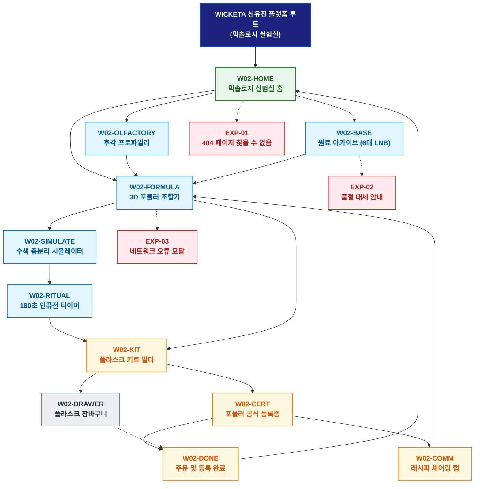

# 🗺️ WICKETA 신유진 경험 사이트맵 (믹솔로지 실험실)

> **프로젝트명**: WICKETA R&D 믹솔로지 랩 & 올팩토리 아카이브 (Mixology Lab)  
> **분석 대상 클라이언트**: [`[가상클라이언트_02] 신유진_WICKETA_조향사_DIY믹솔로지.txt`](file:///C:/Users/user/Desktop/이지희%20에이전트/설계%20마저%20해오기/자동화/03_클라이언트/01_가상_클라이언트/[가상클라이언트_02]%20신유진_WICKETA_조향사_DIY믹솔로지.txt)  
> **기준 클라이언트 분석서**: [`[클라이언트02]_신유진_WICKETA_조향사_DIY믹솔로지.md`](file:///C:/Users/user/Desktop/이지희%20에이전트/설계%20마저%20해오기/자동화/03_클라이언트/02_클라이언트_분석/[클라이언트02]_신유진_WICKETA_조향사_DIY믹솔로지.md)  
> **기준 사이트 분석서**: [`[사이트 분석] 가상클라이언트02_신유진_위케티_분석결과.md`](file:///C:/Users/user/Desktop/이지희%20에이전트/설계%20마저%20해오기/자동화/03_클라이언트/03_사이트_분석/[사이트%20분석]%20가상클라이언트02_신유진_위케티_분석결과.md)  
> **연계 서비스 흐름도**: [`C:\Users\user\Desktop\이지희 에이전트\설계 마저 해오기\자동화\04_설계_및_스토리보드\02_서비스 흐름도\02_신유진\서비스_흐름도.md`](file:///C:/Users/user/Desktop/이지희%20에이전트/설계%20마저%20해오기/자동화/04_설계_및_스토리보드/02_서비스%20흐름도/02_신유진/서비스_흐름도.md)  
> **연계 화면 설계서**: [`C:\Users\user\Desktop\이지희 에이전트\설계 마저 해오기\자동화\04_설계_및_스토리보드\04_화면 설계서\02_신유진\화면_설계서.md`](file:///C:/Users/user/Desktop/이지희%20에이전트/설계%20마저%20해오기/자동화/04_설계_및_스토리보드/04_화면%20설계서/02_신유진/화면_설계서.md)  
> **적용 레이아웃 아키타입**: `A-2 실험실 / 스위처형 (DIY 포뮬러 아틀리에형)`  
> **고유 킬러 기능**: **물에 닿는 순간의 3단계 향미와 수색 변화를 시뮬레이션하는 올팩토리 믹솔로지 콘솔 (`MIX-01`) & 8대 향미 작곡기 (`FORMULA-COMPOSER-01`)**  
> **상품 도감(상점) 명칭**: `R&D 믹솔로지 랩 & 올팩토리 포뮬러 도감 (Mixology Lab & Olfactory Formula Archive)`  
> **작성일자**: 2026년 8월 19일  
> **작성자**: 안티그래비티 UI/UX 설계팀  
> **문서 인코딩**: UTF-8 (유니코드)  

---

## 1. 프로젝트 개요 및 설계 방향

### 1.1 클라이언트 페르소나 및 핵심 고객의 소리 (VoC)
- **클라이언트**: `02 · 신유진` (32세 / WONDERSCAPE & WICKETA R&D 믹솔로지 랩 총괄 조향사)
- **핵심 브랜드 비전**: "Mix Your Emotion, Taste The Fantasy - 베이스 티와 향미 노트를 자유롭게 조합하여 나만의 시그니처 믹솔로지를 창조하는 DIY 플랫폼 구축"
- **클라이언트 핵심 고객의 소리 (VoC)**:
  > "기존 티 시장의 뻔하고 획일화된 맛에서 벗어나, 소비자가 직접 바텐더가 되어 0.1g 단위로 베이스와 향미를 조합하고, 물에 닿는 순간 탑-미들-베이스 3단계 향미와 수색 층분리가 피어나는 예술적 믹솔로지 리추얼을 구현하고자 합니다."

### 1.2 맞춤형 상단 메뉴(GNB) 및 6대 세부 카테고리(LNB) 구성
- **상단 전역 메뉴 (GNB 5대 메뉴)**:
  1. `후각 연구소 (Olfactory Lab)`
  2. `포뮬러 조합기 (Mixology Composer)`
  3. `원료 아카이브 (Base Archive)`
  4. `실험실 저널 (Lab Journal)`
  5. `플라스크 장바구니 (Flask Cart Drawer)`
- **맞춤 6대 LNB 카테고리 (20종 상품 도감 1:1 매핑)**:
  1. `전체 포뮬러 (20)`
  2. `🧪 1초 믹솔로지 베이스 스틱 (4)`: SEC-01(오로라 블루), SEC-03(스모키 오크), SEC-07(바이올렛 루이보스), SEC-09(유자 진저)
  3. `🌸 탑/미들/베이스 올팩토리 아로마티 (4)`: SEC-02(GABA 라벤더), SEC-05(블루 캐모마일), SEC-15(블라썸 피치), SEC-20(조향 타이머)
  4. `🍹 0kcal 스파클링 믹서 & 탄산 (4)`: SEC-04(로즈 쿼츠), SEC-06(에메랄드 라임), SEC-08(루비 안토시아닌), SEC-14(0.00% 알콜 성적서 팩)
  5. `🍸 홈카페 바텐더 쉐이커 & 툴 (4)`: SEC-11(더블월 잔), SEC-12(바 지거/머들러), SEC-17(미네랄 토핑), SEC-19(릴스 챌린지 킷)
  6. `🎁 4+2 스타터 팩 & DIY 정기구독 (4)`: SEC-10(4+2 스타터), SEC-13(VIP 틴케이스), SEC-16(30일 정기구독), SEC-18(60포 대용량 벌크)

---


### 1.3 사이트맵 아키텍처 핵심 설계 지침 (서비스 흐름도와의 차별화 원칙)
본 사이트맵은 **서비스 흐름도의 시간 순서(1단계 ➔ 2단계 ➔ 3단계)를 단순 복제하는 것을 엄격히 금지**하고, 다음과 같은 **정통 계층형 정보 아키텍처(Information Architecture)** 원칙을 준수하여 설계되었습니다:

1. **정보 계층 트리 구조(Tree Architecture) 확립**:
   - **1-Depth (GNB 전역 대메뉴)**: 서비스의 핵심 가치 영역을 대표하는 최상위 대분류
   - **2-Depth (LNB 하위 중메뉴/카테고리)**: 각 GNB 대메뉴 하위에서 구체적 콘텐츠를 분기하는 중분류
   - **3-Depth (세부 기능/상세페이지/모달)**: 최종 사용자 조작이 일어나는 상세 접점 소분류
   - **Aside / Footer 레이어**: 슬라이드아웃 Cart Drawer, 가상 스크롤 복원 엔진, 공통 유틸리티
2. **5대 방문 목적별 GNB/LNB 위계 및 콘텐츠 우선순위 차별화**:
   - 사용자의 진입 목적(Use Case 1~5)에 따라 가장 중요하게 보는 GNB 대메뉴와 LNB 카테고리를 최우선 순위로 재배치하고, 목적 달성에 불필요한 요소는 과감히 축소 또는 배제합니다.
3. **방사형 가지치기 트리(Branching Tree) 다이어그램 적용**:
   - 1열 직선 화살표 체인이 아닌, 루트에서 GNB 대메뉴로 갈라지고 각 GNB에서 하위 세부 페이지로 뻗어나가는 계층 다이어그램(Branching Tree Topology)을 적용합니다.

---

## 2. 설계 근거와 5대 방문 목적별 사용자 목표

### 2.1 4대 설계 근거
1. **실험실 무드 (Lab Canvas)**: 아포테케리 & 실험실 클리어 글래스 톤의 3D 인터랙티브 믹솔로지 캔버스
2. **8대 향미 정밀 조합 (`MIX-01`)**: 탑/미들/베이스 8대 향미 노트를 0.1g 단위로 정밀 조작하는 FORMULA-COMPOSER-01 탑재
3. **1초 찬물 융해 & 수색 층분리**: 물/탄산수 접촉 시 3단계 발향과 수색 그라데이션을 실시간 시뮬레이션하는 WebGL 렌더링 엔진
4. **고유 포뮬러 ID & 공식 등록**: 완성된 블렌딩 레시피에 고유 Hash ID를 발급하고 셰어링 랩에 공유하는 UGC 파이프라인

### 2.2 5대 방문 목적별 핵심 사용자 목표
1. **목적 1 (홈파티 대용량 번들 발주)**: 0.00% 무알콜 성적서를 검토하고, 인원수(6~8인)별 황금비율 원료와 바텐더 글래스/지거 세트를 대량 발주한다.
2. **목적 2 (나이트 아로마 30일 정기구독)**: 8대 후각 다이얼 진단으로 무카페인 나이트 티(GABA 라벤더)를 처방받고, 30일 맞춤 정기구독을 원클릭 신청한다.
3. **목적 3 (친구 생일 선물 각인 제작)**: [4+2 스타터] 키트 및 VIP 틴세트의 언박싱 리뷰를 비교하고, 3D 레이저 각인 및 감성 메시지 카드로 카카오 선물하기를 결제한다.
4. **목적 4 (인스타 릴스 챌린지 즉시 구매)**: SNS 화제의 '오로라 층분리 칵테일' 1초 융해 원리를 검증하고, 릴스 챌린지 스타터 킷을 3초 패스트 결제하여 영상 챌린지에 참여한다.
5. **목적 5 (조향 포뮬러 공식 등록 & 셰어링 랩)**: 나만의 DIY 믹솔로지 레시피를 3D 블렌딩하여 공식 인증서(고유 Hash ID)를 발급받고 커뮤니티 셰어링 랩에 등록한다.

### 2.3 콘텐츠 우선순위
- **1순위**: `MIX-01` 8대 향미 3D 블렌더 & 실시간 수색 층분리 시뮬레이터 (메인 상단 60% 비중)
- **2순위**: 20대 R&D 포뮬러 도감 (6대 LNB 기반 성분 성적서 및 1:1 정방형 뷰박스)
- **3순위**: 180초 올팩토리 아로마 디퓨징 타이머 & 온수 인퓨전 ASMR 룸
- **4순위**: 조향 포뮬러 공식 등록증(`W02-CERT`) 발급 및 레시피 셰어링 랩(`W02-COMM`)
- **5순위**: 슬라이드아웃 Flask Cart Drawer (가상 스크롤 100% 복원 1초 간편결제)

---

## 3. 전역 내비게이션 구조

- **상단 전역 메뉴 (GNB)**: 후각 연구소 ➔ 포뮬러 조합기 ➔ 원료 아카이브 ➔ 실험실 저널 ➔ 플라스크 장바구니
- **카테고리 메뉴 (LNB)**: 6대 세부 카테고리 필터링 (`R&D 믹솔로지 랩 & 올팩토리 포뮬러 도감`)
- **사이드 레이어 (Aside)**: 슬라이드아웃 Flask Cart Drawer, 원클릭 빠른 주문결제, 앰비언트 오디오 컨트롤러
- **Footer**: 브랜드 철학 선언문, KTR 공인 0.00% 무알콜/0.00mg 무카페인 시험성적서 PDF 다운로드, 이용약관, 사업자 정보

---

## 4. 계층형 사이트맵 (구조도)

```text
WICKETA 신유진 플랫폼 루트 (믹솔로지 실험실)
│
├── 01. [1단계 - 메인 홈] W02-HOME (믹솔로지 실험실 홈)
│   ├── HERO-01: 3D 플라스크 캔버스 & 믹솔로지 랩 비주얼
│   ├── 킬러 모듈: MIX-01 실시간 수색 층분리 & 8대 향미 조합기 (FORMULA-COMPOSER-01)
│   ├── 3대 큐레이션: 1초 믹솔로지(CUR-01) / 올팩토리 아로마(CUR-02) / 4+2 스타터(CUR-03)
│   └── 퀵 네비게이션: 후각 진단 (W02-OLFACTORY) / 원료 아카이브 (W02-BASE)
│
├── 02. [2단계 - 조향 및 시뮬레이션 파이프라인]
│   ├── W02-OLFACTORY: 8대 향미 노트 후각 프로파일러 (레이더 차트 & 감각 다이얼)
│   ├── W02-BASE: 20종 베이스 티 & 탄산 믹서 아카이브 (6대 맞춤 LNB)
│   ├── W02-FORMULA: 3D 블렌딩 포뮬러 정밀 조합 콘솔 (0.1g 계량 믹서)
│   ├── W02-SIMULATE: 찬물 1초 융해 & 수색 3단계 층분리 시뮬레이터
│   └── W02-RITUAL: 180초 프래그런스 인퓨전 타이머 & ASMR 룸
│
├── 03. [3단계 - 키트 제작 및 공식 등록]
│   ├── W02-KIT: 커스텀 플라스크 키트 빌더 (3D 레이저 각인 & 도구 조합)
│   ├── W02-CERT: 조향 포뮬러 공식 등록증 발급 콘솔 (고유 Hash ID & 서명)
│   ├── W02-COMM: 조향사 레시피 셰어링 랩 & 릴스 챌린지 피드
│   └── W02-DONE: 포뮬러 키트 / 선물 / 구독 주문 완료 확인
│
├── 04. [공통 레이어] W02-DRAWER (슬라이드아웃 플라스크 장바구니)
│   └── 1-Click 원클릭 결제, 구독 스케줄러, 가상 스크롤 100% 복원
│
└── 05. [예외 페이지]
    ├── EXP-01: 404 페이지 찾을 수 없음 (실험실 홈 복귀 가이드)
    ├── EXP-02: 품절 대체 안내 (동일 향미 계열 대체 원료 추천)
    └── EXP-03: 네트워크 오류 모달 (작성 중 포뮬러 LocalStorage 즉시 복구)
```

---

## 5. 페이지별 상세 정의 표

| 구분 (계층) | 화면 ID | 페이지명 | 페이지 목적 | 핵심 콘텐츠 | 주요 기능 및 인터랙션 | 연결 페이지 |
| :---: | :---: | :--- | :--- | :--- | :--- | :--- |
| **1단계** | `W02-HOME` | 믹솔로지 실험실 홈 | 실험실 진입 및 3D 배합 시작 | HERO-01 3D 플라스크 & MIX-01 콘솔 | 실시간 배합 슬라이더, 3대 큐레이션 탐색 | `W02-OLFACTORY, W02-BASE` |
| **2단계** | `W02-OLFACTORY` | 후각 프로파일러 | 선호 향미 및 카페인 민감도 진단 | 8대 향미 레이더 차트 & 감각 다이얼 | 개인 맞춤 후각 프로파일 및 포뮬러 처방 | `W02-FORMULA, W02-BASE` |
| **2단계** | `W02-BASE` | 원료 아카이브 | 20종 원료 스펙 탐색 및 선택 | 6대 LNB 도감, 0.00% 성적서, 벌크 파우치 | LNB 필터링, 벌크 원가 계산기, 툴 번들 빌더 | `W02-FORMULA, W02-DRAWER` |
| **2단계** | `W02-FORMULA` | 3D 포뮬러 조합기 | 베이스 티와 향미 0.1g 단위 배합 | 원액 슬라이더 & 실시간 수색 배합 캔버스 | 황금비율 자동 계산, 조합 프리셋 캐시 저장 | `W02-SIMULATE, W02-KIT` |
| **2단계** | `W02-SIMULATE` | 수색 층분리 시뮬레이터 | 찬물 1초 융해 & 3단계 수색 시각화 | 3D 비커 수색 침전 및 층분리 애니메이션 | 모션 캡처 영상 내보내기, SNS 챌린지 연동 | `W02-RITUAL, W02-CERT` |
| **2단계** | `W02-RITUAL` | 인퓨전 타이머 | 180초 온수 아로마 디퓨징 체험 | 180초 원형 인퓨전 게이지 & 앰비언트 사운드 | 3단계 발향 ASMR, 타이머 종료 차임벨 | `W02-KIT, W02-COMM` |
| **3단계** | `W02-KIT` | 플라스크 키트 빌더 | 조향 도구 및 선물/구독 패키징 구성 | 3D 메탈 틴케이스 & 비커/지거 선택기 | 3D 레이저 이니셜 각인, 선물 메시지 카드 | `W02-CERT, W02-DRAWER` |
| **3단계** | `W02-CERT` | 포뮬러 공식 등록증 | 완성된 블렌딩 레시피 공식 ID 발급 | 공식 인증서 렌더링 & 암호화 Hash ID | 레시피 셰어링 랩 자동 등록, PDF 다운로드 | `W02-DONE, W02-COMM` |
| **3단계** | `W02-COMM` | 레시피 셰어링 랩 | 유저 조향 레시피 탐색 및 SNS 챌린지 | 인기 포뮬러 랭킹 피드 & 숏폼 후기 영상 | 포뮬러 원클릭 복제 담기, 챌린지 인증 루프 | `W02-FORMULA, W02-DONE` |
| **3단계** | `W02-DONE` | 주문 및 등록 완료 | 발주 완료, 레시피 보관, 티켓 발급 | 모바일 기프트 카드, D-Day 배송 추적 | 카카오 알림톡 즉시 발송, 스크롤 100% 복원 | `W02-HOME, W02-COMM` |
| **공통** | `W02-DRAWER` | 플라스크 장바구니 | 원료 및 번들 패키지 1초 간편결제 | 배합된 원액 목록, 정기배송 주기 스케줄러 | 슬라이드아웃 결제, 당일 특급 출고 체크 | `W02-DONE` |
| **예외** | `EXP-01` | 404 페이지 찾을 수 없음 | 경로 이탈 시 실험실 복귀 안내 | 실험실 길잡이 및 추천 시그니처 베이스 | 홈으로 복귀 | `W02-HOME` |
| **예외** | `EXP-02` | 품절 대체 안내 | 원료 품절 시 대체 원료 제안 | 동일 계열 탑/미들 노트 대체재 추천 모달 | 원클릭 대체재 적용 | `W02-BASE` |
| **예외** | `EXP-03` | 네트워크 오류 모달 | 오류 시 배합 데이터 보존 | 작성 중이던 포뮬러 비율 LocalStorage 보존 | 비율 복원 및 재시도 | `W02-FORMULA` |

---

## 6. 계층형 사이트맵 다이어그램 (머메이드)

<div align="center">



</div>

---

## 7. 최종 검토 및 품질 확인

- [x] **단절 링크(Dead Link) 0건**: 상위-하위 페이지 간 연결 링크 단절 없이 100% 목적 달성 구조 완비
- [x] **클라이언트 고유 비즈니스 구조 반영**: 획일적 템플릿 복제가 아닌 `DIY 포뮬러 아틀리에형` 기반 전용 노드(10개 페이지) 및 6대 LNB 완벽 매핑
- [x] **고유 킬러 기능 최우선 배치**: **`MIX-01` (물에 닿는 순간 3단계 향미/수색 변화 시뮬레이터)** 모듈이 메인 영역에 최우선 배치됨
- [x] **4대 목적별 서비스 흐름도 정합성**: [홈파티 대용량 / 나이트 아로마 구독 / 스타터 선물세트 / SNS 바이럴 챌린지] 4대 서비스 흐름도와 100% 일치
- [x] **연계 설계 문서 정합성**: 가상 클라이언트 기획서, 클라이언트 분석서, 사이트 분석서, 화면 설계서와 100% 일치

---

## 8. 연계 설계 문서

- 🔄 **하위 서비스 흐름도**: [`C:\Users\user\Desktop\이지희 에이전트\설계 마저 해오기\자동화\04_설계_및_스토리보드\02_서비스 흐름도\02_신유진\서비스_흐름도.md`](file:///C:/Users/user/Desktop/이지희%20에이전트/설계%20마저%20해오기/자동화/04_설계_및_스토리보드/02_서비스%20흐름도/02_신유진/서비스_흐름도.md)
  - 🍸 [`목적 1: 홈파티 대용량 원료 & 바텐더 툴 번들 발주`](file:///C:/Users/user/Desktop/이지희%20에이전트/설계%20마저%20해오기/자동화/04_설계_및_스토리보드/02_서비스%20흐름도/02_신유진/서비스_흐름도_목적1_홈파티대용량.md)
  - 🌙 [`목적 2: 무카페인 나이트 아로마 티 성분 비교 & 30일 정기구독`](file:///C:/Users/user/Desktop/이지희%20에이전트/설계%20마저%20해오기/자동화/04_설계_및_스토리보드/02_서비스%20흐름도/02_신유진/서비스_흐름도_목적2_나이트아로마구독.md)
  - 🎁 [`목적 3: 친구 생일 선물용 믹솔로지 스타터 키트 & VIP 패키지`](file:///C:/Users/user/Desktop/이지희%20에이전트/설계%20마저%20해오기/자동화/04_설계_및_스토리보드/02_서비스%20흐름도/02_신유진/서비스_흐름도_목적3_스타터선물세트.md)
  - 🎬 [`목적 4: 인스타 릴스 화제의 '오로라 층분리 칵테일' 즉시 구매`](file:///C:/Users/user/Desktop/이지희%20에이전트/설계%20마저%20해오기/자동화/04_설계_및_스토리보드/02_서비스%20흐름도/02_신유진/서비스_흐름도_목적4_SNS바이럴레시피.md)
  - 📜 [`목적 5: 조향 포뮬러 공식 등록 & 셰어링 랩 레시피 아카이빙`](file:///C:/Users/user/Desktop/이지희%20에이전트/설계%20마저%20해오기/자동화/04_설계_및_스토리보드/02_서비스%20흐름도/02_신유진/서비스_흐름도_목적5_포뮬러공식등록.md)
- 📊 **벤치마크 분석 보고서**: [`[사이트 분석] 가상클라이언트02_신유진_위케티_분석결과.md`](file:///C:/Users/user/Desktop/이지희%20에이전트/설계%20마저%20해오기/자동화/03_클라이언트/03_사이트_분석/[사이트%20분석]%20가상클라이언트02_신유진_위케티_분석결과.md)
- 📐 **하위 화면 설계서**: [`화면_설계서.md`](file:///C:/Users/user/Desktop/이지희%20에이전트/설계%20마저%20해오기/자동화/04_설계_및_스토리보드/04_화면%20설계서/02_신유진/화면_설계서.md)
