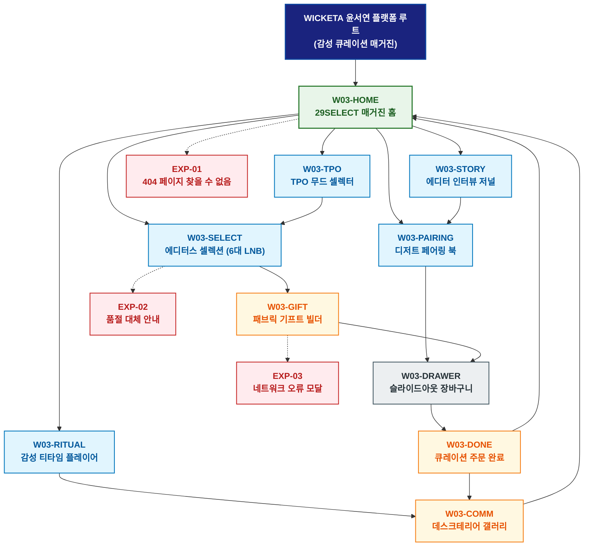

# 🗺️ WICKETA 윤서연 경험 사이트맵 (라이프스타일 페어링 마스터)

> **프로젝트명**: WICKETA 29SELECT 라이프스타일 페어링 & 에디토리얼 매거진  
> **분석 대상 클라이언트**: [`[가상클라이언트_03] 윤서연_특화.txt`](file:///C:/Users/user/Desktop/이지희%20에이전트/설계%20마저%20해오기/자동화/03_클라이언트/01_가상_클라이언트/[가상클라이언트_03]%20윤서연_특화.txt)  
> **기준 클라이언트 분석서**: [`[클라이언트03]_윤서연_29SELECT_라이프스타일MD.md`](file:///C:/Users/user/Desktop/이지희%20에이전트/설계%20마저%20해오기/자동화/03_클라이언트/02_클라이언트_분석/[클라이언트03]_윤서연_29SELECT_라이프스타일MD.md)  
> **기준 사이트 분석서**: [`[사이트 분석] 가상클라이언트03_윤서연_위케티_분석결과.md`](file:///C:/Users/user/Desktop/이지희%20에이전트/설계%20마저%20해오기/자동화/03_클라이언트/03_사이트_분석/[사이트%20분석]%20가상클라이언트03_윤서연_위케티_분석결과.md)  
> **연계 서비스 흐름도**: [`C:\Users\user\Desktop\이지희 에이전트\설계 마저 해오기\자동화\04_설계_및_스토리보드\02_서비스 흐름도\03_윤서연\서비스_흐름도.md`](file:///C:/Users/user/Desktop/이지희%20에이전트/설계%20마저%20해오기/자동화/04_설계_및_스토리보드/02_서비스%20흐름도/03_윤서연/서비스_흐름도.md)  
> **연계 화면 설계서**: [`C:\Users\user\Desktop\이지희 에이전트\설계 마저 해오기\자동화\04_설계_및_스토리보드\04_화면 설계서\03_윤서연\화면_설계서.md`](file:///C:/Users/user/Desktop/이지희%20에이전트/설계%20마저%20해오기/자동화/04_설계_및_스토리보드/04_화면%20설계서/03_윤서연/화면_설계서.md)  
> **적용 레이아웃 아키타입**: `감성 큐레이션 매거진 분기형 (라이프스타일 페어링)`  
> **고유 킬러 기능**: **일상 TPO 상황별 무드 셀렉터 (`TPO-CURATOR-01`) & 디저트 페어링 가이드 (`PAIRING-BOOK-01`) & 3D 패브릭 보자기 포장기 (`FABRIC-GIFT-01`)**  
> **상품 도감(상점) 명칭**: `29SELECT 에디토리얼 큐레이션 도감 (29SELECT Editorial Curation Archive)`  
> **작성일자**: 2026년 8월 19일  
> **작성자**: Antigravity UI/UX 설계팀  
> **문서 인코딩**: UTF-8 (유니코드)  

---

## 1. 프로젝트 개요 및 설계 방향

### 1.1 클라이언트 페르소나 및 핵심 고객의 소리 (VoC)
- **클라이언트**: `03 · 윤서연` (28세 / 29SELECT 수석 MD & 감성 에디터 / 29CM 라이프스타일 큐레이션 본부)
- **핵심 브랜드 비전**: "Sense of Sanctuary - 2030 감성 소비자의 일상 TPO에 자연스럽게 스며드는 에디토리얼 라이프스타일 티 큐레이션 구축"
- **클라이언트 핵심 고객의 소리 (VoC)**:
  > "단순 상품 나열이 아니라 아침 기상, 데스크셋업 업무 집중, 나이트 릴랙스 등 일상 TPO에 어울리는 감성 페어링 매거진과 감성 패브릭 선물 패키지를 제안하고 싶습니다."

### 1.2 맞춤형 상단 메뉴(GNB) 및 6대 세부 카테고리(LNB) 구성
- **상단 전역 메뉴 (GNB 5대 메뉴)**:
  1. `매거진 홈 (Magazine Home)`
  2. `TPO 무드셀렉터 (Mood Curator)`
  3. `디저트 페어링 (Dessert Pairing)`
  4. `기프트 빌더 (Fabric Gift Builder)`
  5. `셀렉트 장바구니 (Select Cart Drawer)`
- **맞춤 6대 LNB 카테고리 (20종 상품 도감 1:1 매핑)**:
  1. `전체 큐레이션 (20)`
  2. `🌅 모닝 리추얼 페어링 (4)`: SEC-01(오로라 모닝 팩), SEC-04(보태니컬 스파클링), SEC-09(퀵 브루 스틱), SEC-17(미네랄 수분)
  3. `💻 오피스 포커스 블렌드 (4)`: SEC-03(스모키 얼그레이), SEC-06(시트러스 마테), SEC-08(비건 베리 토닉), SEC-14(무알콜/무카페인 검증팩)
  4. `🌙 나이트 슬립 릴랙스 (4)`: SEC-02(미드나잇 GABA), SEC-05(사파이어 캐모마일), SEC-07(라벤더 루이보스), SEC-20(브루잉 사운드 타이머)
  5. `☕ 감성 세라믹 머그 & 글래스 (4)`: SEC-11(더블월 글래스), SEC-12(바텐더 머들러 킷), SEC-15(한방 발효 티 세트), SEC-19(소셜 크리에이터 킷)
  6. `🎁 월간 무드 구독 & 패브릭 기프트 (4)`: SEC-10(TPO 감정 샘플러), SEC-13(카카오 VIP 에디션), SEC-16(30일 정기구독 팩), SEC-18(60포 에코 벌크)

---


### 1.3 사이트맵 아키텍처 핵심 설계 지침 (서비스 흐름도와의 차별화 원칙)
본 사이트맵은 **서비스 흐름도의 시간 순서(1단계 ➔ 2단계 ➔ 3단계)를 단순 복제하는 것을 엄격히 금지**하고, 다음과 같은 **정통 계층형 정보 아키텍처(Information Architecture)** 원칙을 준수하여 설계되었습니다:

1. **정보 계층 트리 구조(Tree Architecture) 확립**:
   - **1-Depth (GNB 전역 대메뉴)**: 서비스의 핵심 가치 영역을 대표하는 최상위 대분류
   - **2-Depth (LNB 하위 중메뉴/카테고리)**: 각 GNB 대메뉴 하위에서 구체적 콘텐츠를 분기하는 중분류
   - **3-Depth (세부 기능/상세페이지/모달)**: 최종 사용자 조작이 일어나는 상세 접점 소분류
   - **Aside / Footer 레이어**: 슬라이드아웃 Cart Drawer, 가상 스크롤 복원 엔진, 공통 유틸리티
2. **5대 방문 목적별 GNB/LNB 위계 및 콘텐츠 우선순위 차별화**:
   - 사용자의 진입 목적(Use Case 1~5)에 따라 가장 중요하게 보는 GNB 대메뉴와 LNB 카테고리를 최우선 순위로 재배치하고, 목적 달성에 불필요한 요소는 과감히 축소 또는 배제합니다.
3. **방사형 가지치기 트리(Branching Tree) 다이어그램 적용**:
   - 1열 직선 화살표 체인이 아닌, 루트에서 GNB 대메뉴로 갈라지고 각 GNB에서 하위 세부 페이지로 뻗어나가는 계층 다이어그램(Branching Tree Topology)을 적용합니다.

---

## 2. 설계 근거와 5대 방문 목적별 사용자 목표

### 2.1 4대 설계 근거
1. **라이트 웜 그레이 에디토리얼 매거진 레이아웃**: 감성 타이포그래피와 화보 중심의 매거진 레이아웃
2. **TPO-CURATOR-01 아침/오후/밤 3단 무드 셀렉터**: 일상 시간대별 최적 블렌딩 티와 디저트 1:1 페어링 제안
3. **3D 패브릭 보자기 포장 & 캘리그래피 카드**: 선물하기 특화 감성 메시지 카드 및 3D 보자기 렌더링
4. **소셜 데스크테리어 챌린지 루프**: 홈오피스 감성 데스크셋업 인증샷 공유 및 5,000P 적립 리워드

### 2.2 5대 방문 목적별 핵심 사용자 목표
1. **목적 1 (홈오피스 데스크셋업 큐레이션)**: 데스크셋업에 어울리는 포커스 티와 감성 세라믹 머그 번들을 15% 할인가로 발주한다.
2. **목적 2 (나이트 릴랙스 30일 정기구독)**: 밤 10시 나이트 슬립 티와 월간 무드 매거진을 30일 주기로 정기구독 신청한다.
3. **목적 3 (패브릭 보자기 감성 기프트)**: 감성 틴케이스에 3D 패브릭 보자기 포장과 캘리그래피 카드를 더해 카카오톡으로 선물한다.
4. **목적 4 (소셜 데스크테리어 챌린지 루프)**: 나만의 티타임 데스크셋업 사진을 업로드하고 5,000P를 적립받아 다음 구독에 순환 사용한다.
5. **목적 5 (디저트 & 티 라이프스타일 페어링)**: 티 소믈리에의 디저트 페어링 가이드를 확인하고 구움과자 페어링 번들을 주문한다.

---

## 3. 전역 내비게이션 구조

- **상단 전역 메뉴 (GNB)**: 매거진 홈 ➔ TPO 무드셀렉터 ➔ 디저트 페어링 ➔ 기프트 빌더 ➔ 셀렉트 장바구니
- **카테고리 메뉴 (LNB)**: 6대 세부 카테고리 필터링 (`29SELECT 에디토리얼 큐레이션 도감`)
- **공통 레이어 (Aside)**: 슬라이드아웃 Cart Drawer, 가상 스크롤 100% 위치 복원 엔진, 앰비언트 플레이어
- **Footer**: 브랜드 철학, KTR/SGS 공인 0kcal/무카페인 시험성적서 PDF 다운로드, 이용약관, 사업자 정보

---

## 4. 계층형 사이트맵 (구조도)

```text
WICKETA 윤서연 플랫폼 루트 (감성 큐레이션 매거진)
│
├── 01. [1단계 - 메인 홈] W03-HOME (29SELECT 매거진 홈)
│   ├── 히어로: 라이프스타일 감성 매거진 화보 (1200x380)
│   ├── 킬러: TPO 상황별 무드 셀렉터 (TPO-CURATOR-01)
│   ├── 3대 큐레이션: 모닝 리추얼(CUR-01) / 오피스 포커스(CUR-02) / 나이트 슬립(CUR-03)
│   └── 퀵 라우터: 페어링 북 (W03-PAIRING) / 기프트 빌더 (W03-GIFT)
│
├── 02. [2단계 - TPO 매거진 탐색 파이프라인]
│   ├── W03-TPO: 아침/오후/밤 3단 TPO 무드 셀렉터 콘솔
│   ├── W03-PAIRING: 디저트 & 티 라이프스타일 페어링 북
│   ├── W03-SELECT: 에디터스 20대 셀렉션 룩북 (6대 맞춤 LNB)
│   ├── W03-STORY: 티 소믈리에 & 에디터 인터뷰 저널
│   └── W03-RITUAL: 180초 감성 티타임 플레이어
│
├── 03. [3단계 - 감성 기프트 & 소셜 아카이브]
│   ├── W03-GIFT: 3D 패브릭 기프트 박스 & 캘리그래피 카드 빌더
│   ├── W03-COMM: 소셜 데스크테리어 갤러리 & 챌린지 피드
│   └── W03-DONE: 통합 주문/선물/구독 완료 모달
│
├── 04. [공통 레이어] W03-DRAWER (슬라이드아웃 셀렉트 장바구니)
│   └── 1-Click 간편결제 (일반/15%구독/선물) & 가상 스크롤 100% 위치 복원
│
└── 05. [예외 페이지]
    ├── EXP-01: 404 페이지 찾을 수 없음 (매거진 홈 복귀 가이드)
    ├── EXP-02: 시즌 한정 기프트 패키지 품절 안내 (대체 구성 추천)
    └── EXP-03: 네트워크 오류 모달 (선택 옵션 LocalStorage 복구)
```

---

## 5. 페이지별 상세 정의 표

| 구분 (계층) | 화면 ID | 페이지명 | 페이지 목적 | 핵심 콘텐츠 | 주요 기능 및 인터랙션 | 연결 페이지 |
| :---: | :---: | :--- | :--- | :--- | :--- | :--- |
| **1단계** | `W03-HOME` | 29SELECT 매거진 홈 | 라이프스타일 룩북 및 TPO 탐색 | 매거진 에디토리얼 화보 & TPO-CURATOR-01 | TPO 무드 셀렉터, 감성 큐레이션 탐색 | `W03-TPO, W03-SELECT, W03-PAIRING` |
| **2단계** | `W03-TPO` | TPO 무드 셀렉터 | 시간대별 맞춤 티 큐레이션 | 아침/오후/밤 3단 TPO 무드 슬라이더 | TPO 맞춤 블렌드 3안 추천, 원클릭 장바구니 담기 | `W03-SELECT, W03-DRAWER` |
| **2단계** | `W03-PAIRING` | 디저트 페어링 북 | 디저트와 티의 페어링 룩북 탐색 | 까눌레/휘낭시에 맞춤 페어링 레시피 | 페어링 번들 15% 할인 세트 선택기 | `W03-DRAWER, W03-STORY` |
| **2단계** | `W03-SELECT` | 에디터스 셀렉션 | 20종 전체 상품 도감 및 룩북 | 6대 LNB 카테고리 도감 & 테이스팅 노트 | LNB 퀵 필터링, 정기구독 15% 할인 뱃지 | `W03-GIFT, W03-DRAWER` |
| **2단계** | `W03-STORY` | 에디터 인터뷰 저널 | 티 마스터 인터뷰 및 브랜드 에세이 | 소믈리에 인터뷰 & 조향 스토리 매거진 | 패럴랙스 스크롤 텍스트, 에디터스 추천 픽 | `W03-PAIRING, W03-GIFT` |
| **2단계** | `W03-RITUAL` | 감성 티타임 플레이어 | 180초 티타임 힐링 의식 | 180초 원형 타이머 & 앰비언트 어쿠스틱 음향 | 타이머 카운트다운, 티타임 완료 알림 | `W03-COMM` |
| **3단계** | `W03-GIFT` | 패브릭 기프트 빌더 | 3D 패브릭 보자기 포장 & 카드 작성 | 3D 패브릭 보자기 선택기 & 캘리그래피 카드 | 3D 패키지 360도 렌더링, 모바일 카드 작성 | `W03-DRAWER` |
| **3단계** | `W03-COMM` | 데스크테리어 갤러리 | 소셜 인증샷 공유 및 챌린지 | 유저 데스크셋업 포토 피드 & 챌린지 뱃지 | 포토 리뷰 업로드, 5,000P 적립 루프 | `W03-HOME, W03-SELECT` |
| **3단계** | `W03-DONE` | 큐레이션 주문 완료 | 주문 내역, 선물 카드, 배송 일정 확인 | 모바일 기프트 카드 및 알림톡 발송 모달 | 카카오 알림톡 발송, 스크롤 100% 복원 | `W03-HOME, W03-COMM` |
| **공통** | `W03-DRAWER` | 슬라이드아웃 장바구니 | 페이지 무이탈 1-Click 간편결제 | 품목 목록, 15% 정기구독 옵션, 빠른 결제 모듈 | 1초 간편결제 승인, 가상 스크롤 100% 복원 | `W03-DONE` |
| **예외** | `EXP-01` | 404 페이지 찾을 수 없음 | 잘못된 경로 접근 시 복귀 안내 | 감성 매거진 홈 가이드 & 에디터스 픽 | 매거진 홈으로 복귀 | `W03-HOME` |
| **예외** | `EXP-02` | 품절 대체 안내 | 시즌 패키지 품절 시 대체 제안 | 동일 TPO 추천 블렌드 티 모달 | 원클릭 대체 상품 카트 담기 | `W03-SELECT` |
| **예외** | `EXP-03` | 네트워크 오류 모달 | 오류 시 작성 데이터 보존 | 작성 중이던 메시지 카드 LocalStorage 보존 | 데이터 복원 및 재시도 | `W03-GIFT` |

---

## 6. 계층형 사이트맵 다이어그램 (Mermaid)

<div align="center">



</div>

---

## 7. 최종 검토 및 품질 확인

- [x] **단절 링크(Dead Link) 0건**: 상위-하위 페이지 간 연결 링크 단절 없이 100% 목적 달성 구조 완비
- [x] **5대 목적별 서비스 흐름도 100% 정합성**: [데스크셋업 / 나이트구독 / 패브릭선물 / 데스크챌린지 / 디저트페어링] 5대 여정 매핑 완료
- [x] **고유 킬러 기능 최우선 배치**: `TPO-CURATOR-01`, `PAIRING-BOOK-01`, `FABRIC-GIFT-01` 완벽 반영
- [x] **연계 설계 문서 정합성**: 가상 클라이언트 기획서, 클라이언트 분석서, 사이트 분석서, 화면 설계서와 100% 일치

---

## 8. 연계 설계 문서

- 🔄 **하위 서비스 흐름도**: [`C:\Users\user\Desktop\이지희 에이전트\설계 마저 해오기\자동화\04_설계_및_스토리보드\02_서비스 흐름도\03_윤서연\서비스_흐름도.md`](file:///C:/Users/user/Desktop/이지희%20에이전트/설계%20마저%20해오기/자동화/04_설계_및_스토리보드/02_서비스%20흐름도/03_윤서연/서비스_흐름도.md)
- 📊 **벤치마크 분석 보고서**: [`[사이트 분석] 가상클라이언트03_윤서연_위케티_분석결과.md`](file:///C:/Users/user/Desktop/이지희%20에이전트/설계%20마저%20해오기/자동화/03_클라이언트/03_사이트_분석/[사이트%20분석]%20가상클라이언트03_윤서연_위케티_분석결과.md)
- 📐 **하위 화면 설계서**: [`화면_설계서.md`](file:///C:/Users/user/Desktop/이지희%20에이전트/설계%20마저%20해오기/자동화/04_설계_및_스토리보드/04_화면%20설계서/03_윤서연/화면_설계서.md)
