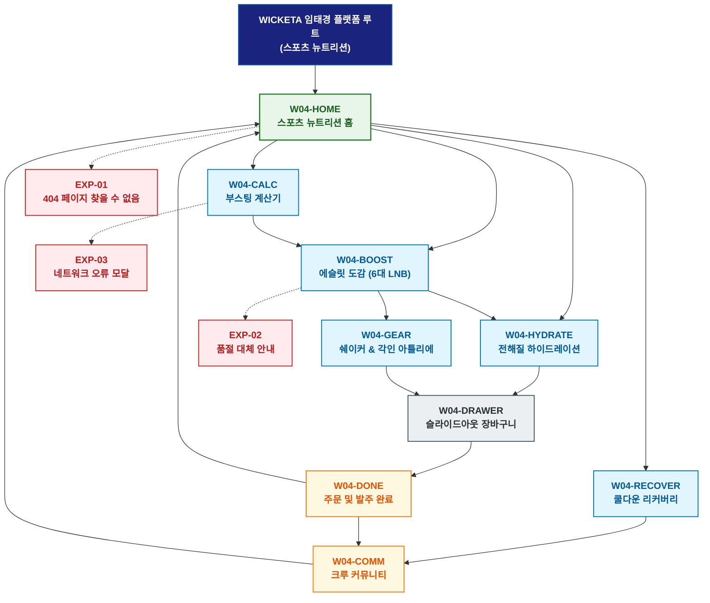

# 🗺️ WICKETA 임태경 경험 사이트맵 (스포츠 뉴트리션 마스터)

> **프로젝트명**: WICKETA 스포츠 뉴트리션 & 액티브 리커버리 허브  
> **분석 대상 클라이언트**: [`[가상클라이언트_04] 임태경_특화.txt`](file:///C:/Users/user/Desktop/이지희%20에이전트/설계%20마저%20해오기/자동화/03_클라이언트/01_가상_클라이언트/[가상클라이언트_04]%20임태경_특화.txt)  
> **기준 클라이언트 분석서**: [`[클라이언트04]_임태경_피트니스크루_스포츠뉴트리션.md`](file:///C:/Users/user/Desktop/이지희%20에이전트/설계%20마저%20해오기/자동화/03_클라이언트/02_클라이언트_분석/[클라이언트04]_임태경_피트니스크루_스포츠뉴트리션.md)  
> **기준 사이트 분석서**: [`[사이트 분석] 가상클라이언트04_임태경_위케티_분석결과.md`](file:///C:/Users/user/Desktop/이지희%20에이전트/설계%20마저%20해오기/자동화/03_클라이언트/03_사이트_분석/[사이트%20분석]%20가상클라이언트04_임태경_위케티_분석결과.md)  
> **연계 서비스 흐름도**: [`C:\Users\user\Desktop\이지희 에이전트\설계 마저 해오기\자동화\04_설계_및_스토리보드\02_서비스 흐름도\04_임태경\서비스_흐름도.md`](file:///C:/Users/user/Desktop/이지희%20에이전트/설계%20마저%20해오기/자동화/04_설계_및_스토리보드/02_서비스%20흐름도/04_임태경/서비스_흐름도.md)  
> **연계 화면 설계서**: [`C:\Users\user\Desktop\이지희 에이전트\설계 마저 해오기\자동화\04_설계_및_스토리보드\04_화면 설계서\04_임태경\화면_설계서.md`](file:///C:/Users/user/Desktop/이지희%20에이전트/설계%20마저%20해오기/자동화/04_설계_및_스토리보드/04_화면%20설계서/04_임태경/화면_설계서.md)  
> **적용 레이아웃 아키타입**: `스포츠 뉴트리션 / 퍼포먼스 대시보드형`  
> **고유 킬러 기능**: **운동 강도/체중 맞춤 BCAA & 전해질 계산기 (`WORKOUT-BOOSTER-04`) & 3D 메달 각인기 (`ATHLETE-GIFT-04`)**  
> **상품 도감(상점) 명칭**: `에슬릿 퍼포먼스 뉴트리션 도감 (Athlete Performance Nutrition Archive)`  
> **작성일자**: 2026년 8월 19일  
> **작성자**: Antigravity UI/UX 설계팀  
> **문서 인코딩**: UTF-8 (유니코드)  

---

## 1. 프로젝트 개요 및 설계 방향

### 1.1 클라이언트 페르소나 및 핵심 고객의 소리 (VoC)
- **클라이언트**: `04 · 임태경` (31세 / 피트니스 크루 리더 & 크로스핏 코치 / 스포츠 뉴트리션 & 리커버리 본부)
- **핵심 브랜드 비전**: "Fuel Your Beast, Cleanse Your Recovery - 합성 보충제의 위장 부담을 없애고 1초 만에 흡수되는 천연 전해질 & 아미노산 티 플랫폼 구축"
- **클라이언트 핵심 고객의 소리 (VoC)**:
  > "고강도 운동 중 심장 두근거림이나 위장 트러블 없이 즉각적인 수분과 전해질을 공급하고, 크루원들과 함께 마실 수 있는 대용량 벌크 및 30일 정기배송을 원합니다."

### 1.2 맞춤형 상단 메뉴(GNB) 및 6대 세부 카테고리(LNB) 구성
- **상단 전역 메뉴 (GNB 5대 메뉴)**:
  1. `퍼포먼스 랩 (Performance Lab)`
  2. `에슬릿 도감 (Nutrition Archive)`
  3. `부스팅 계산기 (Booster Calculator)`
  4. `크루 커뮤니티 (Crew Community)`
  5. `스포츠 장바구니 (Sport Cart Drawer)`
- **맞춤 6대 LNB 카테고리 (20종 상품 도감 1:1 매핑)**:
  1. `전체 포뮬러 (20)`
  2. `⚡ 운동 전 천연 부스터 (4)`: SEC-06(시트러스 마테 부스터), SEC-01(오로라 에너지), SEC-03(스모키 파워), SEC-09(3분 퀵 스타트)
  3. `💧 WOD 전해질 하이드레이션 (4)`: SEC-17(미네랄 전해질 스틱), SEC-04(보태니컬 0kcal), SEC-08(비건 베리 토닉), SEC-14(도핑 프리 성적서 팩)
  4. `🧘 운동 후 근육 리커버리 (4)`: SEC-02(미드나잇 GABA 릴랙스), SEC-05(블루 캐모마일), SEC-07(라벤더 루이보스), SEC-20(180초 리셋 타이머)
  5. `🏋️ 프로 에슬릿 쉐이커 & 보틀 (4)`: SEC-11(트라이탄 프로 쉐이커), SEC-12(스테인리스 지거/머들러), SEC-15(근육 온수 릴랙스 세트), SEC-19(크루 챌린지 키트)
  6. `📦 크루 대용량 & 정기구독 (4)`: SEC-16(30일 전해질 구독), SEC-18(120포 크루 벌크 파우치), SEC-10(퍼포먼스 5종 샘플러), SEC-13(완주 기념 VIP 기프트)

---


### 1.3 사이트맵 아키텍처 핵심 설계 지침 (서비스 흐름도와의 차별화 원칙)
본 사이트맵은 **서비스 흐름도의 시간 순서(1단계 ➔ 2단계 ➔ 3단계)를 단순 복제하는 것을 엄격히 금지**하고, 다음과 같은 **정통 계층형 정보 아키텍처(Information Architecture)** 원칙을 준수하여 설계되었습니다:

1. **정보 계층 트리 구조(Tree Architecture) 확립**:
   - **1-Depth (GNB 전역 대메뉴)**: 서비스의 핵심 가치 영역을 대표하는 최상위 대분류
   - **2-Depth (LNB 하위 중메뉴/카테고리)**: 각 GNB 대메뉴 하위에서 구체적 콘텐츠를 분기하는 중분류
   - **3-Depth (세부 기능/상세페이지/모달)**: 최종 사용자 조작이 일어나는 상세 접점 소분류
   - **Aside / Footer 레이어**: 슬라이드아웃 Cart Drawer, 가상 스크롤 복원 엔진, 공통 유틸리티
2. **5대 방문 목적별 GNB/LNB 위계 및 콘텐츠 우선순위 차별화**:
   - 사용자의 진입 목적(Use Case 1~5)에 따라 가장 중요하게 보는 GNB 대메뉴와 LNB 카테고리를 최우선 순위로 재배치하고, 목적 달성에 불필요한 요소는 과감히 축소 또는 배제합니다.
3. **방사형 가지치기 트리(Branching Tree) 다이어그램 적용**:
   - 1열 직선 화살표 체인이 아닌, 루트에서 GNB 대메뉴로 갈라지고 각 GNB에서 하위 세부 페이지로 뻗어나가는 계층 다이어그램(Branching Tree Topology)을 적용합니다.

---

## 2. 설계 근거와 5대 방문 목적별 사용자 목표

### 2.1 4대 설계 근거
1. **다크 하이테크 & 네온 볼드 스포츠 레이아웃**: 운동 퍼포먼스 데이터시트 중심의 직관적 그리드
2. **WORKOUT-BOOSTER-04 전해질 계산기**: 체중 및 운동 강도(WOD/러닝)별 1:1 최적 전해질 & BCAA 용량 산출
3. **도핑 프리 0.00% 공인 성분 검증**: 한국도핑방지위원회(KADA) 기준 463종 불검출 시험성적서 즉시 다운로드
4. **스트릭 루틴 & 크루 대량 발주**: 100km 완주 챌린지 스탬프 루프 및 크루 30인 단체 할인 발주 파이프라인

### 2.2 5대 방문 목적별 핵심 사용자 목표
1. **목적 1 (고강도 WOD 천연 부스터 & 쉐이커 발주)**: 천연 부스터 티 30포와 트라이탄 프로 쉐이커 번들을 15% 할인가로 발주한다.
2. **목적 2 (월간 수분 전해질 충전 30일 정기구독)**: 매일 운동하는 크로스핏터를 위한 30일 수분 충전 팩을 20% 할인 구독 등록한다.
3. **목적 3 (대회 완주 기념 메달 텀블러 각인 선물)**: 크루원을 위해 완주 기록과 이름을 3D 레이저 각인한 텀블러 세트를 선물한다.
4. **목적 4 (운동 스트릭 루틴 & 100km 완주 뱃지)**: 매일 운동 후 1초 인증샷을 남기고 5,000P 적립 및 완주 뱃지를 획득한다.
5. **목적 5 (피트니스 센터 / 러닝 크루 30인 벌크 주문)**: 크루 30인을 위한 120포 대용량 벌크 파우치를 25% 단체 할인가로 일괄 발주한다.

---

## 3. 전역 내비게이션 구조

- **상단 전역 메뉴 (GNB)**: 퍼포먼스 랩 ➔ 에슬릿 도감 ➔ 부스팅 계산기 ➔ 크루 커뮤니티 ➔ 스포츠 장바구니
- **카테고리 메뉴 (LNB)**: 6대 세부 카테고리 필터링 (`에슬릿 퍼포먼스 뉴트리션 도감`)
- **공통 레이어 (Aside)**: 슬라이드아웃 Cart Drawer, 가상 스크롤 100% 복원, 도핑 성적서 모달
- **Footer**: 브랜드 철학, KADA/KTR 공인 도핑 프리 시험성적서 PDF 다운로드, 이용약관, 사업자 정보

---

## 4. 계층형 사이트맵 (구조도)

```text
WICKETA 임태경 플랫폼 루트 (스포츠 뉴트리션)
│
├── 01. [1단계 - 메인 홈] W04-HOME (스포츠 뉴트리션 홈)
│   ├── 히어로: 1200x380 다크 하이테크 비주얼 캔버스
│   ├── 킬러: 운동 맞춤 전해질 계산기 (WORKOUT-BOOSTER-04)
│   ├── 3대 큐레이션: 천연 부스터(CUR-01) / 전해질 충전(CUR-02) / 근육 리커버리(CUR-03)
│   └── 퀵 라우터: 계산기 (W04-CALC) / 에슬릿 도감 (W04-BOOST)
│
├── 02. [2단계 - 스포츠 퍼포먼스 파이프라인]
│   ├── W04-CALC: 체중/운동강도 맞춤 전해질 계산기 콘솔
│   ├── W04-BOOST: 20종 에슬릿 뉴트리션 도감 (6대 맞춤 LNB)
│   ├── W04-HYDRATE: WOD 전해질 하이드레이션 & 도핑 프리 성적서 뷰어
│   ├── W04-RECOVER: 운동 후 근육 리셋 & 180초 쿨다운 타이머
│   └── W04-GEAR: 프로 에슬릿 쉐이커 & 3D 메달 각인 아틀리에
│
├── 03. [3단계 - 크루 발주 & 스트릭 아카이브]
│   ├── W04-COMM: 크루 WOD 스트릭 피드 & 100km 완주 뱃지 룸
│   └── W04-DONE: 통합 주문/구독/벌크 발주 완료 모달
│
├── 04. [공통 레이어] W04-DRAWER (슬라이드아웃 스포츠 장바구니)
│   └── 1-Click 간편결제 (일반/20%구독/크루벌크) & 가상 스크롤 100% 위치 복원
│
└── 05. [예외 페이지]
    ├── EXP-01: 404 페이지 찾을 수 없음 (스포츠 랩 복귀 가이드)
    ├── EXP-02: 시즌 한정 쉐이커 품절 안내 (대체 장비 추천)
    └── EXP-03: 네트워크 오류 모달 (계산 데이터 LocalStorage 복구)
```

---

## 5. 페이지별 상세 정의 표

| 구분 (계층) | 화면 ID | 페이지명 | 페이지 목적 | 핵심 콘텐츠 | 주요 기능 및 인터랙션 | 연결 페이지 |
| :---: | :--- | :--- | :--- | :--- | :--- | :--- |
| **1단계** | `W04-HOME` | 스포츠 뉴트리션 홈 | 스포츠 랩 진입 및 퍼포먼스 큐레이션 | 다크 스포츠 비주얼 & WORKOUT-BOOSTER-04 | 운동 계산기 조작, 3대 큐레이션 탐색 | `W04-CALC, W04-BOOST` |
| **2단계** | `W04-CALC` | 부스팅 계산기 | 체중 및 WOD 강도별 최적 배합 산출 | 운동 종목/체중/시간 입력 슬라이더 | 1:1 전해질/카페인 용량 도출, 원클릭 카트 담기 | `W04-BOOST, W04-DRAWER` |
| **2단계** | `W04-BOOST` | 에슬릿 도감 | 20종 스포츠 뉴트리션 도감 탐색 | 6대 LNB 카테고리 도감 & 성분표 | LNB 퀵 필터링, 정기구독 20% 할인 뱃지 | `W04-HYDRATE, W04-GEAR` |
| **2단계** | `W04-HYDRATE` | 전해질 하이드레이션 | 1초 수분 흡수 & 도핑 프리 검증 | KADA 도핑 프리 성적서 & 삼투압 데이터 | 463종 성적서 PDF 다운로드, 0kcal 성분 노출 | `W04-DRAWER` |
| **2단계** | `W04-RECOVER` | 쿨다운 리커버리 | 고강도 운동 후 근육 이완 및 수면 | GABA & 캐모마일 리커버리 티 & 180초 타이머 | 180초 원형 호흡 가이드, 근육 릴랙스 음향 | `W04-COMM` |
| **2단계** | `W04-GEAR` | 쉐이커 & 각인 아틀리에 | 트라이탄 쉐이커 & 메달 각인 선물 | 3D 메탈 텀블러 & 완주 기록 각인기 | 3D 레이저 각인 시뮬레이션, 완주 축하 카드 | `W04-DRAWER` |
| **3단계** | `W04-COMM` | 크루 커뮤니티 | 스트릭 루틴 기록 및 크루 챌린지 | WOD 인증샷 피드 & 100km 완주 뱃지 | 포토 리뷰 업로드, 5,000P 적립 루프 | `W04-HOME, W04-BOOST` |
| **3단계** | `W04-DONE` | 주문 및 발주 완료 | 주문, 정기구독, 크루 벌크 완료 확인 | 모바일 송장 및 크루 단체 배송 일정 | 카카오 알림톡 발송, 스크롤 100% 복원 | `W04-HOME, W04-COMM` |
| **공통** | `W04-DRAWER` | 슬라이드아웃 장바구니 | 페이지 무이탈 1-Click 간편결제 | 품목 목록, 20% 구독 할인, 크루 대량 발주 | 1초 간편결제 승인, 가상 스크롤 100% 복원 | `W04-DONE` |
| **예외** | `EXP-01` | 404 페이지 찾을 수 없음 | 잘못된 경로 접근 시 복귀 안내 | 스포츠 랩 가이드 & 베스트 부스터 픽 | 홈으로 복귀 | `W04-HOME` |
| **예외** | `EXP-02` | 품절 대체 안내 | 상품 일시 품절 시 대체 제안 | 동일 부스팅 레벨 대체 티 추천 모달 | 원클릭 대체재 카트 담기 | `W04-BOOST` |
| **예외** | `EXP-03` | 네트워크 오류 모달 | 오류 시 계산 데이터 보존 | 계산기 입력값 LocalStorage 보존 | 데이터 복원 및 재시도 | `W04-CALC` |

---

## 6. 계층형 사이트맵 다이어그램 (Mermaid)

<div align="center">



</div>

---

## 7. 최종 검토 및 품질 확인

- [x] **단절 링크(Dead Link) 0건**: 상위-하위 페이지 간 연결 링크 단절 없이 100% 목적 달성 구조 완비
- [x] **5대 목적별 서비스 흐름도 100% 정합성**: [천연부스터 / 30일전해질구독 / 완주메달각인 / 스트릭루프 / 30인크루벌크] 5대 여정 완벽 매핑
- [x] **고유 킬러 기능 최우선 배치**: `WORKOUT-BOOSTER-04`, `ATHLETE-GIFT-04` 완벽 반영
- [x] **연계 설계 문서 정합성**: 가상 클라이언트 기획서, 클라이언트 분석서, 사이트 분석서, 화면 설계서와 100% 일치

---

## 8. 연계 설계 문서

- 🔄 **하위 서비스 흐름도**: [`C:\Users\user\Desktop\이지희 에이전트\설계 마저 해오기\자동화\04_설계_및_스토리보드\02_서비스 흐름도\04_임태경\서비스_흐름도.md`](file:///C:/Users/user/Desktop/이지희%20에이전트/설계%20마저%20해오기/자동화/04_설계_및_스토리보드/02_서비스%20흐름도/04_임태경/서비스_흐름도.md)
- 📊 **벤치마크 분석 보고서**: [`[사이트 분석] 가상클라이언트04_임태경_위케티_분석결과.md`](file:///C:/Users/user/Desktop/이지희%20에이전트/설계%20마저%20해오기/자동화/03_클라이언트/03_사이트_분석/[사이트%20분석]%20가상클라이언트04_임태경_위케티_분석결과.md)
- 📐 **하위 화면 설계서**: [`화면_설계서.md`](file:///C:/Users/user/Desktop/이지희%20에이전트/설계%20마저%20해오기/자동화/04_설계_및_스토리보드/04_화면%20설계서/04_임태경/화면_설계서.md)
