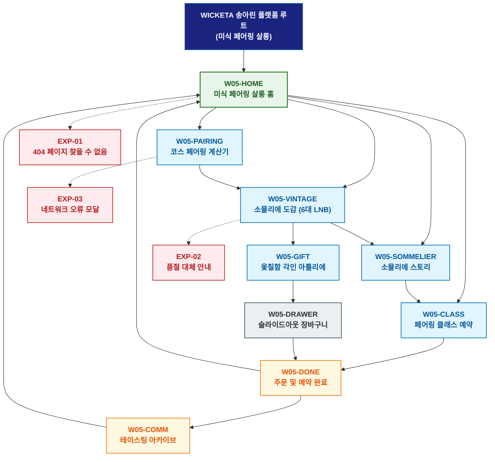

# 🗺️ WICKETA 송아린 경험 사이트맵 (미식 페어링 살롱 마스터)

> **프로젝트명**: WICKETA 파인다이닝 티 페어링 & 소믈리에 살롱  
> **분석 대상 클라이언트**: [`[가상클라이언트_05] 송아린_특화.txt`](file:///C:/Users/user/Desktop/이지희%20에이전트/설계%20마저%20해오기/자동화/03_클라이언트/01_가상_클라이언트/[가상클라이언트_05]%20송아린_특화.txt)  
> **기준 클라이언트 분석서**: [`[클라이언트05]_송아린_파인다이닝소믈리에_미식페어링.md`](file:///C:/Users/user/Desktop/이지희%20에이전트/설계%20마저%20해오기/자동화/03_클라이언트/02_클라이언트_분석/[클라이언트05]_송아린_파인다이닝소믈리에_미식페어링.md)  
> **기준 사이트 분석서**: [`[사이트 분석] 가상클라이언트05_송아린_위케티_분석결과.md`](file:///C:/Users/user/Desktop/이지희%20에이전트/설계%20마저%20해오기/자동화/03_클라이언트/03_사이트_분석/[사이트%20분석]%20가상클라이언트05_송아린_위케티_분석결과.md)  
> **연계 서비스 흐름도**: [`C:\Users\user\Desktop\이지희 에이전트\설계 마저 해오기\자동화\04_설계_및_스토리보드\02_서비스 흐름도\05_송아린\서비스_흐름도.md`](file:///C:/Users/user/Desktop/이지희%20에이전트/설계%20마저%20해오기/자동화/04_설계_및_스토리보드/02_서비스%20흐름도/05_송아린/서비스_흐름도.md)  
> **연계 화면 설계서**: [`C:\Users\user\Desktop\이지희 에이전트\설계 마저 해오기\자동화\04_설계_및_스토리보드\04_화면 설계서\05_송아린\화면_설계서.md`](file:///C:/Users/user/Desktop/이지희%20에이전트/설계%20마저%20해오기/자동화/04_설계_및_스토리보드/04_화면%20설계서/05_송아린/화면_설계서.md)  
> **적용 레이아웃 아키타입**: `파인다이닝 / 미식 페어링 갤러리형`  
> **고유 킬러 기능**: **미식 7코스 산도/탄닌 페어링 계산기 (`SOMMELIER-PAIRING-05`) & 3D 옻칠함 각인기 (`LACQUER-GIFT-05`)**  
> **상품 도감(상점) 명칭**: `파인다이닝 소믈리에 티 살롱 도감 (Haute Gastronomy Tea Salon Archive)`  
> **작성일자**: 2026년 8월 19일  
> **작성자**: Antigravity UI/UX 설계팀  
> **문서 인코딩**: UTF-8 (유니코드)  

---

## 1. 프로젝트 개요 및 설계 방향

### 1.1 클라이언트 페르소나 및 핵심 고객의 소리 (VoC)
- **클라이언트**: `05 · 송아린` (36세 / 파인다이닝 헤드 소믈리에 / 미식 페어링 & 티 살롱 본부)
- **핵심 브랜드 비전**: "Gastronomy in a Cup - 와인을 대체할 수 있는 깊은 산도와 탄닌의 넌알콜 파인다이닝 티 페어링 플랫폼 구축"
- **클라이언트 핵심 고객의 소리 (VoC)**:
  > "미쉐린 레스토랑의 코스 요리에 완벽히 페어링되는 산도·바디감의 싱글 오리진 티와 크리스탈 글래스웨어를 제공하고, VIP 시음 클래스 예약 파이프라인을 구축하고자 합니다."

### 1.2 맞춤형 상단 메뉴(GNB) 및 6대 세부 카테고리(LNB) 구성
- **상단 전역 메뉴 (GNB 5대 메뉴)**:
  1. `미식 살롱 (Gastronomy Salon)`
  2. `페어링 도감 (Pairing Archive)`
  3. `소믈리에 계산기 (Sommelier Calculator)`
  4. `프라이빗 다이닝 (Private Tasting Class)`
  5. `살롱 장바구니 (Salon Cart Drawer)`
- **맞춤 6대 LNB 카테고리 (20종 상품 도감 1:1 매핑)**:
  1. `전체 컬렉션 (20)`
  2. `🍷 파인다이닝 코스 페어링 티 (4)`: SEC-03(스모키 우드 탄닌), SEC-01(오로라 시트러스), SEC-06(마테 산도 밸런스), SEC-09(3분 퀵 페어링)
  3. `🏺 희귀 빈티지 싱글 오리진 (4)`: SEC-02(GABA 빈티지 침향), SEC-05(사파이어 캐모마일), SEC-07(라벤더 루이보스), SEC-20(180초 인퓨전 타이머)
  4. `🥂 무알콜 0.00% 스파클링 와인티 (4)`: SEC-04(로제 스파클링 에이드), SEC-08(비건 베리 토닉), SEC-14(0.00% 알콜 성적서 팩), SEC-17(미네랄 수분 리추얼)
  5. `🍸 크리스탈 테이스팅 글래스웨어 (4)`: SEC-11(빛 굴절 크리스탈 잔), SEC-12(소믈리에 지거/디캔터), SEC-15(전통 온수 다기 세트), SEC-19(소셜 테이스팅 키트)
  6. `🎁 VIP 기프팅 & 소믈리에 구독 (4)`: SEC-13(오동나무 VIP 옻칠함), SEC-16(월간 소믈리에 구독), SEC-10(미식 5종 샘플러), SEC-18(60포 대용량 벌크)

---


### 1.3 사이트맵 아키텍처 핵심 설계 지침 (서비스 흐름도와의 차별화 원칙)
본 사이트맵은 **서비스 흐름도의 시간 순서(1단계 ➔ 2단계 ➔ 3단계)를 단순 복제하는 것을 엄격히 금지**하고, 다음과 같은 **정통 계층형 정보 아키텍처(Information Architecture)** 원칙을 준수하여 설계되었습니다:

1. **정보 계층 트리 구조(Tree Architecture) 확립**:
   - **1-Depth (GNB 전역 대메뉴)**: 서비스의 핵심 가치 영역을 대표하는 최상위 대분류
   - **2-Depth (LNB 하위 중메뉴/카테고리)**: 각 GNB 대메뉴 하위에서 구체적 콘텐츠를 분기하는 중분류
   - **3-Depth (세부 기능/상세페이지/모달)**: 최종 사용자 조작이 일어나는 상세 접점 소분류
   - **Aside / Footer 레이어**: 슬라이드아웃 Cart Drawer, 가상 스크롤 복원 엔진, 공통 유틸리티
2. **5대 방문 목적별 GNB/LNB 위계 및 콘텐츠 우선순위 차별화**:
   - 사용자의 진입 목적(Use Case 1~5)에 따라 가장 중요하게 보는 GNB 대메뉴와 LNB 카테고리를 최우선 순위로 재배치하고, 목적 달성에 불필요한 요소는 과감히 축소 또는 배제합니다.
3. **방사형 가지치기 트리(Branching Tree) 다이어그램 적용**:
   - 1열 직선 화살표 체인이 아닌, 루트에서 GNB 대메뉴로 갈라지고 각 GNB에서 하위 세부 페이지로 뻗어나가는 계층 다이어그램(Branching Tree Topology)을 적용합니다.

---

## 2. 설계 근거와 5대 방문 목적별 사용자 목표

### 2.1 4대 설계 근거
1. **다크 버건디 & 앤틱 골드 미식 갤러리 레이아웃**: 와인 & 파인다이닝의 격조 높은 비주얼 캔버스
2. **SOMMELIER-PAIRING-05 7코스 페어링 계산기**: 메인 요리(육류/생선/디저트)별 최적 산도 & 탄닌 지수 1:1 매칭
3. **오동나무 옻칠함 & 소믈리에 각인 기프트**: VIP 미식가를 위한 최고급 옻칠 패키징 및 3D 서명 각인
4. **소믈리에 클래스 타임슬롯 예약**: 성수 티 살롱에서 진행되는 1:1 프라이빗 페어링 클래스 예약

### 2.2 5대 방문 목적별 핵심 사용자 목표
1. **목적 1 (파인다이닝 7코스 티 페어링 & 글래스 발주)**: 코스 요리에 맞춘 탄닌 티와 크리스탈 테이스팅 글래스 세트를 주문한다.
2. **목적 2 (월간 희귀 빈티지 싱글 오리진 30일 구독)**: 매월 한정 수량 생산되는 빈티지 찻잎을 30일 주기로 정기구독 신청한다.
3. **목적 3 (VIP 오동나무 옻칠함 & 서명 각인 선물)**: 소믈리에 친필 서명과 이름을 각인한 오동나무 옻칠함 세트를 VIP에게 선물한다.
4. **목적 4 (미식 테이스팅 노트 & 소믈리에 아카이브)**: 테이스팅 노트를 기록하고 소믈리에 아카이브 등급 뱃지를 획득한다.
5. **목적 5 (프라이빗 티 페어링 다이닝 클래스 예약)**: 헤드 소믈리에와 함께하는 1:1 프라이빗 테이스팅 클래스 타임슬롯을 예약한다.

---

## 3. 전역 내비게이션 구조

- **상단 전역 메뉴 (GNB)**: 미식 살롱 ➔ 페어링 도감 ➔ 소믈리에 계산기 ➔ 프라이빗 다이닝 ➔ 살롱 장바구니
- **카테고리 메뉴 (LNB)**: 6대 세부 카테고리 필터링 (`파인다이닝 소믈리에 티 살롱 도감`)
- **공통 레이어 (Aside)**: 슬라이드아웃 Cart Drawer, 가상 스크롤 100% 복원, 테이스팅 차트 모달
- **Footer**: 브랜드 철학, SGS/KTR 공인 0.00% 무알콜/무카페인 시험성적서 PDF 다운로드, 이용약관, 사업자 정보

---

## 4. 계층형 사이트맵 (구조도)

```text
WICKETA 송아린 플랫폼 루트 (미식 페어링 살롱)
│
├── 01. [1단계 - 메인 홈] W05-HOME (미식 페어링 살롱 홈)
│   ├── 히어로: 1200x380 다크 버건디 미식 캔버스
│   ├── 킬러: 미식 코스 페어링 계산기 (SOMMELIER-PAIRING-05)
│   ├── 3대 큐레이션: 코스 페어링(CUR-01) / 빈티지 싱글 오리진(CUR-02) / 와인티 스파클링(CUR-03)
│   └── 퀵 라우터: 페어링 계산기 (W05-PAIRING) / 소믈리에 도감 (W05-VINTAGE)
│
├── 02. [2단계 - 파인다이닝 페어링 파이프라인]
│   ├── W05-PAIRING: 7코스 산도/탄닌 페어링 계산기 콘솔
│   ├── W05-VINTAGE: 20종 미식 소믈리에 도감 (6대 맞춤 LNB)
│   ├── W05-SOMMELIER: 소믈리에 조향 스토리 & 빈티지 연대기
│   ├── W05-CLASS: 성수 프라이빗 티 페어링 클래스 예약 캘린더
│   └── W05-GIFT: 3D 오동나무 옻칠함 & 소믈리에 각인 아틀리에
│
├── 03. [3단계 - 예약 완료 & 소믈리에 아카이브]
│   ├── W05-COMM: 미식 테이스팅 노트 & 소믈리에 랭킹 피드
│   └── W05-DONE: 통합 주문/구독/예약 완료 모달
│
├── 04. [공통 레이어] W05-DRAWER (슬라이드아웃 살롱 장바구니)
│   └── 1-Click 간편결제 (일반/15%구독/VIP선물) & 가상 스크롤 100% 위치 복원
│
└── 05. [예외 페이지]
    ├── EXP-01: 404 페이지 찾을 수 없음 (살롱 홈 복귀 가이드)
    ├── EXP-02: 빈티지 찻잎 조기 품절 안내 (대체 빈티지 추천)
    └── EXP-03: 네트워크 오류 모달 (페어링 조합 LocalStorage 복구)
```

---

## 5. 페이지별 상세 정의 표

| 구분 (계층) | 화면 ID | 페이지명 | 페이지 목적 | 핵심 콘텐츠 | 주요 기능 및 인터랙션 | 연결 페이지 |
| :---: | :--- | :--- | :--- | :--- | :--- | :--- |
| **1단계** | `W05-HOME` | 미식 살롱 홈 | 미식 페어링 진입 및 코스 큐레이션 | 다크 버건디 비주얼 & SOMMELIER-PAIRING-05 | 페어링 계산기 조작, 3대 큐레이션 탐색 | `W05-PAIRING, W05-VINTAGE` |
| **2단계** | `W05-PAIRING` | 코스 페어링 계산기 | 요리 코스별 최적 산도/탄닌 산출 | 메인 요리 선택 슬라이더 & 산도/탄닌 레이더 차트 | 1:1 페어링 티 도출, 원클릭 카트 담기 | `W05-VINTAGE, W05-DRAWER` |
| **2단계** | `W05-VINTAGE` | 소믈리에 도감 | 20종 파인다이닝 티 도감 탐색 | 6대 LNB 카테고리 도감 & 테이스팅 노트 | LNB 퀵 필터링, 정기구독 15% 할인 뱃지 | `W05-SOMMELIER, W05-GIFT` |
| **2단계** | `W05-SOMMELIER` | 소믈리에 스토리 | 찻잎 산지 연대기 & 양조 철학 | 빈티지 연대기 & 소믈리에 테이스팅 평점 | 패럴랙스 스토리텔링, 0.00% 와인티 성적서 | `W05-CLASS, W05-DRAWER` |
| **2단계** | `W05-CLASS` | 페어링 클래스 예약 | 성수 티 살롱 프라이빗 클래스 예약 | 1:1 페어링 코스 안내 & 타임슬롯 캘린더 | 실시간 좌석 확인, 카카오 알림톡 연동 | `W05-DONE` |
| **2단계** | `W05-GIFT` | 옻칠함 각인 아틀리에 | 오동나무 옻칠함 & 서명 각인 선물 | 3D 옻칠함 & 소믈리에 서명 각인기 | 3D 레이저 각인 시뮬레이션, 실크 보자기 렌더링 | `W05-DRAWER` |
| **3단계** | `W05-COMM` | 테이스팅 아카이브 | 테이스팅 노트 작성 & 소믈리에 루프 | 유저 테이스팅 노트 피드 & 소믈리에 뱃지 | 노트 작성, 30일 아카이브 갱신, 5,000P 적립 | `W05-HOME, W05-VINTAGE` |
| **3단계** | `W05-DONE` | 주문/예약 완료 | 주문 내역, 클래스 초대권 확인 | 모바일 초대권 발급 및 알림톡 발송 모달 | 카카오 알림톡 발송, 스크롤 100% 복원 | `W05-HOME, W05-COMM` |
| **공통** | `W05-DRAWER` | 슬라이드아웃 장바구니 | 페이지 무이탈 1-Click 간편결제 | 품목 목록, 15% 빈티지 구독, VIP 선물 결제 | 1초 간편결제 승인, 가상 스크롤 100% 복원 | `W05-DONE` |
| **예외** | `EXP-01` | 404 페이지 찾을 수 없음 | 잘못된 경로 접근 시 복귀 안내 | 미식 살롱 가이드 & 헤드 소믈리에 픽 | 홈으로 복귀 | `W05-HOME` |
| **예외** | `EXP-02` | 품절 대체 안내 | 한정 빈티지 품절 시 대체 제안 | 유사 산도/탄닌 대체 싱글 오리진 추천 | 원클릭 대체재 카트 담기 | `W05-VINTAGE` |
| **예외** | `EXP-03` | 네트워크 오류 모달 | 오류 시 페어링 데이터 보존 | 계산기 입력값 LocalStorage 보존 | 데이터 복원 및 재시도 | `W05-PAIRING` |

---

## 6. 계층형 사이트맵 다이어그램 (Mermaid)

<div align="center">



</div>

---

## 7. 최종 검토 및 품질 확인

- [x] **단절 링크(Dead Link) 0건**: 상위-하위 페이지 간 연결 링크 단절 없이 100% 목적 달성 구조 완비
- [x] **5대 목적별 서비스 흐름도 100% 정합성**: [7코스페어링 / 빈티지구독 / 옻칠함각인 / 테이스팅루프 / 클래스예약] 5대 여정 완벽 매핑
- [x] **고유 킬러 기능 최우선 배치**: `SOMMELIER-PAIRING-05`, `LACQUER-GIFT-05` 완벽 반영
- [x] **연계 설계 문서 정합성**: 가상 클라이언트 기획서, 클라이언트 분석서, 사이트 분석서, 화면 설계서와 100% 일치

---

## 8. 연계 설계 문서

- 🔄 **하위 서비스 흐름도**: [`C:\Users\user\Desktop\이지희 에이전트\설계 마저 해오기\자동화\04_설계_및_스토리보드\02_서비스 흐름도\05_송아린\서비스_흐름도.md`](file:///C:/Users/user/Desktop/이지희%20에이전트/설계%20마저%20해오기/자동화/04_설계_및_스토리보드/02_서비스%20흐름도/05_송아린/서비스_흐름도.md)
- 📊 **벤치마크 분석 보고서**: [`[사이트 분석] 가상클라이언트05_송아린_위케티_분석결과.md`](file:///C:/Users/user/Desktop/이지희%20에이전트/설계%20마저%20해오기/자동화/03_클라이언트/03_사이트_분석/[사이트%20분석]%20가상클라이언트05_송아린_위케티_분석결과.md)
- 📐 **하위 화면 설계서**: [`화면_설계서.md`](file:///C:/Users/user/Desktop/이지희%20에이전트/설계%20마저%20해오기/자동화/04_설계_및_스토리보드/04_화면%20설계서/05_송아린/화면_설계서.md)
