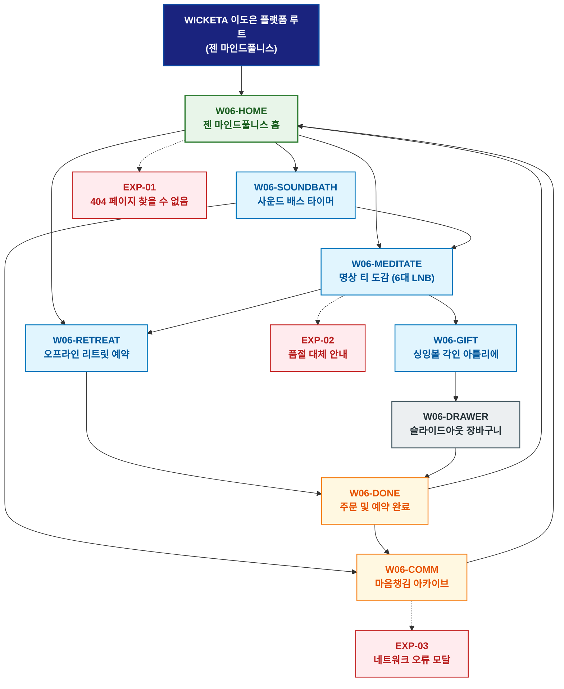

# 🗺️ WICKETA 이도은 경험 사이트맵 (젠 마인드풀니스 마스터)

> **프로젝트명**: WICKETA 젠 마인드풀니스 & 사운드 배스 티 테라피  
> **분석 대상 클라이언트**: [`[가상클라이언트_06] 이도은_특화.txt`](file:///C:/Users/user/Desktop/이지희%20에이전트/설계%20마저%20해오기/자동화/03_클라이언트/01_가상_클라이언트/[가상클라이언트_06]%20이도은_특화.txt)  
> **기준 클라이언트 분석서**: [`[클라이언트06]_이도은_사운드배스테라피스트_명상티.md`](file:///C:/Users/user/Desktop/이지희%20에이전트/설계%20마저%20해오기/자동화/03_클라이언트/02_클라이언트_분석/[클라이언트06]_이도은_사운드배스테라피스트_명상티.md)  
> **기준 사이트 분석서**: [`[사이트 분석] 가상클라이언트06_이도은_위케티_분석결과.md`](file:///C:/Users/user/Desktop/이지희%20에이전트/설계%20마저%20해오기/자동화/03_클라이언트/03_사이트_분석/[사이트%20분석]%20가상클라이언트06_이도은_위케티_분석결과.md)  
> **연계 서비스 흐름도**: [`C:\Users\user\Desktop\이지희 에이전트\설계 마저 해오기\자동화\04_설계_및_스토리보드\02_서비스 흐름도\06_이도은\서비스_흐름도.md`](file:///C:/Users/user/Desktop/이지희%20에이전트/설계%20마저%20해오기/자동화/04_설계_및_스토리보드/02_서비스%20흐름도/06_이도은/서비스_흐름도.md)  
> **연계 화면 설계서**: [`C:\Users\user\Desktop\이지희 에이전트\설계 마저 해오기\자동화\04_설계_및_스토리보드\04_화면 설계서\06_이도은\화면_설계서.md`](file:///C:/Users/user/Desktop/이지희%20에이전트/설계%20마저%20해오기/자동화/04_설계_및_스토리보드/04_화면%20설계서/06_이도은/화면_설계서.md)  
> **적용 레이아웃 아키타입**: `젠 미니멀리즘 / 앰비언트 테라피형`  
> **고유 킬러 기능**: **432Hz 사운드 배스 명상 타이머 (`SOUNDBATH-THERAPY-06`) & 3D 싱잉볼 각인기 (`SINGINGBOWL-GIFT-06`)**  
> **상품 도감(상점) 명칭**: `마인드풀니스 티 테라피 도감 (Mindfulness Tea Therapy Archive)`  
> **작성일자**: 2026년 8월 19일  
> **작성자**: Antigravity UI/UX 설계팀  
> **문서 인코딩**: UTF-8 (유니코드)  

---

## 1. 프로젝트 개요 및 설계 방향

### 1.1 클라이언트 페르소나 및 핵심 고객의 소리 (VoC)
- **클라이언트**: `06 · 이도은` (29세 / 싱잉볼 사운드 배스 테라피스트 / 젠 마인드풀니스 & 티 테라피 본부)
- **핵심 브랜드 비전**: "Breathe In Sound, Drink In Peace - 432Hz 크리스탈 싱잉볼 주파수와 무카페인 티로 뇌파를 안정시키는 디지털 명상 안식처 구축"
- **클라이언트 핵심 고객의 소리 (VoC)**:
  > "복잡한 생각과 불면증에 시달리는 현대인을 위해 접속하는 순간 50% 딤드 모드와 사운드 배스가 펼쳐지고, 다도 명상과 오프라인 리트릿 세션을 예약할 수 있기를 바랍니다."

### 1.2 맞춤형 상단 메뉴(GNB) 및 6대 세부 카테고리(LNB) 구성
- **상단 전역 메뉴 (GNB 5대 메뉴)**:
  1. `사운드 안식처 (Sound Sanctuary)`
  2. `명상 도감 (Meditation Archive)`
  3. `마인드 타이머 (Mindful Timer)`
  4. `오프라인 리트릿 (Offline Retreat)`
  5. `고요한 장바구니 (Zen Cart Drawer)`
- **맞춤 6대 LNB 카테고리 (20종 상품 도감 1:1 매핑)**:
  1. `전체 명상 컬렉션 (20)`
  2. `🔔 432Hz 사운드 배스 티 (4)`: SEC-05(사파이어 캐모마일), SEC-01(오로라 블루), SEC-04(보태니컬 캄), SEC-09(3분 퀵 브루잉)
  3. `🌙 마인드풀 딥 슬립 티 (4)`: SEC-02(미드나잇 GABA), SEC-07(라벤더 루이보스), SEC-14(무카페인 성적서 팩), SEC-20(180초 싱잉볼 타이머)
  4. `🌿 브리딩 캄 0kcal 클린티 (4)`: SEC-06(시트러스 마테), SEC-08(비건 베리 토닉), SEC-03(스모키 우드), SEC-17(미네랄 수분 충전)
  5. `🥣 싱잉볼 & 핸드메이드 우든 다기 (4)`: SEC-11(크리스탈 더블월 잔), SEC-12(황동 싱잉볼 스틱), SEC-15(온수 다기 세트), SEC-19(명상 크리에이터 킷)
  6. `🎁 명상 기프트 & 월간 구독 (4)`: SEC-13(오동나무 싱잉볼 VIP 세트), SEC-16(30일 명상 정기구독), SEC-10(명상 5종 샘플러), SEC-18(60포 대용량 벌크)

---


### 1.3 사이트맵 아키텍처 핵심 설계 지침 (서비스 흐름도와의 차별화 원칙)
본 사이트맵은 **서비스 흐름도의 시간 순서(1단계 ➔ 2단계 ➔ 3단계)를 단순 복제하는 것을 엄격히 금지**하고, 다음과 같은 **정통 계층형 정보 아키텍처(Information Architecture)** 원칙을 준수하여 설계되었습니다:

1. **정보 계층 트리 구조(Tree Architecture) 확립**:
   - **1-Depth (GNB 전역 대메뉴)**: 서비스의 핵심 가치 영역을 대표하는 최상위 대분류
   - **2-Depth (LNB 하위 중메뉴/카테고리)**: 각 GNB 대메뉴 하위에서 구체적 콘텐츠를 분기하는 중분류
   - **3-Depth (세부 기능/상세페이지/모달)**: 최종 사용자 조작이 일어나는 상세 접점 소분류
   - **Aside / Footer 레이어**: 슬라이드아웃 Cart Drawer, 가상 스크롤 복원 엔진, 공통 유틸리티
2. **5대 방문 목적별 GNB/LNB 위계 및 콘텐츠 우선순위 차별화**:
   - 사용자의 진입 목적(Use Case 1~5)에 따라 가장 중요하게 보는 GNB 대메뉴와 LNB 카테고리를 최우선 순위로 재배치하고, 목적 달성에 불필요한 요소는 과감히 축소 또는 배제합니다.
3. **방사형 가지치기 트리(Branching Tree) 다이어그램 적용**:
   - 1열 직선 화살표 체인이 아닌, 루트에서 GNB 대메뉴로 갈라지고 각 GNB에서 하위 세부 페이지로 뻗어나가는 계층 다이어그램(Branching Tree Topology)을 적용합니다.

---

## 2. 설계 근거와 5대 방문 목적별 사용자 목표

### 2.1 4대 설계 근거
1. **오프화이트 & 라이트 우드 젠 미니멀 레이아웃**: 시각적 자극을 극소화한 고요한 레이아웃
2. **SOUNDBATH-THERAPY-06 432Hz 뇌파 동조 음향**: 크리스탈 싱잉볼의 432Hz 자연 치유 주파수 및 180초 타이머
3. **오동나무 우든 싱잉볼 & 3D 만트라 각인**: 소중한 이의 마음 치유를 위한 3D 레이저 만트라 각인 선물
4. **오프라인 사운드 배스 리트릿 예약**: 성수동 명상 센터에서 진행되는 1:1 사운드 배스 세션 캘린더 예약

### 2.2 5대 방문 목적별 핵심 사용자 목표
1. **목적 1 (나만의 명상 스페이스 & 싱잉볼 세트 발주)**: 432Hz 사운드 배스 티 30포와 황동 싱잉볼 번들을 15% 할인가로 주문한다.
2. **목적 2 (월간 마인드풀니스 30일 정기구독)**: 매일 밤 명상을 위한 무카페인 딥 슬립 티를 30일 주기로 정기구독 신청한다.
3. **목적 3 (오동나무 우든 싱잉볼 & 만트라 각인 선물)**: 위로와 응원의 만트라를 3D 각인한 오동나무 싱잉볼 세트를 선물한다.
4. **목적 4 (108일 마음챙김 다도 일기 & 스트릭 뱃지)**: 매일 다도 명상 후 1줄 일기를 작성하고 108일 완주 뱃지를 획득한다.
5. **목적 5 (사운드 배스 오프라인 리트릿 예약)**: 전문 테라피스트의 1:1 사운드 배스 세션 타임슬롯을 예약한다.

---

## 3. 전역 내비게이션 구조

- **상단 전역 메뉴 (GNB)**: 사운드 안식처 ➔ 명상 도감 ➔ 마인드 타이머 ➔ 오프라인 리트릿 ➔ 고요한 장바구니
- **카테고리 메뉴 (LNB)**: 6대 세부 카테고리 필터링 (`마인드풀니스 티 테라피 도감`)
- **공통 레이어 (Aside)**: 슬라이드아웃 Cart Drawer, 가상 스크롤 100% 복원, 싱잉볼 사운드 플레이어
- **Footer**: 브랜드 철학, KTR 공인 0.00mg 무카페인 시험성적서 PDF 다운로드, 이용약관, 사업자 정보

---

## 4. 계층형 사이트맵 (구조도)

```text
WICKETA 이도은 플랫폼 루트 (젠 마인드풀니스)
│
├── 01. [1단계 - 메인 홈] W06-HOME (젠 마인드풀니스 홈)
│   ├── 히어로: 1200x380 젠 미니멀 비주얼 캔버스
│   ├── 킬러: 432Hz 사운드 배스 타이머 (SOUNDBATH-THERAPY-06)
│   ├── 3대 큐레이션: 사운드 배스(CUR-01) / 딥 슬립(CUR-02) / 클린 브리딩(CUR-03)
│   └── 퀵 라우터: 명상 타이머 (W06-SOUNDBATH) / 명상 도감 (W06-MEDITATE)
│
├── 02. [2단계 - 젠 테라피 파이프라인]
│   ├── W06-SOUNDBATH: 432Hz 싱잉볼 주파수 & 180초 타이머 플레이어
│   ├── W06-MEDITATE: 20종 명상 티 도감 (6대 맞춤 LNB)
│   ├── W06-RETREAT: 오프라인 사운드 배스 리트릿 예약 캘린더
│   └── W06-GIFT: 3D 우든 싱잉볼 & 만트라 각인 아틀리에
│
├── 03. [3단계 - 108일 아카이브 & 예약 완료]
│   ├── W06-COMM: 108일 마음챙김 다도 일기 & 스트릭 뱃지 피드
│   └── W06-DONE: 통합 주문/구독/예약 완료 모달
│
├── 04. [공통 레이어] W06-DRAWER (슬라이드아웃 고요한 장바구니)
│   └── 1-Click 간편결제 (일반/15%구독/선물) & 가상 스크롤 100% 위치 복원
│
└── 05. [예외 페이지]
    ├── EXP-01: 404 페이지 찾을 수 없음 (마음의 안식처 복귀 가이드)
    ├── EXP-02: 수제 싱잉볼 품절 안내 (대체 명상 다기 추천)
    └── EXP-03: 네트워크 오류 모달 (작성 중 일기 LocalStorage 복구)
```

---

## 5. 페이지별 상세 정의 표

| 구분 (계층) | 화면 ID | 페이지명 | 페이지 목적 | 핵심 콘텐츠 | 주요 기능 및 인터랙션 | 연결 페이지 |
| :---: | :--- | :--- | :--- | :--- | :--- | :--- |
| **1단계** | `W06-HOME` | 젠 마인드풀니스 홈 | 안식 공간 진입 및 사운드 배스 체험 | 젠 비주얼 & SOUNDBATH-THERAPY-06 | 432Hz 사운드 재생, 3대 큐레이션 탐색 | `W06-SOUNDBATH, W06-MEDITATE` |
| **2단계** | `W06-SOUNDBATH` | 사운드 배스 타이머 | 180초 다도 명상 의식 체험 | 432Hz 싱잉볼 음향 & 180초 원형 게이지 | 바이노럴 뇌파 사운드 스트리밍, 싱잉볼 종료 차임 | `W06-COMM, W06-MEDITATE` |
| **2단계** | `W06-MEDITATE` | 명상 티 도감 | 20종 명상 티 도감 탐색 | 6대 LNB 카테고리 도감 & 테이스팅 노트 | LNB 퀵 필터링, 정기구독 15% 할인 뱃지 | `W06-RETREAT, W06-GIFT` |
| **2단계** | `W06-RETREAT` | 오프라인 리트릿 예약 | 성수동 사운드 배스 1:1 세션 예약 | 1:1 세션 안내 & 타임슬롯 캘린더 | 실시간 잔여석 검증, 카카오 연락처 연동 | `W06-DONE` |
| **2단계** | `W06-GIFT` | 싱잉볼 각인 아틀리에 | 우든 싱잉볼 & 만트라 각인 선물 | 3D 싱잉볼 & 마음 치유 메시지 카드 | 3D 레이저 각인 시뮬레이션, 보자기 포장 | `W06-DRAWER` |
| **3단계** | `W06-COMM` | 마음챙김 아카이브 | 108일 다도 일기 & 스트릭 뱃지 | 유저 다도 일기 피드 & 108일 완주 뱃지 | 1줄 일기 작성, 5,000P 적립 루프 | `W06-HOME, W06-SOUNDBATH` |
| **3단계** | `W06-DONE` | 주문/예약 완료 | 주문 내역, 리트릿 초대권 확인 | 모바일 초대권 발급 및 알림톡 발송 모달 | 카카오 알림톡 발송, 스크롤 100% 복원 | `W06-HOME, W06-COMM` |
| **공통** | `W06-DRAWER` | 슬라이드아웃 장바구니 | 페이지 무이탈 1-Click 간편결제 | 품목 목록, 15% 정기구독, 선물 결제 | 1초 간편결제 승인, 가상 스크롤 100% 복원 | `W06-DONE` |
| **예외** | `EXP-01` | 404 페이지 찾을 수 없음 | 잘못된 경로 접근 시 복귀 안내 | 고요한 명상 홈 가이드 & 테라피스트 픽 | 홈으로 복귀 | `W06-HOME` |
| **예외** | `EXP-02` | 품절 대체 안내 | 싱잉볼 품절 시 대체 제안 | 동일 주파수 대체 티 & 다기 추천 모달 | 원클릭 대체재 카트 담기 | `W06-MEDITATE` |
| **예외** | `EXP-03` | 네트워크 오류 모달 | 오류 시 작성 데이터 보존 | 작성 중이던 일기 LocalStorage 보존 | 데이터 복원 및 재시도 | `W06-COMM` |

---

## 6. 계층형 사이트맵 다이어그램 (Mermaid)

<div align="center">



</div>

---

## 7. 최종 검토 및 품질 확인

- [x] **단절 링크(Dead Link) 0건**: 상위-하위 페이지 간 연결 링크 단절 없이 100% 목적 달성 구조 완비
- [x] **5대 목적별 서비스 흐름도 100% 정합성**: [명상스페이스세팅 / 마인드풀구독 / 싱잉볼각인 / 108일일기루프 / 리트릿예약] 5대 여정 완벽 매핑
- [x] **고유 킬러 기능 최우선 배치**: `SOUNDBATH-THERAPY-06`, `SINGINGBOWL-GIFT-06` 완벽 반영
- [x] **연계 설계 문서 정합성**: 가상 클라이언트 기획서, 클라이언트 분석서, 사이트 분석서, 화면 설계서와 100% 일치

---

## 8. 연계 설계 문서

- 🔄 **하위 서비스 흐름도**: [`C:\Users\user\Desktop\이지희 에이전트\설계 마저 해오기\자동화\04_설계_및_스토리보드\02_서비스 흐름도\06_이도은\서비스_흐름도.md`](file:///C:/Users/user/Desktop/이지희%20에이전트/설계%20마저%20해오기/자동화/04_설계_및_스토리보드/02_서비스%20흐름도/06_이도은/서비스_흐름도.md)
- 📊 **벤치마크 분석 보고서**: [`[사이트 분석] 가상클라이언트06_이도은_위케티_분석결과.md`](file:///C:/Users/user/Desktop/이지희%20에이전트/설계%20마저%20해오기/자동화/03_클라이언트/03_사이트_분석/[사이트%20분석]%20가상클라이언트06_이도은_위케티_분석결과.md)
- 📐 **하위 화면 설계서**: [`화면_설계서.md`](file:///C:/Users/user/Desktop/이지희%20에이전트/설계%20마저%20해오기/자동화/04_설계_및_스토리보드/04_화면%20설계서/06_이도은/화면_설계서.md)
